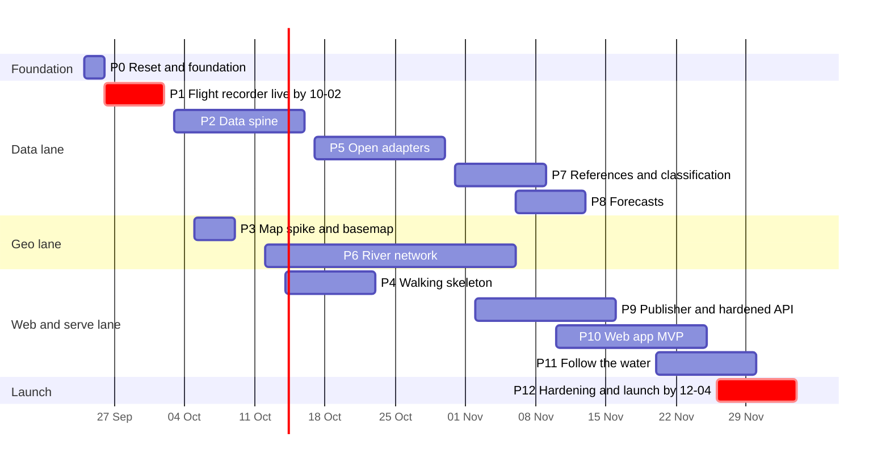
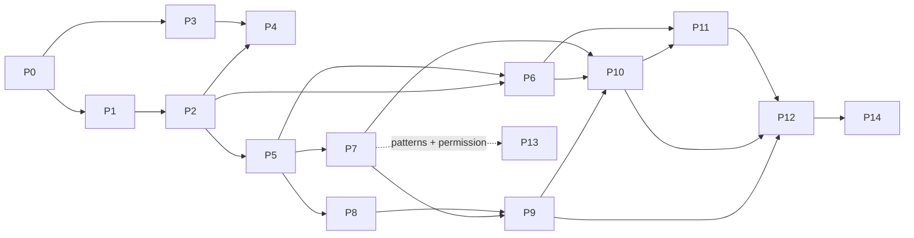

# Phases: implementation plan

**Status:** final plan, 2026-09-23. It goes with `ARCHITECTURE.md`, which is cited as A§x. Catalogue sections are cited as §x.y, and source IDs (NL-1 … CH-11) are the catalogue's. **Amended 2026-09-23 after the catalogue gap check**; §9 lists every change per gap item and the affected phases. **Amended 2026-09-24 for the owner audience** (decision D22, ADR-0017, catalogue §0.8); §10 lists every change with the affected phases and sections. **Build amendments** (what each build found or settled against this plan): §11 (P1a), §12 (P1b), §13 (P2a), §14 (P2b), §15 (P3), §16 (P4a), §17 (P4b), §18 (P5a), §19 (P5b), §20 (P5c), §21 (P6a), §22 (P6b), §23 (P7a).

**How the plan is executed:**
- Each phase becomes **one GitHub issue** containing three Claude Code prompts: Build, Code review and Security review.
- A **roadmap issue** links all the phase issues.
- A phase may ship as **2–3 PRs** (a/b/c). Each PR gets its own build → code review → security review cycle.
- **Cap per PR:** one subsystem, or at most three provider adapters.

**Hard dates:**
- **Production ingestion live ≤ 2026-10-02 (P1).**
- **Public launch ≤ 2026-12-04 (P12).**

Every other date is indicative.

---

## 1. Timeline, lanes and dependencies

| # | Phase | Lane | Window (2026) | PRs | Depends on | Build · Code review · Security review |
|---|---|---|---|---|---|---|
| P0 | Reset and foundation | – | 09-24 → 09-26 | a reset · b foundation | – | Opus xhigh · Sonnet `high` · **Fable high** |
| P1 | **Flight recorder in production** | data | 09-26 → **10-02** | a recorder · b platform | P0 | Opus xhigh · **Fable** `high` · **Fable xhigh** |
| P2 | Data spine | data | 10-03 → 10-16 | a spine + DE-1 · b NL-1/NL-2/NL-4 | P1 | **Fable xhigh** · Opus `max` · Sonnet xhigh |
| P3 | Map spike and self-hosted basemap | geo | 10-05 → 10-09 | one PR | P0 (P1b for the VPS) | Opus xhigh · Sonnet `high` · Sonnet xhigh |
| P4 | Walking skeleton (noindex) | web | 10-14 → 10-23 | a API · b web + deploy | P2 (P4a can start on P2a), P3 | Opus xhigh · Sonnet `xhigh` · Opus high |
| P5 | Open observation adapters | data | 10-17 → 10-30 | a FR + CH · b DE-7 + LU + twins · c owner-audience BE-3 + LU-2/3/4 | P2 | Opus xhigh · Sonnet `xhigh` (**Fable** `high` for P5b) · Sonnet xhigh |
| P6 | River network, snapping, chainage | geo | 10-12 → 11-06 | a graph · b snapping + tiles | P2 (P6b: P5) | Opus xhigh · Sonnet `high` · Sonnet medium |
| P7 | References, classes, warnings, honest classification | data | 10-31 → 11-09 | a parsers · b engine | P5 | Opus xhigh · **Fable** `xhigh` · Sonnet high |
| P8 | Official forecasts (bi-temporal) and the future slider | data | 11-06 → 11-13 | a run model + NL/DE (+ LU-3 owner) · b CH/FR + slider | P5 (P7 for display) | Opus xhigh · **Fable** `high` · Sonnet high |
| P9 | Static publisher and hardened read API | serve | 11-02 → 11-16 | a publisher · b API hardening | P7 (P8 contracts can be stubbed) | Opus xhigh · Sonnet `xhigh` · **Fable xhigh** |
| P10 | Web app MVP | web | 11-10 → 11-25 | a UI core · b pages | P9 contracts, P6, P7 | Opus xhigh · Sonnet `xhigh` · Sonnet xhigh |
| P11 | Follow the water | web | 11-20 → 11-30 | a minimum · b colouring + playback · c Hovmöller | P6, P10, P9 frames | Opus xhigh · Sonnet `xhigh` · Sonnet medium |
| P12 | Flood hardening, operations, **public launch** | ops | 11-26 → **12-04** | a hardening · b ops + launch | P9, P10, P11a | Opus xhigh · **Fable** `high` · **Fable max** |
| P13 | Gated sources, one PR per source as each permission arrives | data | on permission | per source | P5/P7/P8 patterns + owner permission | Opus high · Sonnet `xhigh` · Opus xhigh |
| P14 | **LATER:** historical backfill and climatology | data | 2027 | per provider group | launch + 4 weeks stable | Opus xhigh · **Fable** `high` · Sonnet high |





**Dated events:**

| Date | Event | What it means for the plan |
|---|---|---|
| 2026-10-02 | Recorder live (hard target) | Every day after this is data lost |
| 2026-10-25 | DST fall-back; the hour 01:00–02:00Z repeats in local time | Captured raw by P1. Real payloads become regression fixtures in P5. **Every parser of offset-less local times needs synthetic fall-back and spring-forward fixtures before its first production run** (catalogue §0.3; the DST gate of A§7.4) |
| 2026-10-28 | Node 26 becomes LTS | Bump from 26.10.x to the first LTS patch via Dependabot |
| 2026-11-05 | RWS documentation moves to the CTD | URLs live in config. Watch the nightly contract check. The NL-4 xlsx path under `rijkswaterstaatdata.nl/publish/…` is at risk (§2.1); API hosts unconfirmed (§10 R4; owner action D6) |
| December–March | Rhine and Meuse flood season | This is why launch is ≤ 12-04 |

---

## 2. Gates, criterion tags and workflow

### 2.1 Criterion tags

Every acceptance criterion carries exactly one tag.

| Tag | Meaning | Who is accountable |
|---|---|---|
| **[CI]** | Provable offline: in GitHub Actions, or reproducibly in the build agent's session (SessionStart hook + native PostgreSQL 18). | Build agent |
| **[agent-prod]** | Checkable from outside, without SSH, through `scripts/verify-prod.sh <domain>`, `/status/capture.json`, `/data/v1/status.json` or `/api/v1/health*`. If the agent sandbox cannot reach the domain, the owner runs the script and pastes the output. | Build agent |
| **[owner]** | Needs the owner's access or judgement: VPS console, bucket keys, a phone alert, e-mails, a signed checklist. | Owner (the agent supplies the script or checklist) |

**Soak criteria** (for example "72 h ≥ 99%") are `[agent-prod]` checks made after deploy. They **block closing the issue, not starting the next phase**.

### 2.2 Per-PR workflow

1. **Build.** A fresh session with the phase's build model and effort runs `/plan`. The owner approves the plan. The agent implements it on `claude/p<N><a>-<slug>` and opens the PR with the evidence checklist filled in.
2. **Code review.** A fresh session with the review model runs `/code-review <level> --comment <PR#>`.
3. **Security review.** A fresh session with the security model checks out the PR branch and runs `/security-review`.
4. **Fix.** A fresh session with the build model at the build effort addresses the findings. If a High or Critical finding was fixed, the relevant review re-runs on the fix diff only.
5. **Gate.**
   - CI is green.
   - No High or Critical security finding is open.
   - Medium findings are fixed or accepted in `docs/risk-register.md`.
   - Every `[CI]` item is ticked with evidence.
6. **Merge and deploy.** The owner merges and approves the `production` environment. `rws-update` pulls, verifies and deploys. The agent runs `verify-prod.sh` and ticks the `[agent-prod]` items.

### 2.3 PR evidence checklist (`.github/pull_request_template.md`)

```
## Evidence
- [ ] Every [CI] criterion → test name or CI job link
- [ ] Every [agent-prod] criterion → verify-prod.sh output (after deploy)
- [ ] [owner] items → script/checklist provided: <path>
- [ ] CLAUDE.md / runbooks / docs/threat-model.md updated where this PR changes them
- [ ] Audience: sources touched and their audience (public / owner / off), and the owner canary result, or "no audience change"
- [ ] New runtime dependencies: ADR-lite lines (why · licence · maintainer health · transitive count) or "none"
- [ ] Source IDs touched (catalogue): …
- [ ] [U] items not verified: …
```

---

## 3. Model and effort rubric

Models: `/model fable` (Fable 5.1, $10/$50 per MTok), `/model opus` (Opus 5.5, $4/$20), `/model sonnet` (Sonnet 5, $2/$10) and `/model haiku` (Haiku 4.5, $1/$5). Effort: `/effort low|medium|high|xhigh|max`.

### 3.1 Always

1. **Set effort explicitly** in every prompt. Opus 5.5 defaults to medium, which is too low for any step here.
2. **Reviews run in fresh sessions** with a mandate different from the build.
3. **Code review uses a different model from the build, always.** A security review may reuse the builder's model (P4, P13), because a fresh session with a security-only mandate already gives independence.

### 3.2 Builds

**Default builder: Opus 5.5 at xhigh**, the agentic sweet spot:
- The work is multi-file and mostly unattended.
- The provider traps are well documented in the catalogue.
- Several 2026 majors (MapLibre 6, Vite 8, Vitest 5, the PG18 image layout, Node 26) are newer than most model knowledge.

Exceptions:
- **Fable 5.1 builds only P2**, the data spine. It fixes the canonical model, the time, unit and datum semantics, idempotency and revisions, and every later adapter copies it. An error there silently corrupts the only copy of the go-live data.
- **Opus at high builds P13.** By then P5, P7 and P8 have established the adapter template, and each gated source is a small PR.
- **Sonnet 5 builds nothing before launch.** The volume of patterned work is not large enough to justify the extra review load a cheaper builder needs.
- **Haiku 4.5 is not used.** Every step either writes code that runs unattended against irreplaceable data or reviews such code. The savings are small next to the cost of one missed bug.

### 3.3 Code reviews

| Model and level | Used for | Phases |
|---|---|---|
| **Fable** | A miss would be irreversible, or would mislead the public during a flood | P1 recorder (atomicity, silent gaps); P5b LU DST and offset; P7 classification semantics; P8 forecast bi-temporality; P12 cache and versioning at launch; P14 backfill precedence |
| **Opus at `max`** | The strongest independent reviewer for the one Fable-built phase; correctness outweighs cost, and the diff is bounded | P2 |
| **Sonnet at `xhigh`** | Conformance against established patterns and the catalogue pitfall lists | P4, P5a, P9, P10, P11, P13 |
| **Sonnet at `high`** | Configuration, docs and geo work whose correctness is asserted by strong tests | P0, P3, P6 |

### 3.4 Security reviews

| Model and effort | Used for | Phases |
|---|---|---|
| **Fable** | The change is a root of trust or the public attack surface | P0 CI (high: small diff); P1 trust chain and SSRF fetcher (xhigh); P9 public API (xhigh); P12 whole-system launch gate (**max**) |
| **Opus at high/xhigh** | First exposure of a new kind | P4, the first public endpoint (high); P13, the first third-party credentials (xhigh) |
| **Sonnet at xhigh** | New untrusted-input parsers or client surface, checked against a checklist | P2, P3, P5, P10 |
| **Sonnet at high** | Parsers behind established guards | P7, P8, P14 |
| **Sonnet at medium** | Offline tools or UI-only diffs | P6, P11 |

### 3.5 Effort

- **max** only where correctness beats cost and the diff is bounded: the P2 code review and the P12 security review.
- **low** is never used.

### 3.6 Totals

- Fable: **11 of 45 steps** (P0 security, P1 review and security, P2 build, P5b review, P7 review, P8 review, P9 security, P12 review and security, P14 review).
- Opus: 14 builds, 1 review and 2 security reviews.
- Sonnet: the rest.
- Haiku: 0.

---

## 4. Issue template: the three prompts

Each phase issue contains this block. The placeholders come from the phase section. `<INVARIANTS>` is the verbatim list in A§12.1 / `CLAUDE.md`.

````markdown
### 1 · Build — `/model <build-model>` · `/effort <build-effort>`
```
/model <build-model>
/effort <build-effort>
/plan
You are implementing Phase <N>, PR <N><x> "<pr-name>" of mwijkhuisen/Waterheight.
Read first: CLAUDE.md (bill of materials, gotchas, security invariants), docs/plan/ARCHITECTURE.md,
docs/plan/PHASES.md §P<N>, docs/adr/, docs/threat-model.md, and these catalogue sections:
<§refs> in docs/sources/SOURCE-CATALOGUE.md. Source IDs in scope: <IDs>.
Security invariants (must hold for every line you write): <INVARIANTS>
Plan first: map every [CI] and [agent-prod] acceptance criterion of this PR to a test, command or
evidence item; list the [owner] items and the script/checklist you will provide; wait for approval.
Then implement on branch claude/p<N><x>-<slug>, strictly inside "Scope in" for this PR. Tests run
offline (msw onUnhandledRequest:'error'; fixtures come from the raw archive, never live calls).
No new runtime dependency without an ADR-lite line. Update CLAUDE.md, runbooks and
docs/threat-model.md where this PR changes them. Open PR "P<N><x>: <pr-name>" with the evidence
checklist filled in. Do not merge. List every [U] item you could not verify.
```
### 2 · Code review — `/model <review-model>` · `/code-review <level>`
```
/model <review-model>
/code-review <level> --comment <PR#>
Focus for this phase: <code-review focus bullets>.
Also check: each [CI] criterion has a test that fails without the change; source IDs and catalogue
pitfalls (<§refs>) are honoured; scope did not creep beyond "Scope in".
```
### 3 · Security review — `/model <sec-model>` · `/effort <sec-effort>`
```
/model <sec-model>
/effort <sec-effort>
git fetch origin && git checkout claude/p<N><x>-<slug>
/security-review
Focus for this phase: <security focus bullets>.
Verify the CLAUDE.md security invariants hold for this diff: <INVARIANTS>.
Report any threat-model delta for docs/threat-model.md. Classify findings Critical/High/Medium/Low.
```
````

---

## 5. Phases

### P0 · Reset and foundation

**Window:** 09-24 → 09-26 · **Lane:** – · **Depends on:** – · **PRs:** P0a reset, P0b foundation

**Goal.** Archive the legacy code where `main` can no longer reach it. Give every later agent the same guardrails: a buildable monorepo, hardened CI, a supply-chain policy, `CLAUDE.md`, the plan and the catalogue in the repository, and a registry keyed by catalogue source IDs.

**Scope in**
- **P0a reset**
  - Create the annotated tag `legacy-v0` on `a4106b8` (the legacy `main`; if PR #30 was merged first, `main` is `a4106b8` plus only `docs/plan/` and `docs/sources/`) and push it.
  - In one commit, `git rm -r` every legacy path: `packages/`, `spike/`, `fixtures/`, `deploy/`, `docs/INSTALL-UBUNTU.md`, `docs/INTERNATIONAL-DATA.md`, `docs/PROMPT-PHASE3-GERMANY.md` (the only legacy files under `docs/`; never `docs/plan/` or `docs/sources/`), `.github/workflows/ci.yml`, `PROMPT.md`, `README.md`, `Dockerfile`, `docker-compose.yml`, `package.json`, `package-lock.json`, `tsconfig*.json`, `.env.example`, `.dockerignore` and `.gitignore`. Add a new stub `README.md` and a rewritten `.gitignore`.
  - Write `scripts/verify-fresh-start.sh`. It fails if any blob in `main`'s tree is byte-identical to a blob in `legacy-v0`. The allowlist starts empty. The planning-bundle files are new blobs, never legacy.
- **P0b foundation**
  - **pnpm workspace** (A§5):
    - `apps/server` with a Hono `/healthz` and a role dispatcher stub (`capture | load | publish | api | replay | watchdog`);
    - `apps/web` with Vite + React and a Paraglide "Hallo / Hello" page, NL at `/` and EN at `/en/`;
    - `packages/core` and `packages/contracts`;
    - empty `db/migrations/`, plus `registry/`, `tools/geo/`, `deploy/` and `scripts/`.
  - **TypeScript configuration**: `tsconfig.base.json` with `strict`, `noUncheckedIndexedAccess`, `exactOptionalPropertyTypes`, `erasableSyntaxOnly` and `verbatimModuleSyntax`, plus project references built with `tsc -b`.
  - **Tooling**: Biome; Vitest 5 with a global msw setup using `onUnhandledRequest: 'error'`. `pnpm check` runs Biome, `tsc -b` and Vitest.
  - **pnpm policy**: `minimumReleaseAge: 10080`, `strictDepBuilds`, an explicit `allowBuilds`, `blockExoticSubdeps`, `--frozen-lockfile`. The override procedure for urgent security fixes is documented in `CLAUDE.md`.
  - **CI workflows**, with every action SHA-pinned, `permissions: {}` at top level and `persist-credentials: false`:
    - `ci.yml`: install, `pnpm check`, integration tests against a digest-pinned `postgres:18.6` service container, web build, a dbmate up/down/up round trip, `check-bom`, `check-boundaries`, `verify-fresh-start`;
    - `security.yml`: zizmor, gitleaks over the full history, a grep that every `uses:` has a 40-hex SHA, a grep for top-level `permissions: {}`, and CodeQL if the repository is public (decision D7);
    - `dependabot.yml`: npm, github-actions and docker; `cooldown` 7 days; grouped; no automerge.
  - **`CLAUDE.md`**:
    - the mission and the fresh-start rule (never read or restore `legacy-v0` content);
    - the bill of materials with exact pins (A§3);
    - gotchas: MapLibre 6 is ESM-only and WebGL2-only, with `map.transform` removed; the PG18 image moved `PGDATA` to `/var/lib/postgresql/18/docker` and the volume to `/var/lib/postgresql`; TS 7 is forbidden; Vitest 5's `clearMocks` default and failing unawaited assertions; Node 26 Temporal and type-stripping rules; corepack is not bundled; Protomaps builds are kept for 1 week; Hub'Eau v1 returns 403; RWS docs move to the CTD on 2026-11-05;
    - the security invariants (A§12.1), verbatim, including invariant 11 (owner-audience isolation);
    - the audience rules (A§6, ADR-0017): what `public`, `owner` and `off` mean, that the owner view is used by the owner alone and never shared, and that fixtures of owner-audience sources are synthetic;
    - the adapter contract, and the rule that adapters are keyed by source ID;
    - criterion tags, the definition of done, and the PR and review workflow (§2);
    - the ADR-lite rule for new dependencies.
  - **Agent set-up**:
    - `.claude/settings.json`: deny reads of `**/.env*` and `deploy/secrets/**`; deny `git push --force*`; allow `pnpm`, `psql` and read-only `git` commands;
    - `.claude/hooks/session-start.sh`, written with the `session-start-hook` skill. It is idempotent and installs Node 26.10.x, pnpm 12.6.0 (P0b pinned 12.5.1: 12.6.0 was under the 7-day release age) and native PostgreSQL 18 (a cluster on port 5433 with the builtin C.UTF-8 locale), then runs `pnpm install --frozen-lockfile`.
  - **Docs**:
    - `docs/plan/`: ARCHITECTURE.md, PHASES.md, JUDGEMENT.md and `proposals/` from the planning bundle (branch `claude/river-water-level-map-hf7bcz`, PR #30);
    - `docs/sources/SOURCE-CATALOGUE.md` and `docs/sources/research/*.md`, copied verbatim;
    - the import is conditional: if `main` already holds `docs/plan/` and `docs/sources/` (PR #30 merged), they are not re-imported but verified identical to `origin/claude/river-water-level-map-hf7bcz` if that branch still exists, else to the PR #30 merge commit, and the PR body records which case applied; otherwise they are imported with `git checkout` from that branch (explicit refspec);
    - `docs/adr/0001…0015` and `0017` (from A§13), `docs/threat-model.md` v1 (including the owner channel), `SECURITY.md`, `docs/risk-register.md`;
    - `docs/permissions.md` (tracker) and `docs/legal/requests/*.md`: ready-to-send e-mails for every row in §6.2 C (C1–C13). The tracker records per source: date sent, date answered, conditions, the **audience** (`public`, `owner` or `off`) and its `private_basis`, the licence channels granted (`display`, `api`, `bulk_export`, `history_export`; catalogue §0.7) and a **go/no-go date** after which the fallback ships (§0.2). **Every e-mail asks explicitly** whether (a) machine-readable redistribution through our public API and exports is allowed and (b) we may keep and republish a history archive (§0.2, §0.7). C1 (HIC) and C2 (VMM) request credentials for a **personal, non-commercial, private viewer** and optionally ask about public display; C3 (SPW) and C4 (AGE) ask **only for public display** (optional; nothing waits on them);
    - `docs/github-settings.md` and `scripts/gh-settings.sh` (with a `--check` mode).
  - **Registry**: `registry/providers.yaml` and `registry/sources.yaml`, listing **every catalogue source ID** with its licence, exact attribution text (§1b), **`audience`** (`public | owner | off`; it replaces `publication`, A§6) and `capture_enabled`, plus the schema and a validator test. Initial values (catalogue §0.8; ADR-0017):
    - `public`: the §0.2 "safe" sources, plus CH-2, CH-4 and CH-5 (they move to `owner` if BAFU objects in C13);
    - `owner`, each with a **`private_basis`** (`clause` verbatim from catalogue §0.8, `url`, `retrieved` date): BE-3, LU-2, LU-3, LU-4, DE-3, and DE-2 until the Belegexemplar is sent (then `public`, P12);
    - `off`: NL-3, DE-9, **DE-10 (LfU RLP) and DE-12 (LUBW)** until C11/C12 are granted (their Impressum forbids copying without consent), DE-13 and the other backlog sources, and BE-1 and BE-2 until their credentials arrive (C1, C2; then `owner`);
    - a series may narrow its source's audience, never widen it; the RLP-operated gauges inside LU-1 are narrowed to `off` (withheld), and so are the LfU RLP-origin series on the AGE site (LU-2 Bollendorf and Gemünd; the LU-3 Moselle runs at Perl, Stadtbredimus and Wasserbillig), which are not captured at all until C4 or C11;
    - one **owner canary** source (`audience: owner`, `canary: true`) and one withheld canary series, used by the tests of P2 and P9 and hidden from every UI.
  - **Licence channel flags** (catalogue §0.7) in `registry/sources.yaml` for every source: `display`, `api`, `bulk_export`, `history_export`, `attribution_text`, `attribution_url`, `needs_last_updated`, `needs_retrieval_date`. Defaults: all four channels on for CC0 / DL-DE Zero / Etalab / CC BY / Modellicentie sources (with attribution); `api`, `bulk_export` and `history_export` **off** for any source used under a written permission until its permission record says otherwise; for an `owner` source, `display`, `api` and `history_export` on (they apply to the owner channel only) and `bulk_export` off. The channels apply inside each audience. A series may narrow its source's flags, never widen them.
  - **Station registry schema** (`registry/stations/*.yaml`, one row per physical gauge and quantity; catalogue gap item 17): canonical source and provider IDs, coordinates, datum and gauge zero with validity, river and km system, tidal/weir flags, expected threshold source and forecast source, licence-gate status, `audience` and `first_release`. The rows are filled from catalogue §3 in P2 and P5; the schema and validator land here. Rows of owner-audience stations may hold identification only (provider number, name, coordinates, river and km); the validator rejects values, thresholds or forecasts in them.
  - **GitHub files**: `.github/CODEOWNERS` (the owner on `.github/`, `deploy/`, `db/migrations/` and `registry/`), `.github/ISSUE_TEMPLATE/phase.md` (§4) and `.github/pull_request_template.md` (§2.3).

**Scope out:** product code, service Dockerfiles (P1), the VPS.

**Deliverables:** the tag; a clean `main`; the scaffold, CI and Dependabot configuration; `CLAUDE.md`; the hook; the docs, ADRs, registry and e-mail drafts; the GitHub settings script.

**Acceptance criteria**
- [ ] [CI] `git rev-parse legacy-v0^{commit}` equals `a4106b8…`, and `git ls-remote --tags origin 'legacy-v0*'` returns it on the peeled `refs/tags/legacy-v0^{}` line.
- [ ] [CI] `verify-fresh-start.sh` passes: `main` contains 0 legacy blobs and none of the legacy top-level paths.
- [ ] [CI] After the P0a removal commit, the tree holds only `README.md`, `.gitignore`, `scripts/*` and, only if PR #30 was merged first, `docs/plan/**` and `docs/sources/**`.
- [ ] [CI] P0b: `docs/plan/` and `docs/sources/` equal the planning bundle (branch `claude/river-water-level-map-hf7bcz`, or the PR #30 merge commit if the branch is gone); the PR body says whether they were imported or already on `main`.
- [ ] [CI] On a clean checkout, `pnpm install --frozen-lockfile && pnpm check && pnpm -F web build` is green, and `node apps/server/dist/main.js api` serves `GET /healthz` → 200.
- [ ] [CI] zizmor reports 0 findings at medium or above. Every `uses:` is pinned to a 40-hex SHA, and every workflow has top-level `permissions: {}`.
- [ ] [CI] gitleaks passes on the full history of `main`.
- [ ] [CI] `check-bom` passes: the `CLAUDE.md` bill of materials equals the pins in `package.json` and the lockfile. A deliberately wrong pin makes it fail (test).
- [ ] [CI] `check-boundaries` fails on committed violation fixtures (web → server, adapter → adapter) and passes on the tree.
- [ ] [CI] The registry validates. Every source ID from §1a appears exactly once with an `audience`. NL-3, DE-9, DE-10, DE-12, BE-1 and BE-2 are `off`; BE-3, LU-2, LU-3, LU-4, DE-2 and DE-3 are `owner`; CH-2, CH-4 and CH-5 are `public`. No `publication` or `dark` value remains.
- [ ] [CI] **`private_basis` validation:** an `owner` source without a `private_basis`, or with an empty `clause`, a `url` that is not https, or a missing `retrieved` date, fails; a `private_basis` on a `public` or `off` source fails; each owner source's `clause` matches its catalogue §0.8 row verbatim (test against the committed catalogue).
- [ ] [CI] Every source carries the four §0.7 channel flags and its attribution fields. A test fails if a source marked as permission-based has `api`, `bulk_export` or `history_export` on, if an `owner` source has `bulk_export` on, or if a series widens its source's flags or its audience.
- [ ] [CI] A doc test asserts that `CLAUDE.md` quotes the A§12.1 invariants 1–11 verbatim, including invariant 11 (owner-audience isolation).
- [ ] [CI] The station-registry schema (gap item 17 fields) validates a committed sample of 5 rows, and a row missing `first_release` or the licence-gate status fails.
- [ ] [CI] The dbmate up/down/up round trip is green on PG 18.6.
- [ ] [CI] A fresh claude.ai/code session runs the SessionStart hook, then `pnpm check` and `pnpm test:integration` pass with no manual steps. The session log is attached to the PR.
- [ ] [owner] `scripts/gh-settings.sh` is applied, and `scripts/gh-settings.sh --check` passes (§6.2 B1–B3).
- [ ] [owner] The permission e-mails C1, C2, C5–C9 and C11–C13 are sent (C10 waits until after launch; C3 and C4 are optional public-display requests, sent or marked "deferred"), and their dates are recorded in `docs/permissions.md`, including C1 and C2 as personal-viewer requests, C11 LfU RLP, C12 LUBW and C13 BAFU hydrodaten, each with a go/no-go date.

**Providers / rivers:** none for data. The registry covers every source ID.

**Risks**
- *Losing legacy history.* Tag first, verify the tag on the remote, and only then delete, in a separate PR.
- *Losing the plan.* P0a removes only the three legacy `docs/*.md` files, never `docs/plan/` or `docs/sources/`; P0b imports the bundle only if PR #30 was not merged, and verifies it either way. Branch `claude/river-water-level-map-hf7bcz` stays until P0b merges, unless PR #30 was merged; then it may be deleted.
- *Legacy assumptions creeping back.* The blob check and the fresh-start rule prevent this.
- *The 7-day release age blocking an urgent fix.* A documented override procedure.
- *Hook drift.* The hook is idempotent and CI runs the same commands.
- *A wrong audience* (an owner-only source marked public, or a no-consent source marked owner). Values come from catalogue §0.8, the validator checks each `private_basis` against it, and CODEOWNERS covers `registry/`.

**Review focus**
- *Code review:* hook idempotency; that `check-bom` and `check-boundaries` really fail on violations; the registry against catalogue §1a/§1b (IDs, attribution text, flags), the §0.7 channel-flag defaults and the §0.8 audiences and `private_basis` clauses; that every e-mail draft asks the §0.2 redistribution and history-archive questions, and that C1/C2 ask for a personal, non-commercial, private viewer.
- *Security review:* `${{ }}` injection in `run:`; token permissions; `pull_request_target` absent; `persist-credentials: false`; the cache-poisoning surface; the Dependabot and pnpm policy; the `.claude/settings.json` deny rules; whether the `CLAUDE.md` invariants are specific enough to enforce, invariant 11 in particular; the settings script, which must not weaken anything.

| Step | Model | Effort | Justification |
|---|---|---|---|
| Build | `opus` | xhigh | Patterned scaffolding, but it writes the operating manual and policy every later agent inherits, on 2026-current versions |
| Code review | `sonnet` | `/code-review high` | Configuration and docs conformance against this plan; mechanical, and a different model |
| Security review | `fable` | high | The CI root of trust (permissions, pinning, hook, settings). A small diff where a miss becomes a repository-compromise vector |

---

### P1 · Flight recorder in production

**Window:** 09-26 → **live ≤ 10-02** · **Lane:** data + ops · **Depends on:** P0; owner actions A1–A7 · **PRs:** P1a recorder and P1b platform, built in parallel sessions

**Goal.** Stop losing data. Every perishable, legally capturable endpoint is fetched on schedule and archived raw, synced off-site and monitored, before any parser or database exists. The signed pull-based deploy and the Object Lock backups work from day one.

**Scope in**
- **P1a recorder** (`apps/server`: `http/`, `archive/`, `capture/`, `adapters/<id>/capture.ts`)
  - **Polite client** (A§7.3, A§12.2):
    - the allowlist per source ID comes from the registry and is checked in DNS `lookup`, after resolution and on each redirect hop. It includes the gap-check hosts of catalogue §6.7: `pegelonline.wsv.de` (without `www`), `rijkswaterstaatdata.nl` (NL-4 file and page), **`download.data.public.lu`** (the LU-5 CAP files are served there, not from `data.public.lu`) and `vorhersage.bafg.de` (DE-3, owner audience from P1 under D3). The owner-audience hosts are added for their own source IDs: **`hydrometrie.wallonie.be`** (BE-3) and `inondations.public.lu` for LU-2, LU-3 and LU-4 (already allowed for LU-1). The hosts of gated sources (`www.hochwasser.rlp.de`, `www.hvz.baden-wuerttemberg.de`, later `www.hlnug.de`) are added only in the PR that follows a permission (P13, or the backlog for HLNUG);
    - private, loopback, link-local, CGNAT, ULA and multicast addresses are refused;
    - same-host redirects only, at most 3. **Canonical URLs** are configured so that no cross-host redirect is needed (§6.7): `hicws.vlaanderen.be` (not the legacy `www.waterinfo.be/tsmhic/…`), `inondations.public.lu`, and each data.public.lu resource's own `url` (not the `latest` redirect link);
    - timeouts: connect 10 s, total 60 s, metadata 120 s;
    - body cap 25 MB, decompressed cap 100 MB for HTTP content encoding (ZIP members follow the ZIP rule below);
    - **per-format input guards** (§6.7; first-release inputs are JSON/GeoJSON, CSV, ZIP of CSV, CAP XML, SPARQL CSV and XLSX, not JSON only): ZIP read from the central directory, ≤ 10 members with allowlisted names (no `/`, `..` or absolute paths), ≤ 200 MB uncompressed in total, ratio ≤ 50:1, streamed, never extracted to disk by name; XML with DTDs, external entities and entity expansion off, any `<!DOCTYPE` rejected, CAP ≤ 1 MB; XLSX gets both the ZIP and XML rules; CSV ≤ 100,000 rows, ≤ 1,000 columns, fields ≤ 1 KB, encoding declared per source;
    - the User-Agent with the contact address, and the RWS `X-API-KEY`;
    - at most 2 connections per host;
    - ETag, `If-None-Match` and `If-Modified-Since`;
    - backoff and breaker as in A§7.3;
    - staggered offsets.
  - **Archive writer**: key layout, tmp + fsync + rename, the daily JSONL manifest, `dup_of`, shape fingerprints (alert on change) and byte counters.
  - **Capture specs for every row of A§7.2**, in `registry/capture.yaml`, each with:
    - a validity assertion (the payload parses; required keys are present; count ≥ minimum);
    - a retention class;
    - a gap-stretch window rule, so the window covers the time since the last success, up to the provider's maximum.
  - **The unrecoverable streams come first** (catalogue §0.1, §0.1a). A§7.2 covers every §0.1a row with its change gate: forecast runs (NL-1 `verwachting`, DE-2 `WV` (owner audience), FR-4, CH-4), alert and class states (DE-6 LHP stations of **all 16 states** plus `/data/alerts` with `If-None-Match`; FR-5 `InfoVigiCru` stored only when `DtHrInfoVigiCru` changes; LU-5 CAP; CH-1 `dangerLevel`; CH-5), and threshold versions (NL-4 xlsx plus the rijkswaterstaatdata.nl link list with an alert on a new file name; DE-1 metadata with characteristic values and PNP `validFrom`; CH-2 `wl_1..wl_4`). These specs are enabled first; observation specs follow in the same PR. DE-10 RLP is added only in P13, on the day C11 is granted.
  - **Owner-audience capture from day one** (D22; A§7.2; catalogue §0.8), with the same politeness, allowlist and attribution as every other spec:
    - **BE-3 SPW**: KiWIS `getTimeseriesValueLayer` for groups **1962373** (levels) and **1962340** (discharge) every 10 min, 2 requests, `timezone=UTC`; the station and time-series metadata daily;
    - **LU-2**: the 39 per-station JSON files of AGE-published gauges hourly, never with a query string; the LfU RLP-operated Bollendorf and Gemünd files are not fetched until C4 or C11 answers (DE-10 terms; catalogue §0.8);
    - **LU-3**: the 55 percentile files of the 11 AGE-computed forecast stations hourly, deduplicated by content hash (forecast runs nobody can refill, so they are enabled first among the owner specs, with LU-4); the LfU RLP-computed Moselle runs (Perl, Stadtbredimus, Wasserbillig) are not fetched until C4 or C11 answers;
    - **LU-4**: the station pages weekly, reading only the `data-to-json` attribute, with an alert on a threshold change;
    - **DE-2** and **DE-3**: already in the §0.1a/A§7.2 set, now `owner` instead of `dark`;
    - each of these sources has its `private_basis`. Nothing parses them yet: P5c, P7 and P8 do.
  - **RWS tiers**: `registry/seed/nl-1.csv` lists about 25 key gauges (10 min) and about 45 others (30 min), taken from §3.1 and §3.3. The forecast locations are listed separately: **all 183 H and 13 Q forecast locations** (§0.1a), about 40 curated ones hourly and the rest every 3 h, inside the ≤ 400 requests/hour budget.
  - **Ungated Belgium from day one** (catalogue §0.6): the NL-1 specs include the RWS points on Belgian soil (`antwerpen`, `lixhebiefaval`, `maaseik`, `herenlaak`, `lanaken`, `kanne`, `smeermaas.zuidwillemsvaart`), and the FR-1 `code_entite` prefixes must cover the codes of the 18 NL-bound Hub'Eau partner stations (add explicit codes where a prefix misses one).
  - **Seeds = the day-0 harvest of catalogue §0.1b**: one-off, idempotent, and recorded in `seed-report.json`. DE-1 P31D for about 60 tier-1 series; FR-1 30 days, paced at 1 request per 2 s; FR-3 about 2 months for about 15 key stations; CH-3 40 days for 11 key stations; DE-7 `pegeldaten.zip`; LU-1 (the first CSV holds 5 days); **LU-5 every CAP dump since 2025-06 (833 files, about 30 MB; it contains real AGE flood alerts, §0.4)**; LU-2 (the first capture holds 7 days; owner audience, so it is reported in the owner status, never in the public `seed-report.json`). NLWKN is not seeded (off). SPW is not seeded here: KiWIS keeps decades, and P5c catches up.
  - **Status and alerts**: `capture-status.json`, written each cycle to `public/status/capture.json` with public-audience specs only plus the aggregate `owner_specs: {fresh, total}` (no IDs, hosts or values); owner-audience specs go to `owner/status/capture.json` (A§7.1), which nothing serves until the owner site exists; a healthchecks ping per provider group, including the **owner** group (start, success and fail; grace 3× cadence); a daily capture report, whose owner part goes only to the owner status file.
- **P1b platform** (`deploy/`, `.github/workflows/release.yml`, `scripts/verify-prod.sh`)
  - **`deploy/host/bootstrap.sh`** (Debian 13; idempotent; shellcheck-clean):
    - the `ops` user; SSH keys only; no root login;
    - nftables inbound: 22 (rate-limited), 80 and 443/tcp, 443/udp;
    - nftables egress for the `egress` and `public` subnets: TCP 443 plus DNS only;
    - unattended-upgrades + needrestart, chrony and a sysctl baseline;
    - Docker 29.8.1 + Compose v5.5.1 from Docker's signed apt repository;
    - `daemon.json`: `no-new-privileges`, `live-restore`, the `local` log driver with rotation, `icc: false`;
    - `/srv/rws/{raw,public,owner,tiles,backup}` and `/etc/rws/secrets` (0700); `owner` is mounted only into `capture` (status), and later `publish-owner` and `caddy` (A§11.1).
  - **`deploy/compose.yaml`**, with the networks of A§11.1:
    - services `caddy` (NL/EN placeholder page, `/healthz`, `/status/capture.json`), `capture`, `watchdog` and `backup` (job);
    - the full hardening flags and Compose secrets.
  - **Dockerfiles**: server (built on `node:26-trixie-slim`, run on distroless `nodejs26-debian13:nonroot`) and web (`caddy:2.11.4-alpine` plus static files), with digest-pinned bases.
  - **`release.yml`**: build, SBOM + provenance, push to GHCR by digest, cosign keyless signing and attestation. Then the `promote` job in the `production` environment publishes the Release `prod-<ts>` with a signed `release-manifest.json` (A§11.2).
  - **Deploy**: `deploy/bin/rws-update` plus a systemd timer (every 5 min), and `rws-deploy <release>`. Both verify the manifest and images with the pinned identity and issuer, then pull, `up -d`, smoke-test and roll back automatically on failure.
  - **Backups**:
    - `rws-backup.timer` runs restic of `raw` hourly to the Object Lock bucket;
    - `rws-restore-drill.timer` runs monthly and can be forced once. It restores a 100-object sample, compares sha256 and writes the result to `/status/ops.json` (coarse values only).
  - **Watchdog role**: probes `https://<domain>/healthz` and `/status/capture.json` through public DNS and TLS, and checks that the certificate is valid ≥ 14 days, the disk is < 75% full and the last backup is < 2 h old.
  - **Healthchecks set-up**: `deploy/healthchecks.yaml` and `rws-hc-sync`, which creates the checks using the owner's healthchecks API key.
  - **`scripts/verify-prod.sh <domain>`**: TLS validity, the exact headers of A§12.2, `/healthz`, capture freshness per spec, and `X-Robots-Tag: noindex`.
  - **`deploy/bin/rws-reachability`** (catalogue gap item 11, §10 R7): a one-shot owner-run check **on the VPS, over IPv4 and IPv6**, against every §1a endpoint and the sandbox failures to re-test (waterstandlimburg.nl, Saarland, `server.wver.de`, `waterdata.wrij.nl`, `evrs.bkg.bund.de`, Overpass, Geofabrik). It asserts on a **body signature**, not only the HTTP status (e.g. the OSM tile server answers 200 with a "blocked" PNG). The output goes to `docs/reachability-<date>.md`.
  - **`docs/capacity.md`** (gap item 16): after 48 h of production capture, the compressed bytes per day per spec after sha256 deduplication, the projected year-1 archive (hot obs window plus forever classes) against the disk and the bucket, and the retention class per source derived from it.
  - **Runbooks**: bootstrap, recorder down, deploy/rollback, restore, disk full, lost SSH access.

**Scope out:** parsing, the database (Compose placeholders only), any public API, the map.

**Deliverables:** the recorder running on the VPS; the off-site archive; the alerts; the seed report; the signed pull-deploy pipeline; the backups and restore drill; `verify-prod.sh`; the runbooks.

**Acceptance criteria**
- [ ] [CI] Client tests (msw) refuse or abort each of these:
  - a non-allowlisted host;
  - DNS answers of `127.0.0.1`, `10.0.0.1`, `169.254.169.254`, `100.64.0.1`, `::1` and `fc00::1`, including on a redirect hop;
  - a cross-host redirect;
  - a 30 MB body;
  - a gzip bomb (1 KB → 1 GB, aborted at 100 MB);
  - a ZIP with too many entries or `../` paths;
  - a slowloris upstream.
- [ ] [CI] Per-format guards (§6.7): a ZIP with a compression ratio > 50:1 or > 200 MB uncompressed is refused, while a synthetic ZIP of 128 MB uncompressed (the real `pegeldaten.zip` size) passes; an XML body with `<!DOCTYPE`, an external entity or entity expansion is refused; a CSV with > 1,000 columns or a field > 1 KB is refused; an XLSX with an XML bomb inside is refused.
- [ ] [CI] Allowlist and redirects: `download.data.public.lu`, `rijkswaterstaatdata.nl`, `pegelonline.wsv.de`, `vorhersage.bafg.de`, `hydrometrie.wallonie.be` (BE-3) and `inondations.public.lu` (LU-1 to LU-4) are allowlisted for their source IDs, and no host of an `off` source (DE-9, DE-10, DE-12, BE-1, BE-2) is; a `data.public.lu` → `download.data.public.lu` redirect is refused, and the LU-5 spec fetches each resource's own `url` directly.
- [ ] [CI] A test enumerates catalogue §0.1a: every row (NL-1 forecasts; DE-2; DE-6 all states + alerts with `If-None-Match`; FR-4; FR-5 gated on `DtHrInfoVigiCru`; LU-5; CH-1; CH-2; CH-4; CH-5; NL-4 xlsx + link page; DE-1 metadata; LU-1) has an enabled CaptureSpec with the listed interval and change gate, and a retention class that keeps forecast, class and threshold payloads forever. DE-10 (a note under the table, gated) has no spec until P13. The one deliberate interval deviation is NL-1 forecasts: all 183 H + 13 Q locations, the ~40 curated ones hourly and the rest every 3 h, so that the RWS budget of ≤ 400 requests/hour holds (A§7.2); the test asserts that tiering.
- [ ] [CI] A registry test shows that the NL-1 specs include the 7 RWS Belgian points and that the FR-1 request covers all 18 NL-bound Belgian partner-station codes of §0.6.
- [ ] [CI] Backoff and the circuit breaker behave correctly under fake timers, and `Retry-After` is honoured.
- [ ] [CI] A `kill -9` of a capture child process during a write leaves no object under a final key and no manifest line for it. The next cycle resumes and fills the window.
- [ ] [CI] The manifest round-trips its Zod schema. An identical body produces `dup_of` and no new object.
- [ ] [CI] Every CaptureSpec has a validity assertion with one passing fixture and three failing fixtures: empty-but-200, an HTML error page, and truncated JSON. The fixtures of owner-audience specs (BE-3, LU-2, LU-3, LU-4, DE-2, DE-3) are synthetic (real structure, generated values, `synthetic: true`; invariant 9).
- [ ] [CI] The budget config test holds:
  - `ddapi20-waterwebservices.rijkswaterstaat.nl` ≤ 400 requests/hour;
  - the CH-1 interval is ≥ 10 min;
  - the DE-6 interval is ≤ 10 min;
  - FR-1 seed pages are ≥ 2 s apart;
  - BE-3 ≤ 2 value requests per 10 min plus the daily metadata; LU-2 ≤ 39 and LU-3 ≤ 55 requests/hour; LU-4 weekly; no LU request carries a query string, and none fetches an LfU RLP-origin file (LU-2 Bollendorf and Gemünd; LU-3 Perl, Stadtbredimus and Wasserbillig);
  - no spec exists for NL-3, DE-9, DE-10, DE-12, BE-1 or BE-2 (every `off` source).
- [ ] [CI] Owner-audience capture: BE-3 (2 group requests per 10 min + daily metadata), LU-2 (hourly), LU-3 (hourly, content hash), LU-4 (weekly, `data-to-json` only), DE-2 and DE-3 have enabled specs; each of their sources has a `private_basis`; LU-3 and LU-4 are in the first-enabled group. A test writes a status cycle and shows that their state lands only in `owner/status/capture.json`, while `public/status/capture.json` contains no owner source ID or host (grep) and only the `owner_specs` count.
- [ ] [CI] The release workflow produces signed images with an attached SBOM and provenance (run link).
- [ ] [agent-prod] `verify-prod.sh` passes: valid certificate, headers, `/healthz` 200, noindex.
- [ ] [agent-prod] In `/status/capture.json`, every enabled public spec has a success within 3× its cadence, and `owner_specs.fresh` equals `owner_specs.total`, sampled 3 times over 1 h.
- [ ] [agent-prod] The seed report shows DE-1 ≥ 28 days, FR-1 ≥ 28 days, CH-3 ≥ 38 days and DE-7 about 60 days for the listed series. It also shows LU-5 with every CAP dump since 2025-06 (≥ 833 files) and LU-1 with ≥ 4 days (the §0.1b day-0 harvest).
- [ ] [agent-prod, soak 72 h] ≥ 99% of scheduled captures succeed per source ID, with upstream 5xx and timeouts listed separately. The daily byte totals per spec are recorded as the size-budget baseline.
- [ ] [agent-prod] `docs/capacity.md` is committed from the first 48 h of production capture: compressed bytes/day per spec after deduplication, the projected year-1 raw archive and database size vs the ≥ 200 GB disk and the bucket, and a retention class per source.
- [ ] [owner] `rws-reachability` ran on the VPS over IPv4 and IPv6; its output is attached. Every first-release endpoint passes its body-signature check, or it is listed in `docs/risk-register.md` with its fallback.
- [ ] [agent-prod] `/status/ops.json` shows a successful forced restore drill: 100 of 100 sha256 match.
- [ ] [owner] `deploy/tests/negative-deploy.sh` shows that `rws-update` refuses an unsigned image and an image signed by another identity, and that an injected smoke-test failure rolls back to the previous manifest.
- [ ] [owner] Stopping `capture` for more than 3× cadence fires the healthchecks alert on the owner's phone (one provider group).
- [ ] [owner] `restic forget --prune` run with the VPS key fails to remove object versions.
- [ ] [owner] After a VPS reboot, `/status/capture.json` is fresh again within 20 min with no manual step.

**Providers / rivers:** NL-1, NL-2, NL-4, DE-1, DE-2 (owner), DE-3 (owner), DE-6, DE-7, DE-8, FR-1, FR-3 (seed), FR-4, FR-5, LU-1, LU-5, LU-6, CH-1, CH-2, CH-3 (seed), CH-4 and CH-5, plus the owner-audience BE-3 (the Walloon Meuse from Chooz to Lixhe, Sambre, Ourthe, Vesdre, Amblève, Semois and Walloon Escaut) and LU-2, LU-3 and LU-4 (Luxembourg observations, forecasts and thresholds). Together they cover:
- the Alpine Rhine and Bodensee, the High Rhine with the Thur, Aare, Reuss and Limmat, and the Birs;
- the Upper and Lower Rhine to the NL branches;
- the Moselle, Saar, Sauer/Sûre, Our and Alzette;
- the Main, Neckar, Lahn, Sieg, Ruhr, Lippe and Erft;
- the French Meuse, Chiers, Semoy and Sambre, and the Rur, Niers and Schwalm;
- the Escaut, Scarpe and Lys (French side);
- the Ems, Vechte, Dinkel, Berkel, Issel and Bocholter Aa;
- Belgium without permissions (§0.6): the RWS points on Belgian soil and the NL-bound Hub'Eau partner stations (Semois, Chiers, Viroin, Houille, upper Sambre tributaries, Lys at Menen).

**Risks**
- *Silent gaps.* Validity assertions, fingerprints, dead-man switches and the daily report.
- *Missing an unrecoverable stream.* Forecasts, alert/class states and threshold versions cannot be refilled (§0.1); the §0.1a enumeration test and first-enabled order.
- *Disk filling up.* NRW is captured hourly, the size baseline is measured, and an alert fires at 75%. Raw volume is 0.5–1 GB/day uncompressed before deduplication (gap item 16): body-hash and `DtHrInfoVigiCru` gates, zstd, and `docs/capacity.md` from the first 48 h.
- *Sandbox ≠ production reachability* (§10 R7). `rws-reachability` from the VPS; datacentre IP blocks (Cloudflare at AGE, Azure APIM at NLWKN, Hub'Eau "usage abusif") show up as body-signature failures, not as silent 200s.
- *Over-polling.* Budget tests and a contact User-Agent.
- *Clock skew.* chrony.
- *The RWS CTD move (11-05).* URLs live in config; the NL-4 file path is the most exposed (link-page watch, local copy, alert on 404).
- *The owner's VPS steps slipping.* The scripts are idempotent, and each step has a check command.
- *Seeds stressing providers.* Pacing and off-peak runs.
- *Owner-audience capture read as redistribution.* It is personal use only (catalogue §0.8): polite rates, attribution kept, status and data only in the owner channel, and nothing public until a provider consents.
- *AGE behind Cloudflare blocking the VPS* (§10 R7). `rws-reachability` covers `inondations.public.lu`; LU-1 and LU-5 do not depend on LU-2/3/4.

**Review focus**
- *Code review:* write atomicity (tmp → fsync → rename, and the manifest line only after rename); scheduler drift and overlap (`protect`); gap-stretch windows; `dup_of` correctness; validity assertions that cannot pass on garbage; seed idempotency; `rws-update` rollback correctness; `set -euo pipefail` and quoting; that the capture set covers every §0.1a stream with its change gate and forever retention, the §0.1b day-0 harvest, and the owner-audience specs at their polite rates.
- *Security review:* the dialer allowlist per hop and the IP classes; size caps applied before decompression; the §6.7 per-format guards (ZIP, XML/CAP, XLSX, CSV) and the canonical-URL redirect exceptions; redaction of secrets in the manifest and logs; raw-volume permissions; the cosign identity and issuer pinning (exact string, no regex wildcards); secret file modes; the bucket key's scope; nftables default-drop and egress rules; Caddy headers; that `/status/*.json` leaks nothing sensitive, and that owner-audience spec state never reaches the public status file.

| Step | Model | Effort | Justification |
|---|---|---|---|
| Build | `opus` | xhigh | Code that runs unattended 24/7, where every bug means unrecoverable data loss, plus the first infrastructure and deploy chain |
| Code review | `fable` | `/code-review high` | A small diff with the highest cost of failure. The most capable independent model hunts atomicity, scheduling and silent-gap bugs |
| Security review | `fable` | xhigh | The trust anchor: the SSRF-capable fetcher, the deploy signature chain, backups and the firewall. Everything later relies on it |

---

### P2 · Data spine

**Window:** 10-03 → 10-16 · **Lane:** data · **Depends on:** P1 · **PRs:** P2a spine + DE-1 (10-03 → 10-10); P2b NL-1/NL-2/NL-4 (10-08 → 10-16)

**Goal.** Turn the archive into a correct, provenance-tracked time-series store, and prove the design on two dissimilar providers:
- **DE-1**: GET with ETag, local offsets, a 31-day window, mixed units and mirrors.
- **NL-1**: one POST per location, fixed `+01:00` timestamps, and an NL-2 WFS whose local times are labelled `Z`.

**Scope in**
- **P2a**
  - **`packages/core`**:
    - canonical Zod types;
    - Temporal time-convention parsers for every convention in A§7.4;
    - the unit table (§4.5);
    - the datum enum with offsets, sources and uncertainty (§4.1). **IGN69 and NGF-1884 carry no usable NAP offset**: the conversion function returns "not converted" for them (catalogue C40; D16);
    - the QC bitmask and the sentinel registry.
  - **`db/migrations`**:
    - the **complete** schema of A§6, including the forecast, reference, class, warning and health tables, so later phases only add data. This includes the §0.7 licence channel columns on `source` and `series`, the recurring season and `priority` columns on `reference_value` (for NL-4), and the **audience columns**: `source.audience` with `private_basis` (a CHECK makes it NOT NULL when `audience = 'owner'`), `series.audience` (narrow only) and `reference_value.source_id`;
    - `ensure_partitions()` (`SECURITY DEFINER`, fixed `search_path`, 3 months ahead, no default partition), BRIN and `btree_gist`;
    - the roles and `pg_hba` of A§12.2, including **`rws_owner_api`** (LOGIN, read-only, `SELECT` on `own_*` only, `CONNECTION LIMIT 4`);
    - the `pub_*` and **`own_*`** security-barrier view families of A§6, with the audience filter applied at every join (station, series, reference, class, forecast, warning, attribution), and `apps/server/src/db/audience.ts` as the only place that names them (A§5);
    - a `db` service initialised with the builtin C.UTF-8 locale.
  - **Registry sync**: YAML → `provider`, `source` (with `audience` and `private_basis`), `attribution`, `station`, `station_alias` and `series`. A drift report compares the registry with the harvested DE-1 `stations.json`.
  - **`load` role** (A§7.4 steps 1–6):
    - tails the manifest from `load_cursor`;
    - QC, the idempotent upsert with `obs_revision`, `obs_latest`, and incremental `obs_1h`/`obs_1d` in the same transaction;
    - a nightly rollup reconciliation;
    - `source_health` and quarantine;
    - the retention pruner, run with `--dry-run` for the first week.
  - **`replay` CLI** (`--source --spec --from --to`).
  - **Adapter DE-1**:
    - W and Q; units `cm`, `m+NN` and `m+PNP`; sentinel `99999`; negative W is valid;
    - mirrors (RWS, BAFU Basel, RP Freiburg Konstanz, Ruhrverband) get role `mirror`;
    - 1-minute series are downsampled to 15 min;
    - station metadata and `gauge_zero` with `validFrom`.
  - **Tier-1 DE registry** from §3.1 and §3.2, with every station-registry field of P0b (expected threshold and forecast source, licence-gate status, `first_release`), so the P7/P8 coverage metrics have a denominator.
  - **Minimal `api` role**: only `/api/v1/health` and `/api/v1/health/sources`, reading `rws_api` views. Health lists public-audience sources only, plus an aggregate `owner_sources: {healthy, total}` from the count-only view `pub_owner_health` (no IDs; A§6). Caddy proxies `/api/v1/health*` only.
  - **Deploy**: `db`, `migrate`, `load` and `api`, then replay everything since P1.
- **P2b**
  - **Adapter NL-1 observations**:
    - WATHTE/NAP/meting with method F007, and Q with per-station method codes;
    - `+01:00` timestamps; quality code 99 is a gap;
    - TAW, MSL and PLAATSLR duplicates are dropped, except the Eijsden-grens TAW series, which is kept as a twin;
    - a stale-series filter (Arnhem, Driel Q, Westervoort IJsselkop Q, §2.1).
  - **Adapter NL-2**: discovery and coordinates only; `local-labelled-Z`; REST wins.
  - **NL-4**: a pinned offline converter (fflate + fast-xml-parser, under the §6.7 XLSX guards) writes `registry/thresholds/nl-4.csv` with the source sha256. The rows load into `reference_value` with semantics `provider_class`; P7 uses them. The converter follows the **catalogue §2.1 parser specification** (NL-4 holds Waterinfo *display* classes, not alert levels):
    - sheet `ParameterLimits`; `'NULL'` is a string;
    - the effective legend for a date is the union of the `Gehele jaar` rows and the rows whose `FromMonth/FromDay`–`ToMonth/ToDay` window contains the date (stored as a recurring season, not a date range);
    - a **lower `Priority` number wins**;
    - slug variants are deduplicated on (Code, Description, Period, Label, From, To): 6,245 rows → 1,542;
    - bounds come from `From`/`To`, never from the label text;
    - the curated series without classes (H: `millingenaanderijn.pannerdensekop`, `holtheme.vecht`, `lith.beneden`, `lixhebiefaval`, `antwerpen`; Q: `millingenaanderijn`, `hagestein.boven`, `maastricht.sintpieter.zuid`, `roermond.hambeek`) stay without NL-4 rows.
  - **Tier-1 NL registry** from §3.1 and §3.3:
    - Lobith `tolkamer`, Pannerdense Kop, Nijmegen, Tiel, Zaltbommel, Driel, Amerongen, Hagestein;
    - Westervoort IJsselkop / `westervoort.1` Q, Doesburg, Zutphen, Deventer, Olst, Zwolle, Kampen;
    - Eijsden-grens, Sint Pieter, Borgharen, Stevensweert, Roermond, Venlo, Grave, Megen, Lith;
    - the Vecht stations and Epen (Geul);
    - tidal stations flagged.
  - **Eijsden twin**: TAW − NAP.
  - **`contract-check.yml`** (nightly): live fetch and parse for DE-1, NL-1 and NL-2. It opens or updates a `contract-drift` issue on failure.

**Scope out:** other adapters; parsing references, classes or forecasts (their tables exist but stay empty, except NL-4 rows); the public data API; the UI.

**Deliverables:** core, migrations, registry sync, loader, replay and pruner; adapters DE-1, NL-1, NL-2 and NL-4; a production database filled since P1; the contract check; the runbooks "schema drift", "replay" and "partition maintenance" (P2b adds "outage drill").

**Acceptance criteria**
- [ ] [CI] Each adapter has ≥ 3 real fixtures from the P1 archive: a normal case, an edge case (sentinel, gap or DST) and an empty or error case. Parse + normalise equals the committed `.golden.json`, with ≥ 90% line coverage of parse and normalise.
- [ ] [CI] fast-check property tests: time parsers round-trip; the DST gap and overlap are handled explicitly for Europe/Amsterdam, Berlin, Luxembourg and Zurich; unit conversions are invertible.
- [ ] [CI] At least 30 known-instant cases pass, including:
  - RWS `2026-09-23T20:50:00.000+01:00` → `19:50Z`;
  - WFS `…T21:30:00.000Z` (local) → `19:30Z` in summer and `20:30Z` in winter;
  - PEGELONLINE `+02:00` and `+01:00`;
  - the repeated local hour on 2026-10-25 (01:00Z–02:00Z).
- [ ] [CI] Replaying the fixture archive twice gives an identical per-partition `md5(string_agg(…))` checksum, 0 new rows and 0 revisions. A changed value produces exactly one `obs_revision` row.
- [ ] [CI] A batch crossing a month boundary creates the partition. An insert beyond the partition horizon fails loudly (there is no default partition).
- [ ] [CI] Incremental `obs_1h`/`obs_1d` equal a from-scratch aggregate over the same data.
- [ ] [CI] Roles: `rws_api` and `rws_publish` cannot INSERT, UPDATE or DELETE, cannot SELECT base tables or any `own_*` view (permission denied), and see no row of the seeded withheld canary or the owner canary (`777777.777`). `rws_owner_api` is read-only, cannot SELECT base tables or `pub_*`, sees the owner canary through `own_*` and never the withheld canary.
- [ ] [CI] Audience filter at every join: an owner-audience reference (LU-4-style, `source_id` owner) and an owner forecast run attached to a public series are visible in `own_reference` / `own_forecast_run` and absent from `pub_reference` / `pub_forecast_run`; a station whose only series is owner-audience is absent from `pub_station`; a series that narrows a public source to `owner` or `off` disappears from `pub_*`. The DB rejects an `owner` source without `private_basis`.
- [ ] [CI] RWS `99`/`0.0` and PEGELONLINE `99999` never appear as values.
- [ ] [CI] The NL-4 converter on the 15-4-2026 workbook yields 1,542 rows after deduplication (from 6,245), with 237 H and 27 Q location codes. Lobith Q's Normaal/Verlaagd bound is 1,400 m³/s on 15 May and 1,000 m³/s on 15 September, while the `Gehele jaar` bounds (4,450 / 5,400 / 8,100 / 11,800 m³/s) apply on both dates. An overlap fixture resolves to the row with the lower `Priority` number. Coverage of the curated list is reported as 49/54 H and 14/18 Q (amended in §14: 61/69 H and 15/18 Q against the series P1 captures).
- [ ] [CI] The datum function returns "not converted" for IGN69 and NGF-1884 series.
- [ ] [CI] Drift simulation: a mutated payload is quarantined and raises an alert, other payloads still load, and a replay after the fix loads it.
- [ ] [CI] On the synthetic seed (3,000 series × 60 days), Q1 "all series at T" runs in < 50 ms.
- [ ] [agent-prod] `/api/v1/health/sources` is green for DE-1 and NL-1. ≥ 95% of tier-1 series have an `obs_latest` age < 45 min (DE-1) or < 60 min (NL-1) (amended in §14: each NL-1 series against its own `staleness_limit`).
- [ ] [agent-prod] Loader lag p95 < 2 min, as reported by health.
- [ ] [agent-prod] The Eijsden-grens twin TAW − NAP = 233 ± 1 cm for every aligned timestamp over 7 days (twin status in health).
- [ ] [agent-prod] The production replay since P1 is complete: health lists a checksum per partition and 0 unexplained quarantined payloads.
- [ ] [owner] **Outage drill:** `rws-drill stop-capture 2h`, then restart. Q7 (in health) reports **0 missing buckets** for tier-1 DE-1 and NL-1 series over the window.

**Providers / rivers**
- DE-1: the Rhine from Rheinweiler/Kehl to Emmerich; the federal Moselle, Saar, Main, Neckar, Lahn and Ruhr; the Ems.
- NL-1, NL-2 and NL-4: Bovenrijn, Waal, Pannerdensch Kanaal, Nederrijn-Lek and IJssel; the Maas from Eijsden to Lith; the Overijsselse Vecht and Geul; tidal stations (flagged).

**Risks**
- *Model mistakes propagate everywhere.* Fable builds from `/plan`, Opus reviews at `max`, and replay makes fixes possible.
- *Late DST coverage.* DST fixtures are synthetic now, and the real 10-25 payloads are added in P5.
- *NL-1 stalls or limit changes.* Health alerts and the contract check.
- *Retention pruning deletes too much.* Dry-run for a week, and the "forever" classes are covered by tests.
- *An owner row leaking through a join* (a public station classed by an owner threshold, an owner run in a public forecast). The audience filter at every join, the per-join tests and the canaries.

**Review focus**
- *Code review:* transaction boundaries; `IS DISTINCT FROM` with the revision CTE; rollup correctness under late revisions; the manifest cursor under a crash; parser disambiguation for the DST hour; the unit and datum declarations for every DE-1 and NL-1 series; mirror handling; the NL-4 converter against the §2.1 specification (season union, priority direction, slug deduplication, bounds from `From`/`To`).
- *Security review:* parameterised SQL only; the `SECURITY DEFINER` `search_path`; role grants against the views, including that no public role can reach `own_*` and that `rws_owner_api` (unrelated to the object owner `rws_owner`) is read-only; that every `pub_*` view applies the audience filter at every join; `pg_hba`; parser resource limits; replay CLI input handling; retention deletion constrained to the `raw/` root.

| Step | Model | Effort | Justification |
|---|---|---|---|
| Build | `fable` (start in `/plan`) | xhigh | The hardest and most consequential design: canonical model, time, unit and datum semantics, idempotency and revisions. Errors silently corrupt the only archive, and every adapter copies the pattern |
| Code review | `opus` | `/code-review max` | An independent strong model at maximum effort. Correct normalisation outweighs cost, and the diff is bounded |
| Security review | `sonnet` | xhigh | Mostly internal surface (DB roles, SQL, parser limits) with well-known checks |

---

### P3 · Map spike and self-hosted basemap

**Window:** 10-05 → 10-09 · **Lane:** geo · **Depends on:** P0 (P1b for the VPS job) · **PRs:** one

**Goal.** Settle the unverified map facts before any web phase:
- the Protomaps style package `@protomaps/basemaps` 5.7.2 with v4 tiles;
- MapLibre 6 under the strict CSP, after the CSP bundle was removed (§8 C23);
- WebKit with `temporal-polyfill`.

It also ships the basemap extract job and the style assets.

**Scope in**
- **`tools/geo/basemap/` and `deploy/bin/rws-basemap-refresh`**: a one-shot `basemap` job on the VPS, with egress to `build.protomaps.com` only (amended in §15: two hosts, `build-metadata.protomaps.dev` for the build list and `build.protomaps.com` for the files; the job is a role of the server image, run as two Compose jobs, `basemap` for the fetch and `basemap-promote`, without network, for the checks and the swap). It:
  - picks the newest build from `builds.json`;
  - extracts bbox `1.5,45.8,12.5,54.0` at z0–14, plus planet z0–6;
  - verifies the result and writes its sha256;
  - writes versioned files `tiles/basemap-<date>.pmtiles` and `tiles/planet-z6-<date>.pmtiles`;
  - swaps `tiles/manifest.json` atomically and **keeps the previous version**.

  A quarterly timer is installed but disabled until the owner enables it.
- **Style build** (in `geo.yml`): `@protomaps/basemaps` 5.7.2, muted light flavour, labels from `name:nl`/`name:en`, self-hosted glyphs and sprites under `/assets/map/` (amended in §15: flavour `white`, since 5.7.2 has no "muted"; the styles are generated offline and committed, and `geo.yml` only checks them).
- **Map module**: `apps/web/src/features/map/` with the `useMapLibre` hook, the `pmtiles` protocol and the worker URL set-up. A dev-only `/_spike` route renders the basemap with 200 fixture stations as `circle` + `feature-state` (amended in §15: the spike pages exist only in the e2e build).
- **Fixture**: a committed tile fixture of ≤ 5 MB (a small bbox around Lobith) for agents and CI.
- **ADR-0016**: the worker set-up (a same-origin worker URL vs `blob:`), the final CSP string, style compatibility, and the fallback if 5.7.2 is incompatible (pin an older compatible style, or our own style JSON).
- **Caddy**: `/tiles/*` with range requests and immutable caching; `/assets/map/*`.

**Scope out:** stations from the API, the time slider (P4), river lines (P6).

**Acceptance criteria**
- [ ] [CI] Playwright (Chromium, WebKit, Firefox) on the fixture tiles under the **exact production CSP**: the map renders (the canvas is not blank), there are **0 `securitypolicyviolation` events**, and **every request is same-origin**.
- [ ] [CI] The style validates against MapLibre 6.11.1's style specification and renders z4–14 of the fixture with no missing-source or missing-layer errors, or ADR-0016 records the alternative that does.
- [ ] [CI] MapLibre loads as a lazy chunk, and the worker file is served same-origin.
- [ ] [CI] WebKit with `Temporal` absent loads the polyfill, and a date-formatting smoke test passes.
- [ ] [agent-prod] `/tiles/basemap-<date>.pmtiles` answers `Range` requests with 206 and `Cache-Control: public, max-age=31536000, immutable`. `tiles/manifest.json` lists the current and previous versions.
- [ ] [owner] The extract job ran on the VPS; the log is attached and the sha256 matches the manifest.

**Providers / rivers:** OSM via Protomaps (ODbL; credit "© OpenStreetMap contributors · Protomaps").

**Risks**
- *Style incompatibility.* The ADR fallback.
- *Protomaps retention (1 week).* We keep our own extract and the previous version.
- *The 4.3 GB download.* The job resumes and is checksum-verified (amended in §15: go-pmtiles `extract` cannot resume, so every run starts clean; the sha256 is computed after the extraction, because Protomaps publishes checksums only for the full planet file, and `promote` re-checks it before a file is served).

**Review focus**
- *Code review:* job idempotency and atomic swap; manifest handling; that the hook cleans up the map on unmount; that the Playwright assertions are real (pixel check, request log).
- *Security review:* whether the CSP is minimal (`worker-src`, `img-src blob:`); no third-party origins anywhere, including glyphs, sprites and fonts; the egress scope of the basemap job; download integrity.

| Step | Model | Effort | Justification |
|---|---|---|---|
| Build | `opus` | xhigh | New major versions (MapLibre 6, the Protomaps v4 schema) where agent knowledge is thin; a decision under uncertainty |
| Code review | `sonnet` | `/code-review high` | Small, strongly tested diff |
| Security review | `sonnet` | xhigh | The CSP becomes site-wide policy; a checklist-driven header and origin review |

---

### P4 · Walking skeleton

**Window:** 10-14 → 10-23 · **Lane:** web · **Depends on:** P2 (P4a can start once P2a is merged), P3 · **PRs:** P4a API, P4b web + deploy

**Goal.** A visitor picks a date and time and sees the DE-1 and NL-1 levels at that moment, on the production domain, in NL or EN, behind `noindex`. This brings forward the integration risks: LOCF semantics, cache headers, the CSP, WebKit and URL state. It also gives the owner a product to look at while data accumulates.

**Scope in**
- **P4a API** (Hono + zod-openapi, `packages/contracts`):
  - endpoints `/api/v1/meta`, `/api/v1/stations`, `/api/v1/snapshot?t=`, `/api/v1/series/{id}` and `/api/v1/openapi.json`;
  - the validation and limits of A§9.2: `t` needs an offset, ≤ 32 characters, quantised to 10 min, within [`displayStart`, now]; unknown parameters → 400;
  - `Cache-Control` per age class;
  - LOCF within `staleness_limit` (Q1);
  - the LRU and singleflight;
  - the `rws_api` role.
- **P4b web**:
  - MapLibre on the self-hosted basemap, with stations as `circle` + `feature-state`;
  - the time selector: a date picker, a time input and a scrubber in 10-min steps with play and step controls, a CET/CEST label and UTC `?t=` in the URL (D11);
  - `displayStart` from `meta` (D9), with the epoch marker;
  - a station panel with a lazy ECharts H/Q chart;
  - NL at `/` and EN at `/en/`;
  - the table view as the no-WebGL2 fallback;
  - a beta banner, footer attribution from `meta` sources, and the disclaimer "Geen officiële waarschuwingsdienst / Not an official warning service".
- **Caddy**: `/api/v1/*` proxy and `X-Robots-Tag: noindex`.
- `scripts/verify-prod.sh` extended to cover the API and cache headers.

**Scope out:** other providers (P5), classes (P7), forecasts (P8), the static publisher (P9), rivers (P6).

**Acceptance criteria**
- [ ] [CI] `/snapshot?t=<now−1d>` equals a direct SQL LOCF computation for 50 random series (seeded database).
- [ ] [CI] Each of these returns **400 without any DB query** (spy): `t` without an offset, longer than 32 characters, before `displayStart`, in the future, or with an unknown parameter.
- [ ] [CI] `Cache-Control` is asserted for each age class.
- [ ] [CI] On the synthetic seed, `/snapshot` p95 is < 50 ms warm and < 150 ms cold; `/series` over 14 days raw is < 50 ms.
- [ ] [CI] Playwright (Chromium, WebKit, Firefox):
  - NL is the default, and switching to EN keeps `t` and `s`;
  - the slider updates `?t=` and the marker states;
  - a deep link restores the view;
  - the slider is keyboard-operable;
  - **02:30 CEST and 02:30 CET on 2026-10-25 are distinct selectable instants**;
  - the table fallback renders with WebGL2 disabled;
  - 0 CSP violations; only same-origin requests; axe finds 0 serious or critical issues.
- [ ] [CI] A fixture station named `` renders inert, in the popup, the panel and the chart tooltip.
- [ ] [CI] Initial JS ≤ 250 KB gzip, excluding the lazy MapLibre and ECharts chunks.
- [ ] [agent-prod] `verify-prod.sh` passes, with noindex present. `/` shows DE-1 and NL-1 stations whose latest value is ≤ 45 min old. `/api/v1/openapi.json` is served.

**Providers / rivers:** DE-1 and NL-1 (the German Rhine chain, its federal tributaries, the Dutch branches and the Maas).

**Risks**
- *MapLibre's weekly releases.* Exact pin and WebKit e2e.
- *LOCF misunderstandings.* SQL-equivalence tests.
- *The public surface arriving early.* Opus security review, noindex, strict validation.

**Review focus**
- *Code review:* LOCF and staleness semantics; quantisation and the cache-key space; typed search-parameter validation; DST display; lazy-chunk boundaries.
- *Security review:* input validation before any DB access; cache-key and poisoning risks; DoS through spans; CSP and header regressions; no HTML sinks; the error bodies leak no stack traces.

| Step | Model | Effort | Justification |
|---|---|---|---|
| Build | `opus` | xhigh | A full-stack slice on new majors (MapLibre 6, Vite 8, TanStack Router) |
| Code review | `sonnet` | `/code-review xhigh` | Independent. The LOCF, cache-header and URL-state checks are concrete and testable |
| Security review | `opus` | high | The first public attack surface. A stronger model in a fresh security-only session |

---

### P5 · Open observation adapters

**Window:** 10-17 → 10-30 · **Lane:** data · **Depends on:** P2 · **PRs:** P5a FR-1/FR-3 + CH-1/CH-2/CH-3; P5b DE-7/DE-8 + LU-1/LU-6 + twins, deduplication and the DST gate (the real 2026-10-25 set: #55, after the night); **P5c owner-audience adapters: SPW BE-3 and AGE LU-2/LU-3/LU-4** (moved out of P13; D22)

**Goal.** Parse every remaining open observation source from the archive, starting at the seeds, and publish each physical gauge exactly once. Parse the owner-audience sources captured since P1 for the owner view, without any of their rows reaching a public output.

**Scope in**
- **P5a**
  - **FR-1**:
    - H mm → cm and Q l/s → m³/s;
    - `Link: next` pagination and HTTP 206;
    - rows with `code_station: null` (site-level Q) are dropped;
    - foreign-station mirrors become `mirror` **only where the operating agency's own feed is ingested and public**. The Belgian partner stations of §0.6 are `primary` until BE-1/BE-2/BE-3 go public in P13 (their operators are all gated), in both audiences; in the owner view the SPW series of the same gauges are twins (P5c);
    - negative Q is flagged, not dropped;
    - gauge-zero metadata is stored but not trusted.
  - **FR-3**: the ~2-month seed loaded as twin and gap-fill.
  - **Ungated Belgian set** (catalogue §0.6; registry rows with the P0b fields):
    - NL-1 (the P2b adapter; registry rows only): `antwerpen` (tidal, H forecast), `lixhebiefaval`, `maaseik` (H, Q F006, H and Q forecasts), `herenlaak`, `lanaken` (H forecast), `kanne` (Q; water body unverified, §10 R9) and `smeermaas.zuidwillemsvaart` (canal intake, H and Q). `sasvangent` is in NL, not Belgium;
    - FR-1: the **18 NL-bound Hub'Eau partner stations** with commune 99131 (Chiers at Athus and Torgny, Ton at Harnoncourt; Semois at Membre, Tintigny, Chiny, Bouillon, Sainte-Marie, Straimont; Viroin at Treignes, Couvin, Nismes; Houille at Felenne; Thure at Bersillies-l'Abbaye; Hante at Beaumont and Wiheries; Trouille at Givry; Lys at Menen-Ropswalle). Excluded: `E240041201` Escaut at Tournai and `D021000101` Sambre at Solre-Erquelinnes (registered, no data) and the Yser at Roesbrugge (not NL-bound).
  - **CH-1**:
    - SPARQL results with fixed `+01:00`;
    - W in m ü. M. LN02 with `value_kind=level`;
    - relative gauges flagged;
    - duplicate observations per station resolved to the latest;
    - `cube.link/Undefined` means no danger level.
  - **CH-2**: live values as a twin, with strings like `"2500 m³/s"` parsed.
  - **CH-3**: the 40-day seed.
  - **Tier-1 FR and CH registry** from §3.1–§3.4.
- **P5b**
  - **DE-7**:
    - ZIP with count, size and path caps (§6.7: ≤ 10 allowlisted members, ≤ 200 MB uncompressed, ratio ≤ 50:1, streamed; `pegeldaten.zip` is 10.1 MB → 128 MB; UTF-8 for `pegeldaten.zip`, Latin-1 for NRW metadata);
    - fixed `+01:00`;
    - placeholder IDs (`1234567`, …) ignored;
    - WSV duplicates (`site_no` 102) deduplicated against DE-1;
    - W only;
    - the cadence rises to 15 min once the pruner is live.
  - **DE-8**: station master data (PNP, DHHN2016).
  - **Tier-1 LU registry** from §3.2, and the DE-7 stations not already in the P2 DE registry, with every P0b station-registry field.
  - **LU-1**:
    - the wide table with naive `Europe/Luxembourg` times and DST disambiguation by column order;
    - the **15-minute label offset detected daily against the DE-1 Perl twin**;
    - Esch-Sûre in m → cm;
    - stations matched by name to the **LU-6** geometry;
    - **third-party gauges inside the CSV** (LfU RLP Bollendorf and Gemünd; WSV Perl; Service de la navigation) are narrowed per series: Perl comes from DE-1 (precedence), and the RLP-operated gauges are narrowed to `off` (withheld in both audiences) until C4 confirms that the AGE CC0 covers them (§0.2, §0.8) or RLP consents (C11).
  - **DST gate** (A§7.4; catalogue §0.3): LU-1 is enabled in `load` only after its synthetic fall-back (repeated 02:00–02:59 local) and spring-forward fixtures pass. The same gate applies to every later offset-less parser (DE-6 in P7, DE-3 in P8, DE-10/DE-12/DE-13 in P13).
  - **Twin-check job**, covering the twins of A§7.4 item 7.
  - **Precedence rules** of A§7.4 item 6, with a registry test.
  - **Real 2026-10-25 payloads** from the archive for DE-1, NL-1, NL-2, FR-1, CH-1, DE-7 and LU-1, added as regression fixtures.
- **P5c owner-audience adapters** (D22; ADR-0017; catalogue §0.8, §2.4 BE-3, §2.6). Every row these adapters write has effective audience `owner`, and none reaches a `pub_*` view.
  - **Shared KiWIS client** `adapters/_shared/kiwis/` (moved from P13): value layers; `getTimeseriesValues` in batches of ≤ 100 `ts_id`s with `timezone=UTC` and ≤ 250,000 values per call; timeouts of 60–120 s; metadata daily; no wildcard listing on the hot path; `ts_path` resolved at start-up. P13 adds the OAuth2 token and credit budget for HIC and VMM.
  - **BE-3 SPW**:
    - groups 1962373 (`H`, `H_sonde`, `Habs`, `Habs_sonde`) and 1962340 (`Q`, `QADM`); `H` in m relative to the gauge zero → cm; `station_gauge_datum` in m DNG (= TAW) with `9999.0` as unknown (no conversion); `Habs` absolute m DNG;
    - `QADM` is hourly and its trailing future step (`null`/`-1`) is dropped;
    - quality codes: 200 → raw, below 200 → validated, 205/210 → provider-suspect, 253 dropped;
    - keyed on `station_no`/`site_no`, never on names (HASTIERE on the Hermeton vs Hastière; DCENN "Dinant" on the Fonds de Leffe);
    - the navigable Meuse and Sambre are weir-controlled: flagged `impounded`, Q preferred for the flow signal;
    - attribution "Sources des données : Service public de Wallonie (SPW)", linked to hydrometrie.wallonie.be;
    - **catch-up** from 2026-08-24 (the seed start of the public sources) within ≤ 250,000 values per call, paced at 1 request per 5 s, off-peak;
    - station registry rows (identification only) for the tier-1 Walloon gauges of catalogue §3.3–§3.4, with `audience: owner`.
  - **LU-2 AGE**: per-station JSON with offset timestamps; `ts_path` as the ID; Esch-Sûre in m; omitted values are gaps, not zeros; a **twin of LU-1** in both audiences, never primary. The LU-1 label-offset detector keeps using the public DE-1 Perl twin; the LU-1 ↔ LU-2 comparison is reported in the owner status only.
  - **LU-3 AGE** parse and normalise: the slug rules of §2.6 (`Ettelbrück-/-Alzette` → `ettelbruck-alzette`, Gemünd → `gemund-our`); p10/p30/p50/p70/p90; no issue time, so the run key is (series, first step, content hash); the Moselle floors (Perl 250, Stadtbredimus 260, Wasserbillig 220 cm) flagged `below_floor` (tested on synthetic fixtures; those three runs are LfU RLP's and are captured only after C4 or C11); `forecastsLimit` (h24/h48) kept as the display limit. Loading into `forecast_run` is enabled in P8a.
  - **LU-4 AGE** parse and normalise under the §6.7 HTML rule (only the `data-to-json` attribute; scripts never run): `levelsMax` yellow/orange/red in cm (0 = undefined), `newVigilanceList` HQ2…HQ100 as levels in cm, `zeroScale` (m NN) with its `serviceDate`, `pk`, `forecastsLimit`; invalid coordinates (Hesperange) fall back to LU-6 geometry. Loading into `reference_value` (with `source_id` LU-4) is enabled in P7a.
  - **Synthetic fixtures.** The repository is public by default (D7), so committed fixtures of BE-3, LU-2, LU-3 and LU-4 keep the real structure but carry generated values, and each carries a `synthetic: true` marker. `pnpm fixtures:synth` derives them from archived payloads, and the real payloads stay in the raw archive.
  - **Health**: public health shows only the aggregate `owner_sources` count; per-source owner health is written to the owner status from P9a.

**Scope out:** references, classes and warnings (P7); forecasts (P8); gated sources (P13); the owner publisher, API and UI (P9, P10).

**Acceptance criteria**
- [ ] [CI] Each P5a and P5b adapter has ≥ 3 real fixtures with golden outputs and ≥ 90% coverage of parse and normalise.
- [ ] [CI] FR-1: 491 mm → 49.1 cm and 17,300 l/s → 17.3 m³/s; pagination across 2 pages plus a 206 response works; null-station Q rows are dropped; negative Q gets a flag.
- [ ] [CI] CH-1: `2026-09-23T20:40:00+01:00` → `19:40Z`; duplicate observations resolved; relative-gauge flag set.
- [ ] [CI] DE-7 zip-bomb and zip-slip fixtures are rejected, and placeholder IDs are ignored.
- [ ] [CI] An LU-1 fixture containing the 2026-10-25 repeated hour parses to monotonic UTC with no duplicates, and the offset detector finds +15 min on a fixture.
- [ ] [CI] Every real 2026-10-25 payload listed above passes as a regression fixture. (Moved to #55 on 2026-10-02: P5b ships the harness with its `PENDING` switch.)
- [ ] [CI] DST gate: a registry test enumerates every adapter whose time convention is `naive-local`, `local-labelled-Z` or `start-of-interval` and fails unless it has both a synthetic fall-back fixture (the repeated local hour) and a spring-forward fixture (the missing hour) with golden output, **before** `load` enables it.
- [ ] [CI] A registry test shows no physical gauge published twice, and the precedence rules hold: Basel from CH-1; Konstanz and FR-1 foreign copies unpublished where the operator's own feed is public (the §0.6 Belgian partner stations stay published until P13); Perl from DE-1. The RLP gauges inside LU-1 are `off` (withheld) until C4 or C11 is answered.
- [ ] [agent-prod] The §0.6 ungated Belgian set is published: the 7 RWS Belgian points and the 18 NL-bound Hub'Eau partner stations appear in `/api/v1/stations` as `primary`, and ≥ 90% of them have a value younger than 3 h.
- [ ] [agent-prod] Twins in health:
  - Chooz FR-1 vs FR-3 |ΔH| ≤ 1 cm;
  - Uckange Q equal after unit conversion;
  - Basel CH-1 vs the DE-1 mirror (240.00 m + W/100) ≤ 1 cm;
  - Perl LU-1 (offset-corrected) equals DE-1 for ≥ 99% of timestamps, with the detected offset reported.
- [ ] [agent-prod] Health is green for FR-1, CH-1, DE-7 and LU-1. Coverage from seed or epoch to now is ≥ 95% of expected buckets on tier-1 series, with provider gaps listed from `ingest_batch`.
- [ ] [agent-prod] The CH-1 interval is never below 10 min (from manifest timestamps). DE-7 runs at 15 min, and the bytes per day are within budget.
- [ ] [CI] (P5c) BE-3, LU-2, LU-3 and LU-4 meet the fixture standard above (≥ 3 fixtures with golden outputs, ≥ 90% coverage of parse and normalise), and a test fails if any committed fixture of an `owner`-audience source (these four, plus DE-2 and DE-3 from P8 and every later `owner` source) lacks the `synthetic: true` marker or is byte-identical to an archived payload.
- [ ] [CI] (P5c) BE-3: `timezone=UTC` stamps parse to UTC; H m → cm; `9999.0` datum → unknown and no conversion; the trailing `QADM` `null`/`-1` is dropped; quality 200 → raw and 205/210 → suspect; the HASTIERE/Hastière and two "Dinant" fixtures resolve by `station_no`; KiWIS batches never exceed 100 `ts_id`s or 250,000 values.
- [ ] [CI] (P5c) LU-2: a fixture spanning the 2026-10-25 repeated hour parses to monotonic UTC; LU-2 equals LU-1 after the detected label offset (twin), and LU-2 is never `primary`. LU-3: the slug fixtures resolve; p10 ≤ p30 ≤ p50 ≤ p70 ≤ p90 or a QC flag; the Perl floor is flagged `below_floor`. LU-4: only `data-to-json` is read (a page with a script and a decoy attribute yields the same records), `levelsMax` 0 → undefined, and Hesperange takes the LU-6 geometry.
- [ ] [CI] (P5c) Audience: every BE-3, LU-2, LU-3 and LU-4 row has effective audience `owner` and none is visible through a `pub_*` view; a registry test shows no physical gauge published twice in either audience, with the SPW-operated §0.6 partner stations and LU-2 as twins.
- [ ] [agent-prod] (P5c) Public `/api/v1/health/sources` reports `owner_sources.healthy` = `owner_sources.total` and lists no owner source ID; `/api/v1/stations` contains no BE-3 or LU-2 station.

**Providers / rivers**
- FR-1/FR-3: Rhine and Ill, Moselle, Meurthe, Sarre and Nied, Meuse, Chiers, Semoy, Sambre, Escaut, Scarpe, Lys.
- CH-1/2/3: Alpine Rhine, Bodensee, High Rhine, Thur, Aare, Reuss, Limmat, Birs; Basel 2289.
- DE-7/8: Rur, Wurm, Niers, Schwalm, Issel, Bocholter Aa, Berkel, Dinkel, upper Vechte, upper Ems, Lippe, Sieg, Erft.
- LU-1/6: Moselle, Sûre/Sauer, Our, Alzette.
- BE without permissions (§0.6), about 25 points: the Zeeschelde at Antwerp, the Meuse at Lixhe, the Grensmaas (Maaseik, Herenlaak, Lanaken), Kanne and the Zuid-Willemsvaart intake (NL-1); the Chiers, Ton, Semois, Viroin, Houille, Thure, Hante, Trouille and the Lys at Menen (FR-1). On the public site the Walloon Meuse between Chooz and Lixhe, the Scheldt between Maulde and Antwerp, the Dender and the Kempen rivers stay empty until P13.
- Owner view only (P5c): BE-3 on the Walloon Meuse (Chooz → Lixhe), Sambre, Ourthe, Vesdre, Amblève, Semois and Walloon Escaut; LU-2 as the LU-1 twin; LU-3 and LU-4 on the Sûre, Alzette, Our and Moselle.

**Risks**
- *Naive local time at DST, and a silent fix to the LU offset.* Daily detection, twins and the DST gate.
- *Undocumented hydrodaten (CH-2) and the LINDAS "Draft" status.* LINDAS stays primary, CH-2 is a twin, and the contract check watches both. Whether BAFU accepts polling of the hydrodaten files is asked in C13 (§10 R5); if BAFU objects to public use, CH-2 moves to the owner audience and CH-1 alone remains public (D22, catalogue §0.8), and only a request to stop fetching stops its capture.
- *ZIP and CSV brittleness.* Fingerprints and quarantine.
- *Unclear RWS `kanne` series* (Jeker/Geer or canal; §10 R9). Published with its RWS name only, no river assignment until C7 answers; snapped by override in P6.
- *Real SPW or AGE values in the public repository* (P5c). Synthetic fixtures with a marker and a byte-identity check against the archive.
- *SPW group contents and KiWIS IDs changing without notice.* `ts_path` resolved at start-up, daily metadata, and quarantine on an unknown series.
- *An owner-audience row reaching a public view through a new join.* The P2 audience tests plus the P5c audience criterion.

**Review focus**
- *Code review:* unit factors per series; DST disambiguation and the DST gate; the offset detector's statistics (window, robustness, alert on change); precedence and alias correctness; mirror exclusion, and the §0.6 exception for Belgian partner stations; pagination termination; for P5c, the KiWIS quirks (UTC, `QADM`, datum `9999.0`, quality codes, same-name stations), the LU-3 slug and floor rules, and that owner twins never become primary.
- *Security review:* ZIP extraction limits; SPARQL response handling, and that no query is built from data; CSV injection that could reach any output; resource exhaustion in wide CSVs; for P5c, the HTML rule for LU-4 (`data-to-json` only, no script execution), KiWIS response size limits, that no committed fixture holds real owner-audience values, and that every owner row stays out of `pub_*`.

P5c uses the P5 build model and the default P5 reviewers (as P5a): `opus` xhigh, Sonnet `/code-review xhigh`, Sonnet xhigh security review.

| Step | Model | Effort | Justification |
|---|---|---|---|
| Build | `opus` | xhigh | Four dissimilar formats (paged JSON, SPARQL, zipped CSV, wide local-time CSV), each with a silent-corruption trap |
| Code review | `sonnet` for P5a; **`fable` for P5b** | `/code-review xhigh` (P5a); `/code-review high` (P5b) | P5a is conformance against the P2 pattern and the pitfall lists. P5b carries the LU DST and offset logic and deduplication, where a miss silently shifts data |
| Security review | `sonnet` | xhigh | New untrusted-input parsers (ZIP, SPARQL, CSV), checked against a checklist |

---

### P6 · River network, snapping and chainage

**Window:** 10-12 → 11-06 · **Lane:** geo · **Depends on:** P2 (P6b also needs the P5 station registry) · **PRs:** P6a graph pipeline (10-12 → 10-24); P6b snapping, chainage and tiles (10-26 → 11-06)

**Goal.** A directed river graph with the Rhine-delta bifurcations for every river that feeds the Netherlands, with stations snapped to it and given chainage, and a river overlay tileset. This is the basis for "see the water flow".

**Scope in**
- **P6a**
  - `registry/rivers.yaml`: the curated OSM relation IDs from §5.3, including Rhein 123924, Meuse 1075197, Escaut 324288, Moselle 390416, Ems 370068, Main 412876, Neckar 123881, Sambre 1600647, Ourthe 2246211, Rur 384594, Lahn 412935, Saar 390393, Sieg 409090, Ruhr 364754 and Lippe 379691. It adds the Dutch branches, Aare, Reuss, Limmat, Thur, Sauer, Our, Alzette, Leie/Lys, Dender, Niers, Vecht/Vechte, Dinkel and Berkel. The Nahe and Lys are resolved by hand. It also adds the rivers that carry the §0.6 ungated Belgian points (Semois/Semoy, Chiers, Ton, Viroin, Houille, Thure, Hante, Trouille) and, for P13 and D21, the Kempen rivers that enter NL directly (Mark, Dommel, Aa/Weerijs, Warmbeek/Tongelreep, Keersop, Merkske) and the Voer, plus the RLP tributaries (Ahr, Kyll, Prüm).
  - **River names** (catalogue gap item 19): each river in `rivers.yaml` has a reviewed `name_nl` and `name_en` (Maas/Meuse, Moezel/Moselle, Sûre/Sauer, Schelde/Scheldt, Leie/Lys …), seeded from OSM `name:nl`/`name:en` and Wikidata. Provider-published names stay in `names` as published.
  - **`geo.yml`** (manual and monthly), because Geofabrik and Overpass are unreachable from agent sandboxes:
    - download the Geofabrik PBFs (NL, BE, LU, CH, DE states in the basin, FR Grand-Est and Hauts-de-France; P6a: see §21, the old regions) and verify their md5;
    - `osmium tags-filter` → `osmium export -f geojsonseq`;
    - run the TypeScript graph builder (`tools/geo/rivernet/`).
  - **Graph builder**:
    - nodes are shared OSM nodes, and edges are ways as drawn;
    - keep `main_stream` ways, and empty-role ways that connect;
    - check for cycles;
    - allow **several downstream edges** (Pannerdensche Kop, IJsselkop);
    - EU-Hydro `NEXTDOWNID` QA through its REST API, with a buffer of about 200 m (P6a: see §21, direction from the geometry);
    - write a QA report.
  - **Outputs**: `river_graph.json`, `reaches.geojson` and the QA report, published as release assets `geo-<date>`. A committed fixture PBF is used for agent and CI tests.
- **P6b**
  - **Snapping**: water-body name or Wikidata match plus ≤ 500 m, **never distance alone**, with a manual override table (`registry/snap-overrides.yaml`). The canal points of §0.6 (`smeermaas.zuidwillemsvaart`; `kanne` until §10 R9 is answered) are placed only through the override table and never on the Meuse.
  - **Chainage**: official km first (DE-1 `km`, RWS rkm); otherwise the graph distance to an NL entry node (Lobith, Eijsden, the Scheldt border, the Dollard, the Vecht border). Stored as `(river_id, km_official, km_system, km_to_nl_entry)`.
  - **Reaches**: segmented at snapped stations, with `tidal` and `impounded` flags and indicative travel-time ranges from §3.7. Owner-audience stations (P5c) are snapped and get chainage like any other, but the public `reaches-<ver>.json` and `rivers.pmtiles` are segmented at public stations only; the owner view's extra split points are applied by the owner publisher (P11).
  - **Tiles and downloads**: `rivers.pmtiles` via tippecanoe (< 30 MB), `/data/v1/rivers/reaches-<ver>.json`, the ODbL download `/downloads/rivers-<ver>.geojson.gz`, and the attribution and licence page text.
  - **Registry**: river fields synced into `registry/stations/*.yaml`. (P6b: they are in the generated `registry/rivernet.yaml` and `station.km_system` stays the official label; see §22.)

**Scope out:** rendering and animation (P11); empirical travel-time calibration (P14).

**Acceptance criteria**
- [ ] [CI] On the fixture PBF, the graph is acyclic, the Pannerdensche Kop has 2 downstream edges, and two runs on the same input produce byte-identical outputs.
- [ ] [CI] Canal-trap fixtures (Julianakanaal, Albertkanaal, Bijlandsch Kanaal, Grand Canal d'Alsace) produce 0 name-mismatched snaps. A golden list of 50 hand-checked stations snaps 100% correctly.
- [ ] [CI] The §0.6 Belgian points snap to their own rivers (Semois, Chiers, Viroin, Lys at Menen, Grensmaas); `smeermaas.zuidwillemsvaart` and `kanne` never snap to the Meuse. Every river in `rivers.yaml` has a non-empty reviewed `name_nl` and `name_en`.
- [ ] [CI] km values are monotone from upstream to downstream along the Rhine (Basel → Lobith), the Meuse (Chooz → Lith) and the Moselle (Uckange → Koblenz).
- [ ] [CI] Paths exist from Basel 2289, Trier, Raunheim (Main), Chooz and the Escaut FR-1 gauges to the NL entry nodes, and Basel → Lobith → {Waal, Nederrijn-Lek, IJssel} is traversable.
- [ ] [CI] The SPW Meuse gauges (P5c registry rows) snap to the Meuse in km order between Chooz and Lixhe, and neither `reaches-<ver>.json` nor `rivers.pmtiles` references any owner-audience station.
- [ ] [agent-prod] A `geo.yml` run on the full PBFs succeeds: ≥ 98% of edge directions agree with EU-Hydro, every disagreement is listed, and `rivers.pmtiles` is < 30 MB.
- [ ] [agent-prod] `/tiles/rivers-<ver>.pmtiles` and the ODbL download are served, with the attribution text present.

**Providers / rivers:** OSM (ODbL) and EU-Hydro (QA only); official km from DE-1 and NL-1. All rivers in scope.

**Risks**
- *Inconsistent OSM relation roles* (Moselle, Escaut). Clean-up rules plus overrides.
- *ODbL share-alike.* The graph is published under ODbL, and station data stays a separate collective database.
- *PBF size in Actions.* Regional extracts and a cache.

**Review focus**
- *Code review:* bifurcation handling; snapping rules and overrides; km direction per river; determinism.
- *Security review:* workflow permissions and download integrity (md5); the tool image's supply chain; ODbL and attribution compliance.

| Step | Model | Effort | Justification |
|---|---|---|---|
| Build | `opus` | xhigh | Subtle topology work: bifurcations and canal-aware snapping |
| Code review | `sonnet` | `/code-review high` | Golden lists and graph invariants make the review concrete |
| Security review | `sonnet` | medium | An offline tool with no runtime surface |

---

### P7 · References, classes, warnings and honest classification

**Window:** 10-31 → 11-09 · **Lane:** data · **Depends on:** P5; P7b also on owner decision D18 (crosswalk sign-off; signed 2026-10-03) · **PRs:** P7a reference, class and warning parsers; P7b classification engine

**Goal.** Every published value carries an honestly derived state and a visible `basis`. Operational thresholds, statistical references, provider classes and warnings from every open source are stored with validity ranges.

**Scope in**
- **P7a**
  - **DE-1** characteristic values (MNW, MW, MHW, NNW, HHW, HSW, GlW, Marke I–III, with periods) and gauge-zero changes. Resolve §8 C22 live before use.
  - **NL-4** mapping to stations. NL-4 rows are **Waterinfo display classes, not alert levels** (catalogue §2.1, C39): their basis label says so ("RWS Waterinfo-legenda, geen officiële waarschuwing / RWS Waterinfo legend, not an official warning").
  - **CH-2** `wl_1…wl_4`, which are **discharge-based** (m³/s); **CH-1** `dangerLevel`; **CH-5** warning sections. They are public under the BAFU conditions (catalogue §0.8) unless BAFU objects in its C13 answer; silence by the go/no-go date (10-31) keeps them public. If BAFU objects to public use, CH-2 and CH-5 move to `audience: owner` (the owner view keeps them) and the public fallback is CH-1 `dangerLevel` plus **CH-6**, the open geo.admin.ch class layers and national warning map (opendata.swiss "Open use", no permission needed). CH-6 then gets a capture spec, an adapter and a per-source allowlist entry for `data.geo.admin.ch` (a catalogue §6.7 host) in this phase; it is not a P13 source. Only if BAFU asks us to stop fetching the files does their capture stop.
  - **FR-5** tronçon vigilance, mapped to stations through the **downward link `TronEntVigiCru` `aNMoinsUn`** (catalogue §2.5, C38; the upward `StaEntVigiCru` link is a placeholder, `"A renseigner"`): 56 sections and 331 stations in territories 2, 3 and 29, each station in exactly one section. A spatial join to the `InfoVigiCru` MultiLineStrings is a cross-check only, with a manual override table. The parser accepts both the current lowercase property names and the older casing (`LbEntCru`, `AcroEntCru`, `TypEnSup_1`). No Vigicrues section covers the French Escaut, Scarpe or Deûle, so those stations get no FR-5 class. `CruesHistoriques` are stored as historical references.
  - **DE-7** `LANUV_MNW/MW/MHW`, `LANUV_Info_1..3` and `alarmlevel`.
  - **DE-6** LHP classes and alerts: stored on change, refreshed at least every 10 min, with LHP colours kept. Per catalogue §0.4 and §4.9:
    - the station `lhpClass` is an integer −1…4; **a feature without an `lhpClass` key** (216 live, "Ohne Hochwasser-Einstufung") is `no_ref` (the catalogue writes `no-ref`), not an error;
    - the **alert** `lhpClass` is a **string** on a different scale (1 Entwarnung, 2 Vorwarnung, 4 Hochwasser, 5 Großes, 6 Sehr großes Hochwasser; no 3); alert geometry is Polygon or LineString; alerts carry no issue or validity time, so validity starts at the collection's `updated`;
    - **duplicates across states** (Worms, Perl, Kaub, Mainz, Kleinheubach, Obernau, Havelberg): group by the numeric part of the id and position (< 500 m); take the class from the state that operates the gauge (RP for Worms, Mainz, Kaub and Perl); if it reports −1 or nothing, use the worst other class and record its provenance ("class from LHP/HE");
    - the feature `timestamp` is offset-less local time, so the DST gate of P5 applies.
  - **LU-5** CAP: filter on `[AGE]`/`FLOOD`; drop `TEST` by `cb-eu-level` and headline, **not** by `<status>` (a TEST message carries `Actual`); resolve `Cancel` messages, which have no `<info>`, through `<references>` (`[AGE],<identifier>,<sent>`); map `ALERT_LVL_1…4` (inverted: 1 is red); keep all three language blocks (fr-FR, de, en-US) and `expires`; parse XML with entities off; store zone polygons.
  - **Provider label table** (catalogue gap item 19): `registry/labels/<SOURCE-ID>.yaml` maps every provider class and alert label (FR, DE, NL; CH de/en) to a reviewed NL and EN text. The raw label is always stored and shown beside our translation.
  - **Flood fixtures** (catalogue §0.4) for every class and warning parser: the LHP test server (`…/public/v1/test/data/{stations,alerts}`: the 2024-01-25 flood, station classes 1–3, alert classes 1/2/4/5) plus hand-edited class-4 stations, class-6 alerts and class-less features; the real AGE LU-Alert flood alerts from the archive (red Sud 2025-09-08/09, Moselle 2026-02-13/14) with a Cancel and a TEST; the Wayback `InfoVigiCru` capture of 2023-12-11 (levels 2 and 3, old casing; the capture is truncated at 1 MiB, so the committed fixture keeps only the complete features and closes the collection, a hand edit documented next to the fixture); a hand-built CH-5 flood section (no archived capture, §10 R2).
  - **Owner-audience references** (D22; parsers from P5c), stored with `source_id` and effective audience `owner`, so they never reach `pub_reference`:
    - **LU-4**: yellow/orange/red vigilance levels (0 = undefined, so most stations start at orange), the HQ2…HQ100 levels and the status-class bounds, attached to the LU-1 (public) and LU-2 series of each station; a change raises an alert and opens a new validity range;
    - **BE-3**: the long-term non-exceedance percentiles (`P05…P95`, `Moyen`; catalogue §4.6) as `statistical` and `CrueDeReference.Top3` as `historical`; SPW publishes no numeric alert thresholds, and `NIVCRU` is stored raw if present.
  - **Raw retention of mixed payloads**: from this phase the loader promotes every CH-1 and CH-2 payload whose class or threshold fields changed (`dangerLevel`, `wl_1..wl_4`) to the forever class, in addition to the daily copy (A§7.2).
  - Every row is stored with a validity range (`WITHOUT OVERLAPS`). A change raises an alert.
- **P7b**
  - **Pure classifier** in `packages/core` (A ADR-0009):
    - the ordinal scale plus the flags stale, suspect, tidal and impounded;
    - priority: operational > statistical > provider class;
    - **the mapping table is the catalogue §4.9 crosswalk** as signed off by the owner (D18), one row per provider class with its target level and its basis (stage, discharge or area);
    - **gauge vs area classes** (§4.9): an area class (FR-5 section, LHP alert, RLP region, LU-Alert zone, CH-5 section) colours a station only with an explicit "section" badge; where a station has both, the gauge class wins and the area class is shown alongside;
    - **per audience** (A§7.4 item 11): the classifier runs once on `pub_*` rows for the public outputs and once on `own_*` rows for the owner view. The §4.9 LU-4 rows (marked "gated") and a BE-3 percentile row apply only in the owner view. The BE-3 row is a D18 addendum; the proposal is `low` at or below P05 and `normal` otherwise, never an alert level from percentiles alone;
    - a `basis_label` on every state;
    - Δh since the window start, and the trend;
    - the "≈ m NAP ±" conversion for the detail view, **except for French stations (IGN69/NGF), which get no converted height in the first release**, nor does any station whose gauge zero comes only from Hub'Eau metadata (the §0.6 Belgian partner stations) (D16; catalogue §4.7(5), C40).
  - **Generated documentation**: the mapping table generates `docs/classification.md`.
  - **Coverage report** per country and **per audience**: the share of tier-1 stations with a class other than `no_ref`, and separately the share of `first_release` stations that get a non-grey class **from sources that need no permission** (catalogue gap item 17). The public report is published through `/api/v1/health/sources` until the P9a publisher exists, then in `status.json`, and it drives D10; the owner report goes to the owner status only (written from P9a).
  - **API**: the snapshot gains `state` and `basis`, and the P4 popup shows the basis (the full legend comes in P10).

**Scope out:** percentile climatology (P14); gated thresholds such as HIC and the DE-10 RLP alert regions (P13). (SPW and AGE LU-4 thresholds are in scope for the owner view.)

**Acceptance criteria**
- [ ] [CI] CI fails if `docs/classification.md` differs from the code's table.
- [ ] [CI] Boundary tests sit exactly at each threshold per provider. For example, Kaub at 9 cm with MNW 65 → `low`, basis "WSV MNW 2010–2020". A station without references → `no_ref`, never a guess.
- [ ] [CI] Exceedance (HIC-style) and non-exceedance (SPW-style) percentile conventions are represented and tested with synthetic fixtures.
- [ ] [CI] A changed threshold or gauge zero creates a new validity range and raises an alert. Nothing is overwritten.
- [ ] [CI] LU-5 `TEST` fixtures are excluded. XXE and entity-expansion fixtures are refused. A Vigicrues section level reaches every station in that section.
- [ ] [CI] A golden-state test covers about 30 real stations across the public providers (owner-audience references appear only in the synthetic per-audience fixtures below). Any change needs an explicit golden update.
- [ ] [CI] Every row of the catalogue §4.9 crosswalk (as signed off in D18) has a boundary test, and `docs/classification.md` lists exactly those rows with their basis (stage, discharge or area).
- [ ] [CI] Flood fixtures (§0.4) reach the expected §4.9 levels: LHP test-server stations of class 1, 2 and 3 → elevated, high, extreme; a hand-edited class 4 → extreme; alert `"4"` (string) → high, `"5"`/`"6"` → extreme, `"1"` → normal; a feature without an `lhpClass` key → `no_ref`; the Wayback `InfoVigiCru` (old casing) and a current payload with the same levels give identical classes; the real AGE red alert → extreme on zone Sud, its Cancel (no `<info>`) closes it via `<references>`, and a TEST with `<status>Actual</status>` is dropped.
- [ ] [CI] LHP duplicates: fixtures for Worms (RP 0, HE −1) and Perl (SL 0, RP −1, SL −1) resolve per the §4.9 rule, with provenance recorded.
- [ ] [CI] The FR-5 station → section table built from `TronEntVigiCru` `aNMoinsUn` has every station in exactly one section; the French Escaut/Scarpe/Deûle stations get no FR-5 class.
- [ ] [CI] Every provider class or alert label present in the fixtures has an NL and an EN entry in `registry/labels/`; an unmapped label fails CI.
- [ ] [CI] A French station and a §0.6 Belgian partner station from FR-1 (zero from Hub'Eau metadata) return no converted absolute height; an NL, DE, LU, CH or BE (TAW, fixture until BE-1 arrives in P13) station does.
- [ ] [CI] The DE-6 parser passes the DST gate of P5 (fall-back and spring-forward fixtures for the offset-less feature `timestamp`).
- [ ] [CI] **Per-audience classification:** a public LU-1 fixture station (Diekirch) with synthetic LU-4 thresholds is classed from LU-4 with basis "AGE" in the owner run, and gets its public state without them (`no_ref` or its public basis) in the public run; no public output contains an LU-4 or BE-3 basis label. A BE-3 fixture station exists only in the owner run.
- [ ] [CI] Every LU-4 crosswalk row (yellow/orange/red → elevated/high/extreme, 0 = undefined, the status classes) and the BE-3 percentile addendum row (as signed off in D18) has a boundary test run in the owner audience, and `docs/classification.md` marks them "owner view only".
- [ ] [CI] A changed LU-4 level creates a new validity range with `source_id` LU-4 and raises an alert whose text names no value (the details are in the owner status from P9a).
- [ ] [agent-prod] The coverage report is published per country (`/api/v1/health/sources`, or `status.json` once P9a is live), and 100% of displayed markers carry a basis or `no_ref`.
- [ ] [agent-prod] The DE-6 refresh interval is ≤ 10 min (manifest).

**Providers / rivers:** DE-1, NL-4, CH-1, CH-2, CH-5, FR-5, DE-7, DE-6 and LU-5 (plus CH-6 only as the C13 fallback), across every river from P2 and P5; in the owner view also LU-4 (Sûre, Alzette, Our, Moselle) and BE-3 (Walloon Meuse, Sambre, Ourthe, Vesdre, Amblève, Semois, Escaut).

**Risks**
- *Semantic misreadings*: percentile direction, "Marke", discharge-based CH thresholds. A Fable review.
- *An unsigned crosswalk.* Each agent would invent its own mapping; P7b does not start before D18 is answered (the §4.9 proposal is the default). D18 was signed on 2026-10-03 (§6.1).
- *Flood code paths never seen live* (all research ran at extreme low water; §0.4). Flood fixtures now; the first real NL-bound FR-4 and CH-5 flood payloads become fixtures when they occur (owner action D7; §10 R2).
- *Marketing display classes as warnings.* NL-4 basis label and the Method page (P10).
- *NL-4 workbook changes.* Weekly hash watch.
- *An owner-audience threshold colouring a public marker.* The per-audience classifier, `reference_value.source_id` gated in the views, and the per-audience classification test.
- *Reading SPW percentiles as alert levels.* They are `statistical`, non-exceedance, and map to `low`/`normal` only (D18 addendum).

**Review focus**
- *Code review:* every mapping row against §4.6, §4.7 and the signed-off §4.9 crosswalk; the LHP station vs alert scales (never mixed) and the duplicate rule; gauge vs area precedence; unit and quantity mismatches (a Q threshold applied to H); validity-range logic; the priority order; that `no_ref` is never replaced by a guess; that the generated doc matches the code; that the classifier never mixes audiences (LU-4 and BE-3 rows only in the owner run) and that the SPW percentile direction is non-exceedance.
- *Security review:* XML parsing (XXE, billion laughs, `<!DOCTYPE` rejection per §6.7); GeoJSON size limits; that provider label strings, including the translation table, stay inert downstream; that no owner-audience reference, basis label or coverage number reaches a public output.

| Step | Model | Effort | Justification |
|---|---|---|---|
| Build | `opus` (start in `/plan`, write the matrix first) | xhigh | Careful semantic mapping across seven providers |
| Code review | `fable` | `/code-review xhigh` | Honest cross-country comparison is the product's credibility. The strongest independent model challenges every mapping |
| Security review | `sonnet` | high | Little new surface: CAP XML and GeoJSON parsing behind the existing guards |

---

### P8 · Official forecasts (bi-temporal) and the future slider

**Window:** 11-06 → 11-13 · **Lane:** data · **Depends on:** P5 (P7 for display) · **PRs:** P8a run model + NL-1 + DE-2 + LU-3 loading (owner; parser from P5c); P8b CH-4 + FR-4 + DE-3 (owner) + future snapshot and slider

**Goal.** Every forecast run captured since P1 loads as an immutable bi-temporal run. The slider reaches into the near future using the latest run per series, with an honest horizon per station (decision D8).

**Scope in**
- **P8a**
  - **Run identity** of A§7.4 item 9, with `forecast/latest.json` groundwork.
  - **NL-1 `verwachting`**: no run ID, so the run is (series, first valid time, content hash).
  - **DE-2 `WV`** (owner audience until the P12 BfG gate, then public): `initialized`; values beyond 48 h are flagged `estimate`; `provider_segment_end` is set. The run-age alert is **schedule-aware**: `WV` runs on working days, and at weekends and on holidays only when Ruhrort is below 4 m [D]. How `WV` behaves above HSW / Marke II is unknown (catalogue §0.4, §10 R1; asked in C6): a missing, capped or stale run is shown as "no forecast", never extended.
  - **Fixtures of owner-audience forecasts** (DE-2, DE-3, LU-3) are synthetic, with the `synthetic: true` marker of P5c, while their sources are `owner`; the real payloads stay in the raw archive.
  - **LU-3** (owner audience; parser from P5c): runs keyed by (series, first step, content hash) with `issued_inferred`; `below_floor` values shown as "below forecastable range"; the per-station display limit `forecastsLimit` (h24/h48) respected. Only the 11 AGE-computed stations are captured and loaded; the Moselle runs at Perl, Stadtbredimus and Wasserbillig are computed by LfU RLP (catalogue §2.6) and wait for C4 or C11, like the RLP gauges inside LU-1 (DE-10 terms; catalogue §0.8).
  - **Forecast coverage** (catalogue §0.5; gap item 17), **per audience**: `/api/v1/health/sources` (and `status.json` once the P9a publisher is live) reports, per river reach of the §0.5 matrix and per country, the share of `first_release` stations with a current official forecast from public sources. First-release public forecast sources are NL-1, DE-2 (public after the P12 BfG gate), CH-4 and FR-4 (event-only); RLP (66 gauges), HIC and LUBW arrive through P13. The owner coverage matrix, written to the owner status only, adds DE-2 before the gate, DE-3 and LU-3 (Sauer/Sûre, Our and Alzette; the Mosel LU/DE runs are LfU RLP's and wait for C4 or C11).
- **P8b**
  - **CH-4**: median, 25–75% band, min/max; the run is inferred from the run start and `Last-Modified`. Only the `_de` files are fetched; traces are matched **by position and by name**, because names are language-specific ("Mediana", "Min / Max" vs "Min. / Max."). Flood fixture: the Wayback capture of 2023-11-02 (storm Ciarán; gzip-encoded; median rising to 476 m³/s, max 800 m³/s, threshold bands 700/1100/1450/1800). That capture is the **`_it` file** of station 2020, Ticino at Bellinzona (the only archived flood run; Po basin, not NL-bound), so its trace names are Italian ("Mediana", "Misurato", "Min / Max"): the trace-name table carries the `it` names for this fixture, while production still fetches `_de` only.
  - **FR-4**:
    - P10/P50/P90 with `DtProdSimul`;
    - HTTP 200 bodies that carry an error are detected;
    - the v1.1 route uses `+02:00` and the legacy route `+00:00`;
    - the only sample is a Loire station (K490003010): it is a schema fixture only; the first NL-bound forecast is promoted to a fixture when an event occurs (owner action D7; §10 R2).
  - **DE-3** (owner audience; shown in the owner view, public display in P13 once D4 is settled):
    - daily-mean quantiles stamped at the start of the interval, "GMT+1";
    - `---` is censored above 640 cm and stored as censored, not zero;
    - the "GMT+1" CSV is on the catalogue §0.3 list, so the DST gate of P5 applies.
  - **Future snapshot**: Q2 for future `t`, and `/api/v1/series/{id}/forecast?asof=`.
  - **Web**: the slider range extends to now + the station horizon, capped at 48 h. Forecast styling uses hollow markers, labelled with the agency and the issue time (or "opgehaald / fetched" when inferred). "Estimate" styling applies beyond the provider segment, and stations without a forecast show "no forecast".
  - **Display rules** in `contracts`: providers are never blended; provider display limits are respected.
  - **Owner view**: the future snapshot, `/series/{id}/forecast?asof=` and the coverage computation take their view family from `audience.ts` (A§5), so the owner API and owner publisher (P9) return DE-2 (before the gate), DE-3 and LU-3 runs and the owner coverage matrix, while the public ones never do. The owner UI renders them in P10.

**Scope out:** forecast verification statistics; our own forecasts (never); DE-2 public display, which stays owner-audience until the P12 BfG gate; **EFAS** (real-time restricted to authorised users) and **GloFAS** (open but modelled, not official), neither used in the first release (catalogue §0.5); the gated forecasts of DE-10 RLP, DE-12 LUBW and BE-1 HIC (P13).

**Acceptance criteria**
- [ ] [CI] Replay rebuilds the run history since P1 without duplicates: the run count equals the number of unique (series, first valid time, content hash) keys.
- [ ] [CI] DE-2 values beyond 48 h are flagged `estimate`. DE-3 `---` is stored as censored, never as 0. DE-3 start-of-interval GMT+1 stamps convert to UTC correctly.
- [ ] [CI] FR-4 v1.1 (`+02:00`) and legacy (`+00:00`) payloads of the same run give identical UTC values, and an HTTP-200 error body is quarantined.
- [ ] [CI] Quantiles must satisfy p10 ≤ p50 ≤ p90, and otherwise get a QC flag.
- [ ] [CI] "Latest run as of T" (Q2) takes < 50 ms on the synthetic seed.
- [ ] [CI] API: `t` in (now, now + horizon(station)] returns values from the latest run issued at or before now; `t` beyond 48 h → 400.
- [ ] [CI] Playwright:
  - moving past now switches to forecast styling;
  - the label shows the agency and issue time;
  - stations without a forecast are greyed;
  - the slider clamps at each station's horizon;
  - an owner-audience forecast (DE-2 before the gate, DE-3, LU-3) never appears on the public site or in a public API response (canary), while the same query over the owner family returns it.
- [ ] [CI] LU-3: replaying the archive gives one run per (series, first step, content hash); the Perl floor fixture is shown as "below forecastable range", never as a level; values beyond `forecastsLimit` are not displayed; LU-3 runs exist only in `own_forecast_run`.
- [ ] [CI] The CH-4 storm-Ciarán fixture (`_it`) parses to the documented median, max and threshold bands; a `_de` fixture with reordered or renamed traces is quarantined, never mislabelled.
- [ ] [CI] The DE-2 run-age alert does not fire on a weekend fixture with Ruhrort ≥ 4 m and does fire on a working day without a new `initialized`. A `WV` payload missing or truncated above HSW yields "no forecast", not a held value.
- [ ] [CI] DE-3 passes the DST gate of P5.
- [ ] [agent-prod] Health shows the latest run age per forecast source. NL-1 has had a new run within the last 7 h. CH-4 covers 55 stations.
- [ ] [agent-prod] The public forecast coverage per §0.5 reach and per country is published (`/api/v1/health/sources`, or `status.json` once P9a is live); every reach whose first-release column in §0.5 is empty shows "no official forecast" and names the agency that would provide it after a permission, or says that no agency publishes one (e.g. SPW for the Walloon Meuse). It names no owner-audience source.
- [ ] [CI] The coverage computation over the owner family fills the Sauer/Sûre and Our reaches from LU-3 (the Mosel LU/DE reach stays empty until C4 or C11) and the Rhine Maxau → Emmerich reach from DE-2 and DE-3, while the public matrix is unchanged by them (the owner matrix is written to the owner status from P9a).

**Providers / rivers**
- NL-1: Lobith, the NL branches, Eijsden and the Maas, plus the Belgian RWS points `antwerpen`, `maaseik` (H and Q) and `lanaken` (§0.6).
- DE-2 and DE-3 (owner audience; DE-2 public after the P12 gate): 7 Rhine gauges.
- LU-3 (owner audience): the 11 AGE-computed stations on the Sûre, Alzette, Wark and Our (the Moselle runs are LfU RLP's and wait for C4 or C11).
- CH-4: 55 stations on the Rhine and Aare.
- FR-4: French stations, during events only.

**Risks**
- *Inferred run identity merging or splitting runs.* Hash plus first-valid key, and fixtures.
- *Event-only forecasts.* Shown honestly as "no forecast".
- *Thin upstream coverage* (§0.5): the Meuse above Eijsden and the Moselle, Saar, Main, Neckar, Lahn and Ems have no official forecast outside French events until RLP (C11) and the other P13 permissions arrive. The coverage report makes this visible.
- *`WV` behaviour in floods unknown* (§10 R1). Treated as "no forecast" when absent; C6 asks BfG.
- *CH-4 is an undocumented hydrodaten file* (§10 R5; C13). It is public under the BAFU conditions (§8: forecasts may be used freely) unless BAFU objects in C13; silence by the go/no-go date (11-06) keeps it public. If BAFU objects to public use, CH-4 moves to the owner audience and the public Swiss reaches show "no forecast"; only if BAFU asks us to stop fetching does its capture stop.
- *An owner-audience run leaking into a public forecast band or coverage number.* Per-audience Q2 and coverage, and the forecast canary.
- *Unclear NL-1 cadence* ("elke 6 uur", UNVERIFIED). The ~40 curated locations are polled hourly and the rest every 3 h (the RWS budget), with deduplication. If the P1 soak shows runs more often than every 3 h, the tiers are rebalanced within the ≤ 400 requests/hour budget.

**Review focus**
- *Code review:* bi-temporal semantics (issue vs valid time); the time conventions per route; horizon and estimate boundaries; that no interpolation happens across providers; the `asof` logic; CH-4 trace matching by position and name; the schedule-aware `WV` freshness; the §0.5 coverage report per audience; LU-3 run identity, floors and display limit.
- *Security review:* the added parsers, and error-body handling; the new API parameters (`asof`) and their bounds; that owner-audience runs stay out of every public forecast output.

| Step | Model | Effort | Justification |
|---|---|---|---|
| Build | `opus` | xhigh | Four formats with implicit run identity and mixed time conventions |
| Code review | `fable` | `/code-review high` | A shifted or mislabelled forecast misleads the public exactly during a flood |
| Security review | `sonnet` | high | New parsers and one parameter behind established guards |

---

### P9 · Static publisher and hardened read API

**Window:** 11-02 → 11-16 · **Lane:** serve · **Depends on:** P7 (P8 contracts may be stubbed) · **PRs:** P9a publisher; P9b API hardening

**Goal.** A flood-time spike costs almost no application CPU. Precomputed static files serve the hot paths, and the API is bounded, sheds load and can never leak withheld or owner-audience data. The owner channel (A§9.3) gets its own publisher output and API, isolated from the public ones by construction.

**Scope in**
- **P9a**
  - **`publish` role**:
    - every file of A§9.1, precompressed (zstd and gzip) and written atomically;
    - dirty-bucket tracking fed by the loader;
    - the recent and settled classes, with per-day versions in `meta.dayVersions`;
    - frames, per-station `recent.json`, `forecast/latest.json`, warnings, `sources.json` with dynamic dates, and `status.json`.
  - **Caddy**: cache classes per path, and `handle_errors 502 503 504` on `/api/v1/snapshot*` → static `latest.json` with `X-Degraded: 1`.
  - **Web**: switches to static-first fetching (meta → latest/recent/settled → API fallback) and shows the degraded banner.
  - **Owner publisher** (`publish-owner`; A§9.3, A§11.1): the same code with `--audience owner` and DB role `rws_owner_api`, writing the hot-path files (meta, latest, stations, sources with `private_basis`, recent, forecast/latest, series/*/recent, warnings/latest, status with the owner capture, health, twin and coverage results) into `/srv/rws/owner/data/v1/`. Owner split points for reaches are added in P11. The public `publish` service has no mount of `/srv/rws/owner`, and `publish-owner` has none of `/srv/rws/public`.
  - **Owner Caddy site** in the Caddyfile (A§11.5): `owner.<domain>` on container port 8443, `basic_auth`, `tls internal`, `Cache-Control: private, no-store`, `X-Robots-Tag: noindex, nofollow`, `/runtime-config.json` = `{"audience":"owner"}`, files from `/srv/rws/owner`, `/api/v1/*` → `api-owner`. **Its port is not published in production until P12a** (WireGuard); until then it is reached only inside the compose network by the e2e tests.
  - **Production owner canary**: the registry canary source (`audience: owner`, value `777777.777`) is loaded in production, so every production output can be checked for it.
- **P9b**
  - A global DB-concurrency semaphore returning 503 with `Retry-After`.
  - `singleflight`, and an LRU of precompressed bodies.
  - Per-client token buckets for the API only, keyed on the Caddy-set IP header with IPv6 /64. **Static files are never limited.**
  - Unknown parameters → 400.
  - `v` handling for immutable responses.
  - A **withheld canary leak test** and an **owner canary leak test** across every public file and public API response.
  - **Owner API** (`api-owner`; A§9.3): the same routes, validation, limits and caches with `--audience owner`, DB role `rws_owner_api`, pool 2, no export route, `audience: "owner"` and the attribution array in every response; reachable only through the owner site.
  - **Licence channels** (catalogue §0.7; A§9.2): our API and any export are redistribution. Static files and `/snapshot` are the `display` channel; `/series`, `/series/{id}/forecast` and `/frames` are the `api` channel; any CSV or bulk download needs `bulk_export` (the first release has no such route, but the guard and its test exist); values older than the provider's own public window need `history_export`. The filters live in the `pub_*` view layer, not only in route code. A second canary, a **`display`-only series**, proves the channel filter.
  - **Per-response attribution**: every API response carries an `attribution` array covering exactly the sources in its body, with the text, the link and the date each licence requires (Etalab/Vigicrues last update, LHP "Stand" with a link, HIC retrieval date, BAFU "Bezugsdatum", BfG credit, "LU-Alert"). The same block is in every published data file.
  - An OpenAPI snapshot test.
  - `.github/workflows/loadtest.yml`: k6 against the compose stack on a CI runner, with the synthetic seed.
  - `POST /api/v1/beacon` (≤ 8 KB, rate-limited, logged only).

**Scope out:** the UI beyond the data-layer switch.

**Acceptance criteria**
- [ ] [CI] Every published file validates against its `contracts` JSON Schema, and the OpenAPI document is snapshot-tested.
- [ ] [CI] **Withheld canary**: a series narrowed to `off` with the value `123456.789` never appears in any file or API response, public or owner. The test greps every output.
- [ ] [CI] **Owner canary** (compose e2e): the owner canary series (`777777.777`), its station, reference, forecast run and `private_basis` text appear in the owner publisher's files and the owner API's responses, and never in any public static file, public API response (every route, including `/snapshot` for 50 random `t`, `/frames`, `/series/{id}/forecast` and `/api/v1/health*`), any public `attribution` array, `status.json`, `/status/capture.json`, `sources.json`, the sitemap and `robots.txt` (once they exist), or a line of the public Caddy access log or the `api`/`publish` logs of the run. The test greps every public output for the value, the station ID, the canary source ID, its attribution text and the clause.
- [ ] [CI] **Isolation by construction:** as `rws_publish` or `rws_api`, a query on any `own_*` view fails with permission denied; the `publish` container cannot write `/srv/rws/owner` and `publish-owner` cannot write `/srv/rws/public` (compose e2e); a request for the owner hostname on the public listener returns no owner content; every owner-site response carries `Cache-Control: private, no-store` and `X-Robots-Tag: noindex, nofollow` and answers 401 without credentials.
- [ ] [CI] **Channel canary**: a `display`-only series with the value `654321.987` appears in the static files and `/snapshot` but never in `/series`, `/series/{id}/forecast` or `/frames`; a series without `history_export` is never served older than its provider window on any channel. The test greps every output.
- [ ] [CI] Every API response and published data file validates an `attribution` array that lists exactly the sources present in the body, including the required date for each source whose licence needs one (fixture: a mixed Vigicrues + LHP + BAFU response).
- [ ] [CI] Property test: for 200 random values of T, the published snapshot equals the reference SQL (Q1/Q2) result.
- [ ] [CI] A revision older than 48 h bumps that day's version. The old URL's content is unchanged, the new URL reflects the revision, and `meta.dayVersions` is updated.
- [ ] [CI] Malformed or oversized input → 400 without a DB query. Over-rate → 429 with `Retry-After`. A saturated semaphore → 503 with `Retry-After`. 50 identical concurrent requests → 1 DB query.
- [ ] [CI] k6: 300 req/s static + 30 req/s API for 2 min gives p95 < 200 ms and 0 errors.
- [ ] [CI] Compose e2e: with `api` killed, the map still loads from static files and shows the degraded banner.
- [ ] [agent-prod] `latest.json` is < 2 min behind the last loader commit (`meta` vs health), and re-rendering one day takes < 60 s (`status.json`).
- [ ] [agent-prod] `verify-prod.sh` asserts `Cache-Control` for every path class of A§9.1.
- [ ] [agent-prod] `verify-prod.sh` fetches every public path class of A§9.1, a sample of 20 settled snapshots and frames, and every public API route, and finds neither `777777.777` nor the owner canary's station ID; `sources.json` and `status.json` list no owner-audience source.

**Providers / rivers:** all public sources; in the owner channel also BE-3, LU-2, LU-3, LU-4, DE-2 (until the P12 gate) and DE-3.

**Risks**
- *Stale caches after revisions.* Per-day versions.
- *Cache-key explosion.* Quantisation and unknown-parameter 400s.
- *Withheld or owner-audience leakage* (a publisher writing to the wrong directory, a cache or LRU key without the audience, a derived state, a log line). Separate processes, roles, volumes and view families; the LRU and singleflight live per process; the withheld and owner canaries in CI and production.
- *Breaching a "display only" permission through the API.* Channel flags in the views, plus the channel canary.
- *Locking out CGNAT crowds.* Static files are never limited.

**Review focus**
- *Code review:* dirty-bucket completeness (a revision at `ts` affects buckets up to `ts + staleness_limit`); atomic writes; version bumping; the fallback path; the load-test realism; that the owner publisher and API reuse the public code paths with only the audience switched (`audience.ts`).
- *Security review:* input validation; DoS through expensive queries; cache poisoning; trusting client-IP headers; the canary coverage, including the channel canary, the `history_export` window and the owner canary over every public output; the owner site's `basic_auth`, headers and unpublished port; that no public process can read `own_*` or write `/srv/rws/owner`; header and CSP regressions; the beacon endpoint as an abuse vector.

| Step | Model | Effort | Justification |
|---|---|---|---|
| Build | `opus` | xhigh | Performance-critical publishing with cache semantics and strict contracts |
| Code review | `sonnet` | `/code-review xhigh` | HTTP and caching patterns are well known, and the tests are concrete |
| Security review | `fable` | xhigh | The internet-facing surface that takes the flood spike, where leakage or DoS does the most damage |

---

### P10 · Web app MVP

**Window:** 11-10 → 11-25 · **Lane:** web · **Depends on:** P9 contracts, P6 tiles, P7 · **PRs:** P10a UI core; P10b pages

**Goal.** A public-grade, bilingual SPA with a classified map, rivers, warnings, a time selector from `displayStart` to the near future, and a station panel showing thresholds, forecast and provenance.

**Scope in**
- **P10a**
  - **Modes**: State, Δh and Q. The default follows D10.
  - **Legend**, with the honesty note: "Klassen volgen de referenties van elke instantie; niet strikt vergelijkbaar / Classes follow each agency's own references; not strictly equivalent".
  - **Palette**: BrBG/PuOr, no red–green pairing, with redundant ▲/▼ and size cues.
  - **Styling** for stale, suspect, tidal (hatched) and impounded stations.
  - **River lines** from P6 under the stations.
  - **Warnings layer**, time-aware at `t`. Area classes (§4.9) are drawn as areas or sections; a station coloured by an area class carries a "section" badge.
  - **Station panel**:
    - the raw value as published, with unit and datum;
    - state and basis, Δh and trend;
    - an ECharts hydrograph with thresholds (`markLine` with basis), alert bands and a forecast band with agency and issue time;
    - "≈ m NAP ±" in the detail view only (D16). **French stations (and the §0.6 Belgian partner stations, whose zeros also come from Hub'Eau) show no converted height**, only "nulpunt / gauge zero: x m IGN69 (Hub'Eau-metadata, niet geverifieerd / unverified)", with the datum as Hub'Eau publishes it (IGN69, NGF-1884 or TAW).
  - **Multilingual labels** (catalogue gap item 19): station names as published in the canonical source's primary language; river names from the reviewed `name_nl`/`name_en` in `rivers.yaml` (P6); provider class and alert labels shown raw with our reviewed NL/EN translation from `registry/labels/` (P7).
  - **Live mode**, refreshing every 60 s.
  - **Table view** and keyboard operation.
  - **Map attribution control**.
  - **Owner mode** (A§10; ADR-0017): `lib/config` reads `/runtime-config.json` once at start-up; data paths stay relative, so on the owner site the same build reads the owner publisher's files and the owner API. In owner mode:
    - a persistent banner on every view, **"Persoonlijk gebruik — niet delen / Personal use only — do not share"**, links each owner-audience source's `private_basis` (clause, URL, retrieval date);
    - an "alleen eigenaar / owner only" badge on every station, series, forecast band and threshold from an owner-audience source; the sources page lists them with their clause and attribution;
    - AGE values shown as published (value and unit);
    - TanStack Query keys include the audience; the owner canary is hidden;
    - in public mode none of this renders, and the public build contains no owner data, hostname or `private_basis` text.
- **P10b**
  - **Bronnen & licenties / Sources & licences**, generated from `sources.json`, with every required attribution string and its dynamic date.
  - **Over / About**: the disclaimer and links to the official services: waterinfo.rws.nl, vigicrues.gouv.fr, naturgefahren.ch, inondations.lu, hochwasserzentralen.de, waterinfo.be and hydrometrie.wallonie.be.
  - **Disclaimer — "Geen officiële waarschuwingsdienst / Not an official warning service"** (catalogue gap item 18): one consolidated page, linked from the footer of every page and from the beta banner, naming the official channel per country: NL RWS/WMCN (waterberichtgeving.rws.nl and waterinfo.rws.nl), DE LHP (hochwasserzentralen.de) and the state flood centres, BE waterinfo.be and SPW (hydrometrie.wallonie.be), FR Vigicrues, LU inondations.lu, CH naturgefahren.ch. It states that real-time data are raw and unvalidated (§0.3) and that NL-4 classes are Waterinfo display classes, not warnings.
  - **Colofon / Colophon (legal)**: operator and contact (D2 mailbox; the owner approves the text, E5), the licence of our own code and of the ODbL river graph, and a link to the sources page.
  - **Methode / Method**: `docs/classification.md` rendered (the signed-off §4.9 crosswalk), datums (and why French stations have no converted height), indicative travel times, the §0.5 forecast coverage, and the **rivers that are not covered** and why (D21: the Kempen rivers until VMM, the RLP tributaries until RLP, Austria and Liechtenstein, the Dutch water-board stretches).
  - **Privacy**: no cookies, no trackers, no analytics, no third-party requests; access logs IP-masked (IPv4 /24, IPv6 /48) and kept 14 days; rate-limiter state held in memory only; if the CDN break-glass (D20) is ever armed, the CDN is named here before it goes live.
  - **Status**: per-source freshness from `status.json`.
  - An **accessibility statement** and a 404 page, all in NL and EN.

**Scope out:** flow animation, playback and Hovmöller (P11); accounts; notifications.

**Acceptance criteria**
- [ ] [CI] Playwright (3 browsers):
  - mode switching works;
  - forecasts appear only where published and are labelled;
  - warnings are time-aware;
  - the legend and honesty note appear in NL and EN;
  - a deep link reproduces the view.
- [ ] [CI] A missing `nl` or `en` key, or a hard-coded UI string (`check-i18n`), fails CI.
- [ ] [CI] axe finds 0 serious or critical issues on every view. The slider, the mode control and station selection work by keyboard alone. A CVD-simulation screenshot set is attached to the PR.
- [ ] [CI] Initial JS ≤ 250 KB gzip, excluding the lazy chunks. Lighthouse CI on mobile gives performance ≥ 80 and accessibility ≥ 95, with LCP < 2.5 s on throttled 4G.
- [ ] [CI] The attribution e2e enumerates the public sources and asserts that each required string appears, including the VIGICRUES date, LHP "Stand" and BAFU "Bezugsdatum".
- [ ] [CI] The XSS fixture stays inert, every request is same-origin, and there are 0 CSP violations.
- [ ] [CI] The disclaimer, colophon and privacy pages exist in NL and EN and are linked from the footer of every page; the disclaimer links one official service for each of the six countries (Playwright).
- [ ] [CI] A French fixture station shows the gauge-zero note and no "≈ m NAP" value; a station coloured by an area class shows the "section" badge; a German section name and a French alert label render raw beside their NL/EN translation, and a missing translation fails `check-i18n`.
- [ ] [CI] **Owner mode** (Playwright, 3 browsers, against the compose e2e owner site with test credentials): the banner "Persoonlijk gebruik — niet delen / Personal use only — do not share" is visible on every view in NL and EN and links the `private_basis` of every owner-audience source except the hidden canary; BE-3 and LU-3/LU-4 fixture data render with the "alleen eigenaar / owner only" badge; every request is same-origin to the owner host; 0 CSP violations. In public mode the banner, the badges and every owner-audience station are absent, and `runtime-config.json` reads `public`.
- [ ] [CI] The public build output (`dist/`) contains no owner canary value, no `private_basis` clause and no owner hostname (grep).
- [ ] [agent-prod] Every page is reachable in NL and EN, and `verify-prod.sh` passes.

**Providers / rivers:** all public sources; in owner mode also BE-3, LU-2, LU-3, LU-4, DE-2 (until the P12 gate) and DE-3.

**Risks**
- *New majors.* Pins and gotchas.
- *Bundle growth.* Lazy chunks and a budget test.
- *Legend clutter.* The mode-specific legend.
- *Owner mode mistaken for the public site, or shared.* The persistent banner, the badges, and the owner site's WireGuard-only access (P12a).
- *A client cache mixing audiences.* Audience in every query key; the two hosts are different origins anyway.

**Review focus**
- *Code review:* URL state and deep links; i18n completeness, including river names, the provider-label table and the banner text; that nothing implies precision (units, ≈, basis, no French absolute heights); that NL-4 display classes are never called warnings; accessibility; performance budgets; that owner mode is driven only by the runtime config and changes presentation, not data access.
- *Security review:* DOM XSS from provider strings in every sink, including the `private_basis` clause; URL-parameter injection; that the CSP is intact; no third-party links that auto-load resources; that the public build and public mode expose no owner data.

| Step | Model | Effort | Justification |
|---|---|---|---|
| Build | `opus` (start in `/plan`) | xhigh | The largest UI surface, on new major versions |
| Code review | `sonnet` | `/code-review xhigh` | React, i18n and accessibility patterns are well known; an independent, cheaper reviewer |
| Security review | `sonnet` | xhigh | Client-side surface (XSS, URL injection, CSP), checked against a checklist |

---

### P11 · Follow the water

**Window:** 11-20 → 11-30 · **Lane:** web · **Depends on:** P6, P10, P9 frames · **PRs:** P11a minimum; P11b reach colouring + playback; P11c Hovmöller

**Goal.** The visitor **sees** water flowing from the rivers that feed the Netherlands into the country. This is part of the first release.

**Cut list** (applied in this order if 11-30 slips; **P11a is the launch minimum**):
1. Drop the Hovmöller panel (P11c).
2. Drop playback (the second half of P11b).
3. Drop reach colouring (the first half of P11b).

**Scope in**
- **P11a**
  - **Animated flow direction** on the river lines (`line-dasharray`, downstream-oriented geometry): 20–30 fps cap; paused when the tab is hidden; off under `prefers-reduced-motion`, with step buttons kept.
  - **"Stroomopwaarts / Upstream" chain panel** per station: the upstream stations in graph order, each with its state at `t` and a typical travel-time **range** from §3.7, labelled "indicatief / indicative". **There is never a numeric ETA.**
- **P11b**
  - **Reach colouring** between snapped stations, by interpolated state or Δh. It may be time-shifted by an indicative travel time, and is then labelled as such. Tidal reaches are hatched and never interpolated. Impounded reaches use Q or state.
  - **Playback** of hourly frames (`frames/…`, ≤ 1 file per UTC day), with play, pause, step and speed controls, reflected in the URL.
- **P11c**
  - **Hovmöller panel** for the Rhine (Basel → Lobith → branches) and the Meuse (Chooz → Lith): x = km to the NL entry, y = time, colour = state or Δh. It is linked both ways with the slider and the station selection.
- **Owner view** (all three PRs; D22): the upstream chain, reach colouring, playback frames and Hovmöller read `own_*` data through the owner publisher and owner API, so **the Walloon Meuse between Chooz and Lixhe is filled from BE-3** (Chooz DGH 8702 → Waulsort → Anseremme → Dinant → Namur → Grands-Malades → Huy → Amay → … → Lixhe, in graph order; catalogue §3.3) and the Sambre, Ourthe, Vesdre and Amblève join the chain. The owner publisher adds the owner-audience stations as extra reach split points on the P6 graph (the public `reaches-<ver>.json` is unchanged), and owner frames come from the owner API. Owner-only chain entries carry the "owner only" badge.

**Scope out:** deck.gl, WebGL shaders, crest tracking, empirical calibration (P14/backlog).

**Acceptance criteria**
- [ ] [CI] A text scan finds no numeric ETA anywhere, and every travel-time text contains "indicatief" or "indicative".
- [ ] [CI] Under reduced motion, the flow animation's `requestAnimationFrame` count is 0. In a hidden tab the animation is paused.
- [ ] [CI] The upstream chain for Lobith lists Emmerich, Rees, Wesel, Duisburg-Ruhrort, Düsseldorf, Köln… in graph order. For Eijsden it lists the Meuse chain.
- [ ] [CI] (P11b) Tidal fixtures (Scheldt, Ems) never receive interpolated colours. Playing 7 days back fetches ≤ 1 frames file per UTC day.
- [ ] [CI] (P11b) Visual regression passes for 3 scenes: the Aug–Sep 2026 low water from the archive, a synthetic flood, and the DST night.
- [ ] [CI] Performance traces show ≥ 30 fps scrubbing on a desktop profile and ≥ 20 fps on a throttled mobile profile.
- [ ] [CI] (P11c) The Hovmöller km axis runs from upstream to downstream, as in the registry.
- [ ] [CI] **Owner view** (compose e2e): in owner mode the upstream chain for Eijsden lists the SPW Meuse gauges between Chooz and Lixhe in graph order and the Meuse Hovmöller has values on that stretch; in public mode the chain goes from Chooz straight to Lixhe, and no public frames file or reach file contains an SPW series or station.

**Providers / rivers:**
- the Rhine with the Aare, Neckar, Main, Moselle/Saar/Sauer, Lahn, Sieg, Ruhr and Lippe;
- the NL branches;
- the Meuse with the Chiers, Semoy, Sambre, Ourthe, Rur and Niers (on the public site, Belgian reaches are drawn with values only at the §0.6 ungated points (Lixhe, the Grensmaas, the Semois, Chiers and Viroin gauges) until P13, and the Walloon Meuse between Chooz and Lixhe has no station values; in the owner view that stretch and the Sambre, Ourthe, Vesdre and Amblève are filled from BE-3);
- the Scheldt and Lys (tidal rules);
- the Ems and Vecht.

**Risks**
- *Visuals implying precision.* Ranges and "indicatief".
- *Weir reaches.* Q or state basis.
- *Mobile battery.* Throttling and pausing.

**Review focus**
- *Code review:* interpolation against the registry and reaches; performance guards; the honesty labels; URL state; that the owner split points and chain entries come only from the owner channel.
- *Security review:* the new endpoint parameters (frames); that the CSP is intact; that no owner-audience station or value reaches a public reach, frames or chain output.

| Step | Model | Effort | Justification |
|---|---|---|---|
| Build | `opus` | xhigh | New visual and geo logic on MapLibre 6 under performance constraints |
| Code review | `sonnet` | `/code-review xhigh` | Concrete performance and honesty criteria |
| Security review | `sonnet` | medium | Client-side rendering of already-public data; minimal new surface |

---

### P12 · Flood hardening, operations and public launch

**Window:** 11-26 → **12-04** · **Lane:** ops · **Depends on:** P9, P10, P11a; owner action A8 (WireGuard) · **PRs:** P12a hardening (including WireGuard and the owner site); P12b operations and launch

**Goal.** The site survives a flood-day spike, data keeps flowing under load, failures reach the owner, and the site launches publicly before the flood season. The owner view goes live over WireGuard only.

**Scope in**
- **P12a**
  - **k6 scenarios**: normal, flood and abusive client.
  - **Flood drill** (catalogue §0.4; gap item 2): `scripts/flood-drill` replays the flood fixtures, time-shifted to the drill clock, in the compose e2e stack (never against production data) through replay → load → publish → UI: the LHP test-server stations and alerts, a synthetic class-4 LHP station, the Wayback Vigicrues levels 2–3 plus a synthetic level-4 section, the real AGE red alert with its Cancel, a CAP TEST, and the CH-4 storm-Ciarán run (station 2020, Ticino, is outside the basin, so the drill registry adds it as a test-only station). The k6 flood scenario runs while the drill plays.
  - **Tuning**: the PostgreSQL pool and memory, the statement timeout, publisher cadence, OS limits (`nofile`, `somaxconn`) and Caddy. **Ingestion keeps priority under a spike** (gap item 9): Compose `cpus` limits per service, a connection limit on `rws_api` below `max_connections` minus the `rws_load`/`rws_publish` reservation, and `capture` and `load` never share a pool with `api`.
  - **Brownout flag** (A§9.2).
  - **Chaos tests** in compose e2e.
  - **WireGuard and the owner site** (A§11.5; ADR-0017; owner action A8). This PR may be pulled forward as soon as P9 and P10a are merged; the owner site is never served before WireGuard is up.
    - `deploy/host/wireguard/` and `rws-wg-peer add|list|revoke`: `wg0` at `10.66.0.1/24`, UDP 51820 open in nftables, peers only the owner's devices, server key root-only (0600);
    - compose publishes the owner site only as `10.66.0.1:443:8443/tcp`, and the public ports only on the explicit public IPv4 and IPv6 addresses (never a wildcard bind, which would also claim `10.66.0.1:443`); `docker.service` is ordered after `wg-quick@wg0`; nftables drops anything for `10.66.0.1` that does not arrive on `wg0`; a public catch-all site answers 421 for unknown hosts;
    - `basic_auth` with one user and a bcrypt hash of a random password of at least 32 characters (`/etc/rws/secrets/owner_basic_auth`); `tls internal`, with the Caddy root CA exported for the owner's devices; no public DNS record for the owner hostname;
    - the owner-site access log in its own file (14 days), and the owner publisher's healthchecks check;
    - `scripts/verify-owner.sh` (owner-run over WireGuard) and the negative checks in `verify-prod.sh`;
    - runbooks: adding or revoking a device, rotating the `basic_auth` password, and what to do if the owner view was exposed (revoke peers, rotate, check the access log).
  - **Egress budget** (gap item 10): a Playwright session profile measures the bytes per typical map session (tiles, JS/CSS, data, API); `docs/capacity.md` multiplies it by the expected flood-day sessions per hour and compares the peak with the VPS uplink and the month with the traffic quota. The fallback is decided in advance (D20).
  - **CDN break-glass runbook**: pre-written cache rules for a pull zone in front of the same hostname. It is documented, not enabled, unless D20 arms it for `/tiles/*` and `/assets/*`.
  - **Final security pass**: headers and CSP on both sites; `deploy/tests/hardening.sh` (`docker inspect` assertions, including that the owner port is published only on the WireGuard address); a secrets-rotation drill (including the `basic_auth` password and a WireGuard peer); `/.well-known/security.txt`; threat model v2 with the owner channel and the public ↔ owner boundary; the HSTS preload decision (D17).
- **P12b**
  - **Runbooks**: provider outage, schema drift, disk full, **VPS rebuild (RTO ≤ 4 h)**, token rotation, PMTiles refresh, DST check, flood mode.
  - **Restore drill** extended to include the database dump and a one-day replay-rebuild comparison.
  - **Launch checklist** (`docs/launch-checklist.md`):
    - the licence and attribution of each source verified, **including its four §0.7 channel flags against its licence or permission record**;
    - the permission tracker reviewed: every source past its go/no-go date runs its fallback (§0.2);
    - **the BfG Belegexemplar sent and recorded in `registry/permissions/DE-2.md`, and then DE-2 flipped from `owner` to `public`**;
    - **the owner channel**: every source's audience matches catalogue §0.8 and each `owner` source's `private_basis` is current; the owner site answers only over WireGuard; the WireGuard peer list holds only the owner's devices; `basic_auth` has one user; the owner canary is absent from every public output; no owner-audience source appears in the sitemap, `sources.json`, `status.json` or the privacy and sources pages;
    - disclaimers, privacy and accessibility statements; the disclaimer, colophon and privacy texts approved by the owner (E5), and the privacy notice matching the real logging configuration;
    - the flood drill and the egress budget passed;
    - providers notified.
  - **Going public**: remove `noindex` on the public site only (the owner site keeps `noindex, nofollow`); add `robots.txt`, a sitemap of public paths and an OpenGraph image; keep a "beta" label.

**Scope out:** new features.

**Acceptance criteria**
- [ ] [CI] k6 in CI (API with the synthetic seed): 50 req/s API + 300 req/s static for 15 min gives p95 < 300 ms, errors < 0.1%, loader lag p95 < 2 min, and no OOM or restart.
- [ ] [owner] k6 static burst against production during a quiet hour (owner triggers `loadtest.yml`): 1,000 req/s including PMTiles range requests for 15 min, p95 < 300 ms, errors < 0.1%, with health staying green throughout.
- [ ] [CI] An abusive client is throttled with 429 without moving other clients' p95 by more than 10%. Brownout engages within 60 s of the trigger.
- [ ] [CI] Chaos (compose e2e):
  - with `api` killed, the map works from static files with the degraded banner;
  - with the DB stopped for 10 min, capture continues and the backlog loads without loss;
  - with a provider blackholed (fake upstream), the stale styling and the alert both fire.
- [ ] [CI] **Flood drill** (compose e2e): every fixture station and area reaches its expected §4.9 level in `latest.json` and `warnings/latest.geojson`; the AGE Cancel closes its alert and the TEST never appears; the CH-4 flood run shows in the forecast band; the Playwright flood scene passes visual regression; and the concurrent k6 flood scenario keeps p95 < 300 ms with loader lag p95 < 2 min.
- [ ] [CI] The egress session profile is measured and committed to `docs/capacity.md`; CI fails if bytes per session grow by more than 20% without an update.
- [ ] [owner] `docs/capacity.md` shows the flood-day peak egress ≤ 50% of the VPS uplink and the month ≤ 50% of the traffic quota, or the D20 fallback is armed before launch.
- [ ] [CI] `security.txt` is present. The CSP has no `'unsafe-inline'`. Grype reports 0 fixable High or Critical findings.
- [ ] [owner] `deploy/tests/hardening.sh` output shows every container non-root, `ReadonlyRootfs`, `CapDrop: ALL` (Caddy adds only `NET_BIND_SERVICE`), `no-new-privileges`, limits set, published ports only on Caddy and never on a wildcard address, and the owner site's port published only on `10.66.0.1` (the WireGuard address).
- [ ] [agent-prod] **WireGuard-only listener, from outside:** TCP 443 and 8443 on every public IPv4 and IPv6 address with SNI and `Host` `owner.<domain>` return no owner content (a failed handshake or the catch-all 421; never a 200 or 401 from the owner site); TCP 8443 is closed on the public addresses; no public DNS record exists for the owner hostname; the public `robots.txt`, sitemap, `sources.json` and `status.json` name no owner-audience source.
- [ ] [owner] `scripts/verify-owner.sh` over WireGuard: 401 without credentials and 200 with them; every response has `Cache-Control: private, no-store` and `X-Robots-Tag: noindex, nofollow`; `/runtime-config.json` reads `owner` (which switches on the banner) and the owner canary is present in the owner data files and API; BE-3, LU-3 and LU-4 data are fresh in the owner status; with the WireGuard tunnel down the owner hostname is unreachable. The output is attached, and `wg show` lists only the owner's devices.
- [ ] [owner] Timed rebuild on a temporary second VPS, from the repository plus backups: ≤ 4 h, with 0 post-restore gaps for sources whose windows are ≥ 7 days.
- [ ] [owner] Every healthchecks alert is tested end-to-end and reaches the owner.
- [ ] [owner] The BfG notice is sent, and CI confirms that `registry/permissions/DE-2.md` exists before DE-2's audience changes from `owner` to `public`.
- [ ] [owner] The launch checklist is signed.
- [ ] [agent-prod] Public by **2026-12-04**: `noindex` removed, `robots.txt` and sitemap served, and `verify-prod.sh` passes the launch profile.

**Providers / rivers:** all public sources, plus any P13 source already permitted; the owner channel with BE-3, LU-2, LU-3, LU-4 and DE-3.

**Risks**
- *The owner site exposed or shared* (a bind on `0.0.0.0`, a public DNS record, a shared password or device). WireGuard-only publishing checked from outside and by `hardening.sh`, `basic_auth`, no public DNS or CT entry, the banner, and the revoke-and-rotate runbook.
- *Bandwidth rather than CPU becomes the flood bottleneck.* A traffic quota of ≥ 20 TB/month, the measured egress budget, and the CDN runbook in reserve (D20). No automatic switch to OpenFreeMap: it would add third-party requests (invariant 7).
- *A dead VPS during a flood loses the unrecoverable streams* (gap item 9). Hourly off-site raw sync (RPO ≤ 1 h), RTO ≤ 4 h, and the second-collector decision (D19).
- *Alert fatigue.* Thresholds tuned from the soak data.
- *A slip past 12-04.* The P11 cut list; launch is not gated on Belgium.

**Review focus**
- *Code review:* cache and versioning correctness under revisions; brownout toggles; realism of the load model; that the flood drill exercises every flood code path of §0.4; the egress model; ingestion priority under load; that the runbooks can actually be executed.
- *Security review:* a full end-to-end pass over the threat model, **including the owner channel** (WireGuard-only listener, nftables, `basic_auth`, `tls internal`, headers, view and role isolation, volumes, logs, backups, the owner canary coverage and the public ↔ owner boundary); exposed surfaces; logging privacy; the break-glass DNS/CDN takeover risk (the CDN never fronts the owner site); secrets inventory and rotation, including WireGuard keys and the `basic_auth` hash; supply-chain state; the whole CSP and header set on both sites.

| Step | Model | Effort | Justification |
|---|---|---|---|
| Build | `opus` | xhigh | Cross-cutting operations work whose mistakes only surface under stress |
| Code review | `fable` | `/code-review high` | Serving stale or wrong data during a flood through a cache or versioning mistake is the subtle launch failure |
| Security review | `fable` | max | The whole-system gate before going public, where correctness outweighs cost |

---

### P13 · Gated sources, as permissions arrive

**Window:** on permission (it may land before launch) · **Lane:** data · **Depends on:** the P5/P7/P8 patterns and the owner's permission for each source · **PRs:** one per source

**Goal.** Complete the Scheldt, Flemish Meuse, Kempen and lower Vechte coverage and the **official German state flood forecasts upstream of NL** (catalogue §0.5), from providers that need tokens or written consent. After D22 this phase is smaller: SPW and AGE already run in the owner view (P5c), so P13 holds VMM and HIC (owner audience once their credentials arrive, public only if the agreement or token terms allow), NLWKN, LfU RLP and LUBW (consent), and flipping SPW or AGE to public if either ever grants public display.

**Expected order:** BE-2 VMM (token) → BE-1 HIC (TYPE 3 credentials for a personal, non-commercial, private viewer) → DE-9 NLWKN → DE-3 public display (D4). **DE-10 LfU RLP (C11) goes first the day it is granted**: it is the single most valuable forecast permission (66 gauges). DE-12 LUBW (C12) follows if granted and if its forecasts are in the data (UNVERIFIED). A BE-3 or LU-2/3/4 public flip is a small PR whenever C3 or C4 grants public display.

**Scope in** (per source PR)
- **Shared KiWIS client** `adapters/_shared/kiwis/` (built in P5c for SPW), extended with the first VMM/HIC PR:
  - an OAuth2 client-credentials token cached ≤ 24 h and never logged;
  - a credit budget per run.
- **Audience on arrival.** BE-1 and BE-2 enter as `audience: owner`, with a `private_basis` that quotes the credential or token terms (and the HIC User Agreement), and move to `public` only if those terms allow public display (for VMM the Modellicentie already does, once the token terms have been read).
- **BE-1**:
  - non-tidal layers 156163 (H) and 156170 (Q);
  - tidal W via `getTimeseriesValues`, because the layer returns null for those series;
  - thresholds `DrempelPrewaak/Waak/Alarm` (m TAW);
  - exceedance percentiles;
  - the compulsory dated attribution.
- **BE-2**: `Absolute Value`, sentinel `-10000`, Modellicentie attribution. Includes the **Kempen gauges** that are the only coverage of the rivers entering NL directly (§0.6): Mark (Minderhout L11_047, Merksplas L11_048, Hoogstraten/Laermolen, the Meer weirs), Dommel (Neerpelt L11_025, De Wulp L11_026, Overpelt L11_022, Peer L11_023), Warmbeek (Achel L11_024), Kleine Aa/Weerijs (Wuustwezel L11_044, Brecht L11_046) and Noordermark (Baarle-Hertog). Whether they deliver live values is checked first (§10 R8).
- **BE-3 public flip** (only if SPW grants prior written consent for public display, C3): `registry/permissions/BE-3.md` with the channels granted, `audience: public`, the SPW-operated §0.6 partner stations switched from the FR-1 copy to BE-3 (FR-1 becomes `mirror`), and the BE-3 references and crosswalk row moving into the public classification. The adapter, references and catch-up already exist (P5c, P7).
- **LU-2/3/4 public flip** (only if AGE grants written authorisation, C4): the same steps for the Luxembourg forecasts and thresholds; LU-2 stays a twin of LU-1.
- **DE-10 LfU RLP** (once C11 is granted; allowlist `www.hochwasser.rlp.de`):
  - W and Q (48 h index, 5 days per site; the CSV holds 90 days, used for catch-up);
  - forecasts at **66 gauges** with nine percentiles p10…p90 (Rhine Maxau → Emmerich 20; Mosel 9 incl. Perl, Stadtbredimus, Wasserbillig and Trier; Ahr 3, Nahe 5, Lahn 4, Sauer 2, Our 2, Kyll, Prüm, Saar, Sieg, Wied, Nette), added to the §0.1a raw archiver the same day;
  - the **46 alert regions** (`alertClassId` 1–7) and the station legend mapped through §4.9;
  - attribution "LfU Rheinland-Pfalz" with the Bearbeitungsdatum;
  - no test server: a hand-built flood fixture from the 7 alert classes and the HW2–HW100 legend (§0.4);
  - the DE-10 CSV is offset-less, so the DST gate of P5 applies;
  - the LfU RLP data republished by AGE (the Bollendorf and Gemünd series in LU-1 and LU-2, the LU-3 Moselle runs at Perl, Stadtbredimus and Wasserbillig) is enabled in the same PR, or earlier if C4 confirms that AGE's terms cover it, in the audience that answer allows.
- **DE-12 LUBW** (once C12 is granted; allowlist `www.hvz.baden-wuerttemberg.de`): the Upper Rhine tributaries (Murg, Kinzig); forecasts only if they are in the data (UNVERIFIED); "MESZ"/"MEZ" stamps, so the DST gate applies.
- **DE-9**: `DatumUTC` only; `-888` sentinel; lat/lon swap fix.
- **DE-3**: public display (D4), from `owner` to `public`, with the BfG credit and the Belegexemplar recorded in `registry/permissions/DE-3.md`.
- **For every source**:
  - the capture spec, adapter, references and forecasts where published;
  - `registry/permissions/<ID>.md`, which CI requires before `audience: public`. It records the four §0.7 channel flags the permission grants (`display`, `api`, `bulk_export`, `history_export`) and the attribution and date duties; channels the permission does not name stay off. An `owner` grant records its `private_basis` instead;
  - **catch-up to the data epoch** where the provider keeps history (KiWIS: decades), within the credit budget;
  - a documented **purge procedure** in case permission is refused or withdrawn;
  - for BE-1, BE-2 and BE-3, **when the source becomes public**: the §0.6 Belgian partner stations that the agency operates switch from the FR-1 copy (`primary` until then) to the agency's own feed, and the FR-1 copy becomes `mirror` (A§7.2 exception). While the source is owner-audience, its series of those gauges stay twins.

**Acceptance criteria**
- [ ] [CI] Every adapter meets the P5 fixture standard; a source that arrives as `owner` (BE-1, BE-2) uses synthetic fixtures with the `synthetic: true` marker (P5c) until it is `public`.
- [ ] [CI] Tokens come only from Compose secrets. A canary secret never appears in logs, the manifest, archive metadata or `ingest_batch` (redaction test).
- [ ] [CI] CI blocks an `audience: public` entry that has no permission record, an `audience: owner` entry without a `private_basis`, and `api`, `bulk_export` or `history_export` on a P13 source unless its permission record (public) or its default owner channels (owner) allow that channel.
- [ ] [CI] A BE-1 or BE-2 source that arrives as `owner` passes the P9 owner canary and audience tests: none of its rows reaches a public output until its audience is `public`.
- [ ] [CI] Every offset-less P13 parser (DE-10 CSV, DE-12 "MESZ"/"MEZ", DE-13 HTML if ever added) passes the DST gate of P5.
- [ ] [CI] (DE-10) The hand-built flood fixture maps all 7 alert classes and the HW2–HW100 legend to the §4.9 levels, and the nine percentiles satisfy p10 ≤ … ≤ p90.
- [ ] [CI] When a BE source goes public, the registry test shows every §0.6 partner station it operates published exactly once, from the operator's feed, with the FR-1 copy as `mirror`.
- [ ] [CI] BE-1 tidal IDs are fetched through `getTimeseriesValues`, never the layer. The token is refreshed at most once per 24 h (fake clock).
- [ ] [CI] BE-1 tidal stations are styled as tidal. BE-3 regulated reaches show Q. The percentile conventions are correct per provider.
- [ ] [agent-prod] Twins, once BE-1 is public: RWS Maaseik (NAP) vs HIC Maaseik (TAW) = 2.33 m ± 2 cm, and RWS Eijsden is consistent with the nearest HIC gauges.
- [ ] [owner] While BE-1 or BE-3 is owner-audience, `verify-owner.sh` shows the same twins in the owner status: Maaseik NAP vs TAW = 2.33 m ± 2 cm, and RWS Eijsden consistent with the nearest HIC and SPW gauges.
- [ ] [agent-prod] For a source that goes public: catch-up to the epoch reaches ≥ 95% of buckets, and public health is green for it.
- [ ] [owner] For a source that arrives as `owner` (BE-1, BE-2): `verify-owner.sh` shows catch-up to the epoch ≥ 95% of buckets and the source healthy in the owner status, while public health lists only the `owner_sources` count.

**Providers / rivers**
- BE-1/BE-2 (Flanders): the tidal Zeeschelde, Leie, Bovenschelde, Dender, Demer, Dijle, Nete, Grensmaas (owner view first).
- BE-2 (Kempen): Mark, Dommel, Warmbeek, Kleine Aa/Weerijs, Noordermark (owner view first).
- DE-9: Vechte and Dinkel.
- Public flips only: BE-3 (Wallonia: the Meuse from Chooz to Lixhe, Sambre, Ourthe, Vesdre, Amblève, Semois, Escaut) and LU-2/3/4 (Sûre, Alzette and Moselle forecasts and thresholds), both already in the owner view since P5c.
- DE-10: Rhine Maxau → Emmerich, Mosel (incl. Perl, Stadtbredimus, Wasserbillig), Saar, Sauer/Sûre, Our, Ahr, Nahe, Lahn, Kyll, Prüm, Sieg, Wied, Nette.
- DE-12: Upper Rhine tributaries (Murg, Kinzig).

**Risks**
- *Refusal or conditions.* The `off` default, the go/no-go date in the tracker and the purge procedure.
- *A "display only" grant.* Channel flags stay off for `api` and exports (P9 enforces them).
- *KiWIS IDs changing and slow calls.* `ts_path` resolution and long timeouts.
- *RLP forecast runs before permission are lost.* Accepted and disclosed. (LU-3 runs are captured for the owner view since P1.)
- *Credentials granted for a personal viewer used publicly.* The audience stays `owner` until the agreement allows public display, and CI blocks `public` without a permission record.

**Review focus**
- *Code review:* conformance to the adapter template; KiWIS quirks (tidal nulls, TAW, quality codes, daily stamps at UTC+1); credit budgeting; the audience and channel flags against the permission record or `private_basis`; RLP percentile and alert-region mapping against §4.9.
- *Security review:* secret storage and rotation; log redaction; token scope; that credentials never reach the browser or the archive; that an owner-audience source stays in the owner channel until its public flip.

| Step | Model | Effort | Justification |
|---|---|---|---|
| Build | `opus` | high | The pattern is established; the quirks are catalogued |
| Code review | `sonnet` | `/code-review xhigh` | Conformance to the template and the pitfall checklist |
| Security review | `opus` | xhigh | The first real third-party credentials in the system |

---

### P14 · LATER: historical backfill and climatology

**Window:** 2027, starting no earlier than 4 weeks after a stable launch · **Lane:** data · **Depends on:** P12, plus data orders and permissions · **PRs:** per provider group

**Goal.** Extend history backwards for context, for our own day-of-year percentile classes and for travel-time calibration, without ever compromising the data captured since go-live.

**Scope in**
- **Backfill runner**: a `backfill_job` checkpoint table (no new queue dependency); resumable after `kill -9`; per-provider rate budgets; off-peak; `--dry-run`; yearly partitions before the epoch.
- **Row rules**:
  - rows carry QC bit 512 (backfilled) plus the provider's validation bits;
  - backfilled rows inherit their source's audience: owner-audience history (BE-3, LU-7) stays in the owner channel, and a percentile climatology built from it is an owner-audience reference;
  - **precedence**: a live-captured row changes only through a provider-validated value, and always via `obs_revision`;
  - rollups are rebuilt and `dayVersions` bumped.
- **Sources:**

  | Source | Route and limits |
  |---|---|
  | NL-1 REST | ≤ 160k values per request (about 2.5-year chunks), 1 request/s |
  | DE-8 NRW | opengeodata `hydro` (resample irregular timestamps; `hydro/q` was seen as a listing only, so verify the download first) |
  | BE-3 KiWIS | ≤ 250k values per call; **owner audience** (private backfill is personal use under the SPW mentions légales, catalogue §0.8); the full-resolution `Cmd.*.Comp` series back to 1969–2007 |
  | BE-1/2 KiWIS | ≤ 250k values per call, with credentials; the audience of the source (owner until the agreement allows public) |
  | FR-2 | `obs_elab` daily |
  | CH-8 | BAFU Datenservice order (**resolve the UTC vs UTC+1 question first**) |
  | CH-9 | data.bs.ch (2289 since 2020, 2106 since 2022) |
  | LU-7 | AGE archive 2002–2024 on request (C4); owner audience unless AGE grants public use |
  | DE-5 PEGELONLINE history form | **only with ITZBund's written OK** |
  | DE-11 HLNUG | `year.json` |

- **Analysis**: the day-of-year percentile climatology as a new `statistical` basis (only for stations with ≥ N years). Empirical travel-time calibration per reach and flow class, which enables indicative crest tracking.
- **Storage review ADR** at about 50 GB: TimescaleDB compression vs a Parquet export of closed partitions.

**Acceptance criteria**
- [ ] [CI] A test proves that backfill never changes a live row unless the provider-validated flag is set, and every such change is in `obs_revision`.
- [ ] [CI] Kill and restart resume with no duplicates and no gaps. The per-provider rate budget holds.
- [ ] [CI] Historical time-zone tests pass: the CH-8 CSV, KiWIS daily stamps, and pre-2007 FR local-time data.
- [ ] [CI] Percentile classes are enabled only for stations with ≥ N years, and they appear in the generated classification document.
- [ ] [CI] A backfill fixture with owner-audience rows (BE-3 history with the owner canary value) and the climatology derived from it never appear in a public output, and do appear in the owner outputs.
- [ ] [agent-prod] Live freshness stays within its limits during the backfill (health sampled hourly).
- [ ] [owner] The restore drill still completes in ≤ 4 h, or the RTO is revised in an ADR. The DB stays within its size budget.

**Review focus**
- *Code review:* precedence and revision rules; resumability; reconciliation against provider counts.
- *Security review:* bulk-download credentials and politeness; that data-order files are handled safely; that owner-audience history stays in the owner channel.

| Step | Model | Effort | Justification |
|---|---|---|---|
| Build | `opus` | xhigh | Long-running, rate-limited, resumable jobs across many providers |
| Code review | `fable` | `/code-review high` | Bulk writes land next to the only copy of the go-live data; the strongest independent check guards precedence |
| Security review | `sonnet` | high | Bulk egress and credentials behind the established guards |

**Backlog (not scheduled):**
- LfU Bayern, HLNUG live, Saarland, WVER and the Dutch water boards (including the Brabant boards De Dommel, Brabantse Delta and Aa en Maas; §10 R8), all with permission. (LfU RLP and LUBW moved to P13 after the gap check);
- Austria and Liechtenstein inflows (Ill, Bregenzerach, Bodensee at Bregenz), only if D21 brings them into scope;
- GloFAS as a clearly labelled "model outlook" layer, never as an official forecast (catalogue §0.5);
- a hand-curated French gauge-zero table (IGN Circé; §10 R6), after which D16 may allow converted heights for French stations;
- a second capture-only collector for the §0.1a streams at another provider (D19);
- deck.gl effects and shader-based flow;
- flood-crest ETAs, still indicative;
- a TypeScript 7 migration once 7.1 and the tooling allow it;
- EU-Hydro 2.0;
- a VictoriaMetrics/Grafana stack if operations need it.

---

## 6. Owner decisions and owner actions

### 6.1 Decisions

Defaults are recommended. "Needed by" is the phase whose build needs the answer.

| ID | Decision | Recommended default | Needed by |
|---|---|---|---|
| D1 | Commercial use (ads, paid tiers)? | **Non-commercial**, stated in every permission request (it helps with HIC, SPW, NLWKN and GKD) | P0 (e-mails) |
| D2 | Domain and contact mailbox | Register now. `contact@` and `security@` on the domain (used in the User-Agent, `security.txt` and the e-mails) | P1 |
| D3 | Capture before consent | **Amended 2026-09-24 (D22):** the owner-audience sources are captured from day one (P1) for the owner view: **BE-3 SPW and LU-2, LU-3 and LU-4 AGE** (their terms allow personal use; catalogue §0.8) and DE-2 and DE-3 (BfG duties attach to publication, not to private use). The earlier "no dark capture of SPW or AGE" no longer applies, and `dark` is retired. **DE-9 NLWKN, DE-10 LfU RLP and DE-12 LUBW stay off until consent** (their Impressum forbids storing or copying without it), and so does the LfU RLP data AGE republishes (the Bollendorf and Gemünd gauges, the LU-3 Moselle runs; catalogue §0.8) until C4 or C11; RLP forecast runs before consent are lost, which is accepted and disclosed. BE-1 and BE-2 stay off until their credentials and token arrive, then enter as `owner` | P1 |
| D4 | Publish BfG forecasts? | Yes: DE-2 at launch, after the Belegexemplar notice. DE-3 later (P13). Both are in the owner view from P8 | P8/P12 |
| D5 | Off-site backup target | An EU S3-compatible bucket with versioning + Object Lock (compliance mode, 30-day default retention); restic-encrypted | P1 |
| D6 | Public API status | Open and rate-limited, "unofficial, no SLA". Documented, not promoted | P9 |
| D7 | Repository visibility | **Public**: free CodeQL and secret scanning, fits the open-data spirit, and GHCR images need no pull token | P0 |
| D8 | Forecast horizon | **Per station**, capped at +48 h. "Estimate" styling beyond the provider's own forecast segment | P8 |
| D9 | Show seeded pre-go-live data? | Yes, labelled with the data epoch and "data since" per station | P4 |
| D10 | Default map mode | State (class) if the P7 coverage report shows ≥ 60% of tier-1 stations with a class other than `no_ref`; otherwise Δh | P10 |
| D11 | Slider step | 10 min; 15-min sources are shown by carrying the last observation forward | P4 |
| D12 | Tidal and impounded reaches | Tidal: hatched, raw level in the detail view, never interpolated, classed only from operational thresholds. Impounded: prefer Q or anomaly vs MW, and label the reach | P7/P11 |
| D13 | Object Lock bucket provider | The owner's choice. It must offer an EU region, the S3 API, versioning and Object Lock | P1 |
| D14 | Basemap extent | Full Rhine basin at z0–14 (4.3 GB) plus planet z0–6 | P3 |
| D15 | Publish the OSM-derived river graph under ODbL | Yes; required once it is served | P6 |
| D16 | Absolute heights | Detail view only, as "≈ m NAP (±2 cm)" next to the raw value; never on the map scale. **Amended after the gap check:** NL, DE, LU, CH and BE (TAW) only. **French stations get no converted height in the first release**; they show the gauge zero as published (Hub'Eau metadata, unverified), because at the three gauges shared with PEGELONLINE the Hub'Eau zeros sit +0.535, +0.58 and +1.57 m above the NHN zeros instead of the published ≈ +0.48 m, a disagreement of about 5 cm to 1.1 m (catalogue §4.1, §4.7(5), C40, §9 Q8). The same applies to any gauge zero taken only from Hub'Eau metadata, including the §0.6 Belgian partner stations in FR-1 (P5a stores those zeros but does not trust them) | P2/P7/P10 |
| D17 | HSTS preload | Not at launch; revisit 3 months later | P12 |
| D18 | **Class crosswalk sign-off** (catalogue §4.9, §9 Q31), including whether RWS NL-4 "Licht verhoogd" counts as `elevated` | Adopt §4.9 as proposed: one row per provider class with target level and basis (stage, discharge or area); gauge class beats area class; LHP duplicates by operating state, else worst class with provenance; "Licht verhoogd" = `elevated`, labelled as a Waterinfo display class and never as a warning. **Addendum (D22):** the §4.9 LU-4 rows apply in the owner view only, plus a BE-3 row for the owner view: SPW long-term non-exceedance percentiles give `low` at or below P05 and `normal` otherwise, never an alert level. **Signed by the owner on 2026-10-03, as P7a built it** (the seven rows P7a flagged): NL-4 "Stormvloed" is `high` (RWS ranks it at order 2 with Hoogwater, below Extreem), not extreme; LU-4 HQ5, DE-1 Hochwassermarken I to III and GlW, and BE-3 `NIVCRU` are shown and never classify; CH-5 level 0 ("Keine Gefahrenstufe") is `no_ref`; the LHP operating state of Obernau is BY and of Kalkofen-neu RP; the LHP alert "2" (Vorwarnung, `elevated`) is drawn hatched in P10, with no colour stored | **P7b** (P7a may start without it) |
| D19 | Second collector for the unrecoverable streams (gap item 9) | Not before launch. The hourly off-site raw sync bounds loss to ≤ 1 h (RPO) and the rebuild RTO is ≤ 4 h. Capture holds no DB credentials, so a capture-only instance at a second provider, writing to its own bucket prefix, is a configuration change; revisit at the P12 retrospective, after checking its IP is not blocked (`rws-reachability`) | P12 |
| D20 | Flood egress fallback (gap item 10) | Decide in advance from the P12 egress budget: if the flood-day peak exceeds 50% of the uplink or the month 50% of the quota, arm a CDN pull zone for `/tiles/*` and `/assets/*` only (static, licence-neutral) under the same hostname, disclosed on the privacy page. **No automatic switch to OpenFreeMap** (third-party browser requests, CSP change) | P12 |
| D21 | **Rivers not covered in the first release** (catalogue gap item 14, §9 Q32) | Accept for the first release and list them on the Method page: the Kempen rivers entering NL directly (Mark, Dommel, Aa/Weerijs, Warmbeek, Keersop, Merkske, Voer) until VMM (P13); the RLP tributaries Ahr, Kyll, Prüm and Nahe with LHP classes only until RLP (P13); the NL water-board stretches through German upstream gauges and RWS (backlog, §9 Q10); canal transfers only at the RWS points (`smeermaas.zuidwillemsvaart`, `kanne`). **Austria and Liechtenstein** (Ill, Bregenzerach, Bodensee at Bregenz): out of scope for the first release; the Alpine Rhine and Bodensee come from CH-1 | P6, P10 (Method page), P13 |
| D22 | **Hybrid audience** (decided by the owner, 2026-09-24; ADR-0017; catalogue §0.8) | **Decided:** keep the public site with the open sources exactly as planned, and add a login-only **owner view** that also shows the sources whose terms allow personal use: BE-3, LU-2, LU-3, LU-4, DE-3, DE-2 until the Belegexemplar, CH-2/CH-4/CH-5 if BAFU objects to public use, and BE-1/BE-2 once their credentials arrive. Only the owner uses it; giving anyone else access (credentials, a WireGuard peer, screenshots) is forbidden, because it would be distribution to third parties. Access: WireGuard only, then `basic_auth`. HIC and VMM are asked for credentials for a personal, non-commercial, private viewer (optionally also about public display); SPW and AGE are asked only for public display | P0 (registry), P1 (capture), P2, P5c, P7–P12, P13, P14 |

### 6.2 Actions

Everything non-code the owner must do, with the phase each item gates. The e-mail drafts are in `docs/legal/requests/` (P0b). Send them from the contact mailbox and record the dates in `docs/permissions.md`.

| # | Action | Details and contacts | Deadline | Gates |
|---|---|---|---|---|
| **A — Infrastructure** | | | | |
| A1 | Answer D1, D2, D5, D7 and D13 | See §6.1 | 09-25 | P0, P1 |
| A2 | Register the domain; create the mailboxes `contact@` and `security@` | Used in the User-Agent, `security.txt` and the permission e-mails | 09-25 | P1 (User-Agent), all e-mails |
| A3 | Order the VPS | EU region, 4 vCPU / 8 GB / ≥ 200 GB NVMe, ≥ 1 Gbit/s, ≥ 20 TB/month, IPv4 + IPv6, Debian 13. Enable provider snapshots (weekly) and the provider firewall (22 from your own IPs if static). Test console (break-glass) access. Install your SSH key (FIDO2 `sk-ed25519` recommended) | 09-27 | **P1b** (so the recorder can be live ≤ 10-02) |
| A4 | DNS | A/AAAA → VPS; CAA `0 issue "letsencrypt.org"`; DNSSEC if the registrar supports it | 09-27 | P1b (TLS) |
| A5 | Off-site backup bucket | EU S3-compatible provider (D13): a versioned bucket with Object Lock at creation (compliance, 30 days). Two keys: a **VPS key** (put, get, list; **no** `DeleteObjectVersion`, `BypassGovernanceRetention` or `PutObjectRetention`) and a **workstation key** for `restic forget --prune`. Generate the restic repository password and keep it offline (password manager + paper) | 09-28 | P1b (backups) |
| A6 | healthchecks.io | Create an account and a project. Add e-mail + phone/push integrations. Create a project API key for `rws-hc-sync` | 09-28 | P1b (alerts) |
| A7 | Put secrets on the VPS | `/etc/rws/secrets/` (0600): restic password, S3 keys, healthchecks API key (plus a GHCR read token if the repo is private). DB role passwords are generated by bootstrap in P2 | as each phase asks (P1b, P2) | P1b, P2 |
| A8 | **Set up WireGuard for the owner view** (D22; A§11.5) | On the VPS: run the P12a WireGuard script (`wg0` 10.66.0.1/24, UDP 51820). On each of **your own** devices (laptop, phone): install WireGuard, generate the key pair on the device, add it with `rws-wg-peer add <name>`, and add the owner hostname to the tunnel's DNS or hosts entry. Install the exported Caddy root CA on each device. Generate the `basic_auth` password (≥ 32 random characters, kept in your password manager) and put its bcrypt hash in `/etc/rws/secrets/owner_basic_auth`. Never add another person's device or share the password. Run `verify-owner.sh` and paste the output | ≤ 11-26 (or as soon as P12a's WireGuard PR merges, if pulled forward) | **P12a** (owner site live) |
| **B — GitHub** | | | | |
| B1 | Run `scripts/gh-settings.sh`, then `--check` | Ruleset on `main`: PR required (**0 required approvals**, because the owner is the only merger), required checks `ci` and `security`, linear history, no force push, no deletion. Tag ruleset protecting `legacy-v0`. Require SHA-pinned actions. Allowed-actions list. Default `GITHUB_TOKEN` read-only; Actions may not approve PRs. Secret scanning + push protection. Private vulnerability reporting. Dependabot alerts | right after P0b merges (09-26) | Closing P0; every later PR |
| B2 | Create the `production` environment | Required reviewer: owner. Deployment branch: `main`. **No environment secrets** | before P1b's first release | P1b onward (every deploy) |
| B3 | Legacy clean-up | Check repository and Actions secrets, deploy keys and webhooks, and revoke anything legacy (the legacy `ci.yml` used no secrets). Revoke access to the old server that `deploy/install-ubuntu.sh` set up. Label and close legacy issues and PRs, and delete stale branches **after** the tag is verified (keep `claude/river-water-level-map-hf7bcz` until P0b merges, unless PR #30 was merged; then it may be deleted) | 09-26 | P0 |
| B4 | GHCR visibility | If public (decision D7), set the packages public after the first release. If private, create a fine-grained read-only `read:packages` token and store it on the VPS (A7), not in GitHub | first P1b release | P1b |
| B5 | GitHub secrets | **None required.** cosign uses GitHub OIDC; GHCR push and issue updates use `GITHUB_TOKEN`. Do not add server credentials to GitHub (ADR-0008) | – | – |
| B6 | GitHub Actions must be able to run | On 2026-09-24 the account's Actions minutes were used up: jobs end in about 2 s without a runner (seen on PR #30). Either make the repository public (D7; standard GitHub-hosted runners are free for public repositories) or raise the Actions spending limit or plan. Check with a trivial workflow run before starting P0b | now, before P0b | **P0b** and every later `[CI]` criterion; P1b releases, geo.yml, the nightly contract check |
| **C — Data access and permission requests** (send by 09-28; HIC needs weeks). **Every request also asks** whether (a) machine-readable redistribution through our public API and exports is allowed and (b) we may keep and republish a history archive (catalogue §0.2, §0.7). Record the answer as audience and channel flags and set a go/no-go date per source in `docs/permissions.md`. The requests to SPW, HIC and AGE may cite the EU High-Value Datasets regulation (2023/138) only as a soft argument, because it sets no real-time requirement for hydrometry (catalogue §0.2). **After D22** (2026-09-24): C1 and C2 ask for credentials for a **personal, non-commercial, private viewer** used by the owner alone (optionally also whether public display would be allowed); C3 and C4 are optional requests for **public display** only and block nothing, because SPW and AGE already run in the owner view under their personal-use terms (catalogue §0.8) | | | | |
| C1 | **HIC** (BE-1): `hic@vlaanderen.be` | TYPE 3 credentials **and a User Agreement** for a **personal, non-commercial, private viewer** (one user, the owner; data never passed to third parties), polling every 10–15 min server-side; confirm the attribution wording and the credit allowance. Optionally ask whether public, non-commercial display on the website would be allowed | 09-28 | P13 (BE-1 as owner audience on arrival; public only if the agreement allows); Maaseik twin |
| C2 | **VMM** (BE-2): `hydrometrie@waterinfo.be` | A (free) API token for automated querying by a **personal, non-commercial, private viewer**, stating the data (H and Q of the Flemish non-navigable rivers, in particular the Kempen gauges on the Mark, Dommel, Warmbeek, Kleine Aa/Weerijs and Noordermark, the only coverage of those rivers, §0.6) and the frequency (every 10–15 min); confirm the Modellicentie attribution. Optionally confirm that public display under the Modellicentie is fine with the token | 09-28 | P13 (BE-2 as owner audience on arrival; public once the token terms are read and allow it) |
| C3 | **SPW** (BE-3): `hydrometrie@spw.wallonie.be` — **optional** | Prior written consent (mentions légales) to show the data **publicly** on the website (the owner view already runs under the personal-use reading, D22), to poll server-side every 10 min, and later to backfill publicly. Ask for numeric alert thresholds (`NIVCRU`). Ask whether the Metawal clause on "support statique (… pdf ou image sur Internet)" allows an image-only public display (UNVERIFIED) | when convenient | Nothing blocks on it; a grant becomes a P13 public-flip PR (BE-3) and allows a public P14 backfill |
| C4 | **AGE Luxembourg** (LU-2/3/4/7): `hydrometrie@eau.etat.lu`, plus the Service de la navigation for the Moselle stations (address not in the research; look it up) — **optional** | Written authorisation for **public** display of the per-station JSON (LU-2), the forecasts (LU-3) and the station-page thresholds (LU-4) (the owner view already uses them under the Aspects légaux, D22). **Ask whether the CC0 of the LU-1 CSV covers its third-party gauges** (LfU RLP Bollendorf and Gemünd, WSV Perl, Service de la navigation), and whether the site terms cover the LfU RLP data it republishes (the Bollendorf and Gemünd JSON files of LU-2 and the LU-3 Moselle forecasts at Perl, Stadtbredimus and Wasserbillig). Report the CSV bugs (15-min late labels, `SN_Remich.json` 404, `Water-Levels-Localstation.csv`). Ask about the 2002–2024 archive (LU-7) | when convenient | Nothing blocks on it: the LfU RLP-origin series (the Bollendorf and Gemünd gauges in LU-1 and LU-2, the LU-3 Moselle runs) simply stay withheld (`off`, and not fetched where they come in their own files) until C4 or C11 is answered; a grant becomes a P13 public-flip PR (LU-2/3/4); LU-7 feeds P14 (owner audience unless public use is granted) |
| C5 | **NLWKN** (DE-9): `HWVZ@nlwkn.niedersachsen.de` | Written clarification (the Impressum conflicts with the manual) permitting **storage and public display** of the Vechte and Dinkel gauges | 09-28 | P13 (DE-9) |
| C6 | **BfG** (DE-2/DE-3): `vorhersage@bafg.de` | Confirm the credit wording and whether `WV` inside PEGELONLINE falls under BfG terms. Announce that the site URL will be sent as the Belegexemplar. **Ask how `WV` behaves above HSW / Marke II**: capped, stopped in favour of the state flood centres' forecasts, or kept (§0.4, §10 R1). **At launch:** send the URL (with a screenshot) and record it in `registry/permissions/DE-2.md` | now; again at launch | **P12 launch gate** (DE-2 → public); P8 (flood behaviour of DE-2); P13 (DE-3) |
| C7 | **RWS** (NL-1): the "Servicedesk Data" contact form on rijkswaterstaatdata.nl, optionally also https://github.com/Rijkswaterstaat/WaterWebservices/discussions | Courtesy notice of the load (about 9k requests/day), the `X-API-KEY` value and the contact address. Ask about the forecast cadence ("elke 6 uur"), **whether the API hosts change with the CTD migration on 2026-11-05** (§10 R4; also ask in GitHub Discussions), the meaning of quality code 25, **whether the longer waterinfo fan/ensemble forecasts exist as data, whether the NL-4 classes correspond to the WMCN warning phases and whether those phases exist machine-readably** (§10 R3), where the next NL-4 edition will be published, and **what the `kanne` Q series measures** (§10 R9) | before 10-02 | Courtesy for P1 (not blocking); the answers inform P2b, P5 (`kanne`), P7 (NL-4 labelling) and P8 |
| C8 | **ITZBund / WSV** (DE-1/DE-5): contact address not in the research; use the contact on pegelonline.wsv.de | Courtesy notice. Ask whether `WV` and the third-party mirrors fall under DL-DE Zero, and ask permission for scripted use of the history form (DE-5) | 09-28 | Courtesy for P1; P14 (DE-5) |
| C9 | **BAFU** (CH-1…CH-8): `abfragezentrale@bafu.admin.ch` (live data), `hydrologie@bafu.admin.ch` (history orders) | Courtesy notice of 10-min LINDAS/hydrodaten use. Ask what `threshold_customer` means, about the history order (CH-8), and whether the CSV is UTC or UTC+1. (The hydrodaten polling permission is C13; one e-mail may carry both) | 09-28 | Courtesy for P1; P14 (CH-8) |
| C10 | Backlog providers | HLNUG, LfU Bayern and the Dutch water boards (Vechtstromen, Rijn en IJssel, Waterschap Limburg, and the Brabant boards De Dommel, Brabantse Delta and Aa en Maas, §10 R8): addresses not researched. (LfU RLP and LUBW moved to C11/C12) | after launch | Backlog |
| C11 | **LfU Rheinland-Pfalz** (DE-10) — **send now**: `poststelle@lfu.rlp.de`; Landesamt für Umwelt Rheinland-Pfalz, Kaiser-Friedrich-Straße 7, 55116 Mainz, tel. 06131 6033-0 | Consent (Impressum: *"nur mit Zustimmung des LfU … vervielfältigt … an Dritte abgegeben … öffentlichen Wiedergaben"*) to capture, store and publicly display the **forecasts at 66 gauges** (p10…p90), the **46 alert regions** and the W/Q values, with the source credit "LfU" and the Bearbeitungsdatum; the §0.2 API/export and history questions. The single most valuable forecast permission (catalogue §0.5): Rhine Maxau → Emmerich, Mosel incl. Perl/Stadtbredimus/Wasserbillig, Ahr, Nahe, Lahn, Sauer, Our, Kyll, Prüm | 09-28 | **P13 (DE-10)**; the P8 coverage matrix row "after a permission" |
| C12 | **LUBW** (DE-12) — send now: `Pegelinfo@lubw.bwl.de` | Consent under the Impressum for the Upper Rhine tributaries (Murg, Kinzig); ask whether forecasts are published as data (UNVERIFIED); the §0.2 API/export and history questions | 09-28 | P13 (DE-12); not needed for the first release |
| C13 | **BAFU hydrodaten polling**: `abfragezentrale@bafu.admin.ch` | Ask whether polling the undocumented hydrodaten website files is acceptable, and at what interval: CH-2 `hydro_sensor_pq.geojson` (thresholds `wl_1..wl_4`), CH-4 `q_forecast` (forecasts) and CH-5 `hydro_warn_levels` (warning sections); whether the 10-min rule of the BAFU 2019 conditions applies to them; and whether thresholds and forecasts are, or will be, on LINDAS (§10 R5). CH-2/4/5 are public under the BAFU conditions ("Freie Nutzung", §6 10-min rule, §8 forecasts free; catalogue §0.8), and silence by the go/no-go date keeps them public. **Fallback if BAFU objects to public use: the owner audience** (D22), instead of stopping: CH-2/4/5 stay in the owner view, and the public site shows CH-1 LINDAS `dangerLevel` plus the open CH-6 geo.admin.ch classes and national warning map (no permission needed; added in P7) and no Swiss forecasts. Only an explicit request to stop fetching the files stops their capture | 09-28; go/no-go 10-31 (P7) and 11-06 (P8) | P1 (capture continues), **P7 (CH-2, CH-5 audience)**, **P8 (CH-4 audience)** |
| **D — During the build** (action IDs D1–D8 are separate from the decision IDs D1–D22 of §6.1; the text says "owner action Dn" for these) | | | | |
| D1 | Approve each `/plan`, merge PRs and approve `production` deployments | – | continuous | every phase |
| D2 | Run the `[owner]` acceptance items | The scripts and checklists are supplied in each PR | per phase | closing each issue |
| D3 | DST weekend | On 2026-10-25 after 03:00 local, check `/status/capture.json`: every spec is fresh, and LU-1 and NL-2 payloads are archived | 10-25 | P5 (DST fixtures) |
| D4 | Basemap job | Run the first extract (P3). Enable the quarterly timer | 10-09 | P3, P4 |
| D5 | Monthly and quarterly operations | Check the restore-drill result monthly. Run `restic forget --prune` from the workstation quarterly. Watch the disk trend | from 11-01 | P1 onward |
| D6 | RWS CTD switch | On 2026-11-05/06 check the nightly contract check and the RWS updates page; if the API hosts or the NL-4 file path moved, update the base URLs in config (§10 R4) | 11-06 | P2b, P8 (NL-1 continuity) |
| D7 | First flood event | When an NL-bound Vigicrues forecast, a Swiss warning section above level 1, or an LHP class ≥ 2 appears live, tell the agent: the archived payloads become regression fixtures (§10 R2) | when it happens | P7, P8 (fixtures; not blocking) |
| D8 | Answer the gap-check decisions | D18 (crosswalk) before P7b; D21 (uncovered rivers) before P10b; D19 and D20 before P12 | D18 10-31; D21 11-10; D19/D20 11-26 | P7b, P10b, P12 |
| **E — Launch** | | | | |
| E1 | Send the BfG Belegexemplar (C6) and record it | `registry/permissions/DE-2.md` | ≤ 12-03 | P12 (DE-2 from `owner` to `public`) |
| E2 | Tell RWS, ITZBund and BAFU about go-live | Courtesy | 12-04 | – |
| E3 | Timed rebuild drill on a temporary VPS | Delete the temporary VPS afterwards | ≤ 12-03 | P12 |
| E4 | Sign the launch checklist | `docs/launch-checklist.md` | 12-04 | **Public launch** |
| E5 | Approve the legal pages | The disclaimer, colophon (operator name and contact) and privacy notice in NL and EN (catalogue gap item 18); confirm the privacy notice matches the logging configuration | 11-25 | P10b, P12 (launch checklist) |

---

## 7. Roadmap issue (content)

Title: **Roadmap: river levels flowing into NL (fresh start)**.

It contains:
- the table in §1, with each phase linked to its issue;
- the Gantt chart and dependency graph from §1;
- a permission tracker for C1–C13: sent, answered, granted or refused, the audience and channel flags granted, the go/no-go date, and the permission-record link (C1/C2 as personal-viewer requests; C3/C4 as optional public-display requests);
- the **audience table** (D22): every source with `public`, `owner` or `off`, the `private_basis` link for each owner source (catalogue §0.8), and the owner-view status (WireGuard set up, A8; owner site live, P12a);
- the owner-decision table (§6.1), with status (D22 decided);
- the hard dates: **recorder live ≤ 10-02**, **launch ≤ 12-04**;
- the P11 cut list.

---

## 8. Traceability to the requirements

| Requirement | Covered by |
|---|---|
| Public map on a free/open basemap, self-hosted | P3, P4, P10 (Protomaps PMTiles, MapLibre) |
| NL, DE, BE, FR, LU and CH from the start, including Moselle/Sauer and upper Rhine/Aare | P1 capture (all public IDs and the owner-audience IDs), P2, P5, P7, P8; on the public site Belgium has the ~25 ungated points of catalogue §0.6 (P5) until P13 (HIC, VMM, NLWKN, RLP, LUBW, and SPW/AGE public flips); the owner view adds SPW and the AGE forecasts and thresholds from P5c (D22) |
| Show sources whose terms allow only personal use, to the owner alone ("if that means only myself can use, that's also okay") | D22, ADR-0017, catalogue §0.8: P0 (audience, `private_basis`, invariant 11), P1 (owner capture), P2 (`own_*` views, `rws_owner_api`), P5c (SPW, AGE adapters), P6 (public reaches unchanged), P7 (owner thresholds), P8 (owner forecasts), P9 (owner publisher, owner API, owner canary), P10 (owner mode, banner), P11 (Walloon Meuse in the flow chain), P12 (WireGuard-only owner site, security review, launch checklist), P13 (VMM/HIC as owner, public flips), P14 (private backfill) |
| See water flowing into NL | P6 (graph), P11 (flow, upstream chain, reach colouring, playback, Hovmöller) |
| Date/time selector, including the near future | P4 (past), P8 (future), P10 |
| Collection from go-live; history later | P1 (live ≤ 10-02, seeds), P14 (LATER) |
| Water level, discharge, forecasts, thresholds and alert levels, classified honestly | P2, P5 (H/Q), P8 (forecasts, §0.5 coverage), P7 (references, classes, warnings, basis; the §4.9 crosswalk signed off in D18), P12 (flood drill) |
| Modest traffic with flood spikes | P9 (static-first, load shedding), P12 (load tests, flood drill, egress budget, brownout, CDN runbook) |
| NL default + EN; names as published | P0 (Paraglide), P4, P10; registry `name`/`water_name` exactly as published |
| One VPS with Docker Compose, DB + worker + API + TLS proxy | P1b, P2, P9 (A§11) |
| Fresh start: tag `legacy-v0`, nothing reused | P0a, ADR-0001, blob check |
| Phase issues with Build, Code review and Security review prompts, and a roadmap issue | §4 template, per-phase model tables, §7 |

---

## 9. Amendments after the catalogue gap check (2026-09-23)

`SOURCE-CATALOGUE.md` was revised by the gap check in `plan/CATALOGUE-GAPS.md` after this plan was written. This section lists, per gap item, what this plan now does about it. Use it to patch phase issues that were drafted before the amendment: "Affected phases" names every phase whose Scope in, Acceptance criteria, Risks or Review focus changed. "Covered" means the plan already handled it before the gap check. "Owner" means a new or amended entry in §6.1 (D) or §6.2 (A–E). Where §10 (2026-09-24) changes an item below (`dark` retired in favour of `owner` or a withheld `off` series; SPW and AGE moved from P13 to P5c as owner-audience sources; the C13 fallback now the owner audience), §10 wins; the rows below stay as the record of the 2026-09-23 amendment.

### 9.1 Gap items

| Gap # | Decision | What changed | Affected phases | Affected sections |
|---|---|---|---|---|
| 1 | amended | The unrecoverable streams (forecast runs, alert/class states, threshold versions; catalogue §0.1, §0.1a) are enabled first, and a CI test enumerates §0.1a. NL-1 forecasts now cover **all** 183 H + 13 Q locations (40 curated hourly, the rest every 3 h, inside the RWS budget). DE-6 takes all 16 states with `If-None-Match`. FR-5 is stored only when `DtHrInfoVigiCru` changes. NL-4 adds the link-page watch. Seeds = the §0.1b day-0 harvest, now including **LU-5 every CAP dump since 2025-06 (833 files)** and LU-1. CH-1 `dangerLevel` and CH-2 `wl_*` changes are kept forever (loader promotion from P7) | P1, P7 | PHASES P1 (Scope P1a; AC: §0.1a enumeration, seed report; Risks; Review); P7 (Scope P7a raw retention). A§2 principle 3; A§7.2 (priority and retention notes; rows NL-1 forecasts, NL-4, DE-6, FR-5, LU-1, LU-5, CH-1, CH-2); ADR-0003 |
| 2 | amended + owner | Flood fixtures (§0.4): LHP test server (stations 1–3, string alert classes 1/2/4/5) plus hand-edited class 4 / class 6 / class-less; real AGE LU-Alert flood alerts with Cancel and TEST; Wayback `InfoVigiCru` 2023-12-11 (old casing); hand-built CH-5; CH-4 storm Ciarán (Wayback, gzip); FR-4 Loire payload as a schema-only fixture. `WV` absent or capped above HSW → "no forecast". **Flood drill** before launch in compose e2e with the k6 flood scenario running. Owner: C6 now asks BfG about `WV` above HSW (R1); new owner action D7 in §6.2 (promote the first live flood payloads to fixtures, R2) | P7, P8, P12 | PHASES P7 (Scope P7a flood fixtures; AC flood fixtures; Risks); P8 (Scope P8a DE-2, P8b CH-4 and FR-4; AC; Risks); P12 (Scope P12a flood drill; AC flood drill; Review; launch checklist). §6.2 C6, D7 |
| 3 | amended + owner | §0.5 coverage matrix: P8 publishes forecast coverage per reach and per country (health endpoint, then `status.json` from P9a); empty reaches say "no official forecast" and name the agency that would supply it. EFAS and GloFAS are not used (P8 scope out, ADR-0010; GloFAS "model outlook" only in the backlog). **LfU RLP permission moved to "send now"** (new C11, `poststelle@lfu.rlp.de`) and LUBW too (new C12); DE-10 (66 forecast gauges p10…p90, 46 alert regions, W/Q) and DE-12 are gated P13 sources; DE-10/DE-12 `off` in the registry and in D3 until consent; RLP and LUBW removed from the backlog and from C10. C7 asks RWS about the longer fan forecasts (R3) | P0, P8, P13, P14 | PHASES P0 (registry flags; AC); P8 (Scope P8a coverage; Scope out; AC; Risks; Providers); P13 (Goal; Expected order; Scope DE-10, DE-12; AC; Providers; Risks; Review); P14 (backlog). §6.1 D3; §6.2 C7, C10, C11, C12; §7; §8. A§7.2 "Not captured"; ADR-0007; ADR-0010 |
| 4 | amended + owner | P5 adds the **ungated Belgian set** (§0.6): 7 RWS points on Belgian soil (NL-1 registry rows: `antwerpen`, `lixhebiefaval`, `maaseik`, `herenlaak`, `lanaken`, `kanne`, `smeermaas.zuidwillemsvaart`) and the **18 NL-bound Hub'Eau partner stations** as `primary` (exception to the FR-1 mirror rule until BE sources are public); Tournai, Solre-Erquelinnes and Roesbrugge excluded; `sasvangent` is NL. P6 adds the rivers of those points and keeps canal points on overrides. The permission tracker records sent/answered/conditions/channels and a **go/no-go date** per source. C2 names the Kempen gauges; C3 asks about the Metawal static-image route; the EU HVD regulation is cited as a soft argument only (§6.2 C header). P1 captures the whole set from day one (NL-1 specs, FR-1 code coverage test). When a BE source goes public in P13, its partner stations switch to the operator's feed and the FR-1 copy becomes `mirror` | P0, P1, P5, P6, P11, P13 | PHASES P0 (Scope P0b docs); P1 (Scope P1a; AC); P5 (Scope P5a FR-1 and Belgian set; AC precedence and Belgian set; Providers; Risks; Review); P6 (Scope P6a/P6b; AC); P11 (Providers); P13 (Scope "for every source"; AC); §6.2 C2, C3; §8. A§7.2 (Belgian coverage, mirror exception); A§7.4 item 6; ADR-0007 |
| 5 | amended + owner | **Licence channel flags** (§0.7: `display`, `api`, `bulk_export`, `history_export`, attribution text/URL, last-updated/retrieval-date duties) in `registry/sources.yaml` with defaults (all on for open licences; `api`/exports off for anything under written permission) and a validator; schema columns on `source`/`series` (narrow, never widen); the views enforce the channels and the history window; P9 adds the **display-only canary** and a per-response `attribution` array; invariant 8 now covers channels (goes verbatim into `CLAUDE.md` in P0); P13 permission records state the granted channels; the launch checklist verifies the flags; every permission e-mail asks about API redistribution and history archives | P0, P2, P9, P12, P13 | PHASES P0 (Scope P0b registry and docs; AC; Review); P2 (Scope P2a schema); P9 (Scope P9b; AC channel canary and attribution; Risks; Review); P12 (launch checklist); P13 (Scope "for every source"; AC; Risks; Review); §6.2 C header. A§2 principle 6; A§6 (`source`, `series`, views); A§9.2 rules; A§12.1 invariant 8; ADR-0007 |
| 6 | amended + owner | P7 uses the **§4.9 crosswalk**, which needs owner sign-off (**new D18**, §9 Q31; P7b waits for it). Gauge class beats area class; area classes colour stations only with a "section" badge (P10). LHP duplicate rule; features **without an `lhpClass` key** (216) → `no_ref`; LHP alert scale (string, 1/2/4/5/6) kept apart from the station scale. **Correction:** FR-5 station → section now comes from `TronEntVigiCru` `aNMoinsUn` (the `StaEntVigiCru` link is a placeholder), captured daily in P1; no section covers the French Escaut/Scarpe/Deûle | P1, P7, P10 | PHASES P1 (capture via A§7.2); P7 (header; Scope P7a FR-5, DE-6; Scope P7b; AC; Risks; Review); P10 (Scope P10a; AC). §6.1 D18; §6.2 D8. A§7.2 rows FR-5, DE-6; A§7.4 items 6 and 10; A§10; ADR-0009 |
| 7 | amended + owner | **Correction:** NL-4 is Waterinfo display classes, not alert levels. The P2b converter follows the §2.1 specification (union of `Gehele jaar` and seasonal windows, lower `Priority` wins, slug dedup 6,245 → 1,542, bounds from `From`/`To`, `'NULL'` as a string, the list of curated series without classes) with new AC; `reference_value` gets a recurring season and `priority`; P1 watches the link page and alerts on a new file or a 404 (CTD risk); P7 and P10 label NL-4 as "not an official warning". C7 asks about WMCN phases and the next edition (R3) | P1, P2, P7, P10 | PHASES P1 (Scope; Risks); P2 (Scope P2a schema, P2b NL-4; AC; Review); P7 (Scope P7a NL-4; Risks); P10 (Scope P10b disclaimer, Method; Review); §1 dated events; §6.2 C7. A§6 `reference_value`; A§7.2 NL-4 row; ADR-0009 |
| 8 | amended (decision) | **D16 amended: no converted absolute height for French stations** (nor for any zero taken only from Hub'Eau metadata, such as the §0.6 Belgian partner stations) in the first release; they show the published gauge zero marked unverified. The datum function returns "not converted" for IGN69/NGF-1884 (P2), the classifier skips them (P7), the panel shows the gauge-zero note (P10), each with a [CI] check. The A§6 datum line no longer states IGN69 ≈ NAP + 0.47…0.49 m. A curated French zero table is backlog (R6) | P2, P7, P10, P14 | PHASES P2 (Scope P2a; AC); P7 (Scope P7b; AC); P10 (Scope P10a; AC; Review); P14 (backlog); §6.1 D16. A§6 Datums; A§10; ADR-0009 |
| 9 | covered + amended + owner | Already covered: hourly restic of `raw` to an Object Lock bucket, monthly and forced restore drill, disk alarm at 75% (P1b); the RTO ≤ 4 h rebuild drill (P12, E3). Added: **RPO ≤ 1 h** stated for the raw archive; Compose `cpus` limits and an `rws_api` connection limit that reserves the ingestion pools (P12a); **new D19** on a second capture-only collector (default: not before launch; backlog) | P12, P14 | PHASES P12 (Scope P12a tuning; Risks; Review); P14 (backlog); §6.1 D19. A§9.2 database session; A§11.1; A§11.3 recovery objectives; ADR-0011 |
| 10 | amended + owner | **Egress budget** in P12a: a Playwright session profile measures bytes per map session, and `docs/capacity.md` compares the flood-day peak with the uplink and the month with the traffic quota ([CI] + [owner] AC). **New D20**: if either exceeds 50%, arm a CDN pull zone for `/tiles/*` and `/assets/*` only, disclosed on the privacy page; no automatic OpenFreeMap switch | P10, P12 | PHASES P10 (Scope P10b privacy); P12 (Scope P12a; AC; Risks; Review). §6.1 D20; §6.2 D8. A§10 privacy; A§12.2 privacy |
| 11 | amended | P1b adds `rws-reachability`: an owner-run check on the VPS over IPv4 and IPv6 against every §1a endpoint and the sandbox failures to re-test, asserting on body signatures; [owner] AC and a new risk (R7) | P1 | PHASES P1 (Scope P1b; AC; Risks). A§5 layout; A§12.2 |
| 12 | amended + owner | **DST gate**: an adapter with an offset-less convention is not enabled in `load` until synthetic fall-back and spring-forward fixtures pass; enforced by a registry test in P5 (LU-1) and applied to DE-6 (P7), DE-3 (P8) and DE-10/DE-12/DE-13 (P13). NL-2 in P2 was already covered by its DST criteria. RWS CTD: C7 asks about the API hosts (R4); **new owner action D6** (§6.2) checks the contract check and updates page on 11-05/06; the NL-4 path is flagged at risk | P5, P7, P8, P13 | PHASES §1 dated events; P5 (Scope P5b DST gate; AC; Risks; Review); P7 (Scope P7a DE-6; AC); P8 (Scope P8b DE-3; AC); P13 (Scope DE-10, DE-12; AC); §6.2 C7, D6. A§7.4 item 2 |
| 13 | amended | **Per-format guards** (§6.7; not "JSON only"): ZIP ≤ 10 allowlisted members, ≤ 200 MB uncompressed, ratio ≤ 50:1, streamed; XML with DTDs and entities off and `<!DOCTYPE` rejected, CAP ≤ 1 MB; XLSX gets both; CSV row, column and field caps with a declared encoding; HTML only via `data-to-json`. Allowlist adds `download.data.public.lu`, `rijkswaterstaatdata.nl`, `pegelonline.wsv.de` and `vorhersage.bafg.de` (DE-3 is captured dark from P1; gated hosts only on permission); canonical URLs avoid cross-host redirects. [CI] AC in P1 | P1, P2, P5, P7, P13 | PHASES P1 (Scope P1a polite client; AC; Review); P2 (Scope P2b NL-4); P5 (Scope P5b DE-7); P7 (Review); P13 (Scope LU-4, DE-10, DE-12). A§7.1; A§12.2 fetcher |
| 14 | amended + owner | **New D21** (§9 Q32): the uncovered rivers are accepted for the first release and listed on the Method page (Kempen rivers until VMM, RLP tributaries until RLP, NL water-board stretches via German and RWS gauges, canals only at the RWS points; **Austria and Liechtenstein out of scope**). P6 adds the Kempen rivers, the Voer and Ahr/Kyll/Prüm to `rivers.yaml`; P13 BE-2 includes the Kempen gauges (live check, R8) and DE-10 the RLP tributaries; the Brabant water boards join C10 and the backlog | P6, P10, P13, P14 | PHASES P6 (Scope P6a); P10 (Scope P10b Method); P13 (Scope BE-2, DE-10; Providers); P14 (backlog). §6.1 D21; §6.2 C2, C10, D8 |
| 15 | owner + amended | **New C13**: ask BAFU (`abfragezentrale@bafu.admin.ch`, send by 09-28, go/no-go 10-31 for P7 and 11-06 for P8) whether polling the undocumented hydrodaten files CH-2, CH-4 and CH-5 is acceptable and at what interval, and whether thresholds and forecasts are or will be on LINDAS (R5). Fallback (on a refusal, or on no answer by a go/no-go date the owner does not extend): CH-1 `dangerLevel` plus the open CH-6 geo.admin.ch classes and warning map (no permission needed, so added in P7, not P13), no Swiss forecasts | P5, P7, P8 | PHASES P5 (Risks); P7 (Scope P7a CH-2/CH-5, CH-6 fallback; Providers); P8 (Risks); §6.2 C9, C13. A§7.2 CH-2 row and "Not captured" (CH-6) |
| 16 | amended | `docs/capacity.md` from the first 48 h of production capture (after dedup and zstd): bytes/day per spec, year-1 projection vs disk and bucket, retention per source ([agent-prod] AC). Delta-friendly gates (`DtHrInfoVigiCru`, conditional GETs; NRW layer 10 if the zip dominates) | P1 | PHASES P1 (Scope P1b; AC; Risks). A§5 layout; A§7.2 retention; A§7.3 size budget; A§11.4 |
| 17 | amended | A station-registry schema with the gap-17 fields (canonical and provider IDs, coordinates, datum and zero with validity, river and km system, tidal/weir flags, expected threshold and forecast source, licence-gate status, `first_release`) lands in P0b with a validator, is filled in P2 (DE, NL) and P5 (FR, CH, LU, ungated BE), and feeds two metrics: the share of `first_release` stations with a non-grey class (P7) and with a current forecast (P8), both from sources that need no permission | P0, P2, P5, P7, P8 | PHASES P0 (Scope P0b; AC); P2 (Scope P2a tier-1 DE registry); P5 (Scope P5a Belgian set; Scope P5b tier-1 LU registry); P7 (Scope P7b coverage report); P8 (Scope P8a coverage). A§6 station registry |
| 18 | amended + owner | P10b adds a consolidated **"Geen officiële waarschuwingsdienst / Not an official warning service"** page with the official channel for each of the six countries (incl. RWS/WMCN), a **colophon** (operator, contact, licences) and an expanded **privacy notice** (masked logs 14 days, limiter state in memory, no analytics, no third parties, CDN disclosure), with [CI] AC. The launch checklist requires owner approval (**new E5**) and a privacy notice that matches the logging configuration | P10, P12 | PHASES P10 (Scope P10b; AC); P12 (launch checklist); §6.2 E5. A§10 routes, privacy, legal pages; A§12.2 privacy |
| 19 | amended | River names from a reviewed `name_nl`/`name_en` table in `rivers.yaml` (P6); provider class and alert labels mapped to reviewed NL/EN text in `registry/labels/<SOURCE-ID>.yaml`, with an unmapped label failing CI (P7); the UI shows station names as published, river names from the table, and provider labels raw beside our translation (P10) | P6, P7, P10 | PHASES P6 (Scope P6a; AC); P7 (Scope P7a; AC); P10 (Scope P10a; AC; Review). A§5 layout; A§10 |
| 20 | amended / covered | `pegeldaten.zip` is now [V]: the P1 seed was already planned (covered). DE-8 `hydro/q` is a listing only: the P14 route must be verified. DE-6 alert schema verified via the test server: used in P7. FR-4 Loire-only: schema-only fixture in P8. LU-3 "hourly" partly verified: hourly polling with content-hash dedup in P13. `WV` weekend schedule [D]: schedule-aware run-age alert in P8 with [CI] AC. §6.5 conditional requests: DE-6 `If-None-Match`, FR-5 no ETag (A§7.2). LU-1 third-party gauges: RLP-operated gauges `dark` until C4 answers (P5b); C4 asks. Open owner decisions (R12): see §9.2 | P5, P7, P8, P13, P14 | PHASES P5 (Scope P5b LU-1; AC); P7 (Scope P7a DE-6); P8 (Scope P8a DE-2, P8b FR-4; AC); P13 (Scope LU-2/3/4); P14 (Sources table); §6.2 C4. A§7.2 rows DE-6, FR-5, LU-1; A§7.3 |

### 9.2 Remaining open items R1–R12 (catalogue §10) and what closes them

| R# | Open item | Closed by |
|---|---|---|
| R1 | BfG `WV` above HSW / Marke II | Owner action **C6** (asks BfG). Until answered, P8 shows a missing or capped run as "no forecast"; P12 gates DE-2 publication |
| R2 | Flood fixtures for FR-4 (NL-bound), CH-5, DE-10 | P1 captures them live whenever they occur; hand-built fixtures in **P7** (CH-5), **P8** (FR-4 schema) and **P13** (DE-10); owner action **D7** promotes the first real payloads |
| R3 | RWS fan forecasts as data; NL-4 ↔ WMCN phases | Owner action **C7**; meanwhile **P7/P10** label NL-4 as display classes, and fan forecasts stay out of scope |
| R4 | RWS API hosts after the CTD switch on 11-05 | Owner actions **C7** (Servicedesk and GitHub Discussions) and **D6** (11-05/06 check); URLs in config (P1); nightly contract check (**P2b**) |
| R5 | Permission answers (HIC, VMM, SPW, AGE, NLWKN, BfG, LfU RLP, LUBW, BAFU) | Owner actions **C1–C6, C9, C11–C13** with the tracker and go/no-go dates (**P0b**); each grant becomes a **P13** PR (C13 decides the **P7/P8** audience of CH-2/4/5). Since D22 (§10), SPW and AGE run in the owner view without waiting (C3/C4 are optional public-display requests), and HIC/VMM credentials first enable the owner view |
| R6 | IGN69 offset and French gauge zeros | Decision **D16** (amended): no French converted heights in **P2/P7/P10**; the curated zero table is in the **P14** backlog |
| R7 | Reachability from the production VPS | **P1** [owner] criterion: `rws-reachability` over IPv4 and IPv6 with body signatures |
| R8 | VMM Kempen gauges live; Brabant water-board data | **P13** (BE-2 PR checks live delivery after the C2 token); Brabant boards via **C10** and the **P14** backlog |
| R9 | What RWS `kanne` Q measures | Owner action **C7**; **P5** publishes it without a river assignment, **P6** places it only by override |
| R10 | Austria and Liechtenstein inflows | Decision **D21** (out of scope for the first release; backlog if that changes) |
| R11 | Design items: volume, backup/RPO/isolation, bandwidth, DST fixtures, seed list and coverage, privacy/legal, multilingual | Volume: **P1** (`docs/capacity.md`). Backup/RPO: **P1b** (covered) + A§11.3; isolation: **P12a**; second collector: **D19**. Bandwidth: **P12a** + **D20**. DST: **P5** gate, applied in **P7/P8/P13**. Seed list and coverage: **P0b/P2/P5/P7/P8**. Privacy/legal: **P10b/P12b** + **E5**. Multilingual: **P6/P7/P10** |
| R12 | Owner decisions: go-live date, commercial or not, who sends the e-mails, crosswalk sign-off | Go-live: the hard dates (recorder ≤ 10-02 sets the data epoch; launch ≤ 12-04); `T_MIN` is `displayStart`, decision **D9** (default: seeded data from about 08-24, marked with the epoch). Commercial: decision **D1** (A1 by 09-25). E-mails: the owner sends §6.2 C from the contact mailbox (A2, P0 [owner] criterion). Crosswalk: decision **D18** (owner action D8, by 10-31) |

---

## 10. Amendment: owner audience (2026-09-24)

The owner decided on a **hybrid audience** (D22; ADR-0017; catalogue §0.8). The public site keeps the open sources exactly as planned. A login-only **owner view**, used by the owner alone and never shared, also shows the sources whose terms allow personal use. The flag `publication: public | dark | off` becomes `audience: public | owner | off`, and `dark` is retired: DE-2 and DE-3 become `owner`, and the RLP-operated gauges inside LU-1 become a withheld series (`off`). Use this table to patch phase issues drafted before 2026-09-24. "Affected phases" names every phase whose Scope in, Acceptance criteria, Risks, Review focus or header changed; "Affected sections" names the exact places. No window and no model/effort table changed: P5c uses the P5a models (Opus xhigh · Sonnet `/code-review xhigh` · Sonnet xhigh).

| Change | Affected phases | Affected sections |
|---|---|---|
| **O1. Decision and evidence.** New decision **D22** (hybrid audience, decided). New catalogue **§0.8** with the per-source verdict and verbatim clause: owner-only use without consent is allowed for BE-3 SPW, LU-2/3/4 AGE, DE-2/DE-3 BfG (privately, without the Belegexemplar) and CH-2/4/5 BAFU (public too); VMM needs only a token; HIC needs TYPE-3 credentials; DE-9 NLWKN, DE-10 LfU RLP and DE-12 LUBW stay off (even private storage or copying needs consent). New **ADR-0017** "Owner audience for personal-use sources". Not legal advice | P0 | PHASES §6.1 D22 (new); P0 Scope P0b Docs (`docs/adr/0017`, threat model v1 with the owner channel). A header, §1 (new row), §13 ADR-0017 (new) and ADR list note. Catalogue header, §0.2 (owner-only note), §0.8 (new) |
| **O2. Registry `audience` and `private_basis`.** `audience: public \| owner \| off` per source replaces `publication` (a series may only narrow it). `private_basis` (`clause` verbatim from §0.8, `url`, `retrieved`) is mandatory for `owner`. Initial values: `public` = the §0.2 safe sources + CH-2/4/5; `owner` = BE-3, LU-2, LU-3, LU-4, DE-3, DE-2 (until the Belegexemplar); `off` = NL-3, DE-9, DE-10, DE-12, DE-13 and the backlog, BE-1/BE-2 until credentials (then `owner`). Owner channel defaults: `display`, `api`, `history_export` on and `bulk_export` off. Station rows carry `audience`; owner-station rows hold identification only. Registry canaries: an owner canary source and a withheld canary series | P0, P13 | PHASES P0 Scope P0b Registry, Licence channel flags, Station registry schema; P0 AC registry (rewritten), **`private_basis` validation (new)**, channel flags (extended); P0 Risks (wrong audience); P0 Review (code); P13 Scope "Audience on arrival", "For every source"; P13 AC permission record. A§2 principle 6; A§5 registry line; A§6 `source`, `series`, station registry note; ADR-0007 |
| **O3. Security invariants.** Invariant 2 (public vs owner roles and views), 8 (`audience: public` only; withheld canary; `private_basis` for `owner`) and 9 (synthetic owner fixtures) amended; **new invariant 11, owner-audience isolation**, verbatim-ready for `CLAUDE.md` and every prompt's `<INVARIANTS>` block. A doc test checks that `CLAUDE.md` quotes invariants 1–11 verbatim | P0 (and the `<INVARIANTS>` block of every phase issue, P0–P14) | PHASES P0 Scope P0b `CLAUDE.md` (invariants + audience rules); P0 AC doc test (new); P0 Review (security). A§12.1 invariants 2, 8, 9, 11 |
| **O4. Owner-audience capture from day one.** Specs: BE-3 KiWIS groups 1962373 and 1962340 every 10 min (2 requests) + daily metadata; LU-2 39 JSON files hourly (no query string; the LfU RLP-operated Bollendorf and Gemünd files not fetched); LU-3 55 percentile files of the 11 AGE-computed stations hourly (content hash; first-enabled, with LU-4; the LfU RLP Moselle runs not fetched until C4 or C11); LU-4 station pages weekly (`data-to-json` only); DE-2/DE-3 now `owner`. Allowlist: `hydrometrie.wallonie.be` (BE-3), `inondations.public.lu` for LU-2/3/4. Budget tests. LU-2 7-day first capture. Owner spec status only in `owner/status/capture.json`; public `capture.json` gets the aggregate `owner_specs` count only. Healthchecks **owner** group (18 checks). `/srv/rws/owner` created. D3 amended (no longer "no dark capture of SPW/AGE") | P1 | PHASES P1 Scope P1a Polite client (allowlist), unrecoverable streams (DE-2 owner), **Owner-audience capture (new)**, Seeds, Status and alerts; P1 Scope P1b bootstrap (`/srv/rws/owner`); P1 AC allowlist, budget config, **owner-audience capture (new)**, capture freshness (`owner_specs`); P1 Providers; P1 Risks (2 new); P1 Review (both). §6.1 D3. A§4 roles table (`capture`); A§7.1 retention/audience line, Capture status; A§7.2 table column "Audience", rows DE-2, DE-3, **BE-3, BE-3 metadata, LU-2, LU-3, LU-4 (new)**, LU-1, CH-2, owner-audience paragraph, Not captured, Belgium paragraph; A§7.3 config tests; A§11.1 `capture` volumes; A§11.3 healthchecks; A§12.2 allowlist, HTML rule |
| **O5. Schema, views and role.** `source.audience` + `private_basis` (CHECK), `series.audience` (narrow only), `reference_value.source_id`; **`own_*`** view family (public + owner rows) beside `pub_*` (public rows only, audience filter at every join); **`rws_owner_api`** (LOGIN, read-only, `own_*` only, `CONNECTION LIMIT 4`; unrelated to `rws_owner`); public roles have no grant on `own_*`; view names only in `apps/server/src/db/audience.ts` (CI grep); public health shows only an `owner_sources` count | P2 | PHASES P2 Scope P2a `db/migrations` (audience columns, roles, view families), Registry sync, Minimal `api` role; P2 AC Roles (rewritten), **audience filter at every join (new)**; P2 Risks (new); P2 Review (security). A§5 import rules; A§6 schema (`source`, `series`, `reference_value`, sentinels) and "Audiences, views and roles" (rewritten); A§8 note; A§12.2 Database roles |
| **O6. New PR P5c "owner-audience adapters: SPW BE-3 and AGE LU-2/LU-3/LU-4"** (moved out of P13). Shared KiWIS client moved here from P13. BE-3 H/Q/QADM (UTC, datum `9999.0`, quality codes, same-name stations, impounded reaches, SPW attribution, catch-up from 2026-08-24). LU-2 as an LU-1 twin, never primary. LU-3 and LU-4 parse + normalise (loading enabled in P8a/P7a). **Synthetic fixtures** with a `synthetic: true` marker. Owner twins: SPW-operated §0.6 partner stations and LU-2 stay twins in both audiences; the LU-1 offset detector keeps using DE-1 Perl | P5, P13 | PHASES §1 table PR column (P5 gains c); P5 header PRs, Goal, Scope P5a FR-1 (owner twins), Scope P5b LU-1 (RLP gauges `off`), **Scope P5c (new)**, Scope out; P5 AC precedence (RLP `off`), **P5c AC ×5 (new: fixture standard and synthetic marker, BE-3, LU-2/3/4, audience, agent-prod health)**; P5 Providers; P5 Risks (3 new); P5 Review (both); P5 model note (P5c = P5a models); P13 Scope Shared KiWIS client. A§6 sentinels; A§7.2 mirrors (owner twins); A§7.4 items 6, 7 (twins table + owner twins), 8, 11 (new) |
| **O7. Public river graph unchanged by owner stations.** Owner-audience stations are snapped and get chainage, but the public `reaches-<ver>.json` and `rivers.pmtiles` are segmented at public stations only | P6 | PHASES P6 Scope P6b Reaches; P6 AC SPW snapping and no owner station in public reach files (new) |
| **O8. Owner-audience references and per-audience classification.** LU-4 vigilance levels, HQ2–HQ100 and status bounds, and BE-3 non-exceedance percentiles (`statistical`) and `CrueDeReference.Top3` (`historical`), stored with `source_id`; the classifier and the coverage report run per audience; LU-4 rows and a BE-3 percentile row (D18 addendum: `low`/`normal` only) apply in the owner view only | P7 | PHASES P7 Scope P7a **Owner-audience references (new)**; Scope P7b classifier (per audience), Coverage report (per audience); Scope out; P7 AC **per-audience classification, LU-4/BE-3 boundary tests, LU-4 change (new)**; P7 Providers; P7 Risks (2 new); P7 Review (both). §6.1 D18 (addendum). A§7.4 item 11 |
| **O9. Owner forecasts.** LU-3 loading in **P8a** (run = series + first step + content hash; floors; `forecastsLimit`); DE-2 `owner` until the P12 gate; DE-3 `owner` (public in P13); forecast coverage matrix **per audience**; the future snapshot and `asof` queries take the audience's view family | P8 | PHASES §1 table PR column (P8a + LU-3); P8 header PRs; P8 Scope P8a DE-2, **LU-3 (new)**, Forecast coverage; Scope P8b DE-3, **Owner view (new)**; Scope out; P8 AC Playwright canary (rewritten), **LU-3 (new)**, public coverage (no owner source), **owner coverage (new)**; P8 Providers; P8 Risks (CH-4, owner run leak); P8 Review (both) |
| **O10. Owner publisher, owner API and owner canary.** `publish-owner` (`--audience owner`, `rws_owner_api`) writes the hot-path files to `/srv/rws/owner/data/v1/` (settled snapshots and frames via the owner API); `api-owner` (pool 2, no export route, `audience: "owner"`, attribution); owner Caddy site in the Caddyfile with `basic_auth`, `tls internal`, `Cache-Control: private, no-store`, `X-Robots-Tag: noindex, nofollow`, **port unpublished in production until P12a**; production owner canary; **owner canary `777777.777`** absent from every public output; withheld canary (formerly dark) absent everywhere; isolation by construction (roles, volumes, listener) | P9 | PHASES P9 Goal; Scope P9a **Owner publisher, Owner Caddy site, Production owner canary (new)**; Scope P9b canary tests, **Owner API (new)**; P9 AC withheld canary (renamed), **owner canary, isolation by construction, agent-prod canary sweep (new)**; P9 Providers; P9 Risks (leakage, rewritten); P9 Review (both). A§4 diagram and roles table; A§9.1 `sources.json` row and public-output note; A§9.2 Licence channels; **A§9.3 (new)**; A§11.1 services `api-owner`, `publish-owner`, `caddy` volumes |
| **O11. Owner mode in the SPA.** One build; `/runtime-config.json` per site; relative data paths; persistent banner "Persoonlijk gebruik — niet delen / Personal use only — do not share" linking each `private_basis`; "alleen eigenaar / owner only" badges; AGE values as published; query keys per audience; public build free of owner data | P10 | PHASES P10 Scope P10a **Owner mode (new)**; P10 AC **owner mode Playwright, public build grep (new)**; P10 Providers; P10 Risks (2 new); P10 Review (both). A§5 layout (`features/owner`, `lib/config`); A§10 tree and **Owner mode** bullet |
| **O12. Walloon Meuse in the owner flow chain.** The upstream chain, reach colouring, frames and Hovmöller use owner data in the owner view (SPW Meuse gauges from Chooz to Lixhe, plus the Sambre, Ourthe, Vesdre and Amblève); owner split points added by the owner publisher; public outputs unchanged | P11 | PHASES P11 Scope **Owner view (new)**; P11 AC **owner view chain (new)**; P11 Providers (Meuse line); P11 Review (both) |
| **O13. WireGuard-only owner site and launch.** WireGuard on the host (`wg0` 10.66.0.1/24, UDP 51820, owner devices only, `rws-wg-peer`); owner port published only on the WireGuard address, nftables drop off-`wg0`, catch-all 421; `basic_auth` (bcrypt, ≥ 32 random characters); `tls internal`, no public DNS record; owner access log; `verify-owner.sh`; runbooks (device add/revoke, password rotation, exposure). The owner channel joins the final security pass, threat model v2, hardening checks and the launch checklist; DE-2 flips from `owner` to `public`; `noindex` removed on the public site only. New owner action **A8** (WireGuard) | P12 | PHASES P12 header (depends on A8, PRs), Goal; Scope P12a **WireGuard and the owner site (new)**, Final security pass; Scope P12b launch checklist (DE-2 flip, **owner channel (new)**), Going public; P12 AC hardening (extended), **WireGuard-only listener [agent-prod] (new)**, **`verify-owner.sh` [owner] (new)**, BfG (reworded); P12 Providers; P12 Risks (new); P12 Review (security). §6.2 **A8 (new)**, E1. A§5 layout (`host/wireguard/`, `rws-wg-peer`, `verify-owner.sh`); A§11.1 networks; **A§11.5 (new)**; A§12.2 headers, host, agents, threat model |
| **O14. P13 shrinks.** VMM and HIC enter as `owner` when their credentials arrive (public only if the agreement or token terms allow); NLWKN, LfU RLP, LUBW unchanged (consent); SPW and AGE are only **public flips** if they ever grant public display; DE-3 public flip (D4); partner-station precedence switches only when a BE source becomes public | P13 | PHASES P13 Goal, Expected order; Scope Shared KiWIS client (extension only), **Audience on arrival (new)**, BE-3 → public flip, LU-2/3/4 → public flip, DE-3, For every source; P13 AC permission record (rewritten), **owner BE-1/BE-2 isolation (new)**, twins (reworded to "once BE-1 is public"), **owner-status twins via `verify-owner.sh` (new)**; P13 Providers; P13 Risks; P13 Review (both) |
| **O15. Private backfill.** Backfill of owner-audience sources is allowed privately: BE-3 KiWIS history (owner audience), LU-7 AGE archive on request (owner unless public use is granted); backfilled rows and climatology inherit the audience | P14 | PHASES P14 Scope Row rules, Sources table (BE-3, BE-1/2, LU-7); P14 AC owner backfill (new); P14 Review (security) |
| **O16. C13 fallback = owner audience.** CH-2/4/5 stay public under the BAFU conditions unless BAFU objects (silence keeps them public); on an objection they move to `owner` (public: CH-1 + CH-6, no Swiss forecasts); only a request to stop fetching stops capture | P0, P7, P8 | PHASES P0 Registry (CH-2/4/5 `public`); P7 Scope P7a CH-2/CH-5; P8 Risks (CH-4). §6.2 C13. A§7.2 CH-2 row, Not captured (CH-6); ADR-0017. Catalogue §0.8 |
| **O17. Permission requests reworded.** C1 HIC and C2 VMM ask for credentials for a **personal, non-commercial, private viewer** (optionally public display); C3 SPW and C4 AGE become **optional** public-display requests that block nothing (the LfU RLP-origin data on the AGE site stays withheld until C4 or C11: the Bollendorf and Gemünd gauges in LU-1, and, not even fetched, their LU-2 files and the LU-3 Moselle runs); the C header, tracker and P0 e-mail criterion follow | P0, P5, P13 | PHASES P0 Scope P0b Docs (`docs/permissions.md`, request drafts); P0 AC e-mails (rewritten); P0 Review (code); P5 Scope P5b LU-1, P5 AC precedence; P13 Scope BE-3/LU flips. §6.2 C header, C1, C2, C3, C4; §7 permission tracker |
| **O18. Evidence and tracking.** The PR evidence checklist gains an "Audience" line; the roadmap issue gains the audience table and owner-view status; traceability gains the owner-view requirement; §9 notes that §10 wins where it changes a 2026-09-23 item; R5 updated | P0 (templates) | PHASES §2.3 (new line); §7 (audience table, tracker wording, D22 status); §8 (BE row, new owner-view row); §9 intro note; §9.2 R5 |
| **O19. Verification fixes (2026-09-24).** (a) LfU RLP data republished by AGE is treated like the RLP gauges inside LU-1: withheld in both audiences, and not fetched where it comes in its own file (LU-2 `Bollendorf.json` and `Gemünd_Our.json`; the LU-3 Moselle runs at Perl, Stadtbredimus and Wasserbillig, which LfU RLP computes). LU-2 is therefore 39 files and LU-3 55 files of 11 AGE-computed stations, the owner Mosel LU/DE forecast reach stays empty until C4 or C11, and C4 asks about it. (b) Fixtures of every owner-audience source are synthetic from P1 on (validity fixtures; DE-2, DE-3 and LU-3 in P8; BE-1/BE-2 in P13), and the P7 golden-state test uses public providers only. (c) The P5 CH-2 risk follows the C13 owner fallback. (d) Public health reads `pub_source_health`, `pub_twin_check`, `pub_ingest_batch` and the count-only `pub_owner_health`. (e) The owner canary grep also covers `/api/v1/health*`, attribution arrays, the canary source ID and its attribution text; the LU-2 seed stays out of the public `seed-report.json`; the catch-up of a BE-1/BE-2 owner source is an [owner] check. (f) Public ports are published on the explicit public addresses (a wildcard bind would also claim `10.66.0.1:443`), and Docker starts after `wg-quick@wg0`. (g) `verify-owner.sh` checks `/runtime-config.json` rather than the client-rendered banner. (h) The DE-2 `WV` schedule and HSW text is back under DE-2 in P8a. (i) Invariant 11 names health endpoints, attribution arrays and restores, and states what the repository may hold; the catalogue keeps the NLWKN key redacted | P0, P1, P2, P5, P7, P8, P9, P12, P13 | PHASES P0 Scope P0b Registry (series narrowing); P1 Scope P1a Owner-audience capture (LU-2, LU-3), Seeds; P1 AC validity fixtures, budget config; P2 Scope P2a Minimal `api` role; P5 Scope P5c LU-3; P5 AC fixture standard (P5a/P5b), P5c synthetic marker; P5 Risks (CH-2); P7 AC golden state; P8 Scope P8a DE-2, owner fixtures (new), LU-3, Forecast coverage; P8 AC owner coverage; P8 Providers; P9 AC owner canary; P12 Scope P12a WireGuard; P12 AC hardening, `verify-owner.sh`; P13 Scope DE-10; P13 AC fixture standard, catch-up (split into [agent-prod] and [owner]); §6.2 C4; §10 O4, O17. A§6 "Audiences, views and roles" (health views); A§7.2 LU-2, LU-3; A§7.3 budget; A§7.4 item 11; A§11.1 networks; A§11.3 backups; A§11.5 listener, checks; A§12.1 invariant 11; ADR-0017 consequences. Catalogue header, §0.1a, §0.1b and §0.5 (owner notes), §0.8 notes, §1a (NLWKN key redacted) |

---

## 11. Amendment: P1a build (2026-09-29)

What the P1a build found when it recorded every endpoint live (issue #16), and what the recorder does about it. Each item is also in the P1a PR.

| Item | Reality | What P1a does |
|---|---|---|
| DE-7 thresholds | `hochwasserportal.nrw/data/internet/layers/10/index.json` answers 404 (the WISKI-Web app no longer exposes it) | The same threshold values (`LANUV_MNW/MW/MHW`, `LANUV_Info_1..3`) are in `pegel_stationen.txt` inside `pegeldaten.zip`: that file is the §0.1b seed and is captured weekly, kept forever. `alarmlevel.json` per station is not captured |
| DE-3 index | `vorhersage.bafg.de/14-Tage-Vorhersage/` answers 404 | `14-Tage-Vorhersage/index.html`; the file list `registry/seed/de-3.csv` comes from the recorded indexes (Rhine files only) |
| CH-4 stations | BAFU lists 54 forecast stations (catalogue: 55) | `registry/seed/ch-4.csv` is the recorded `hydro_sensor_pq_forecast.geojson`; a daily `ch-4-stations` spec reports a change of that list |
| NL-1 budget | 25 key gauges at 10 min with their Q, 45 others and 196 forecast requests exceed 400/hour | Key gauges fetch H every 10 min; every Q, the other gauges and the Belgian points every 30 min; forecasts: 40 requests hourly, the other 156 in three 3-hourly buckets at :45. Busiest 60 min: 367 requests |
| DE-6 alerts | An empty alert list is the normal state | `min: 0` for the DE-6 alerts list as for the FR-4 list; an empty-but-200 (a zero-byte body) still fails. The checklist allows an empty list for FR-4 only; the owner OK'd the extension on 2026-09-29 (#16, issuecomment-5894422289) |
| `pegelonline.wsv.de` | The §6.7 host of DE-4/DE-5, both `off` | Allowlisted under DE-1 (same provider); no spec uses it yet |
| LU-4 pages | The Bollendorf and Gemünd pages describe LfU RLP-operated gauges | Not fetched, as their LU-2 files (40 of 42 pages) |
| XLSX guard | The NL-4 workbook has 14 members with `/` in their names | An OOXML name profile and a member cap of 20 for XLSX; the flat ZIP rule (≤ 10 members, no `/`) stays for ZIPs |
| CSV guard | `messwerte.txt` (239k rows) and `pegel_messwerte.txt` (2.1M rows) exceed 100,000 rows; LU-1 rows are one field wider than its header | ZIP members keep the column and field caps and are bounded by the ZIP total; a row one field wider than the header is accepted |
| HTTP encodings | – | Only one layer of gzip or br (what we advertise) is decoded; stacked or other encodings are refused |
| croner `protect` | croner re-fires a blocked tick as soon as the busy run ends (a late, queued run) | The scheduler keeps its own busy flag per job: a blocked tick is counted and dropped |
| NL-1 observations | – | The gap-stretch window is capped at P31D (RWS keeps decades; longer gaps are a P14 backfill) |
| FR-1 gap walks | Hub'Eau answers newest first, so a walk from the last success − 60 min (− 4 h since #53) that stops at its page cap leaves the oldest part of a gap unfetched | A gap over one day is fetched one closed day window per run, oldest first (`window.step: P1D`), and the window moves only when its whole walk completed. A walk that hits `max_expand` (20 pages after the first; a normal day is ~6) goes on next run below the oldest observation it fetched, so a flood day of any size completes and the window then moves to the end of the whole day; a capped run that got no older (a `next` that never ends) is no success, so the group goes stale and pages. The seed's `page_cap` (400) bounds the whole 30-day seed, and an unfinished seed gets another round every hour for at most 31 days, then is reported incomplete in the log and the daily report |

---

## 12. Amendment: P1b build (2026-09-29)

What the P1b build (issue #16, PR #35) changed or settled against the plan, and why. The owner decided the first five on 2026-09-29, when the plan was approved.

| Item | Plan | What P1b does |
|---|---|---|
| pnpm in the server build image | 12.6.0 | 12.5.1 through `scripts/install-pnpm.sh`: the `packageManager`, lockfile and BOM pin. Bumping to 12.6.0 is its own BOM change (owner decision) |
| `ops` and sudo | – | NOPASSWD sudo, like Debian's cloud user; the SSH key (FIDO2 recommended) is the only secret (owner decision; risk register) |
| Kernel updates | unattended-upgrades | They also reboot at 03:40 UTC when an update needs it (owner decision); the reboot path is an [owner] criterion |
| Grype gate (A§12.2) | P1b | Deferred to P12 (owner decision): Go standard-library findings in the pinned caddy and restic binaries would block the first release. buildx still attaches an SBOM (Syft) to every image |
| VPS architecture | – | amd64 only (owner confirmed) |
| Caddy capability | `NET_BIND_SERVICE` only | None at all. The stock binary's `cap_net_bind_service+ep` file capability makes exec fail under `cap_drop: ALL` (caddy-docker#396), so the web image copies the binary and drops it. Non-root Caddy (uid 65533) binds 80/443 through the namespaced `net.ipv4.ip_unprivileged_port_start` (set explicitly; it covers IPv6). Tighter than planned |
| Secret file modes (A7: 0600) | root 0600 | `root:<per-secret gid>` 0440 in a `root 0700` directory. Compose ignores `uid`/`gid`/`mode` for file secrets and bind-mounts them with their host owner, so a root 0600 file is unreadable to uid 65532. Only the consuming service has the gid in `group_add`, and only it mounts the file |
| Firewall hook | "hook the chain Docker uses" | Docker 29.8.1 still uses the iptables-nft backend: published ports are DNATed in `nat PREROUTING` and accepted in `filter FORWARD → DOCKER-FORWARD`, never INPUT. `nftables.conf` keeps its own `table inet rws` with a forward base chain at priority `filter - 5` (a drop is final in any base chain; it also holds with Docker's experimental nftables backend). It never flushes the ruleset, and `rws-firewall.service` replaces Debian's `nftables.service`, whose `ExecStop` flushes every table (Docker's included). It fails closed at start: `docker.service` `Requires=` it, and `bootstrap.sh` runs `nft -c` before installing a new ruleset. Stopping it keeps the table (no `ExecStop`), and `rws-tick` restores a table deleted by hand |
| `backup` service | on `db`, `egress` | Its own `backup` network, allowed only TCP 443 to the bucket's addresses (an nftables set that `rws-backup` fills before each run; the repository may name no other port). It is a job (`profiles: [jobs]`, `restart: "no"`, no healthcheck), started by the timers with `compose run` |
| Backup image | restic 0.19.1 + pg client | Our own image: the sha256-pinned restic binary on distroless static. `restic/restic` is `FROM alpine:latest` and is not signed by our release identity. P2 adds the pg client |
| `/status/ops.json` | written by the backup and drill jobs | Also by `rws-tick` (disk %, every 10 min), which also restarts a container Docker reports unhealthy. It lives in the root-owned `/srv/rws/public/ops/` so capture (uid 65532, owner of `public/status`) cannot rewrite it; the URL is unchanged |
| `/status/capture.json` | served from capture's status directory | Served from a copy in the root-owned `/srv/rws/public/ops/`: Caddy follows symlinks, so it never mounts the capture-writable `public/status` (P1b security review S1). `rws-status-copy` (root; `rws-status-copy.path` on every write, `rws-tick` and each deploy's smoke test as backstops) copies under a size limit just past 1 MiB and publishes only a regular file of at most 1 MiB that is a single JSON text of the contract's shape and names no owner-audience term (`deploy/owner-terms.json`). Capture's paths and the URL are unchanged |
| The "previous manifest" to roll back to | – | The last release that passed its smoke test (`/var/lib/rws/current`). A failed release goes into `skip_upto` and is never retried automatically; a failed first deploy leaves the containers running and fails loudly; a manual `rws-deploy` of a release older than the one before it holds automatic updates until the next new one (up to the newer of the release before it and the latest, also when GitHub is unreachable); redeploying the current release holds nothing back |
| Host files | from the verified bundle | `rws-update` takes only `compose.yaml` from each verified bundle. Host scripts, units and the firewall are installed by `bootstrap.sh`, run by the owner from a verified release. There is no self-updating updater: while the running release brings other host files (`deploy/bin`, `host`, `systemd`, the healthchecks, reachability and owner-term lists, the two `[owner]` tests; not the image build inputs), every `rws-update` run pings `update` `/fail` (`host_files_changed`) until the owner has run its bootstrap, except during a rollback hold |
| Release manifest | the image digests | Also the sha256 of `deploy-bundle.tar.gz` (the tar of `deploy/`), as compact JSON, which the first-install runbook reads with grep (`deploy/tests/runbook.test.sh`). The release is created as a draft and published once its assets are uploaded, and only while its commit is still the head of `main`. The VPS reads `releases/latest/download/…`, so it parses no GitHub API data at all |
| `verify-prod.sh` | a shell script | A wrapper around `scripts/verify-prod.ts`, which reuses the contract schemas (`CaptureStatus`, `OpsStatus`) and the registry for the owner-leak grep |
| `rws-reachability` | "one GET each" | One request each; the RWS API accepts only POST, so NL-1 is a POST (still without a key). Targets that are not first-release endpoints (the R7 re-tests, and the keyless later §1a endpoints BE-1, BE-2, DE-10, DE-12 and NL-5) are reported but do not fail the run; every signature is data, never a generic word. DE-9 (its key is in every URL) and the CH-6 fallback (file names not in the catalogue) are not targets (KG-046) |
| Reboot at boot | – | `net.ipv{4,6}.ip_nonlocal_bind = 1`: docker-proxy binds the explicit IPv6 address, which is still tentative (duplicate address detection) when Docker starts, and would otherwise fail, leaving Caddy down after a reboot (host-wide, R-035). `rws-resolvers` runs again once the network is online, and from `rws-tick`: the firewall's own run at sysinit may find no resolver, which left containers without DNS |

---

## 13. Amendment: P2a build (2026-09-30)

What the P2a build (issue #17) changed or settled against the plan, and why. D1–D14 are the decisions of the approved build plan; the rows after D14 are what the build found. `ARCHITECTURE.md` carries a short "(P2a: …)" note at each place it changes.

| Item | Plan | What P2a does |
|---|---|---|
| D1 · `migrate` | The official dbmate image (A§4, A§11.1; BOM row `dbmate (image)`) | The server image has a `migrate` role. It builds the database URL in the process from the file secret `db_rws_migrator`, runs the sha256-pinned **dbmate 2.36.0 release binary** (`/app/bin/dbmate`, `--no-dump-schema --wait migrate`, output scrubbed of the URL and the password), then `ensure_partitions` from 2026-08-01 to three months ahead, then the registry sync, all as `rws_owner` (`ALTER ROLE rws_migrator SET role`). `db/migrations` ships in the cosign-verified image (`.dockerignore` allowlist). Exit 0, 1 or 78. The `dbmate (image)` BOM row is dropped: the deploy bundle holds only `deploy/`, there is no shell on the host and no fourth image |
| D2 · roles and passwords | Roles and `pg_hba` in `db/migrations` | A migration cannot create the login role it runs as. `deploy/postgres/roles.sql` (idempotent, no passwords: the seven roles, read-only sessions and 2 s on the readers, `temp_file_limit` 256MB on the readers (superuser-only, so a session cannot raise it), every role's own role-wide and per-database settings reset before its own are set (a role may change its own), EXECUTE on the large-object write functions, `pg_logical_emit_message` and every advisory-lock function and USAGE on plpgsql (granted to `rws_owner`, so no reader or loader runs a DO block) revoked from PUBLIC in the application database, `CONNECTION LIMIT`s, database owner, UTC, CONNECT and TEMPORARY revoked from PUBLIC) is applied by `db_prepare` in `rws-lib.sh`, with the passwords from the file secrets, over the `db` container's local socket, from stdin, before `migrate`. Grants live in migrations. `pg_hba.conf` and `pg_ident.conf` are in `deploy/postgres` and installed by `bootstrap.sh` to `/etc/rws/postgres` (host files) |
| D3 · `pg_dump` | The backup job joins `db` and carries a pg client (A§11.1) | `pg_dump -Fc --no-large-objects` and `pg_dumpall --globals-only --no-role-passwords` run inside the `db` container as `rws_backup`, nightly (first `rws-backup` run at or after 02:00 UTC, or when the dump is 24 h old, under the deploy lock), into `/srv/rws/backup/db` (`root:61003` 0750, files 0440; its parent `/srv/rws/backup` is `root:root` 0700, so no uid-65532 process can swap `db` for a link), which the backup job mounts read-only; restic backs it up with the raw archive; failure code `dump_failed`. The backup image stays restic-only and off the `db` network (tighter than A§11.1). The restore drill does not restore the dump yet (KG-054) |
| D4 · `own_*` roles | – | Both families keep `series.role = 'primary'` only, so mirrors and twins are in neither; the twin views filter on the audience of **both** series of a pair, not on role |
| D5 · 1-minute series | "1-minute series are downsampled to 15 min" | Declared per series (`native_step`, `expected_step`; 20 basin series). A dense series with `native_step < expected_step` keeps its **on-grid samples only** (a timestamp that is a whole multiple of the expected step, UTC); a grid minute the provider did not publish is a gap, which Q7 counts, never filled with a neighbour. The basin snapshot's current value is stored as published (owner decision). A function of each sample alone, so overlapping windows, in either order, and replays store the same rows (property-tested). In the recorded 1-minute fixture 1 of 24 buckets has no on-grid sample: the leading one, where the window starts at minute 17 |
| D6 · schema | A§6 as drawn | `reference_value` key = (series_id, source_id, kind, season_from_md, season_to_md, priority, valid WITHOUT OVERLAPS): NL-4 rows that differ only in priority or season end, and two sources with the same kind, must coexist. `ingest_batch.archive_key` UNIQUE plus `loaded_at`, and `error` restricted by a CHECK to fixed codes (a replay updates a batch, it never adds one). `load_cursor.byte_offset` (`offset` is reserved). `source_health.status` and `detail jsonb`. A table `twin(id, series_a, series_b)`. `series.native_step`; `series.datum` nullable for Q; the datum list includes `DNG`. `source.history_window NOT NULL DEFAULT '0'`, hours and smaller only (a CHECK; the registry sync writes hours). `ingest_batch.n_skipped`: values a registry change could still load. No FK from `obs*.batch_id`. No `source.kind` and no `provider.homepage` (the registry has neither). `attribution` keyed (source_id, ord). `obs.value` CHECK rejects NaN and infinity. Partitions are made by `ensure_partitions` with `CREATE … LIKE` then `ATTACH` |
| D7 · QC | Range, spike and frozen-with-neighbour checks (A§7.4 step 3) | Sentinels dropped; future (more than 15 min) and older-than-45-days timestamps dropped; the range bit (16) and the provider's flags. Spike (32) and frozen (64) are defined, **not evaluated**: an in-batch spike check flips `qc` at window edges and writes false revisions, and frozen needs the P6 neighbour graph (R-039) |
| D8 · tier 1 | "Tier-1 DE registry from §3.1 and §3.2" | The catalogue §3.1/§3.2 gauges verbatim, minus mirrors: 41 stations, 69 series (29 Q). Health reports `fresh`, `provider_stale` and `total`. A stale series is provider-stale only when a payload fetched within two cadences (30 minutes for DE-1) itself stated its latest value (`obs_latest.batch_id` follows every confirmation); a series we stopped storing (a unit mismatch, a 404, a changed key) is plain stale and counts against the source. **On 2026-09-29 five tier-1 Q series were provider-stale** (Köln, Düsseldorf, Wesel, Rees, Emmerich: low-water rating cut-off): 64 of 69 = 92.8%, below the 95% [agent-prod] criterion by the letter. `verify-prod.sh` prints FAIL with the provider-stale count; the owner judges (R-041) |
| D9 · packages at runtime | – | `packages/core` and `packages/contracts` emit JS: `exports` maps the condition `rws-dist` to `./dist/index.js` and `default` to `./src/index.ts`, `files: [dist]`; the image sets `NODE_OPTIONS=--conditions=rws-dist`. Node does not strip types inside `node_modules`; dev and tests keep running from `src` |
| D10 · registry schema | The P0b station fields | `stations.ts` gains required `tier`, `role`, `provider_key`, `native_unit`, `to_canonical`, `value_kind`, `native_step`, `expected_step`, `staleness_limit`; `Source` gains optional `history_window`, required when `history_export` is off (for a source that is not `off`). `p0b-sample.yaml` moves to `packages/contracts/test/fixtures/`. `series.audience` comes from the station row's audience; `lic_override` has no registry user yet (schema and views are tested with seeded rows) |
| D11 · dependencies | `kysely`, `kysely-codegen`, `fast-check` planned | Installed. `pg` moves from dev to runtime. `@vitest/coverage-v8` 5.0.1 is new (dev only). `csv-parse` and `proj4` stay planned |
| D12 · healthchecks | 15 checks | A 16th, `load`, pinged by the watchdog from `/api/v1/health` (`load_unreachable`, `load_contract`, `load_down`, `load_stale`, `load_quarantined`, `load_lag`, and `load_backlog`: a manifest line left unconsumed for 15 minutes, which is a stalled loader; a provider that is down is capture's freshness, not the loader's). The loader has no egress. An HTTP 404 means the release with the api is not deployed: no ping |
| D13 · secrets | A7: root 0600 | The P1b convention: `root:<gid> 0440` in the root-only directory. Six database passwords, generated by `bootstrap.sh` (64 hex characters, gids 61004–61009, never overwritten) |
| D14 · agent sandbox | Trust for role `rws` on database `rws` only | Role `rws` is a superuser of the throw-away cluster and other roles log in over loopback with scram-sha-256, so the role tests run with real logins (T-DB-1, R-018) |
| Q1 | A§8 Q1 through `pub_series` and `pub_obs` | A `LIMIT` cannot be pushed into a `security_barrier` view, so the same lookup reads and sorts each series' whole staleness window (measured 90–280 ms). One `SECURITY DEFINER` function per family, `pub_obs_at` and `own_obs_at`, takes one backward step on the `(series_id, ts)` index per series: median 27.8 ms and p95 44.5 ms on 3,000 series × 60 days (17.28 M rows, local PostgreSQL 18.6). CI job `bench` asserts the index scan and the 50 ms limit. Both functions run with `SET TimeZone = 'UTC'`, so a caller's session zone never reaches them (600 series × 20 days: median 4.3 ms before, 4.2–4.8 ms after) |
| Loader-state view | Health from `pub_source_health`, `pub_twin_check`, `pub_ingest_batch`, `pub_owner_health` | Also `pub_loader`: the loader's computed-at time, backlog, the age of the oldest unconsumed manifest line (`backlog_age_s`) and bad manifest lines, numbers about the loader with no source in them. `lag_p95` is null for a source with no line loaded in the last hour (never the last known value). `own_private_basis` is the owner family's only extra view |
| Registry sync | Part of the load scope | Runs in `migrate`, as `rws_owner`, from the registry files of the signed image. `rws_load` has SELECT only on the registry tables and cannot change an audience or a channel (T-LOAD-4). A series is registered only by a station row; one that leaves becomes inactive; `registry/permissions` records are refused until P13 |
| Newest fetch wins | `ON CONFLICT … WHERE IS DISTINCT FROM` | The stored row of a point is the value stated by the payload with the greatest (`fetched_at`, batch id) among all that stated it, whatever order they arrive in, except that an exact `fetched_at` tie goes to the greater batch id, which follows the order of the first load (KG-066): a point is written only when the batch that holds it is older, or is this very batch and its value or qc now differs (a replay after a parser, normaliser or registry fix corrects what its own batch stored; KG-074 for a unit change). Gauge zeros follow the same rule for the same `validFrom` (a newer `validFrom` supersedes). A newer fetch that states the same value and qc is a **confirmation**: the row's `batch_id` (and `obs_latest.batch_id` for the latest row) moves to it, with no revision, no rollup and no count, so a late payload fetched in between cannot overwrite it. A replay with an unchanged parser writes nothing. A changed value or qc writes exactly one `obs_revision` row; the revision log records the changes in the order they were stored, so it is the one thing that depends on arrival order (the rows, rollups and checksums do not). Every re-statement of an unchanged point rewrites its `batch_id` (about six row updates per insert for DE-1's hourly `PT6H` window; `ponytail:` in `store.ts`) |
| Lines the loader does not parse | Not specified | `dup_of`, 304 and a closed gate: fetch ok, no rows, no batch row. Failed validity or an unattributable `recovered` series payload: batch `skipped`. A fetch error: a failure count. No adapter: cursor and fetch health only. A missing object: batch `skipped`, and in the tail an `object_missing` alert. `SchemaDrift` (including a document over its node or depth cap), an oversized or corrupt object or a sha256 mismatch: batch `quarantined` with a fixed code and an alert. A failure of the payload's own (a database error of class 21, 22, 23 or P0, an object that cannot be read): the payload is tried twice and quarantined on the third pass (`load_error`, `archive_unreadable`). The attempt is recorded in `app_meta` before the payload is touched, keyed by the line's place in the manifest and cleared in the commit that ends its pass, so a payload that kills the process (out of memory, a crash) is quarantined as `load_crashed` on the pass after its second attempt, without being read. A failure that is not the payload's (a connection, a lock timeout, any class 42 or 0A error: with bound parameters that is our SQL or schema) stalls the tail and never counts: alert `load_stalled` when it starts and every 15 minutes, and the age of the oldest unconsumed line in health. A damaged manifest line is counted and alerted once. A tick reads for at most 20 s, then health and the nightly jobs get their turn; the nightly jobs wait while a whole manifest line is unconsumed (a torn last line is not a backlog) |
| `rws_backup` | A login role with scram (A§12.2) | No password exists: `pg_hba` maps the container's `postgres` OS user to it on the local socket. Read-only, `pg_read_all_data` granted `WITH INHERIT TRUE` (the role is NOINHERIT like the others) |
| First-deploy order | "Deploy: `db`, `migrate`, `load` and `api`" | The installed P1b `rws-update` would deploy P2a without the database secrets, fail and roll back. The owner stops `rws-update.timer` before approving `production`, verifies and unpacks the release, runs the new `bootstrap.sh`, runs `rws-deploy <tag>`, then `rws-hc-sync` (16 checks) and starts the timer (`docs/runbooks/bootstrap.md`). The deploy runs pull → `up --wait db` → `db_prepare` → `run migrate` → `up -d` → smoke (plus `/api/v1/health` when the release has an `api`); codes `db_start_failed`, `db_prepare_failed`, `migrate_failed`; no automatic `dbmate down`; a rollback to a P1b release removes `db`, `load` and `api` and keeps the `pgdata` volume |
| History window | "Rows older than the window need `lic_history_export`" | Fail closed: a source with no history export and an unknown window (`history_window` `0`) shows no observation in `obs` or its rollups (nothing older than now). The window holds hours only (a CHECK; the sync writes `P30D` as 720 hours, and a month fails it), because `now() - interval '30 days'` depends on the session's time zone and a reader session chooses its own |
| Retention pruner | "Retention deletion constrained to the `raw/` root" | Also: only objects the loader parsed `ok` and stored whole (`n_skipped` 0: no series the registry does not know, no unit mismatch, no unknown gauge-zero unit, so a registry change and a replay can still load them); never an object whose own line or a `dup_of` line is inside 90 days; never CH-1 or CH-2 payloads before P7 or the first object per spec and UTC day of a mixed source. Bounded memory: candidates come from the manifest files older than the window, one file at a time, looked up per file; the newer files are only scanned for lines that name an old object. The nightly jobs mark their UTC day in `app_meta`, so a restart does not run them again. Dry run unless `RWS_PRUNE_APPLY=1`, which is not set in `compose.yaml` |
| DE-1 registry | 211 stations, 35 without coordinates (catalogue) | `registry/stations/de-1.yaml` is generated by `scripts/gen-de1-stations.ts` from the recorded fixtures: 199 stations (238 series: 198 H, 40 Q), 29 without coordinates. The catalogue's count included the Dutch-side waters, which the basin call does not request. 5 mirror stations (6 series: Lobith, Pannerdense Kop, Basel-Rheinhalle, Konstanz-Rhein, Hattingen); 9 `m+NN` series; 20 one-minute series; 8 `cm` series without a gauge zero (datum `LOCAL`). NEUWIED STADT (27100370, a third-party agency whose licence is unverified) is audience `off`, `licence_gate: withheld`: the loader stores nothing for it until the owner verifies the licence and switches it on in a reviewed registry change |
| `check-boundaries` | View names only in `audience.ts` | Scans more: every TypeScript file under `apps/`, `packages/`, `scripts/` and `test/` (fixture directories too; only the checker's own test trees in `scripts/fixtures/boundaries` are skipped), and `.sql` under `apps/` and `packages/` (`db/migrations` is where the views are created). The match ignores case (SQL folds unquoted names). A test or view title that contains a view name fails it |
| Registry drift report | Compare the registry with a harvested `stations.json` | Once a UTC day, from the live loader on a `de-1-basin` payload: stored in `app_meta` (`registry_drift:DE-1`), alert `registry_drift` when a series vanished or changed unit or step. It only reports |
| Bounded parsing | Strict Zod schemas with array caps | Zod records one issue per element before an array cap applies, so a wrong-shaped body inside the byte caps ran the loader out of memory (review S1: 2.1 GB for 8 MiB of `[0,…]`). Every document is bounded before JSON.parse by a scan of its text (`packages/core` `boundedJson`): at most 30,000 values and depth 8 for the basin call (the fixture: 5,776, depth 5), 200,000 and 10 for the metadata call (41,043, depth 7), 200,000 and 3 for a series window (8,920; 60,000 points are 180,001). Every array is length-checked before its elements are parsed, and a document's top-level elements are parsed one at a time, so a bad document stops at its first bad element. The worst body at each cap ends in `SchemaDrift` under a 256 MiB heap (tested in child processes; the worst, one station of 12,000 wrong-shaped characteristic values, fails at a 96 MiB heap and passes at 128 MiB) |
| Unit switch | – | `measurements.json` carries no unit. The loader keeps, per source, the series whose unit the newest basin payload showed changed (`app_meta` `unit_mismatch:DE-1`, written in that payload's transaction; an older payload never replaces a newer list) and drops those series' measurements payloads as `unit_mismatch` (`n_skipped`, so they are kept and replayed after the registry fix) |
| Role exit codes | P1: `load`, `publish` and `replay` exit 2 until their phase | Only `publish` exits 2 now; `load`, `replay` and `migrate` are implemented (`healthcheck` is unchanged: exit 0 while the heartbeat is fresh) |

---

## 14. Amendment: P2b build (2026-09-30)

What the P2b build (issue #17, PR "P2b: NL-1/NL-2/NL-4") found or settled against the plan and the issue, and why. No audience or channel flag changed (NL-1, NL-2 and NL-4 stay `public`), and the PR adds no migration, no grant, no dependency and no GitHub Action. `ARCHITECTURE.md` carries a short "(P2b: …)" note at each place it changes.

| Item | Plan | What P2b does |
|---|---|---|
| Eijsden TAW capture | "The Eijsden-grens TAW series, which is kept as a twin" (P2 scope), but the P1 specs ask RWS for `Hoedanigheid` NAP only, so nothing recorded TAW | A new spec `nl-1-obs-twin` in `registry/capture.yaml`: cron `1-59/10 * * * *` (the same minute as `nl-1-obs-key`), `variants: {seed: nl-1, where: {tier: twin}}`, `params: {proces: meting, hoedanigheid: TAW}`, window `PT3H` (maximum `P31D`, overlap `PT1H`), retention `obs`; one new seed row `eijsden.grens,H,twin,taw`. `adapters/nl-1/capture.ts` sends TAW when `params.hoedanigheid` is `TAW` and NAP otherwise, as before. The busiest 60 minutes on `ddapi20-waterwebservices.rijkswaterstaat.nl` go from 367 (the figure in §11) to **373 requests**, under the limit of 400 |
| NL-1 series key | "WATHTE/NAP/meting with method F007, and Q with per-station method codes" | `provider_key` is `<Locatie.Code>/<Grootheid>/<Hoedanigheid>/<WaardeBepalingsMethode.Code>`, verbatim (for example `eijsden.grens/WATHTE/TAW/other:F007`). The registry row is the single declaration of the method per series. A payload names its own series, so no manifest variant is needed (`needsVariant: false`) and a `recovered` line loads too. Why: a provider that changes a method code cannot make us store a different series under the old key |
| The method comes from the WFS, not the catalogue | Method codes from the catalogue (§2.1) | The catalogue lists two to seven candidate methods for most locations. `scripts/gen-nl1-stations.ts` takes the one method that is live in the recorded NL-2 WFS snapshot for each series and fails when there is none or more than one. The Q methods are F230 (Lobith, Millingen, Pannerden), F006 (Tiel, Olst, `westervoort.1`, Borgharen), F103 (Venlo, Megen, Sint Pieter, Ommen, Hagestein) and F216 (Eijsden), as the catalogue expects |
| F155 | H is method F007 | H is F007 except **F155 at `holtheme.vecht` and `ommen.vecht`**, the two Vecht gauges whose live WFS feature carries that method |
| Stale list and Driel Q | "A stale-series filter (Arnhem, Driel Q, Westervoort IJsselkop Q, §2.1)" | `STALE_SERIES` (exported from `adapters/nl-1/normalise.ts`, key prefixes): `arnhem.nederrijn/WATHTE/NAP`, `arnhem.nederrijn/Q/NVT`, `driel.boven/Q/NVT` and `westervoort.ijsselkop/Q/NVT/other:F230`. Their values are dropped as `stale_series`. `driel.boven` Q is live in the WFS snapshot (10.19 m³/s) while REST serves only code-99 gaps for it: REST wins, and NL-2 lists the key as unregistered (an info line, no alert) |
| Quality codes | "Quality code 99 is a gap" | 99 is a gap whatever the value. The codes 00, 10, 20, 25, 30 and 40 are kept with no extra QC bit (25 gets no meaning of our own: catalogue C7). **Any other code is withheld** as `unknown_quality` and alerted. `Ongecontroleerd` sets the `raw` bit; `Gecontroleerd` and `Definitief` set the `validated` bit |
| Two values for one instant | Not specified | Split lists of one series are merged and sorted by time. Same instant and same value: one row, the validated one (counted as `duplicate`). Same instant and different values: the instant is **withheld** as `conflict` and alerted; nothing is chosen between them |
| Withheld values | Only `unit_mismatch` and `unknown_zero_unit` kept the object for a replay (§13, retention pruner) | `RETAINED` in `load/pipeline.ts` also holds `unregistered_method` (a registered series arrived under another method code), `unknown_quality`, `conflict` and `registered_dropped` (a list under a registered key with another ProcesType, compartment or grouping; review F3: before it, such a list was only counted as `process`, `compartment` or `grouping`, which stay the codes of unregistered keys). These dropped values count in the batch's `n_skipped` (the pruner keeps the object; a replay after a registry or parser fix loads them) and each raises an alert under its own code with `source`, `spec` and `n` |
| NL-1 registry | "Tier-1 NL registry from §3.1 and §3.3", and a registry that holds one series per quantity | `scripts/gen-nl1-stations.ts` generates `registry/stations/nl-1.yaml` byte for byte: 76 rows at 65 stations (62 H primary, one H twin, 13 Q). Tier 1 is the 31 stations of the P2b brief (42 rows: 28 H, the twin, 13 Q); the 41 primary tier-1 rows are `first_release`. Tier 2 is 34 stations with 34 H rows. 12 of the 88 seed rows are not registered: the 9 Belgian rows (P5), `driel.boven` Q and `arnhem.nederrijn` Q (stale list) and `hedel` H (no WFS feature, so not live). `epen.geul.cottessen` Q is live at RWS but not captured, so it is not a row. `packages/contracts` gains `Twin`, `TwinsFile` and `validateTwins`: a station may carry a second row of the same quantity only when that row has `role: twin` |
| Staleness against "< 60 min" | "≥ 95% of tier-1 series have an `obs_latest` age < 45 min (DE-1) or < 60 min (NL-1)" | Each series carries its own `staleness_limit`: `PT1H` for the 25 key gauges (fetched every 10 minutes) and the twin, `PT90M` for the 49 series fetched every 30 minutes (every Q and the other H gauges) and `PT2H` for `eijsden.grens` Q, which RWS publishes about 75 minutes late. Of the 42 tier-1 rows, 23 have `PT1H`, 18 `PT90M` and 1 `PT2H`. `verify-prod.sh` judges each series against its own limit. `PT90M` is three of the 30-minute fetch intervals; a 60-minute limit would leave room for no missed fetch at all in that tier. Accepted deviation (R-054, KG-081) |
| NL-4 coverage | "Coverage of the curated list is reported as 49/54 H and 14/18 Q" (the count of an older list) | Against the series P1 captures (tiers key and other): **61 of 69 H and 15 of 18 Q**. Without classes: H `millingenaanderijn.pannerdensekop`, `holtheme.vecht`, `herenlaak`, `lixhebiefaval`, `antwerpen`, `lith.beneden`, `rhenen.grebbeberg`, `hedel`; Q `millingenaanderijn`, `hagestein.boven`, `kanne`. Of the nine series that the P2 scope names without classes, `maastricht.sintpieter.zuid` and `roermond.hambeek` are not captured |
| NL-4 rows in `reference_value` | "The rows load into `reference_value` with semantics `provider_class`" | The registry sync in `migrate` (as the object owner, from the registry files of the signed image) deletes the NL-4 rows and inserts them again on every run: for every registered primary NL-1 series whose station code and quantity match (H only on NAP series), `source_id` NL-4, `semantics` `provider_class`, the season (`season_from_md`, `season_to_md`), `priority`, `basis_label` = the workbook label verbatim, unit `cm` or `m³/s`, `valid` = [2026-04-15T00:00Z, ∞), and one row of kind **`NL4_FROM`** (value = From) and one of kind **`NL4_TO`** (value = To) where that bound is not `NULL`. Result: 702 rows on 69 series (58 H, 11 Q). The `alle*` rows match no station. NL-4 has no loader entry: its weekly archive payloads stay unparsed |
| NL-4 bound direction | Bounds from `From`/`To`, never from the label text | Unchanged, but the labels read "> 4450" (an exclusive lower bound) while the specification reads a class as [from, to). How Waterinfo treats a value exactly on a bound is unknown. `classOf` uses [from, to). The file also holds 46 bands with From ≥ To and 18 with both bounds `NULL`, kept as the file states them. P7 maps classes to states and must settle both (KG-083); whether the classes match WMCN phases is still unverified (C7) |
| XLSX limits | P1a (§11): an OOXML name profile and a member cap of 20 for XLSX | `readXlsx` in `http/guards.ts`: at most 20 members, 200 MB unzipped, ratio 50:1, streamed with CRC; XML text of at most **8 MB per member and 16 MB in total** (the NL-4 sheet is 3.8 MB; the generic rule says 1 MB); strict UTF-8; any DOCTYPE or ENTITY is refused. The converter adds an **exact member allowlist** (the 14 members of the workbook) and a pinned sha256. Review rounds 1 and 2: every XML text (CAP too) is refused before the validator runs when one tag or processing instruction is longer than 16 KiB, it holds more than 1.5 million tags plus attributes, or elements nest deeper than 256 (the workbook's longest tag has 643 characters, its sheet 669,675 tags plus attributes and a depth of 5), a ZIP entry marked as a Unix symbolic link is refused, and the NL-4 parser and the class CSV refuse control characters, format characters (Unicode Cf) and bidirectional controls |
| NL-2 count check and drift report | "Discovery and coordinates only; `local-labelled-Z`; REST wins" | NL-2 writes no observation row, ever. `parseCollection` requires `numberReturned`, `numberMatched` and `totalFeatures` to equal the number of features (`invalid_value at numberReturned` otherwise): a paged or capped answer would report every series it left out as vanished. The loader's daily drift report runs against the **NL-1 registry** (`SpecLoader.driftSource: 'NL-1'`): `unregistered`, `vanished` (a registered NAP or NVT key with no value for 12 hours, the capture's CQL filter) and `changed` (`position`, more than 1e-4°), stored in `app_meta` `registry_drift:NL-2`; only `vanished` and `changed` raise the alert `registry_drift`. On the recorded snapshot it lists two unregistered series (`driel.boven/Q/NVT/other:F103` and `epen.geul.cottessen/Q/NVT/other:F007`), nothing vanished, nothing changed |
| DST gate (A§7.4 step 2) | Synthetic fall-back and spring-forward fixtures before an offset-less local-time adapter runs in `load` | The gate is a test: `apps/server/test/adapters/nl-2.test.ts` fails when NL-2 is in `LOAD_ADAPTERS` while a fall-back fixture (two: the first and the second pass of 2026-10-25) or the spring-forward fixture (2027-03-28) is missing. NL-2 is in `LOAD_ADAPTERS` (it stores nothing) |
| Eijsden twin check | "Eijsden twin: TAW − NAP", "twin status in health" | `checkTwins` (`load/twins.ts`) runs in the loader's 60-second health pass, not as a job of its own. For the current UTC hour it checks the 24 hours before it, on timestamps both series have, **leaving out the newest 30 minutes** (values that are still being revised), and writes one `twin_check` row per pair and hour (an idempotent upsert). A pair with nothing aligned in the window gets **a failing row with `n_aligned` 0** (both deltas NULL) when it was checked before, so a side that stops (RWS no longer serves TAW, or its capture stops) shows as a failing twin; a pair never checked gets no row, so data that has not arrived yet is no breach (review F2; before it, nothing aligned wrote no row). `ok` means that every delta (TAW − NAP) differs from the expected offset by no more than the tolerance. `registry/twins.yaml` holds the pair (`eijsden-grens-taw-nap`, offset 233 cm ± 1) and the sync in `migrate` writes the `twin` table. The loader logs `twin_breach` when a pair turns failing and again at each new hour while it fails; `/api/v1/health/sources` twins gain `checks_7d` and `failed_7d`; the watchdog's `load` check adds `load_twin` |
| Q7 over the outage window | "Q7 (in health) reports 0 missing buckets for tier-1 DE-1 and NL-1 series over the window" (the window is not defined) | `findOutages` (`load/health.ts`, stateless, every 10 minutes) takes per source the last gap of at most 168 hours between two payloads loaded `ok` (by `fetched_at`) that is longer than the larger of 3 × the source's shortest capture cadence and 30 minutes. `computeHealth` counts the buckets still without data in that window for tier-1 primary series that had data in the 24 hours before, and stores `detail.outage`; `/api/v1/health/sources` shows `outage: {from, to, missing_buckets} \| null`. `deploy/bin/rws-drill stop-capture <Nm\|Nh>` (new; `docs/runbooks/outage-drill.md`) makes the outage on purpose. The criterion's 2-hour drill shows that the recorder and the loader recover and leave no gap, but not that the recorder stretches its window: the default windows (3 hours for `nl-1-obs-key`, 6 hours for `nl-1-obs-other` and `de-1-series`) already cover a 2-hour gap. `rws-drill stop-capture 4h` exercises the stretch of the 3-hour specs, `6h` (the script's maximum) that of all four, the 6-hour specs by minutes only (the runbook, §1; KG-091) |
| `provider_stale` | §13 (D8): a payload fetched within two cadences of the source (30 minutes for DE-1) stated the latest value | Judged by the cadence of the spec that stated the value (`specCadenceS`; RWS series are fetched every 10 or 30 minutes), falling back to the source's shortest cadence. It applies to DE-1 too: a value last stated by `de-1-series` (hourly in `registry/capture.yaml`) is provider-stale when that payload was fetched within two hours, where §13 allowed 30 minutes (two cadences of `de-1-basin`) |
| "Base URLs in config" (D6, 2026-11-05/06) | The RWS CTD switch changes URLs in config | The URLs are literal in `registry/capture.yaml` (with the `hosts` allowlist). The contract check reads its targets from there |
| The production replay | "Deploy: `db`, `migrate`, `load` and `api`, then replay everything since P1" | The P2a loader had no NL-1 adapter and moved its cursor past every NL-1 line. After the P2b release the owner runs `replay --source NL-1 --from <first P1 day> --to <today>` explicitly (`docs/runbooks/replay.md`). NL-2 needs no replay (it stores nothing) and NL-4 is never replayed |
| `contract-check.yml` | "Live fetch and parse for DE-1, NL-1 and NL-2; it opens or updates a `contract-drift` issue on failure" | As planned, at 03:23 UTC and by hand: `scripts/contract-check.ts` sends at most three requests (`de-1-basin`, `nl-1-obs-key`, `nl-2-wfs`) from the targets of `registry/capture.yaml`, through the loader's validity and parse path. The contact identity comes from the **Actions variables** `RWS_DOMAIN` and `RWS_CONTACT_EMAIL` (not secrets); no RWS key is sent. The report is one fixed code per spec; the `report` job re-validates every line and comments on the one open `contract-drift` issue or opens it, never a second (P5a, §18: six requests at 03:29 UTC since; the text here is the P2b build) |
| Fixtures | "≥ 3 real fixtures from the P1 archive" | None comes from the production archive (an agent has no production access). Recorded live on 2026-09-30T15:49:46Z with `smoke-capture.ts --row` (5 RWS requests): Eijsden TAW (`nl-1-obs-twin`) and NAP, Driel Q, Lobith Q and Arnhem Q (an HTTP 204). Recorded on 2026-09-29 in P1a: `nl-1-obs-key` (Lobith H), `nl-1-catalogue`, `nl-2-wfs`, `nl-4-xlsx`. Synthetic and marked so: `nl-1-obs-split`, the NL-2 DST and empty collections and `nl-4-overlap` (KG-076, KG-077); the zip-bomb, unexpected-member and DOCTYPE workbooks are built inside the tests |
| Reviewers | Security review by `sonnet` at xhigh (§3.4) | Two Opus reviewers, one for code and one for security, on the owner's instruction for this PR |
| Found on the way | – | `extractDataToJson` (the LU-4 HTML reader in `guards.ts`, P1) threw a `RangeError` on a character reference beyond U+10FFFF instead of leaving it as text: fixed in one line, with a test |

---

## 15. Amendment: P3 build (2026-10-01)

What the P3 build (issue #18, PR #45) found or settled against the plan and the issue, and why. The owner decided the flavour, the committed assets and the packaging of the job on 2026-10-01, when the plan was approved. No audience or channel flag changed, and the PR adds no migration, no grant and no healthchecks check. `ARCHITECTURE.md` carries a short "(P3: …)" note at each place it changes.

| Item | Plan | What P3 does |
|---|---|---|
| Hosts of the job | "egress to `build.protomaps.com` only" (P3 scope, A§11.1) | Two hosts. `build-metadata.protomaps.dev` serves `builds.json` (a JSON array, one entry per daily build, with its file name and tiles version; old entries are versions 0.x and 3.x) and `build.protomaps.com` serves the files (`Range` answers 206). Both are in `registry/basemap.yaml` (`protomaps.hosts`). The application holds the build list and a one-byte `Range` probe to them through the SSRF-guarded client, with no redirect at all; at the firewall the job's `egress` network is TCP 443 to any address plus DNS, like `capture` (R-060) |
| Resume and checksum | "The job resumes and is checksum-verified" | go-pmtiles 1.31.2 `extract` has no resume and writes its output directly, so `fetch` empties `.staging` first and every run starts clean (an interrupted fetch costs the whole download again; a limit of 4 hours per extract). Protomaps publishes checksums only for the full planet file, so the sha256 of each extract is computed after it is written, fsynced and recorded in `result.json`, and `promote` re-checks it before the file is served |
| Packaging of the job | A§11.1: "small job image with go-pmtiles 1.31.2 (built in CI, digest-pinned, signed)" | A role of the server image, the P2a precedent of `migrate` with dbmate: go-pmtiles is `/app/bin/pmtiles` (`ADD --checksum` of the release tarball in `deploy/server/Dockerfile`). No fourth image; the release manifest, `rws-update` and `release.yml` are unchanged. Two Compose jobs (profile `jobs`, `restart: "no"`, uid 65532, 512 MB, 1 cpu, 64 pids, no secret, healthcheck disabled): `basemap` (`basemap fetch`; network `egress`; `/srv/rws/tiles` read-only and `/srv/rws/tiles/.staging` read-write; `TMPDIR` in `.staging`, `GOMEMLIMIT` 400 MiB; `ulimits: fsize` 6.5 GB, so no file of the job grows past it, review round 1) and `basemap-promote` (`basemap promote` and `rollback`; `network_mode: none`; `/srv/rws/tiles` read-write). Why two: Caddy follows symlinks and holds the TLS keys, so the job that reads third-party bytes never writes the directory Caddy serves (T-WEB-1, T-MAP-1). `/srv/rws/tiles` is now owned by uid 65532 (root's before P3) and Caddy mounts it read-only; `bootstrap.sh` creates it and `.staging` |
| What `promote` checks | "verifies the result and writes its sha256; swaps `tiles/manifest.json` atomically and **keeps the previous version**" | No network. Every file is opened with `O_NOFOLLOW` and must be regular with one link and within its size limit (6 GB basin, 100 MB world); its hash must equal `result.json`'s; `pmtiles verify` must pass; `pmtiles show --header-json` must say vector tiles compressed with gzip or not at all (what pmtiles.js reads), the registry's zoom range, basin bounds inside the bbox ± 0.01° and a world extract spanning the world; both files are checked before either moves. After each rename the served name must still be a regular file with one link and the checked device and inode, else `file_swapped`; any failure between the first rename and the manifest removes every name the run moved in (`file_remove_failed` when one cannot be removed), so no orphan is left (review rounds 1 and 2). A served name is immutable: a name that holds other bytes is refused (`exists_different`). The manifest is written by temporary file, fsync and rename (current = the new build, previous = what was current), and retention deletes only tile names that no entry names. `result.json` is removed last, so a cut-off promote is finished by running it again. `rollback` re-checks the previous files and swaps current and previous in one manifest write; a second rollback undoes the first. Failure codes are fixed; `docs/runbooks/basemap.md` lists them |
| Which build, and `--build` | "picks the newest build from `builds.json`" | Eligible: a file name `<8 digits>.pmtiles`, a real date up to tomorrow (UTC), tiles version 4.x (`tiles_major`); a date listed twice with two versions is dropped. Without `--build` the job only moves forward: it does nothing when the newest build is the current one (`already current`), older than it (`not_newer`) or the one that was rolled back from (`rolled_back_build`), so a scheduled run never re-fetches a rolled-back build. `--build` of the manifest's previous build is refused before anything is downloaded (`build_is_previous`: a fresh extract could differ byte for byte from the files still on disk; `--rollback` makes it current again). `--build YYYYMMDD` takes a listed eligible build: the owner's first run needs it, because "previous" exists only after a second build is promoted and Protomaps keeps its builds about a week |
| Style flavour | "muted light flavour" | `white`: `@protomaps/basemaps` 5.7.2 has no "muted" flavour (owner decision, ADR-0016). Labels from `name:nl` and `name:en`. One style per language, 132 layers each (64 from the `planet` source, 68 from `basemap`): the planet extract (z0–6, overzoomed) is an underlay at every zoom with its labels to z7, the basin extract is drawn from z7; five planet label layers whose own range starts at z7 or later are dropped |
| Style build | "Style build (in `geo.yml`)" | `tools/geo/basemap/build-style.ts` generates the two styles offline and deterministically into `apps/web/src/features/map/styles/`; they are committed. `geo.yml` (a pull request that touches the geo paths, and by hand; not a required check) runs `build-style.ts --check`, `test/basemap-style.test.ts` and `fetch-assets.ts --verify`. The test is in `pnpm check`: it regenerates the styles, validates them against `@maplibre/maplibre-gl-style-spec` 26.4.4 (the version maplibre-gl 6.11.1 resolves), refuses any third-party URL, checks every source layer against the fixture's `vector_layers`, and every asset against `SHA256SUMS` and the registry pin |
| Glyphs and sprites | "self-hosted glyphs and sprites under `/assets/map/`" | Committed in full, by owner decision: `protomaps/basemaps-assets` at commit `028c18f` (about 17.8 MB, 1,031 files: four font stacks of 256 ranges, `OFL.txt`, `sprites/v4/white*`, `LICENSES.md`, `SHA256SUMS`) under `apps/web/public/assets/map/028c18f/`. Vite's public directory puts them in the web image, and Caddy serves them as immutable `/assets/map/028c18f/…`. The Devanagari stack is mostly copies of the regular one (252 of 256 upstream files are symlinks, written as regular files). Fonts SIL OFL 1.1, sprites MIT |
| Map module and spike | "A dev-only `/_spike` route" | `apps/web/src/features/map/`: `useMapLibre`; `createMap.ts` is the lazy chunk (maplibre-gl, its CSS, pmtiles with `metadata: false`, the worker through `maplibre-gl/dist/maplibre-gl-worker.mjs?worker&url` and `setWorkerUrl`); `lib/time/temporal.ts` loads `temporal-polyfill/global` only where `Temporal` is missing. The spike pages `/_spike/` and `/en/_spike/` (200 fixture stations as `circle` with `feature-state`) exist only in `vite build --mode e2e` (`dist-e2e`, with a `window.__spike` hook); production pages load none of the map chunks (`apps/web/test/map-build.test.ts`). The e2e build's chunks: the map 1,038 kB (283 kB gzip), the worker 510 kB, the polyfill 59 kB (20 kB gzip), each style 104 kB (6.5 kB gzip) |
| CSP | Security review focus: whether the CSP is minimal (`worker-src`, `img-src blob:`) | `blob:` is gone from `img-src` and `worker-src`: the final string is in A§12.2, `deploy/web/site.caddy` and `test/verify-prod.test.ts`. `img-src 'self' data:` stays, for the SVG icons in MapLibre's CSS. The worker is a same-origin module file, never a blob. ADR-0016 has the three variants that were tried in Chromium, Firefox and WebKit |
| Caddy routes | "`/tiles/*` with range requests and immutable caching; `/assets/map/*`" | GET and HEAD only. `/tiles/manifest.json` is `public, max-age=60`; `/tiles/(basemap\|planet-z6)-<8 digits>.pmtiles` is `public, max-age=31536000, immutable` and answers `Range` with 206; exact, case-sensitive path match, from `/srv/rws/tiles` only. Both routes and `/assets/*` answer only for a file that exists (a `file` matcher), because Caddy keeps headers set before `file_server` on its own 404s, so a missing tile would otherwise be a 404 marked immutable; every other `/tiles` path is a 404 without `Cache-Control`; `encode` skips `/tiles/*`. A tile file is served only for one explicit range (`bytes=<first>-<last>`, what pmtiles.js sends) without `If-Range`, `If-Match` or `If-Unmodified-Since`; no `Range`, an open range, several ranges and a range with one of those headers are a 416 (review rounds 1 and 2, SR-1, SR2-1). A path with a dot segment is a 404 (`path_regexp`, ahead of `/assets`). A whole file is still one request away (R-061) |
| Fixtures | "a committed tile fixture of ≤ 5 MB (a small bbox around Lobith)" | Two, 3.67 MB together, in `tools/geo/fixtures/`: `lobith-z14.pmtiles` (2,803,030 bytes, z0–14, bbox 6.04,51.82,6.16,51.88) and `planet-z2.pmtiles` (864,227 bytes, the world to z2), both cut from the Protomaps build 20261001 (tiles 4.15.2), with `lobith-z14.metadata.json` and a README that gives their sha256 and the ODbL credit. KG-102 |
| Playwright and axe | A§3: Playwright in P4, axe in P10 | Installed in P3 (`@playwright/test` 1.63.0, `@axe-core/playwright` 4.13.0; their BOM rows are now `installed`), because the acceptance criteria of P3 need them. The CI job `e2e` (in the `ci` aggregate) serves `pnpm -F web build:e2e` through the stock `caddy:2.11.4-alpine` (the web image's base) with `deploy/web/site.caddy` on `https://localhost`, and runs Chromium, Firefox and WebKit in the digest-pinned `mcr.microsoft.com/playwright:v1.63.0-noble` image (a BOM row; `test/e2e-pins.test.ts`). The specs: WebGL2 first; the production headers byte for byte; the lazy map chunk; the worker under `/assets`; a pixel check at z12 (the basemap alone is not blank, the station colours are present, the fallback magenta is absent); `feature-state`; the attribution text and its single link; a request log (manifest, both tile files, a glyph, the sprite); a z4–z14 sweep; unmount and remount; `Temporal`; axe on both spike pages (Chromium only). WebKit 26.6 ships `Temporal`, so that test deletes it before the page scripts run to prove the polyfill path (KG-103). Every test fails on any `securitypolicyviolation`, CSP console message, CSP-blocked request or off-origin request |
| Dependencies | A§3 plans maplibre-gl, pmtiles, `@protomaps/basemaps`, go-pmtiles and `temporal-polyfill` | All are now `installed` BOM rows. New rows: `@maplibre/maplibre-gl-style-spec` 26.4.4 (dev only) and the Playwright image. maplibre-gl, pmtiles and `temporal-polyfill` are runtime dependencies of the web bundle, each with an ADR-lite line in the PR |
| Host script and timer | "A quarterly timer is installed but disabled until the owner enables it" | As planned, in detail: `deploy/bin/rws-basemap-refresh [--dry-run \| --rollback \| --build YYYYMMDD]` first promotes what an interrupted run left staged (a no-op when nothing is), then runs `fetch` and `promote`, under its own lock (never the deploy lock); `rws-basemap-refresh.timer` (`OnCalendar=*-01,04,07,10-15 05:10:00`, the 15th of January, April, July and October, clear of the 03:40 UTC unattended-upgrades reboot, `Persistent=true`, `RandomizedDelaySec=1h`) and the service (`TimeoutStartSec=4h`) are installed by `bootstrap.sh`, which does not enable the timer. They are host files: the release that brings them pings `update` `/fail` `host_files_changed` until the owner runs its bootstrap. `deploy/reachability.yaml` gains an optional target `protomaps-builds` |
| Alerting | – (the plan names no alert for the job; A§11.3 lists the checks) | The job sends no ping: the 16 checks are a closed set. A failed run is a failed unit and its journal lines; the map keeps working from the last good extract (R-062, KG-100) |
| `verify-prod.sh` | "`/tiles/basemap-<date>.pmtiles` answers `Range` requests with 206 and `Cache-Control: public, max-age=31536000, immutable`. `tiles/manifest.json` lists the current and previous versions" | New checks: `tiles manifest`; `tiles <file>` for every listed file (a `Range: bytes=0-15` request: 206, `Content-Range` total equal to the manifest's byte count, the exact immutable header, no `Content-Encoding`, the PMTiles magic); `tiles previous` (n/a while the manifest has no previous extract); `tiles 404` (`/tiles/`, `/tiles/.staging/` and a dated name that nothing promoted); `tiles 416` (the current basemap file without `Range` and with two ranges; review round 1); `map assets` (a pinned glyph file, immutable). Before the first extract `tiles manifest`, `tiles previous` and `tiles 416` fail in production, by design (no manifest names a file) |
| Reviewers | Code review by `sonnet` at `/code-review high` and security review by `sonnet` at xhigh (§3.3, §3.4) | As planned: two Sonnet reviewers, one for code and one for security; the fixes by Opus |

---

## 16. Amendment: P4a build (2026-10-01)

What the P4a build (issue #19, PR "P4a: API") found or settled against the plan and the issue, and why. The owner approved the decisions on 2026-10-01. No audience or channel flag changed. The PR adds two migrations (the two display-window values, and the meta view pair with its grants) and one build argument in `release.yml`; it adds no dependency and no GitHub Action. `ARCHITECTURE.md` carries a short "(P4a: …)" note at each place it changes.

| Item | Plan | What P4a does |
|---|---|---|
| D9 values in `app_meta` | A§7.5: `data_epoch` "around 2026-10-02"; `display_start` is an owner decision (D9), and the default shows the seeded data. P2 had neither key | The owner took the plan's defaults: `display_start` **2026-08-24T00:00Z** (the seeded data) and `data_epoch` **2026-10-02T00:00Z** (the plan's date for the recorder going live). The hand-written migration `20261014000001_display_window.sql` inserts both as JSON strings with an explicit `Z`, because P2 wrote neither and no reader can read `app_meta`. A change is a new migration, never an edit of this one. The API reads them through the new meta view pair (logical name `meta` in `audience.ts`; `pub_meta` and `own_meta`), whose public and owner members hold only the two instants. The cast carries an explicit offset, so no session time zone reaches it |
| The window in memory | "Each of these returns **400 without any DB query** (spy)": `t` before `displayStart`, in the future, … | `DisplayWindow` (`api/window.ts`) holds both instants in memory. It is loaded from the meta view before the server listens, tried again every 10 seconds until the first load succeeds and refreshed every 5 minutes after it; a failed refresh keeps the last value and logs a fixed code. Validation compares against the held values, so a refused request costs no query. Until the first load the routes that need the window (`/meta`, `/snapshot`, `/series/{id}`) answer 503 `unavailable`. `displayStart` is rounded up to the 10-minute grid when it loads, so the floored `t` or `from` that equals it is served: it is exactly the earliest instant `t`, `from` may take |
| Views migrations | P2a (§13): `scripts/gen-views.ts` writes `20261003000006_views.sql`, and CI regenerates and diffs it | Production has applied that migration, so its text never changes. `gen-views.ts` has a table `LATER`: each view added afterwards is generated into a migration of its own, and the first migration skips it. The meta pair is `20261014000002_views_meta.sql` (CREATE VIEW and GRANT for both families, DROP on the way down). `pnpm db:views` writes every generated file and `--check` diffs every one. A change to the body of an existing view would need a migration that replaces it; there is none yet |
| OpenAPI | `@hono/zod-openapi` 1.6.3 (A§3; P4a scope: "Hono + zod-openapi") | Zod 4.6.5's own `z.toJSONSchema` (draft 2020-12, the dialect of OpenAPI 3.1). `packages/contracts/src/openapi.ts` writes the paths out, and the components are generated from the schemas that the API validates its answers against (`ApiError`, `Meta`, `Stations`, `Snapshot`, `Series`, `Health`, `HealthSources`, and `HealthUnavailable`, the 503 body of the health routes), so the document and the answers cannot drift apart. No new dependency: the BOM row of `@hono/zod-openapi` stays `planned` (P9). The document names no software version |
| "Data since" | A§7.5: "a per-station 'data since' note"; the `series` table has `first_seen` | `series.first_seen` is the registration time (the sync's `DEFAULT now()`), not the first data: the DE-1 seeds reach back to 2026-08-24. `/stations` therefore returns `dataSince` per series: the first UTC day with data in the display channel, read from the daily rollup view (so the history window applies), or `null`. Day precision (KG-112). Ceiling (`ponytail:` in `api/data.ts`): a `GROUP BY` over the daily rollup, once per computation and cached for 300 s (580 ms uncached at 3,000 series × 365 days); the first-data day is stored per series once the registry passes 1,000 active series or an uncached `/stations` passes 500 ms |
| Field names and source IDs | A§9.1: the static files are camelCase (`dataEpoch`, `displayStart`); the P2a health documents are snake_case | The new documents are camelCase like the static files (`dataEpoch`, `displayStart`, `ageSeconds`, `stalenessLimitSeconds`); the health documents keep their snake_case. The source ID is per series (`series[].source`), not per station, because a station may in principle carry series of more than one source. Values are in the canonical unit (`cm` for H, `m³/s` for Q) and `nativeUnit` names the provider's |
| Instants | P4: "`t` needs an offset, ≤ 32 characters, quantised to 10 min, within [`displayStart`, now]; unknown parameters → 400". A§9.2 allows `t` up to now + 48 h | RFC 3339 with an offset: uppercase `T` and `Z`, seconds optional (the web's `?t=2026-11-20T14:00Z` is valid), a fraction of at most 9 digits, years 1900–2099, a real calendar day, an hour of at most 23, a minute and a second of at most 59 (`:60` is refused), an offset of at most 23:59, and `-00:00` refused (RFC 3339 §4.3: the offset is unknown). At most 32 characters, checked before anything is parsed. In a query string a `+` must be sent as `%2B`: a raw `+` decodes to a space and is a 400. The instant is floored to the 10-minute UTC grid. `t` may be at most 5 minutes ahead of the server clock (client skew; a future `t` is P8), `to` at most 10 minutes; anything below `displayStart` is `out_of_range`. A repeated key, an unknown key and a missing or malformed value are 400s |
| Spans, `res` and points | A§9.2: span caps raw 14 d, 1h 366 d, 1d 10 y; at most 20k points | `from` and `to` are floored, and `from` must be before `to`. The caps are raw 14 days, 1h 366 days and 1d 3,660 days. `res` is optional: without it the finest resolution whose cap holds the span is used, and a span that fits none is `span_too_long`. `res` is part of the cache key. At most 20,000 points; the answer says `truncated` when there were more. The span is half-open, [from, to). The series id must be a positive int4 |
| Series that cannot be shown | Not specified | An unknown series, a series that is not in the api channel (`lic_api` off, an owner or `off` audience, a mirror or a twin) and an inactive series (in no other answer either) answer the same 404 `not_found`, and the answer is never cached, so a visitor cannot tell a withheld series from one that does not exist |
| Channels per route | A§9.2: the static files and `/snapshot` are the `display` channel; `/series` is the `api` channel | `/meta`, `/stations` and `/snapshot` read the display views (`/snapshot` through the at-T function). `/series/{id}` reads the api-channel views, so it needs `lic_api`, and rows older than a source's history window need `lic_history_export`, inside the views. Only active series are listed; station flags `tidal` and `impounded` are `null` when unknown |
| Errors and the HTTP surface | P4 review focus: "the error bodies leak no stack traces"; A§12.2: no CORS headers | Every refusal is `{"error": <code>}` with `Cache-Control: no-store` and echoes nothing of the request. The codes (`API_ERROR_CODES` in `packages/contracts`): `unknown_parameter`, `repeated_parameter`, `bad_parameter`, `out_of_range`, `span_too_long` (400), `not_found` (404), `method_not_allowed` (405 with `Allow: GET, HEAD`), `busy` (503 with `Retry-After: 5`), `unavailable` (503) and `internal` (500). Only GET and HEAD, for the whole `/api/v1` tree, the health routes included; any other path under it is a JSON 404; no `access-control-*` header is ever sent. The health routes keep their own 503 body (`{"status":"down","error":"unavailable"}`, `HealthUnavailable` in the OpenAPI document). Every answer is checked against its Zod contract before it is cached or sent, so a field added by mistake is a 503, never a leak. A failure is logged once per computation with a fixed code, never a driver message. Hono 4 answers HEAD through the GET route and drops the body, so a HEAD costs what a GET costs |
| `Cache-Control` | A§9.2: "now 60 s; < 48 h 600 s; older with `v` immutable" | By the age of the quantised instant (`to` for a series): the current 10-minute bucket or later `public, max-age=60, stale-while-revalidate=300`; younger than 48 hours `public, max-age=600`; older `public, max-age=86400`. Never `immutable`: there is no `v` before the versioned URLs of P9b. `/meta` is `public, max-age=60`, `/stations` and `/openapi.json` `public, max-age=300`, the health routes 30 s as before, every error `no-store`. `/meta`'s `now` is the time of its computation, so it may be up to 60 s old. No response depends on a request header |
| LRU and single flight | A§9.2: "An in-process LRU holds precompressed bodies"; "`singleflight` collapses identical in-flight requests"; a global DB-concurrency semaphore returns 503 | `api/lru.ts`: an LRU of answers bounded by 2,048 entries and 64 MiB (a body larger than that is not stored), each kept for the max-age it is sent with, least recently used out first. It holds the JSON text, not a precompressed body. Only answers are stored, never a failure. Callers that ask for a key while it is computed share that one computation, its result or its error. At most 64 distinct keys are computed at once; a new key beyond that is a 503 `busy` with `Retry-After: 5`. The fixed keys `meta` and `stations`, a closed set, are never refused, so the map holds at most 66 computations and a flood of `/series` or `/snapshot` keys cannot take `/meta` and `/stations` down. That is a bound on the in-flight map, not the semaphore of P9b: there is no per-client rate limit and no DB semaphore yet (R-067). The key space is closed: `meta`, `stations`, `snapshot\|<t>` and `series\|<id>\|<res>\|<from>\|<to>` over floored instants. One instance serves one audience per process |
| Pool | A§9.2: "a pool of 10" | P2a built 4 connections for the two health routes. P4a opens 10 (`API_POOL_MAX`, `openApiDb` in `main.ts`). The role's `CONNECTION LIMIT` 12 is unchanged and leaves room for a deploy's overlap |
| Build id | A§9.1: `meta.json` carries a build id | `RWS_BUILD` is the release commit: `release.yml` passes `build-args: RWS_BUILD=${{ github.sha }}` to the server image, whose Dockerfile sets it in the `ENV`; any other build is `dev`. `buildId()` reports only 40 hexadecimal characters or `dev`, so nothing else of the environment can reach `/meta`. `/healthz` still reports no version (A§12.2). The release before this change carries no `RWS_BUILD` (KG-109) |
| `/meta` sources | P4b: "footer attribution from `meta` sources"; A§9.2: an `attribution` array in every response | `sources` lists the public sources that have an active display series (today NL-1 and DE-1), each with its attribution rows verbatim in the registry's language (NL-1 `nl`, DE-1 `de`: the registry holds no English variant, KG-113). The per-response `attribution` array and the dates a licence asks for stay P9b (#24) |
| Q1 | A§8 Q1: the at-T form for a past `t`, "for t = now: `obs_latest`" | `/snapshot` runs the at-T function for every `t`, the current bucket included. No shortcut through the latest-value view: nothing proves it equal to the at-T result at a quantised past `t` |
| Reachability | P4: "Caddy: `/api/v1/*` proxy" | Caddy still proxies only `/api/v1/health` and `/api/v1/health/sources`, and P4a changes no Caddyfile, so the new routes are not public until P4b widens the allowlist (KG-110). `scripts/verify-prod.ts` expects a 404 from `/api/v1/stations` through Caddy: that check stays valid until then, and P4b extends `verify-prod.sh` to the data routes and their headers (the plan's scope) |
| Performance | "On the synthetic seed, `/snapshot` p95 is < 50 ms warm and < 150 ms cold; `/series` over 14 days raw is < 50 ms" | Measured by the CI job `bench` on the synthetic seed of `scripts/bench-q1.ts` (its API phase): cold means an LRU miss, so a database read; warm means an LRU hit. The numbers are in the PR (see the PR). They are not a production measurement (KG-111) |
| Review round 1 | Code review (CR-1 … CR-11) and security review (SR-1 … SR-3) of the PR | CR-1: `/series/{id}` is the same 404 for an inactive series. CR-2: the OpenAPI document gives the health routes their own 503 schema, `HealthUnavailable`. CR-3: the display window is tried again every 10 s until it loads, then every 5 minutes; tests of keep-last-value, the cadence and the load before listen (the api role of `main.ts` in a child process). CR-4: a route test of the 503 `busy` with `Retry-After: 5`. CR-5: the `dataSince` ceiling names its trigger (KG-112). CR-6: `displayStart` is rounded up to the grid. CR-7: `/openapi.json` answers the refusal's own code. CR-8 (a malformed `t` before the window loads is a 503, not a 400) and CR-10 (the in-flight cap is a bound on the map, not the load shedding of P9b) are accepted as they are. CR-9: the shared helpers live in `api/util.ts`. CR-11: the bench limit stays the issue's number (CI: `/series` 14 days raw p95 19.8 ms). SR-1: the fixed keys bypass the in-flight cap. SR-2: `apps/server/test/api/history-export.test.ts` fails when a public source or series turns `history_export` off, because the cache lifetime ignores history windows (KG-114). SR-3: `test/migrations.test.ts` pins the sha256 of every migration. Threat model v4.12 and R-067 updated |

---

## 17. Amendment: P4b build (2026-10-01)

What the P4b build (issue #19, PR "P4b: web + deploy") found or settled against the plan and the issue, and why. The owner decided the router question on 2026-10-01. No audience or channel flag changed. The PR adds no migration, no grant, no GitHub Action and no change to `deploy/compose.yaml`; it adds two runtime dependencies to the web bundle (`@tanstack/react-query` and `echarts`, each with an ADR-lite line in the PR) and takes `zod` and `@rws/contracts` as web dependencies. It changes `deploy/web/site.caddy`, the CI jobs `e2e` and `deploy` and `scripts/verify-prod.ts`, and adds `scripts/check-i18n.ts`. `ARCHITECTURE.md` carries a short "(P4b: …)" note at each place it changes.

| Item | Plan | What P4b does |
|---|---|---|
| Router | A§3 and A§10: TanStack Router with typed, validated search params (`t`, `s`, `mode`, `river`, `play`) beside TanStack Query; the P4 build row names it | Owner decision, 2026-10-01: TanStack Query only, no router. The app is two static pages (NL at `/`, EN at `/en/`) that run one `App`, and the URL state is `apps/web/src/lib/url/url.ts`. `t` is `YYYY-MM-DDTHH:MMZ` in UTC, a real day and hour (the parse is checked by a round trip), floored to the 10-minute grid; `s` must match the `ApiStation.id` pattern and be at most 80 characters. Anything else is dropped (`t` falls back to now, `s` to no selection), never thrown and never rendered. A `t` outside [`displayStart`, the slider's end] counts as no `t`. The URL is written with `history.replaceState`, so scrubbing adds no history entries; the state lives in memory and the URL follows it at most once per 400 ms (review round 1, CR-3). The language link is a full page load of `/en/` or `/` that keeps a valid `t` and `s` (built from the parsed state, never from the raw query), so `<html lang>` is static and always right and the locale needs no cookie or storage. `mode`, `river` and `play` are later phases. The BOM row of `@tanstack/react-router` stays `planned` (P10 at the earliest) |
| Data paths and fetching | A§10: `lib/data/` static-first fetchers (meta → latest/recent/settled → API fallback), keyed by audience | The static files are P9, so the page reads the API only: `/api/v1/meta` (stale after 60 s), `/stations` (300 s), `/snapshot?t=` and `/series/{id}?from=&to=&res=raw`, by relative paths (the same build can later serve the owner site), with `redirect: 'error'`. Every answer is parsed with its strict contract from `@rws/contracts` before the UI sees it; a mismatch or a failed request is an error state with a plain message, never a render. A series ID comes only from the `/stations` answer, never from the URL. `useSnapshot(t)` is keyed by the quantised `t` and debounced 150 ms while the slider moves, so a drag asks only for where it stops; a request that a newer `t` supersedes loses its observer and Query aborts it through its `signal`; the previous values stay on screen until the new ones arrive (`keepPreviousData`), marked as not current (`aria-busy`, dimmed) until the answer for this very `t` is in (review round 1, CR-4), and going back to a bucket reuses its answer. The slider's end is `floor10(min(the browser's clock, meta.now + 5 min))`, which is the API's own limit for `t`, so a skewed clock cannot produce a 400; its start is `displayStart` |
| Time selector | A§10 features/timebar and D11: a date picker, a time input and a scrubber in 10-minute steps with play and step controls and a CET/CEST label | A native date input and a native time input (`step=600`) in Amsterdam time, and a native range input over [`displayStart`, the end] with a 10-minute step: the arrows and Home/End are the input's own, PageUp and PageDown move an hour. Buttons: 10 minutes back, play/pause, 10 minutes forward, Now. The current instant is a `<time>` ("zo 25 okt 2026, 02:30 CET"), the slider's `aria-valuetext` is the same text, and CET or CEST comes from the instant's own offset (`+01:00`, `+02:00`), never from a locale's zone names. The two fields are the visitor's while they have the focus: a date counts once it is a day of the range, a time once its instant is inside it, and nothing is written back into a field being typed in (review round 1, CR-8). On 2026-10-25 the local time 02:30 occurs twice: a fieldset with two radios (02:30 CEST (UTC+02:00) and 02:30 CET (UTC+01:00)) lets the visitor choose between 00:30Z and 01:30Z, a time typed in that hour keeps the offset of the current `t` (CR-9), and the slider reaches both by itself. At a bound, the step and Now buttons keep the focus and do nothing (`aria-disabled`, CR-10). A local time that does not exist (the hour skipped when summer time starts) shows a message (role `alert`) and changes nothing |
| Play and reduced motion | A§10: "Animation is capped at 20–30 fps, pauses when the tab is hidden and is off under `prefers-reduced-motion`" | Play is not an animation: one 10-minute step per second, each a new `t`, so each a snapshot request that is debounced and aborted like a drag. It stops at the slider's end, pauses when the tab becomes hidden (`visibilitychange`) and is off under `prefers-reduced-motion: reduce`: the button is disabled with a note, and the visitor can still step and scrub. There is no frame rate to cap |
| Values as published | A§10 features/station: "raw value as published (unit, datum)"; catalogue §4.7 | The API sends canonical values (`cm`, `m³/s`); the page shows each value as its provider publishes it (`features/station/value.ts`): the canonical value divided by `TO_CANONICAL` of the series' native unit, the unit verbatim, a `stage` as "cm boven peilnul" or "cm above gauge zero", with "(PNP)" for a German source's (review round 1, CR-13), a `level` with its datum ("cm NAP") and `m+NN` as it is. A note says that values from different gauges cannot be compared, because the zeros differ (gauge zero, NAP, NN). No view sorts by value, and the marker colour does not rank stations. State, class and Δh are P7 |
| "Data since" and the epoch | A§7.5 and D9: a per-station "data since" note and the epoch marker | The panel shows `dataSince` of each series (a UTC day, KG-112) and, when it is before `dataEpoch`, "{date}, loaded in advance (this site records from {epoch})"; `null` reads "no data yet". The timebar marks `dataEpoch` on the slider with a tick and says "This site records from {date}; earlier data were fetched from the sources afterwards." |
| Station layer and popup | P4: stations as `circle` + `feature-state`; R-066: popups and tooltips fall under invariant 3 anew | A GeoJSON source with `promoteId: 'id'` whose only feature property is the station ID, so no name reaches the GL renderer (a station without coordinates is in the list and the table only). `feature-state` carries `has` (a value at `t`), `stale` (every value older than twice its series' expected step) and `selected`, and is set per station when `t` changes; the source is not rebuilt. Look (BrBG teal, no red–green pairing): dark = a value, light = only an old value, white = none, larger with a dark ring = selected. No class colours before P7. A click selects. The popup shows the name as a text node through `setDOMContent`, never `setHTML`, and its `Popup` class comes from the lazy `createMap` chunk (`export { Popup }`), so the initial bundle holds no MapLibre. Only the popup's own close button deselects: MapLibre also fires `close` when the map is removed (switching to the table), which must keep the selection (found by the e2e suite). A deep link with `s` opens the map on that station |
| Selecting without the map | P4: "the slider is keyboard-operable"; A§10: WCAG 2.2 AA | A circle layer on a canvas cannot take focus, so two other controls select a station: a native `<select>` of all stations ("name (water)") and the table, whose `<th scope=row>` holds a button with `aria-pressed`. The focus moves into the panel (its heading, `tabindex=-1`) only when a station is opened from the map or the table, never from the `<select>`, whose arrow keys change the value at each press; closing the panel, or the map popup's own close button (review round 1, CR-10), returns the focus to the `<select>`. The panel is an `<aside>` labelled by its heading, with a close button |
| No map, no basemap | P4: "the table view as the no-WebGL2 fallback"; D4: the first basemap extract is an owner action | `hasWebGL2()` (a throw-away canvas context) runs before the map chunk is requested: without WebGL2 the page shows the station table and a notice (role `status`) and never loads MapLibre. Any later map failure gives the same page: MapLibre's own context failure (`GPUInitializationError`) and `manifest_unavailable`, which is what a VPS with no basemap extract yet causes (D4, KG-096; `/tiles/manifest.json` is a 404). So the site works, as a table, before the owner's first extract. The Map/Table toggle shows only while the map can run |
| Station chart | P4: "a lazy ECharts H/Q chart"; A§3: tooltips use `renderMode: 'richText'` | `features/station/chart.ts` is a lazy chunk that registers only the line chart, the grid, tooltip and `markLine` components and the canvas renderer (no `dataZoom`, `markArea` or legend yet: thresholds, alert bands and forecasts are P7, P8 and P10). One chart per series, in the native unit with its zero as the axis name, a vertical line at `t`, no animation. The tooltip has `renderMode: 'richText'` and a formatter that returns plain text (name, time, value and unit). The x axis is a time axis with Amsterdam-time labels; its ticks follow the browser's zone (KG-119). The span is 7 days up to the next 6-hour UTC boundary after the settled `t` (the snapshot's, so a drag asks for it once; the line at `t` follows the live one), never past `floor10(meta.now + 10 min)` (the API's limit for `to`, whatever the browser's clock) and never before `displayStart` (review round 1, CR-5, SR-2), raw (the raw cap is 14 days), so stepping or playing inside six hours asks for nothing new |
| Page chrome | P4: a beta banner, footer attribution from the `meta` sources, the disclaimer "Geen officiële waarschuwingsdienst / Not an official warning service" | A beta banner. The footer: the exact disclaimer; the sources of `/meta`, each attribution row as text in an `<li>` with its own `lang` (a link only when the registry row has an `https` URL; NL-1 and DE-1 have none today, and each has one language only, KG-113); "© OpenStreetMap contributors · Protomaps" (the first part links to the OpenStreetMap copyright page); a link to `/third-party-notices.txt`. An unknown app path (`/foo`, `/en/foo`) shows a localised "not found" heading and a link to the map. The other pages of A§10 (`/over`, `/status`, the legal pages) are P10b |
| Zod in the browser | A§12.2: the CSP has no `'unsafe-eval'`; A§3: one strict Zod schema per response | Zod 4 builds a faster parser with `new Function` unless told not to, and its probe for that runs when an object schema is built. The probe is caught, but under the CSP it is still a `securitypolicyviolation` (`script-src`, eval). `apps/web/src/lib/zod.ts` calls `config({ jitless: true })` and `main.tsx` imports it first, before `@rws/contracts` builds any schema. The CSP stays as A§12.2 has it (invariant 10) |
| E2E test hook | – | `window.__rws` (`lib/testHook.ts`: the map and the live ECharts instances) exists only when `import.meta.env.MODE === 'e2e'`, a build-time constant, so the production bundle has no trace of it; `apps/web/test/build.test.ts` fails when any file of the production build contains `__rws`. Like the spike pages (P3), it is built only by `vite build --mode e2e` (`dist-e2e`, never deployed) |
| Caddy routes | P4: "Caddy: `/api/v1/*` proxy and `X-Robots-Tag: noindex`"; P4a (§16): Caddy still proxies only the two health paths (KG-110) | `deploy/web/site.caddy`, the header block unchanged. `@api` (GET or HEAD, a path as sent that starts with `/api/v1/` and has no `/.` segment) goes to `api:8080` behind `request_body { max_size 1KB }` with `Via` and `Server` removed and a client's `Forwarded` and `X-Real-IP` dropped (review round 1, SR-4), so every route of the API is public and the API answers its own 400 and 404. Any method but GET and HEAD, on any path, is a 405 with `Allow: GET, HEAD` and the site headers from `@write`, a guard ahead of every route (review round 1, SR-3; it replaced `@api_method`). `@api_other` (any other `/api` path, a wrong-case `/API/v1/…`) is a 404 from Caddy; a dot segment that stays under `/api` is a 404 from Caddy, and one that climbs out of `/api` is answered by the route of the cleaned path (SR-4). `/status` joins `/status/*` as a 404, and an `/assets` path that is not an existing file is a 404 (`@assets_miss`, a `path_regexp`, so that Caddy keeps it after `@assets`). The two api matchers exclude each other, so their order does not matter. Probed on the real Caddy 2.11 binary: GET and HEAD of `/api/v1/meta`, `/stations`, `/snapshot`, `/series/1`, `/openapi.json`, `/health` and `/x` reach the API; `/api/v1/.hidden`, `/api/v1/%2e%2e/healthz`, `/API/v1/health`, `/api`, `/api/v1` and `/api/x` are Caddy's 404 and `/api/v1/%2e%2e/%2e%2e/foo` the page of `/foo`; a POST, PUT, DELETE, PATCH or OPTIONS anywhere is the 405. The data routes are public from the merge of this PR (KG-110, R-067) |
| The 413 and the site headers | A§12.2: every response carries the security headers; KG-107 | A GET with a request body over 1 KB (a chunked one too) is a 413 from Caddy's own error path, which carries none of the site headers (measured on Caddy 2.11, like the `file_server` 404 of KG-107). P12's `handle_errors` block is what sets the headers on error responses (KG-107). A missing file under the catch-all and a miss under `/assets` are now a route's own 404, which keeps the headers |
| App routes | A§3: Caddy's `handle_errors` fallback; A§10: NL at `/`, EN at `/en/` | The catch-all serves `/srv/www` as it is. A path with no file (`file {path} {path}/`) and no `.` in its last segment is an app route: under `/en/` it answers `/en/index.html`, anywhere else `/index.html`, with status 200, and the app shows its own "not found" for a route it does not know. A missing path with a dot (`/favicon.ico`, `/robots.txt`) is a 404 answered by the route, with the site headers. `/api`, `/status`, `/tiles` and `/assets` never reach the catch-all, and `/en` is still a 308 to `/en/`. Everything the catch-all answers is `Cache-Control: no-cache`, so a page kept past a deploy never asks for asset names the new image no longer has (review round 1, CR-6). A§10 plans app pages at `/status` and `/en/status`, `/over` and `/en/about`: `/status` and `/status/*` are 404 routes and `/over` is a 308 to `/` (the info URL in the capture User-Agent, P1b), so P10 changes `site.caddy` when it builds those pages (KG-118); `/en/status` already reaches the app |
| `check-i18n` | A§3 and P10: "A missing `nl` or `en` key, or a hard-coded UI string (`check-i18n`), fails CI" | Built now, because P4b writes the first UI text: `scripts/check-i18n.ts` (part of `pnpm check`, and `pnpm check:i18n`) fails when `messages/nl.json` and `en.json` differ in their keys or hold an empty value, and when a `.tsx` file under `apps/web/src` (the compiled `paraglide` folder aside) has JSX text, a string literal as a JSX child or a literal `aria-label`, `aria-valuetext`, `title`, `alt`, `placeholder` or `label` that contains a letter. It reads the TypeScript syntax tree, and prints the path, the line and the kind only, never the text. P10's acceptance criterion therefore holds from P4b on |
| Third-party notices | KG-108 (P3 review SR-5): a notices file before P4 puts the map on the public pages | `apps/web/notices.ts`, a Vite plugin, writes `third-party-notices.txt` into every web build: the licence and notice files of every npm package that has a module in any chunk, the lazy ones included (MapLibre, pmtiles, the polyfill, ECharts, React, TanStack Query, Zod), sorted by code point, with a bilingual preamble that points to the glyph and sprite licences. A package with neither a licence file nor a `license` field fails the build (pmtiles ships no file, so its entry gives the field and says so). The footer links the file, Caddy serves it as `/third-party-notices.txt`. Ceiling: Vite builds the MapLibre worker in a bundle of its own that the plugin does not see; it imports only maplibre-gl's own files. KG-108 is closed |
| E2E: the API and the clock | P4: Playwright on a "seeded database"; the P4a app has a test clock seam (`createApp({ now })`) | `apps/server/test/e2e/api.ts` is a long-running, test-only process (under `test/`, which `.dockerignore` keeps out of every image): it creates a throw-away database (`createTestDb`: the real roles and migrations), syncs the real registry (NL-1 and DE-1), seeds synthetic observations from 2026-10-24T00:00Z to NOW, adds three test stations by SQL (never in `registry/`) and serves the real P4a app as a real `rws_api` login on the fixed clock NOW = 2026-10-26T12:00:00Z. The stations: `nl.e2e.xss` (a name and a water name that are HTML), `nl.e2e.gap` (values until two hours before NOW, so none at NOW) and `nl.e2e.dst` (five values from 2026-10-24 to 2026-10-26, among them those at 02:30 CEST and 02:30 CET on the 25th). It checks its own answers before it listens. Playwright fixes the browser's clock to the same instant with `page.clock.setFixedTime`, which leaves the timers running (the 150 ms debounce and the one-second play timer run in real time). Locally the Playwright config starts the API and `e2e/server.ts` (which now also mirrors the API proxy with its 1 KB limit and 405, the 404s and the app-route fallback of `site.caddy`), and needs `DATABASE_URL`; in CI the `e2e` job gets a digest-pinned PostgreSQL service, runs the API on the runner (`0.0.0.0:8080`) and starts Caddy with `--add-host=api:host-gateway` |
| Playwright and axe | P4: Playwright on Chromium, WebKit and Firefox (the criteria list); A§3: axe in P10; P3: axe on the spike pages in Chromium only (KG-104) | `e2e/app.spec.ts`, in all three browsers: NL is the default and the language switch keeps `t` and `s`; the slider and the buttons update `?t=` and the marker states; a deep link restores the time, the station, the panel and the selected marker; a `t` or `s` that does not parse is dropped; the slider and the station list work from the keyboard; 02:30 CEST and 02:30 CET are two reachable instants, on the scrubber and as two choices of the time input; without WebGL2 (and when MapLibre cannot get its own context) the table and a notice replace the map, and in the first case the map chunk is never requested; the view toggle; the station named as an img tag with `onerror` is inert in the popup, the panel, the table and the chart tooltip (`renderMode` is `richText`); play steps ten minutes a second and stops on Pause and on a hidden tab; reduced motion turns play off; an unknown path is the "not found" page; axe over three views (the map with the panel open, the English table, the page without WebGL2) fails on any serious or critical finding in all three browsers (the P3 spike pages still run axe in Chromium only). `e2e/clean.ts` makes every test fail on a CSP violation, a CSP console message, a blocked request or any off-origin request. `e2e/routes.spec.ts`, once in Chromium, asserts the routes of `site.caddy` against Caddy or its stand-in: the data routes with their `Cache-Control` per age class, the API's fixed refusals, `openapi.json`, the 405 with `Allow`, the 404s, the 413, the app routes, the `/en` redirect and the notices file |
| `verify-prod.sh` | P4: "`verify-prod.sh` extended to cover the API and cache headers"; [agent-prod]: "noindex present; `/` shows DE-1 and NL-1 stations whose latest value is ≤ 45 min old; `/api/v1/openapi.json` is served" | New checks: `api meta` (200, `Cache-Control` exactly `public, max-age=60`, the `Meta` contract, NL-1 and DE-1 among the sources), `api build` (the 40-hexadecimal release commit, not `dev`: KG-109), `api stations` (exactly `public, max-age=300`, the contract, a DE-1 and an NL-1 series), `api snapshot now`, `6h` and `3d` (three instants taken from the server's own `meta.now`, never the verifier's clock, each answered with the `Cache-Control` of its age class and `t` as asked; a "now" that crossed a bucket boundary between the two requests is judged by the response's `Date`), `api openapi` (`openapi` 3.1.0, 300 s), `api params` (an unknown parameter is the fixed 400 with `no-store`), `noindex` (`/`, `/en/`, `/api`, `/tiles`, whatever the status) and `fresh DE-1` and `fresh NL-1` (in the "now" snapshot at least one series of the source has a value no older than 45 minutes at the server's `meta.now`, review round 1 CR-11; the page itself is not loaded). The owner-leak grep now covers the `meta`, `stations` and snapshot bodies, and `health params` expects the API's own JSON 404 for `/api/v1/x` through Caddy. In the CI job `deploy` the checks `api meta`, `api stations`, `api snapshot now`, `6h` and `3d`, `api openapi`, `api params` and `noindex` must PASS; `fresh DE-1`, `fresh NL-1` and `api build` may fail (the loaded fixture is old and the test image has no `RWS_BUILD`). `deploy/tests/e2e/run.sh` also asserts the proxied routes, the 405, the 413, the app fallback and the 404s through the real stack |
| Sizes | P4: "Initial JS ≤ 250 KB gzip, excluding the lazy MapLibre and ECharts chunks" | `apps/web/test/map-build.test.ts` builds as the CLI does (it stubs `NODE_ENV=production`: under Vitest, Vite would bundle React's development build, about 60% more gzip) and asserts that the initial JavaScript of both pages, the scripts and their static imports, is at most 250 KB gzip. Production build: initial JS 375 kB (115 kB gzip: React, TanStack Query, Zod, the API contract and the app; 382 kB and 118 kB before review round 1 left the registry and health modules out); lazy chunks: the map 1,046 kB (285 kB gzip), the chart 512 kB (173 kB gzip), the polyfill 59 kB (20 kB gzip), each style 104 kB, the worker 510 kB. The first view also loads the map chunk, which the budget excludes (KG-120) |
| Dependencies | A§3 and the BOM: `@tanstack/react-router` and `@tanstack/react-query` for P4, ECharts for P10 | `@tanstack/react-query` 5.103.2 (MIT; one transitive, `@tanstack/query-core`) and `echarts` 6.1.0 (Apache-2.0; two, `zrender` and `tslib`) are now `installed`: the chart is P4b scope, so ECharts moves from P10. `@tanstack/react-router` stays `planned` (see Router). `zod` 4.6.5 and the workspace package `@rws/contracts` become direct web dependencies (the BOM note of `zod` says so). All four reach the web bundle; the two new third-party packages have an ADR-lite line each in the PR |
| R-067 | R-067: the decision point is the merge of P4b, whose change of the Caddy allowlist makes the routes public | From the merge of this PR the five data routes are public through Caddy. The bounds in R-067 are what holds until P9b, plus one new one in P4b (the 1 KB request-body limit and the 405 in Caddy), and the owner's acceptance of them at the merge is the decision. The status of R-067 does not change |
| Review round 1 | Code review by `sonnet` at `/code-review xhigh` (CR-1 … CR-13) and security review by `opus` at high (SR-1 … SR-4) (§3.3, §3.4) | CR-1 (the CI `e2e` job was red: in Firefox, axe on the panel next to the table left one colour contrast undecided): not reproduced locally (about 100 runs on the stand-in and on the real Caddy 2.11 binary). Round 1 took it for a race with the filling panel and made every axe run wait until nothing is `aria-busy` and every chart has drawn, and made a failure name each node with its selector, its markup and axe's reason (an undecided check still fails); that wait stays, but the cause was wrong: see review round 2. CR-2 and SR-1: `@rws/contracts` is `sideEffects: false`, and `api.ts` no longer imports the registry or the health module (`HealthSourceId` moved into `api.ts`, the unit constants into the new leaf `units.ts`), so the public bundle holds no canary rendering and no `private_basis`, `owner_sources` or `licence_gate`; `apps/web/test/build.test.ts` greps every production file for them. CR-3: the URL state is held in memory and written at most once per 400 ms, the last value last, in `try`/`catch` (a refused write is tried again); a WebKit-relevant e2e holds ArrowRight 150 times and counts the writes (fewer than 40; the old code froze WebKit's timebar at the 100th). CR-4: while the snapshot on screen is not the one of the current `t`, the map, table and panel region is `aria-busy` and dimmed (after 0.2 s), with an e2e. CR-5 and SR-2: the chart span follows the settled `t`, and `to` is clamped to `floor10(meta.now + 10 min)`; unit tests with a browser clock ahead of the API, and an e2e in which 40 × PageUp with a station open asks `/series` once and `/snapshot` at most three times (the old code asked `/series` six times). CR-6: the catch-all sends `Cache-Control: no-cache` (`site.caddy`, `e2e/server.ts`, `routes.spec.ts`, the pins in `test/verify-prod.test.ts`). CR-7: (a) and (d) above, (c) the bundle grep; (b) the skipped hour (2027-03-28) is outside the display range, so `wallInstant` in `lib/time/time.ts`, the logic of the date and time fields, is unit-tested for it. CR-8: the date and time fields are uncontrolled and never rewritten while they have the focus, and a year being typed (`0002-10-24`) is never clamped; a Chromium e2e types a date digit by digit (the old code ended on 2026-08-24). CR-9: a time typed in the repeated hour keeps the current offset. CR-10: step and Now keep the focus at the bounds (`aria-disabled`); Play is one button whose label changes, without `aria-pressed`; the popup's close button returns the focus to the station list. CR-11: `fresh DE-1` and `fresh NL-1` measure the age at `meta.now`. CR-12: a failed polyfill load shows a localised alert in `#app`; the debounce takes the first value at once. CR-13: "(PNP)" only for a `DE-` source's stage. SR-3: the guard `@write` before every route answers any other method with a 405, `Allow` and the site headers; `@api_method` is gone (KG-107: the 413 and the 502 remain). SR-4: the dot-segment sentences are exact (`site.caddy`, T-API-2, this section), and `header_up -Forwarded` and `-X-Real-IP`. The Caddy changes were probed on the real Caddy 2.11 binary. Threat model v4.14, KG-107, R-067 (the reviewer's two conditions: SR-2 is fixed; the owner's acceptance in the PR is open) |
| Review round 2 | A re-review of the fix diff (`a6061c3..c97425d`) by `sonnet` (code, xhigh) and `opus` (security, high), because round 1 had a blocker and two majors | Code: request changes; security: pass with follow-ups (every SR fixed; a mutation build without `sideEffects` brings the canaries back and `build.test.ts` catches it). R2-CR-1: CR-1 persisted in CI; the new failure message named the node: the panel's close button, whose label was the one character `×`, which axe in the CI image's Firefox cannot judge ("element content is too short"). The button now holds an SVG icon (`aria-hidden`, presentation attributes, no inline style) and keeps its `aria-label`. R2-CR-2: one CI run showed Firefox's own network-error page after the language link (`<html lang="en-US">`), passing before and in the other browsers; the Firefox project now runs without HTTP/3 (the CI job's Caddy advertises h3 on a UDP port its container does not publish; production publishes 443/udp and keeps h3), and the CI job prints each failed test's `error-context.md`. R2-CR-3: the dimmed busy state applies only while loading, not after a failed snapshot. R2-CR-4: the URL is written at most every 400 ms (75 writes in 30 s, under WebKit's 100). R2-CR-6: the two timing-bound e2e assertions are derived from the measured run (writes) or allow one more request (`/series`, `/snapshot`). R2-CR-5 (the digit-by-digit date typing test is Chromium-only) is accepted. R2-SR-1: the `site.caddy` comment says that other client-address headers still reach the api, and that a P9b limit keys only on Caddy's `X-Forwarded-For` or the socket. R2-SR-2: T-WEB-2 says what Play asks (one `/snapshot` a second). Threat model v4.15. The round-2 fix was small and made and verified by the lead |

---

## 18. Amendment: P5a build (2026-10-02)

What the P5a build (issue #20, PR "P5a: FR-1/FR-3 + CH-1/CH-2/CH-3") found or settled against the plan and the issue, and why. The owner decided the three open questions (Q1 to Q3 below). No audience or channel flag changed (FR-1, FR-3, CH-1, CH-2 and CH-3 stay `public`, and no `registry/permissions` record is needed). The PR adds no migration, no grant, no dependency and no GitHub Action; it changes `contract-check.yml` and the allow-fail list of the `deploy` job in `ci.yml`, and `deploy/` is untouched. `ARCHITECTURE.md` carries a short "(P5a: …)" note at each place it changes, and the source catalogue at the three places where the recordings corrected it.

| Item | Plan | What P5a does |
|---|---|---|
| Adapters and loader entries | P5a: pure `parse` and `normalise` for FR-1, FR-3, CH-1, CH-2 and CH-3 | `apps/server/src/adapters/{fr-1,fr-3,ch-1,ch-2,ch-3}/`, strict Zod, bounded before parsing, all `version: 1`. Loader entries in `load/adapters.ts`: FR-1 `fr-1-obs` (16 MiB, one page per payload) and `fr-1-ref` (8 MiB, the gauge zeros); FR-3 `fr-3-obs` and the new `fr-3-twin` (4 MiB, fill into FR-1); CH-1 `ch-1-lindas`; CH-2 `ch-2-pq`; CH-3 `ch-3-40d` (8 MiB, `needsVariant`, fill into CH-1). Time conventions: FR-1 `iso-offset` (UTC with `Z`), FR-3 `epoch-ms`, CH-1 `fixed-offset +01:00`, CH-2 and CH-3 `iso-offset` (their local offset). None is a gated convention (A§7.4 step 2), so none needed DST fixtures. The age window is 45 days, except FR-3: 90 days, because its seed reaches about 72 days back and 45 days would drop 37 % of it without a sign |
| Caps | A§12.2 and T-LOAD-1: every payload is bounded before it is parsed, with caps measured from the fixtures | FR-1 page: 20,000 rows, 250,000 values, depth 4; referentiel: 10,000 stations, 600,000 values, depth 6. FR-3: 30,000 points, 100,000 values, depth 5. CH-1: 2,000 rows, 1,000 columns, fields of 1 KB, the header pinned and no extra field. CH-2: 1,000 features, 60,000 values, depth 8. CH-3: 20,000 points per trace, 150,000 values, depth 10, and only the name, unit and x/y arrays of each trace are read (the layout and the styling are presentation) |
| `scanCsv` in core | The CSV scan lived in `apps/server/src/http/guards.ts`; adapters may import core, not http | `packages/core/src/csv.ts` holds it, with the same caps, throwing `SchemaDrift('csv_*')`; `http/guards.ts` keeps its export as a wrapper that turns the drift code into a `GuardFailure` reason, so the callers of the validity check are unchanged. The new option `extraField: false` makes a row wider than the header fail (CH-1: a shifted column must never pass); the default keeps the LU-1 allowance |
| FR-1 rules | P5: H mm → cm and Q l/s → m³/s, `Link: next` pagination and HTTP 206, rows with `code_station: null` dropped, negative Q flagged and not dropped | Key `<code_station>/<H\|Q>`; mm ×0.1 and l/s ×0.001 from the series metadata. `next` is the JSON body field (the `Link` header is not read), every page is its own payload, `count` is the walk's total and is never compared with the page, and the one-minute overlap of the walk is deduplicated by the upsert. `code_station: null` rows (site-level duplicates: 1,725 of the 5,660 rows of the P1a page) are dropped as `site_level`. A negative H is normal (a stage relative to the gauge zero) |
| Negative discharge (D-a) | Which A§6 qc bit marks a negative Q was open | Our range bit **16**, set by the FR-1 normaliser for Q < 0 (E172751201 and E171551101 are real cases); the value is kept. The core `rangeBit` stays as it is, because a negative Q is legal elsewhere (tidal gauges, Sugiez in CH-1) |
| FR-1 status and quality (D-b) | Open: how `code_statut` and `code_qualification_obs` map to the bitmask | `code_statut` 0, 4, 8 and 12 → raw (1), 16 → validated (2); `code_qualification_obs` 16 and 20 set no bit, 12 "Douteuse" → provider-suspect (4); any other code withholds the value as `unknown_quality`, which is in `RETAINED`, alerted and replayable (the NL-1 precedent) |
| Gauge zeros of FR-1 (D-c) | P5: "gauge-zero metadata is stored but not trusted"; where the "untrusted" flag lives was open | The flag lives in the datum, with no new column. `fr-1-ref` (daily) stores `altitude_ref_alti_station` as published, with datum IGN69 (system 3) or NGF1884 (system 2); both are `converted: false` in `TO_NAP` of `packages/core/src/datums.ts` (D16), so nothing converts them and P10 shows them as unverified by that rule. Systems 0, 1 and null and a null altitude are not stored (`zero_datum_unknown`, `zero_missing`). Implausible zeros (13318.0, 0.17361) are stored as published. Tests assert that no stored FR-1 zero has a convertible datum |
| FR-1 walk that ends silently (D-d) | #42 and KG-094: a failed list page keeps its window; a refused `next` was left to follow-up #44 | `adapters/fr-1/capture.ts` ended a walk without a trace when `next` was refused (another host or path, not a string), and the runner dropped a repeated `next` URL the same way, so the window moved past pages never fetched. Now `Expansion.refused` (set by FR-1 only) and a repeated URL of a walk-page variant (`#<n>`; FR-4 and LU-5 are unchanged) are treated like a capped walk: the next run resumes below the oldest fetched observation, the window never moves past an unfetched page, and the alert `walk_broken` is counted (capture counters, the daily report, the log; not the per-spec state of `/status/capture.json`: KG-126). A capped walk that gets no older is still no success and pages. The LU-5 half of KG-094 stays open |
| Hanweiler and the mirrors (D-e) | P5: foreign-station mirrors are `mirror` only where the operating agency's feed is ingested and public | FR-1 mirrors, never published: Basel `A021005050` (primary CH-1 2289), Breisach `A040000101`, Kehl `A060005050`, Plittersdorf `A355005050` and Maxau `A375005050` (DE-1 23300320, 23300900, 23500700 and 23700200) and **Hanweiler `A940000101` (DE-1 26400100)**: WSV operates it on the federal Saar, DE-1 is public and tier 1 and has a DHHN zero, and Hub'Eau's zero there is off by +1.57 m (catalogue §4.1). Three other foreign Hub'Eau stations are registered `audience: off` (A060005051, the Kehl slope station, and A937203050 and A937204050 on the Blies: out of scope, but known to the loader) |
| The Belgian set | P5: the §0.6 set of about 25 points, 7 NL-1 locations and 18 Hub'Eau partners | The 18 partners of `registry/seed/fr-1-be.csv` (commune 99131) are FR-1 **primary**, country BE (the A§7.2 exception until a Belgian source is public in P13), step PT1H, staleness PT3H. The 9 Belgian seed rows of NL-1 at 7 points are registered, country BE (`antwerpen` tidal; `kanne` Q without a river until §10 R9; `sasvangent` is in NL and stays unregistered). Excluded: Tournai `E240041201`, Solre-Erquelinnes `D021000101` and Roesbrugge. Registering `lanaken`, `maaseik` and `smeermaas.zuidwillemsvaart` attaches their NL-4 class rows: 742 rows on 74 series (61 H, 13 Q) where there were 702 on 69 |
| Gap-fill (D-f) | P5: "FR-3: the ~2-month seed loaded as twin and gap-fill"; CH-3: "the 40-day seed"; A§6 listed bit 512 for P14 | `SpecLoader.fill`, `Normalised.fill` and `upsertObs(…, fill)` in `load/store.ts`. A fill row carries qc bit **512** and is written only where the series has no row, or holds a fill row of an older fetch (newest fetch wins among fills); a row of the series' own source replaces a fill row whatever the fetch times; neither writes an `obs_revision`. So `obs`, `obs_latest`, the rollups and the revisions are the same in either load order (integration-tested). A fill goes only into an active, primary, not-off series of the target source; a key the target does not register counts as unknown (`n_skipped`, never a quarantine); a mirror, twin or off target is dropped as `fill_not_primary`. The batch's `n_rows`, `n_new` and `n_changed` include its fill rows (provenance is the FR-3 or CH-3 batch id); the target source's health does not. FR-3 fills FR-1 (the same key on purpose); CH-3 fills CH-1 |
| CH-1 rules | P5: SPARQL results with fixed `+01:00`, W in m ü. M. LN02 with `value_kind=level`, relative gauges flagged, duplicates resolved to the latest, `cube.link/Undefined` meaning no danger level | The SPARQL CSV through `scanCsv`; the header must be the fixed query's `id,name,water,time,q,w,t,dl,wkt`. A station that comes twice keeps its latest observation (`superseded`; the same time with other values is `conflict`); the payload of 2026-09-29 had duplicates at 520, 2283, 2303, 2288, 2417 and 2252. `dl` is parsed to a level 1 to 5, or to null for `https://cube.link/Undefined` (36 stations), never 0, and is not stored (P7). The temperature `t` is checked for shape and not stored |
| CH-1 relative gauges (D-g) | The flag for relative gauges | Declared per station in the registry as `stage` with datum `LOCAL` (9 of them, for example 2283 at −0.136 m), derived by the generator from the recorded W below 150 m and checked against the CH-2 unit text. A value that contradicts its station's declaration (a level below 150 m, a stage at 150 m or more) is withheld as **`datum_mismatch`**, a new `RETAINED` code (`n_skipped`, alerted, replayable); the declaration is never changed per row. Follow-up #51: an exact 0 at a level series is BAFU's missing value and is dropped as `sentinel` before that guard |
| CH-2 (D-h) | P5: "live values as a twin, with strings like `"2500 m³/s"` parsed" | One anchored pattern, `^(-?\d{1,9}(?:\.\d{1,9})?) (m³/s\|l/s\|m ü\.M\.\|m)$`, reads `sensor_waterlevel_last_value` and `sensor_discharge_last_value`; an empty string and `-` are gaps, any other form is `bad_value` drift, and a unit other than the series' own (native unit, plus level or stage) quarantines the payload (`unit_mismatch`, here a `SchemaDrift` code). CH-2 is a twin and nothing depends on it, so a unit change quarantines rather than withholds; a move to the owner audience (C13) is one registry change. `wl_*` and `threshold_customer` are not read (P7) |
| CH-3 | P5: "the 40-day seed" | The `_de` plot must have exactly two traces, `Wasserstand` (m ü.M.) then `Abfluss` (m³/s), else `trace_order` drift (the other languages translate the names). The station comes from the manifest variant; every row is a fill row of the CH-1 series; 5-minute points keep only the samples on the 10-minute grid (`thinned`), never an average; a level never fills a CH-1 stage series |
| Lake flag (D-i) | A§6: station flags `{tidal, impounded, lake, reservoir}` | The registry's `flags` gains an optional `lake` (`true` on the 34 CH-1 lake stations, left out elsewhere so that the DE-1 and NL-1 files keep their bytes). The sync writes it into `station.flags`; the API contract is unchanged until P10 needs it. `name` and `water_name` are at most 200 characters with no control or format (bidirectional) character, because the API's `Text(200)` would otherwise fail `/stations` |
| CH-1 steps (D-j) | The plan took PT10M for every CH-1 series | `registry/seed/ch-1-steps.csv` is derived from one exported day of CH-1 payloads (`gen-ch1-stations.ts --steps`): 222 stations PT10M (two of them, 2269 and 2356, appear once that day and are PT10M by rule) and 11 PT1H (KG-124) |
| Staleness (D-k) | The default is max(3 × step, 45 min) | FR-1: max(3 × step, PT90M), so PT90M up to 30-minute steps and PT3H for hourly ones (latency is 15 to 75 minutes), the partners PT3H; FR-3 twins PT12H; CH-1 and CH-2 max(3 × step, PT1H) |
| CH scope (Q2) | P5: CH-1 and CH-2 for all Swiss stations | Owner decision: stations on Rhine-basin water bodies are `audience: public`, stations on other water bodies (Rhône and Léman, Doubs, the Po basin with Ticino and Lake Lugano, Como and Maggiore tributaries, Adda, the Inn, the Adige) are `audience: off`: stored nowhere, never `unknown`, and the pruner is not blocked. `scripts/gen-ch1-stations.ts` has two curated tables, `RHINE` and `NON_RHINE` (Lac de Joux is Rhine), and fails on a water body in neither. 75 CH-1 stations (136 rows) and 71 CH-2 stations (129 rows) are `off`; `licence_gate` stays `open` (they are off for scope, not for licence) |
| Registry | P5: tier-1 FR and CH from §3.1 to §3.4 | Generated, never hand-edited: `registry/stations/fr-1.yaml` (550 rows at 304 stations: 300 H and 250 Q; tier 1: 40 stations, 71 rows, the bold codes of §3.1 to §3.4, among them the Belgian partner Torgny B422431101 since review CR-4; 9 mirror rows at 6 stations; 31 partner rows at 18; 5 off rows at 3 stations; forecast source FR-4 on 17 rows at 10 stations), `fr-3.yaml` (26 twin rows at 15 stations), `ch-1.yaml` (412 rows at 227 stations; tier 1: 17 stations, 31 rows, every station of the §3.1 Swiss table, bold or not (review CR-5); 34 lake stations; 6 cube stations without W or Q are not registered: 2113, 2130, 2392, 2462, 2613, 2623), `ch-2.yaml` (380 twin rows at 207 stations; 2648 Innableitung EKW has no CH-1 station: off, null coordinates) and `nl-1.yaml` (85 rows at 72 stations). One file per source, because FR-1 and FR-3 share their provider keys and a station id belongs to one source. The FR-1 steps are the modal gap (at most 1 h) of each series over one exported day of live runs, the P1a page and the two full exported seed pages (`gen-fr1-stations.ts --series`, into `registry/seed/fr-1-series.csv`; 3 sparse or one-point series are PT1H by rule; KG-123), and the CH-1 steps come from one day too (D-j). Expected sources: FR-4 as the forecast source of the FR-1 stations marked "F" in §3 and no threshold source; CH-1 (its `dangerLevel`) as the threshold source of the CH-1 stations whose recorded `dl` is not Undefined, and CH-4 as the forecast source of the stations of `registry/seed/ch-4.csv`; twins and mirrors none. `licence_gate: open`, `river: null` and `km: null` (P6). The public map goes from 258 stations to **712 stations and 1,127 series** (DE-1 193, NL-1 72, FR-1 295, CH-1 152) |
| `fr-3-twin` (Q1) | A§7.2: FR-3 "none recurring (gap-fill and twin only)"; P5b's Chooz and Uckange twins need recent FR-3 values | Owner decision, 2026-10-02: a new spec `fr-3-twin` in `registry/capture.yaml`, Chooz `B720000001/H` and Uckange `A850061001/Q`, cron `17 */6 * * *`, 2 s apart, retention `obs`, on `www.vigicrues.gouv.fr` (no new host). 8 requests a day of about 0.8 MB each (every answer is the whole series of about two months); the budget test is updated. Its rows feed the FR-3 twin series and, as fill, FR-1. The P5b twin check must leave out the rows with bit 512 (KG-121) |
| Health: request interval | P5 [agent-prod]: "The CH-1 interval is never below 10 min (from manifest timestamps)" | `/api/v1/health/sources` sources gain `min_interval_s: [{spec, seconds}]`, the shortest gap between two requests of one spec and variant in the last 24 hours, from the `fetched_at.start` of every root, non-seed, non-recovered manifest line (`dup_of`, 304 and errors included). The raw state is loader-private (`app_meta` `intervals:<source>`, the last 25 hours, only for a registered source since review SR-4); only the minimum is published |
| Health: coverage | P5 [agent-prod]: "Coverage from seed or epoch to now is ≥ 95% of expected buckets on tier-1 series, with provider gaps listed from `ingest_batch`" | `coverage: {from, ratio, series, series_below_95, gaps}` (null until there is one): Q7 since each tier-1 primary series' first hour with data at or after `display_start`, from `obs_1h` over `generate_series` hours up to the last full hour that ended before `now` less the series' `staleness_limit`, plus the newest 20 gaps longer than max(3 × cadence, 30 minutes) between `ok` batches (`findCoverage`, every 10 minutes beside `findOutages`). A source captured by a seed only (CH-3: no recurring spec) is no longer judged on how old its last fetch is: it was `down` after 3 hours. Both fields carry spec ids, numbers and instants only |
| Contract check | P2b: three requests at 03:23 UTC | Six requests a night, one per spec: `de-1-basin`, `nl-1-obs-key`, `nl-2-wfs`, `fr-1-obs` (the first page only, never `next`), `ch-1-lindas` (the river cube) and `ch-2-pq`. The cron moves to **03:29 UTC**, midway between the recorder's CH-1 fetches at :24 and :34, for BAFU's rule of one download per 10 minutes; the minute is nominal, because GitHub may start a scheduled run late (KG-125). The report codes now include `datum_mismatch`, and CH-2's `unit_mismatch` is a schema code. `docs/runbooks/schema-drift.md` §7, `owner-checks.md` §9 and `github-settings.md` follow |
| `verify-prod.sh` | P5 [agent-prod]: health, tier-1 coverage, the CH-1 interval and the Belgian set | New checks: `health FR-1` and `health CH-1`, `tier-1 FR-1` and `tier-1 CH-1`, `coverage FR-1` and `coverage CH-1` (`coverage.ratio` at least 95 %, the series below 95 %, the first instant and the gaps listed), `interval CH-1` (the `min_interval_s` of `ch-1-lindas` at least 595 s: 600 s less 5 s of scheduling jitter), `fresh FR-1` and `fresh CH-1`, and `belgian set` (the 25 points are all stations of `/api/v1/stations`, at least 90 % with a value no older than 3 h at `meta.now`); `API_SOURCES` is NL-1, DE-1, FR-1 and CH-1. The CI job `deploy` lets the data-dependent ones fail, as it does for DE-1 and NL-1, and requires PASS for the rest |
| Twins in health | P5 [agent-prod]: Chooz FR-1 against FR-3 ≤ 1 cm, Uckange Q equal, Basel CH-1 against the DE-1 mirror ≤ 1 cm | Not built in P5a: `registry/twins.yaml` is unchanged and the pairs are P5b's. The registry holds the series on both sides of the FR pairs (the FR-3 twins and the FR-1 mirror rows), and `fr-3-twin` supplies recent FR-3 values |
| Fixture standard | P5 [CI]: each adapter has at least 3 real fixtures with golden outputs and at least 90 % coverage of `parse` and `normalise`; invariant 9 | The new CLAUDE.md section "Adapter fixture standard". Goldens only of real payloads: recorded by `scripts/smoke-capture.ts` (P1a) or exported from the production archive by the owner (Action D2) and imported by `scripts/import-fixtures.ts` (the sha256 is checked against the manifest line; the meta records `from: archive`, `archive_key`, `source_sha256`, `trimmed`). Trimming only by a committed rule (`TRIM`: page 1 of the FR-1 walk keeps its last 400 rows and page 2 its first 400, so they meet at the cursor row; FR-3 and CH-3 the last n points; `scripts/trim-fixtures.ts` for two CH-2 subsets and CH-3 2091). Synthetic payloads (`*.synthetic.raw`, `synthetic: true`) are extra tests, never goldens, except the earlier synthetic goldens and the DST-gate ones. At least 3 real goldens per adapter (normal, edge, empty or error), at least 90 % of the lines of each `parse.ts` and `normalise.ts` (`pnpm test:coverage`), one fast-check property per parser, offline; an adapter below three real goldens (NL-2 and NL-4, from P2b) is pinned at its count by the test. Owner-audience fixtures are synthetic (invariant 9; P5c adds the marker and sha256 test). `apps/server/test/adapters/fixture-standard.test.ts` enforces the meta rules |
| Archive export (Q3, Action D2) | The owner exports fixture payloads from the production archive during the build | Ran 2026-10-02; the first production manifest day is **2026-09-30**. Picks: FR-1 seed pages 1 and 2 (HTTP 206) and an empty last page, FR-3 Uckange Q, Lauterbourg H and an empty series (Strasbourg Q), the CH-1 lake cube and a header-only answer, CH-3 2289 and 2473, and one day of FR-1 rows and CH-1 payloads (the registry derivations). The `none:` picks: no second CH-2 payload and no later river cube had been archived on the third day by noon, so CH-2 keeps the P1a recording and two subsets trimmed from it, and CH-1's river cube is the P1a recording (KG-128). `scripts/fixture-archive.ts` now also writes the FR and CH fixtures (`FRCH_FIXTURES`, 14 lines): 27 manifest lines, 26 payloads and one bare 204 line, for the loader tests and the CI end-to-end run |
| E2E: the API's data | P4b: the e2e API seeds the NL-1 and DE-1 series | `apps/server/test/e2e/api.ts` seeds every public primary series: 712 registry stations and the 3 test stations, where P4b had 258 and the same 3 (261). With about 1,130 table rows the page is taller than a browser can hit-test, so axe checks the first 250 rows (KG-129). The comment of `apps/web/e2e/app.spec.ts` says so |
| Replays after the deploy (D2) | A§2: the archive is the source of truth and replay is how a new adapter loads what was archived | The loader of the earlier releases moved its cursor past the FR and CH lines since P1, and counted the 9 Belgian NL-1 series as unknown. After the deploy the owner replays FR-1, FR-3, CH-1, CH-2, CH-3 and NL-1 from the first manifest day, `--dry-run` first (`docs/runbooks/replay.md` §6). The order does not matter, by the gap-fill rule. The objects of CH-1 and CH-2 are kept whole until P7, because they carry class and threshold state (A§7.2). Removing gap-fill rows after a withdrawn licence is §7 of the same runbook (R-068) |
| Known gaps and risks | A§2.2: every [U] item is listed; Medium findings are fixed or accepted | KG-121 to KG-129 (`docs/known-gaps.md`: the twin check and bit 512, CH-3 against CH-1, the one-day steps, the one-day CH-1 facts, the nominal 03:29 slot, `walk_broken` in the status file, the production output, the fixtures, axe on the tall table), KG-094 closed for FR-1, KG-026 closed for FR and CH, R-057 (six requests) and R-068 (gap-fill rows). Threat model 4.16 |
| Review | §3.3 and §3.4: Sonnet at `/code-review xhigh` for P5a; Sonnet at xhigh for the security review | Two Sonnet reviewers at high (the owner's instruction for this PR), read-only, with the code-review and security-review prompts of issue #20; their findings are returned, not posted. One comment with both tables is posted on the PR; a fresh Opus fixer commits the fixes, the lead verifies them, and a second round follows only on a blocker or a high finding or a large fix diff. The review rounds are added to this section |
| Review round 1 | Code review (CR-1 … CR-10, approve) and security review (SR-1 … SR-7, pass) of `c2c76ab`, no blocker, major, critical or high finding | SR-1 (medium, licence): `/api/v1/meta` also lists the attribution of the sources whose rows fill a listed source's series, as their own entries, through the same family's attribution view (`FILLED_BY` in `load/adapters.ts`, derived from the `fill` fields: FR-3 for FR-1, CH-3 for CH-1), never a fill source that view hides (integration-tested); the footer fills the date where `needsDate`: the Amsterdam date of `t` in the page's language replaces the registry's placeholder (`[date de mise à jour]`, `(Bezugsdatum)`, `<date>`, `<datum>`) or follows the text (`apps/web/src/lib/attribution.ts`, unit-tested, with a Chromium e2e), and a text another source already showed is not repeated. SR-2: `scale` refuses a canonical magnitude over 1e7 as `value_out_of_range` drift (a 1e300 no longer reaches the `real` column as 22003). SR-3: bit 512 means "a row filled from another source's payload"; the P14 archive backfill takes another marker (A§6, T-LOAD-3, R-068). SR-4: `intervals:<source>` is written only for a source the registry knows, and its last starts are pruned 25 h before the newest. SR-5 and CR-1: the `interval CH-1` text, `docs/runbooks/owner-checks.md` §5 and KG-125 say that the gap is per spec and variant (river and lake, C13) and that a restart's catch-up can fail the check for up to 24 h. SR-6: seed-only is a source with a seed spec and no cron spec (`cadences()` in `load/run.ts`, `HealthInputs.seedOnly`). SR-7: an FR-1 `next` must name exactly `/api/v2/hydrometrie/observations_tr`. CR-3: a latest row with bit 512 is neither fresh nor provider-stale for its series. CR-4: Torgny is tier 1 (FR-1: 40 stations, 71 rows; the stations table: 129 tier 1, 895 tier 2). CR-5: CH tier 1 is the whole §3.1 Swiss table, FR tier 1 the bold codes (the generated headers say so). CR-6: a batch's `n_rows` counts its own and its fill rows. CR-7: the `coverage` check text says a tier-1 series without data is caught by `tier-1`. CR-8: `minIntervals` takes the hour buckets from the one holding now − 24 h. CR-9: the Chooz name in `registry/seed/fr-3.csv` is escaped. CR-2 (`walk_broken` not in health or `capture.json`, KG-126) and CR-10 (no empty golden for FR-3, CH-1 and CH-3 that passes capture validity, KG-128) are accepted. Threat model v4.16 gains the round's delta |

---

## 19. Amendment: P5b build (2026-10-02)

What the P5b build (issue #20, PR "P5b: DE-7/DE-8 + LU-1/LU-6 + twins") found or settled against the plan and the issue, and why. The owner decided two open questions (Q1 and Q2 below). No audience or channel flag changed: DE-7, DE-8, LU-1 and LU-6 stay `public`, and the one new registry record, `registry/permissions/LU-1.md`, narrows (it withholds two series) and grants nothing. The PR adds no migration, no grant, no dependency and no GitHub Action; it changes `contract-check.yml` (the title of one step and the header comment) and the allow-fail list of the `deploy` job in `ci.yml`, and `deploy/` is untouched. `ARCHITECTURE.md` carries a short "(P5b: …)" note at each place it changes, and the source catalogue at the places where the recordings corrected it. The owner's archive export of 2026-10-02 (Action D2) was imported during the build and corrected two things the plan took from the P1a recording: AGE's LU-1 file changed format on 2026-09-30, and the pegeldaten seed is ASCII (rows below). Nothing in the P5b acceptance criteria is ticked here: the production ones wait for the deploy, the replays and the fall-back night of 2026-10-25 (KG-133, KG-134).

| Item | Plan | What P5b does |
|---|---|---|
| Adapters and loader entries | P5b: DE-7, DE-8, LU-1 and LU-6 | `apps/server/src/adapters/{de-7,de-8,lu-1,lu-6}/`, strict and pure, all `version: 1`. Loader entries in `load/adapters.ts`: DE-7 `de-7-messwerte` (8 MiB) and `de-7-pegeldaten` (25 MiB; the seed and, weekly, the P7 thresholds); DE-8 `de-8-stations` (10 MiB, no rows, daily drift against the DE-7 registry) and the new `de-8-hydro` (1 MiB, the gauge zeros); LU-1 `lu-1-csv` (2 MiB); LU-6 `lu-6-geo` (2 MiB, no rows, daily drift against the LU-1 registry). Time conventions: DE-7 `fixed-offset +01:00`, LU-1 `naive-local` (`Europe/Luxembourg`, gap and overlap `reject`), DE-8 and LU-6 none (no timestamps). LU-1 is the first gated convention (next rows) |
| DE-7: ZIP and lines | §6.7 ZIP guard: at most 10 allowlisted members, 200 MB, 50:1, streamed; `pegeldaten.zip` is UTF-8 | The loader inflates the one data member under that guard and feeds it line by line to a pure sink (`lineSink` in `adapters/de-7/parse.ts`) that keeps compact columns (a station index, a time index and the value), so the 108 MB member of `pegeldaten.zip` is never held as rows. The ZIP wiring is `zipMember` in `load/adapters.ts` (`checkZip` with `flatNames`, `lineSplitter` with the new `fatal` option, a `GuardFailure` turned into a `SchemaDrift` with the guard's reason), because an adapter may import http types only (`check-boundaries`); `checkZip` now passes a member reader's `SchemaDrift` through, so a bad line ends in its own code (`csv_header`, `csv_width`, `station_no`, `time_bad_format`, `bad_value`, `line_length`, `encoding`, `csv_rows`) with a line number, not in `zip_inflate`. Header pinned `station_no;time;value(cm)`, three fields, a line over 128 characters is drift (the splitter cuts a line without end at 1,024), `messwerte.txt` is ASCII (anything from U+0080 is `encoding`), `pegel_messwerte.txt` is decoded as UTF-8, fatal (the 2026-09-30 seed is ASCII with CRLF line ends), a block terminator `<no>;` is skipped. Caps on data rows: 400,000 and 3,000,000 (measured 238,678 rows of 252 stations with 253 terminators in `messwerte.txt`, and 2,125,687 lines in the `pegeldaten.zip` seed of 2026-09-30, 108,136,362 bytes from 2026-07-30; 2,127,026 on 2026-09-23). Review round 1 (M1) adds caps on what the sink's maps hold: at most 1,000 distinct station numbers per member (measured 252 and 253), so unknown numbers too, and 4,000 distinct times in `messwerte.txt` (measured 2,016) or 20,000 in `pegel_messwerte.txt` (measured 17,856), else `csv_stations` or `csv_times` with the line number. `de-7-pegeldaten` reads only `pegel_messwerte.txt`; the other three allowed members are inflated for their checks and dropped |
| DE-7: rules | P5b: fixed `+01:00`, placeholder IDs ignored, WSV duplicates (`site_no` 102) deduplicated against DE-1, W only | Key `<station_no>/W`; the time at a fixed `+01:00` all year, any other offset `time_offset_mismatch` drift; `1234567`, `123456` and `1234512345` are dropped as `placeholder` (670 rows of `1234512345` in the recording), never unknown; `NA` is `sentinel`; a point twice with one value is `duplicate`, with two values both are withheld as `conflict`; qc raw plus our range bit for a stage outside −2,000…5,000 cm (the value is kept); rows more than 15 minutes ahead are `future`, over 45 days old `too_old`. **`site_no` 102:** `messwerte.zip` carries no `site_no` and the WISKI `layers/10` answered 404 in P1a, so the registry is the only filter: only registered series load, and `scripts/gen-de7-stations.ts` fails on a DE-7 station with the number of a DE-1 station, within 300 m of one (any quantity) or with the name of a DE-1 station of H, case and accents aside, the 300 m that `test/registry-precedence.test.ts` holds the published registry to (review round 1, L4: LANUK numbers have 13 digits and WSV ones 7 or 8, so the number alone could hardly meet). The 2026-09-29 file holds no WSV gauge: the nearest DE-1 station is 1,171 m away and no name matches. A number the registry does not know is `unknown` (once per series, `n_skipped`). No real payload holds an `NA` or a duplicate point (neither the recording nor the 24 exported production `messwerte.zip` payloads), so those two rules are tested on synthetic input only (KG-139). The result is chunks of whole series of at most 50,000 rows (`Normalised.obsChunks`, read through `obsParts` in `packages/core`; the file's rows are about two million for a seed), and the pipeline upserts the chunks inside the payload's one transaction |
| DE-8: the zero and the file | P5b: "station master data (PNP, DHHN2016)"; A§7.2: the OpenHygon station master; catalogue: "ISO-8859-1 metadata CSV" | The recorded OpenHygon file (`OpenHygon-Pegel-Stationen_EPSG4326.txt`) is **UTF-8** with WGS84 coordinates and **has no gauge zero**; the spec declared it latin1 (fixed to `utf-8`, spec version 2). The zero (`Nullpunkt`, the PNP in m on DHHN2016) and the operator (`Betreiber`) are in the hydro file `Hydrologische-Stationen-NRW_EPSG25832_CSV.zip` (one member of 51,225 bytes, ISO-8859-1, 281 data rows of which one is a catchment of `NA` values, member dated 2024-06-12). **Q1, owner decision of 2026-10-02:** a new spec `de-8-hydro` (weekly Monday 05:40 UTC, retention forever, on the allowlisted `www.opengeodata.nrw.de`, so no new host), recorded live once on 2026-10-02 with `smoke-capture`. `normaliseHydro` turns each row of a registered DE-7 series into a gauge zero of datum NHN with `valid_from` null (the file gives no validity date), and `SpecLoader.zeroTarget: 'DE-7'` puts the zeros onto the DE-7 registry; a `NA` zero is `zero_missing`. Its EPSG:25832 coordinates are not read (the master has WGS84), so there is **no proj4 and no new runtime dependency**. 219 of the 251 DE-7 rows carry a zero. The `pegel_stationen.txt` member of the `pegeldaten.zip` seed (the P7 thresholds) equals the OpenHygon station file |
| Gauge zeros without a validity | P2a: a newer `validFrom` supersedes, the same one follows newest-fetch-wins | `applyGaugeZeros` never overwrites a zero that has no validity date with the value of another payload, whatever its source: the different value is not written, it is counted `withheld` and alerted `gauge_zero_withheld` (a confirmation takes the row over as before; the payload that holds the zero corrects it on its own replay; a dated zero supersedes a dateless one). Nothing says from when a changed `Nullpunkt` holds, and the history of zeros is P7 (R-072). Review round 1 (CR-2): this is the rule for **every** dateless zero, FR-1's too (a `fr-1-ref` zero whose `date_debut_ref_alti_station` is null), which before P5b a newer payload corrected; the behaviour is kept and documented. (L6) Because the first zero stands, DE-8 refuses an implausible one before it is stored: `Nullpunkt` outside −10 … 1000 m is `bad_value` drift (the file spans 0 … 546.221 m; its one `9999.9`, Rehringhausen, not a DE-7 gauge, is the missing marker and reads as no zero), a station listed twice gives no zero (`conflict`, CR-1: two zeros of one series broke the zero's range key and quarantined the payload), and the hydro member, read whole, is capped at 2 MiB (`zip_member_size`) |
| LU-1: the time axis | P5b: "the wide table with naive `Europe/Luxembourg` times and DST disambiguation by column order" | Strict wide CSV (`Name,Number,Unit` and the labels; `Number` always empty; a unit of `cm` or `m`; at most 100 rows; a value of `-?\d{1,5}(\.\d{1,3})?` or empty). **AGE changed the file on 2026-09-30** (measured on the owner's export): the P1a recording is the old 5-day file (480 labels, one field more than the header in every row), and every archived production payload is the new 7-day file (672 labels, rows exactly as wide as the header, Esch-Sûre filled in every cell). The parser takes both: `scanCsv` gains `extraField: 'keep'` (the existing `true` drops the one field a row has more than the header, `false` refuses it), which keeps the extra field of an old-format row. The labels are read as **one axis**, never one by one: the columns are consecutive 15-minute steps, so the last unambiguous label (searched from the end) fixes every column's instant by its position, and every label must then equal how a Luxembourg clock shows that instant (`label()` in `adapters/lu-1/normalise.ts`). On 2026-10-25 the labels 02:00 to 02:45 occur twice, `+02:00` then `+01:00` by column order, also when a payload starts or ends inside the repeated hour. Anything else is `time_axis` drift, quarantined and never guessed: a label of the spring gap, a missing, doubled or shuffled column, the repeated hour once or three times, every label ambiguous. An empty cell is a gap, never 0; a `Name` that comes twice withholds both rows (`conflict`); rows are matched by the exact NFC `Name` (the registry maps every name; a crafted name can only miss); a unit other than the series' native unit withholds the row as `unit_mismatch` |
| LU-1: Esch-Sûre | P5b: "Esch-Sûre in m → cm" | The row is a public primary level series: native unit m, ×100, `value_kind: level`, datum NG95, and the new optional station flag `reservoir` (`StationsFile`; A§6 already listed it; left out of every other row so that the other files keep their bytes). In the old 5-day file its CSV row carried one value more than there were labels (the field after the last label, empty in every other row), so it could not be placed: it is withheld as `row_width` (481 values counted in the P1a recording). In the 7-day file since 2026-09-30 Esch-Sûre fills all 672 cells and loads (192 values in the trimmed seed fixture, between 31,000 and 32,000 cm NG95), so the case is no production gap. `row_width` stays for an old-format row with a value after the last label; it is counted only, not in `RETAINED`, so it raises no alert and keeps no object for the pruner (KG-135) |
| LU-1: the label offset | P5b: "the 15-minute label offset detected daily against the DE-1 Perl twin"; A§7.4 step 8; catalogue C14: the labels are 15 minutes late | **The lag is gone in the new format.** Against DE-1 Perl the old file (the P1a recording, 2026-09-28) matches at −15 minutes (96 of 96 instants, residual 15) and the new one (2026-09-29, in the seed captured on 2026-09-30) at 0 (96 of 96); `lu-1.test.ts` holds both with `detectResidual`, which is also the plan's [CI] criterion that the detector finds +15 minutes on a fixture. So `LABEL_OFFSET_DEFAULT_MIN` is **0** (the plan and C14 said 15), and the detector measures it from the first night on. The normaliser shifts each UTC day's labels by that day's offset in minutes (`offsetFor`: the measured day, else the latest measured day before it, else the default), read from `app_meta` per payload (`SpecLoader.labelOffsets`, `load/label-offset.ts`). The nightly detector (`detectLabelOffsets`, after `claimNightly`, in its own `catch` so that its failure keeps no other nightly job from running) measures the last complete UTC day once: the stored LU-1 `Perl` series (a twin) against the DE-1 Perl W series (`c263ea53-…/W`), both without QC bit 512, at the shifts −15, 0 and +15 minutes, tolerance 0.05 cm. A day is decided when at least 48 points align at the best shift, their share is at least 0.9 and every other shift is at least 0.2 lower (`detectResidual`); the offset is the one applied at load plus the residual. It is stored in `app_meta` `label_offset:LU-1` (60 days) and in LU-1's `source_health.detail.label_offset`, which `/api/v1/health/sources` shows as `label_offset: {day, minutes, n_aligned, share} \| null`. A different offset than the loads applied raises the alert `label_offset_changed` (`source`, `day`, `from`, `to`); a day that decides nothing (DE-1 Perl missing, stale or coarser, or a flat river) raises `label_offset_unknown` and keeps the offset carried forward. **Review round 1 (CR-4, L1):** Perl is an impounded reach whose level stands still for hours, and a flat stretch agrees at every shift, so a quiet day stayed undecided and two of them failed `label offset LU-1`. Now only informative instants vote (an LU-1 instant at which DE-1 Perl differs from its value 15 minutes before and after), and `MIN_ALIGNED` counts them: **16** (the real days have 34, 2026-09-28, and 25, 2026-09-29, of 96 instants: 48 would leave both undecided, so `n_aligned` is 34 and 25 there); `MIN_SHARE` and `MARGIN` are unchanged. An undecided day is stored as `{decided: false, n_aligned}` and never read as an offset (the normaliser takes decided days only; the latest decided day survives the 60-day trim), a measured offset beyond ±15 minutes is undecided (`label_offset_unknown` with `measured`, never stored as an offset), and health shows `label_offset: {day, decided, n_aligned, share, minutes, decided_day} \| null`: the latest measured day, whether it decided (`share` null when not), and the offset in force with the day that decided it. `verify-prod`'s `label offset LU-1` judges freshness on the latest measured day, decided or not. A change reaches the stored values only by a replay of LU-1 from the day before the changed day (`replay --source LU-1 --from <day − 1> --to <today>`, each move an `obs_revision`), never silently: `docs/runbooks/label-offset.md`. The detector uses the public DE-1 twin only; no owner source (LU-2) is read |
| LU-6 | P5b: stations matched by name to the LU-6 geometry | LU-6 (51 points) is registry input and stores nothing; its names differ from LU-1's (`Uebersyren`, `Hunnebour`, `Roodt-Syre`, `Mersch ( Beringen )`, `Esch/Sûre`, `Gemünd`, `Stadtbrediums`), `Kautenbach` (14 and 104) and `Niederfeulen` (27 in service, 77 out of service) occur twice, and Perl has no point. So `scripts/gen-lu1-stations.ts` joins each CSV `Name` to the AGE station number of its fiche (the number in the `Hyperlinks` file name, as text: `0029151` for Wasserbillig, `00229150` for Remich) through an explicit curated table, never by name matching. In the loader the daily payload reports drift against the LU-1 registry (`registry_drift:LU-6`): a registered series with a position and no point within 1 km is `vanished`, one whose nearest point lies between 50 m and 1 km is `changed`, and an in-service point with a fiche number and no registered station within 50 m is `unregistered` |
| Load windows (D-a) | A§7.4: each payload is parsed and its rows upserted | A payload that re-states days the earlier ones stated (DE-7: 7 days every hour, LU-1: 7 days every 15 minutes since 2026-09-30, 5 before) would rewrite each point as a confirmation by every payload. `SpecLoader.window` (6 hours; `de-7-messwerte`, `de-7-pegeldaten` and `lu-1-csv`) loads only the rows from the previous loaded payload of the spec, less the window, on: `previousLoad` in `load/store.ts` is the newest `ok` batch of the spec fetched before this one, within 8 days (older, or none, loads the whole payload); a seed line loads whole; rows before it are dropped as `outside_window`. A replay applies the same rule, so it writes what the tail did and a no-op replay stays a no-op; a capture outage heals from the next payload, because its window reaches back to the last one that loaded (up to 8 days). Provider revisions older than the window are not picked up (R-070) |
| The DST gate | P5b: LU-1 is enabled in `load` only after its synthetic fall-back and spring-forward fixtures pass; "a registry test enumerates every adapter" | Built generic. `load/adapters.ts` declares each loaded source's `TIME` (`ADAPTER_TIME`, `null` for the sources with no timestamps), the gated kinds (`GATED_KINDS`: `naive-local`, `local-labelled-z`, `start-of-interval`) and the proof of each gated spec (`DST_PROOF`: fall-back and spring-forward fixture names), and `gate()` drops every spec of a gated or undeclared source that has no proof. It never throws (the API imports the module) and no environment variable or configuration reaches it; the loader logs `dst_gate` once per refused spec at start. Today it covers `lu-1-csv` (`lu-1-csv-dst-fall-back.synthetic`, `lu-1-csv-dst-fall-back-inside.synthetic` for a payload that starts inside the repeated hour, `lu-1-csv-dst-spring-forward.synthetic`, with hand-checked instants in `lu-1.test.ts`) and `nl-2-wfs` (the P2b fixtures, now through the same table). `apps/server/test/adapters/dst-gate.test.ts` is the enumeration: it lists every adapter folder with a `normalise.ts` (a new one must be added by hand, because `check-boundaries` forbids computed module specifiers), finds the gated ones by their declared `TIME`, checks that every proof fixture exists (raw, synthetic meta, golden) and runs, and that removing one fails. DE-1's `VALID_FROM` (a date at local midnight) is not an observation time and is outside the gate |
| Real DST set | P5b: real 2026-10-25 payloads for DE-1, NL-1, NL-2, FR-1, CH-1, DE-7 and LU-1 as regression fixtures | `apps/server/test/adapters/dst-2026-10-25.test.ts` holds the set for seven sources, asserting the exact UTC instants between 00:00Z and 03:00Z on each source's grid (NL-2: the latest value at most 70 minutes before the payload's `fetched_at`, never after it). The switch `PENDING` lists the sources whose fixture is not imported yet, all seven today: the test fails when a pending source already has its fixture or another lacks it. The fall-back night has not happened (2026-10-25). **Owner decision (2026-10-02): the real set moved to its own issue, #55**, so that P5b merges before the night: the owner runs the read-only export script (in #55's body, and `C:\temp`) after 03:30Z (Actions D3, D2), and #55's PR imports the payloads with `scripts/import-fixtures.ts` and empties `PENDING`. KG-134 |
| Twins | P5b: the twin-check job; A§7.4 step 7: lag by cross-correlation (review CR-8: the lag is a scan of the share of agreeing points per shift, not a correlation coefficient; A§7.4 says so now) | `load/twins.ts` is generalised and the pair is computed in TypeScript (`judgeTwin`, with `scoreShifts` in the new `load/align.ts`, which the label-offset detector shares). Both sides leave out QC bit 512, so FR-3 is never compared with itself (**KG-121 closed**). The lag is the shift of b within ± `max_lag_min` (default 60) in 5-minute steps at which the greatest share of the aligned points agrees, and counts only if that share beats the unshifted one by 0.05 and is at least `min_share` (a flat river agrees at every shift, a constant bias at none, so neither invents a lag); `ok` means a share within the tolerance of at least `min_share` (default 1) and a lag of 0. When shifts of both signs reach the best share (a periodic signal) the lag is undetermined and reported as 0, so `ok` is the relation at shift 0 (review CR-6; before, the first of them, the negative one, was reported). The relation schema gains the optional `min_share` (0.5 to 1) and `max_lag_min` (0 to 180, a multiple of 5); `twin_check.lag_min` existed, so there is no migration. Seven pairs in `registry/twins.yaml`: `eijsden-grens-taw-nap`, `chooz-fr3-fr1-h` (0 ± 1 cm), `uckange-fr3-fr1-q` (0 ± 0.001 m³/s), `basel-ch1-de1-h` (CH-1 − the DE-1 mirror = 24,000 ± 1 cm), `perl-lu1-de1-h` and `stadtbredimus-lu1-de1-h` (0 ± 0.05 cm, `min_share` 0.98; 0.99 until review CR-3, which with about 94 aligned points a day tolerated no stray point) and `grevenmacher-lu1-de1-h` (0 ± 3 cm, `min_share` 0.95). Maaseik (P13) and the owner twins (P5c) are not added. `docs/runbooks/twin-failure.md` |
| Registry: DE-7 | P5b: the DE-7 stations not already in the P2 DE registry | `scripts/gen-de7-stations.ts` writes `registry/stations/de-7.yaml` byte for byte from the recorded `messwerte.zip` (which gauges deliver, and their step), the recorded OpenHygon file (name, WGS84, whether `LANUV_Info_1` is stated) and the recorded hydro file (zero and operator): 251 rows (the 252 stations of the recording less the placeholder), 199 at PT15M and 52 at PT5M (the modal gap of each; any other fails the generator), staleness PT2H while the capture is hourly, 219 with the hydro zero, 104 with DE-7 as the threshold source, 9 tier 1 (the bold codes of §3.1, §3.3, §3.5 and §3.6, and the most downstream NRW gauge of a listed river that has none in bold: Bocholter Aa, Ems, Vechte). It fails on a DE-1 code, a station the master does not list, a tier-1 gauge without data, a duplicate row and a name that breaks the label rule |
| Registry: LU-1 | P5b: tier-1 LU registry from §3.2, with every P0b station-registry field | `scripts/gen-lu1-stations.ts` writes `registry/stations/lu-1.yaml`: 42 rows, one per CSV row. 37 are public primary (10 tier 1: the bold gauges of §3.2), 3 are twins (`Perl`, `SN_Stadtbredimus`, `SN_Grevenmacher`, country of Perl DE) and 2 are `off` (`Bollendorf` and `Gemünd_Our`, `licence_gate: withheld`, below). Step PT15M, staleness PT90M, datum LOCAL with no zero (the zeros are LU-4's, an owner source), the impounded Moselle flagged. **Q2, owner decision of 2026-10-02:** Grevenmacher's primary is the DE-1 series `26100200` and the LU-1 copy a twin (they differ by up to 3 cm; the catalogue notes that AGE's thresholds refer to the AGE value, which P7 has to settle); Perl and Stadtbredimus were already DE-1's. With the 251 DE-7 rows the registry syncs to **1,317 stations and 1,984 series**, and the public views show **1,000 stations and 1,415 series** (from 712 stations and 1,127 series after P5a; the 1,415 series are DE-1 231, NL-1 84, FR-1 536, CH-1 276, DE-7 251 and LU-1 37) |
| Hattingen | §1b (DE-1 risks): the Ruhrverband's Hattingen gauge in PEGELONLINE is taken from its original source | Hattingen (Ruhr) stays a DE-1 mirror, unpublished: the Ruhrverband's own feed is not ingested and DE-7 does not carry the gauge |
| Withholding record (D-b) | A§6 and CLAUDE.md: a changed audience needs a `registry/permissions/<ID>.md` record; the sync refused every record until P13 | `registry/permissions/LU-1.md` is the first record and a new kind, the **withholding record** (`WithholdingRecord` in `packages/contracts/src/registry.ts`: `source`, `withheld` provider keys, `audience: "off"`, `basis`, `recorded_on`). It narrows and grants nothing: it names `Bollendorf` and `Gemünd_Our` (LfU RLP gauges inside the CC0 file, catalogue §0.2, §0.8) and the sync (`readRegistry`) checks that each named series is registered and `off`. A record that is not a withholding record is still a grant, and the sync still refuses it (P13). The series override key of `registry/sources.yaml` `gemuend` is renamed `gemund-our` (the last segment of the station id `lu.age.gemund-our`), and `test/registry-lu1.test.ts` maps every LU-1 override to its row (KG-058 for LU-1) |
| Precedence | P5b: a registry test; no physical gauge published twice | `test/registry-precedence.test.ts` reads the whole registry as the sync does: no two public primary series of one quantity from different sources lie within 300 m (none today; a reviewed `DISTINCT_GAUGES` list is the only exemption), a series key is registered once per source and a station id belongs to one source, and each A§7.4 step 6 rule holds: Basel from CH-1 (the DE-1 and FR-1 copies mirrors, CH-2 a twin), Konstanz a mirror, the FR-1 copies of German gauges mirrors where DE-1 publishes the gauge (Hanweiler included), Perl, Stadtbredimus and Grevenmacher from DE-1 with the LU-1 copies twins, the LfU RLP gauges `off` with `licence_gate: withheld`, no WSV gauge from DE-7, the 18 Belgian partners still FR-1 primary, the seven twin pairs between public series, and the label-offset pair equal to the Perl pair of `registry/twins.yaml`. The DST gate test is the other registry test of the plan (above) |
| Canaries | A§12.1 and P2a: the owner and withheld canaries across the views | The integration tests extend the seed to a mirror, a twin and an `off` series (the withheld LU-1 gauges are `off` rows of a public source): none reaches either family |
| Fixtures | P5: at least 3 real goldens per adapter, owner-audience fixtures synthetic | Real goldens of the P1a recordings and of committed trims (`scripts/trim-fixtures.ts` gains CSV and ZIP rules, now kept in `scripts/import-fixtures.ts` and shared; the rule is the meta's `trimmed` text): LU-1 the rows of six stations and the last 96 labels, DE-7 the whole station blocks of six gauges re-zipped deterministically with `node:zlib`, DE-8 the rows of the same six, LU-6 the features of eight fiche numbers (both Kautenbach and both Niederfeulen among them); DE-7, LU-1 and LU-6 also have an empty golden, and the whole recordings are tested too. Synthetic payloads (never goldens, except the three LU-1 DST ones): the DE-7 ZIP attacks (a zip bomb, a lying central directory, a zip-slip name, an absolute name, a nested ZIP, a duplicate and an extra member, more than 10 members, a non-ZIP) and the LU-1 DST fixtures. `scripts/fixture-archive.ts` now writes 32 manifest lines (31 payloads; `NRWLU_FIXTURES` adds the DE-8 pair, the DE-7 blocks, LU-6 and one LU-1 day) for the loader tests and the CI end-to-end run. **The archive export of 2026-10-02 (Action D2)** gave four more real fixtures, imported by `node scripts/import-fixtures.ts --p5b <export dir>` (`IMPORTS_P5B`; the sha256 of each body is checked against its manifest line, and the CSV and ZIP rules moved from `trim-fixtures.ts` into `import-fixtures.ts`, which both use): `lu-1-csv-seed` (the first capture, 2026-09-30, 214,669 bytes, 672 labels; the six rows and the last 192 labels), `de-1-series-perl-w-seed` (the DE-1 Perl W seed of 31 days, cut to its last 300 points: the detector's fixture, overlapping the LU-1 seed), `de-7-messwerte-archive` (the production payload of 2026-10-01 00:50Z, 882,233 bytes; the six blocks of the recording) and `de-7-pegeldaten-blocks` (the seed of 2026-09-30, 10,080,319 bytes, 4 members; Stah and the placeholder block in every member, the rows of the six gauges in `pegel_stationen.txt`). The first weekly `pegeldaten.zip` does not exist yet (Monday 2026-10-05) (KG-139) |
| Capture and budgets | A§7.2: DE-7 every 60 minutes in P1 and every 15 from P5b once the retention pruner runs; DE-8 daily | DE-7 stays hourly (`50 * * * *`): 96 fetches a day of a 0.9 MB ZIP need the pruner to delete what the 90-day window drops, and the pruner is still a dry run (KG-062). `apps/server/test/capture/budget.test.ts` ties the two switches together: it requires `de-7-messwerte` at 3,600 s exactly while the `load` service of `deploy/compose.yaml` lacks `RWS_PRUNE_APPLY=1` and at 900 s when it has it (KG-136). `de-8-hydro` is weekly, and `www.opengeodata.nrw.de` gets at most two requests in any 24 hours (the test sums the simulated week). No request of any spec on `inondations.public.lu` carries a query string (robots `Disallow: /*?*`); LU-6 is on `features.geoportail.lu` |
| Contract check | P5a: six requests a night | **Eight**: `de-7-messwerte` (the ZIP, read through the same guard) and `lu-1-csv` (no query string) join the six; 03:29 UTC. No new code: the report codes of P5a cover them (`docs/runbooks/schema-drift.md` §7), and a ZIP guard reason or `time_axis` is a schema code |
| `verify-prod.sh` | P5 [agent-prod]: health green for DE-7 and LU-1, coverage ≥ 95 %, DE-7 at 15 minutes with the bytes per day in budget, the twins in health | New checks: `health`, `tier-1` and `coverage` for DE-7 and LU-1; `interval DE-7` (the `min_interval_s` of `de-7-messwerte` at least 895 s: 900 s less 5 s of jitter, so it passes at 3,600 s while the spec is hourly and prints the seconds); `bytes DE-7` (the days of `/status/capture.json` each hold at most 90 MB of zstd bytes stored for `de-7-messwerte`); `fresh DE-7` (a value no older than 90 minutes at `meta.now`) and `fresh LU-1` (75 minutes: the file labels its values 15 minutes late and is published 11 to 25 minutes after them); `label offset LU-1` (a `label_offset` measured on a UTC day no older than 2 days before `meta.now`; any offset passes); and, under `--soak`, `twin <id>` for each of the seven pairs (listed, latest check under 2 hours old, `ok`, aligned, lag 0, none failed in 7 days, at least 160 of 168 hourly checks). `API_SOURCES` gains DE-7 and LU-1. The CI job `deploy` lets `health`, `tier-1` and `coverage` of both, `interval DE-7`, `bytes DE-7`, `fresh DE-7`, `fresh LU-1` and `label offset LU-1` fail on its fixture-loaded database (the list in `ci.yml`) and requires PASS for the rest |
| Licence items [U] | A§7.2 and §0.2: third-party gauges inside open files | Two lists for the owner, neither blocks the release. The Service de la navigation gauges in the AGE CC0 file: `SN_Remich` and `SN_Wasserbillig` are published, `SN_Stadtbredimus` and `SN_Grevenmacher` are unpublished twins (C4). The DE-7 gauges of other operators, from the hydro file's `Betreiber`: `2761150000100` (RWE), `2766645000100` (Oester-Wasserverband), `2768529000200` (WBV Lüdenscheid) and `2768784000200` (Landschaftsverband Westfalen-Lippe), and 32 registered gauges that the hydro file does not list (operator unknown); the DL-DE Zero licence covers LANUK's publication, and whether it covers these is unverified (KG-137, KG-138) |
| Replays after the deploy (D2) | A§2: replay is how a new adapter loads what was archived | The loader of the earlier releases moved its cursor past the DE-7, DE-8, LU-1 and LU-6 lines since P1. After the deploy the owner replays DE-7, DE-8, LU-1 and LU-6 from the first manifest day, `--dry-run` first (`docs/runbooks/replay.md` §8); the `pegeldaten` seed (2.1 million lines, the rows from the last 45 days loaded) loads whole in one transaction under the loader lock, so health may blip while it runs. DE-8 hydro first or last does not matter: a zero of an unregistered series is `unknown`, and the registry is synced by `migrate` before |
| Known gaps and risks | A§2.2: every [U] item is listed; Medium findings are fixed or accepted | KG-133 to KG-140 (`docs/known-gaps.md`: the production output and replays, the fall-back night, the old-format `row_width`, DE-7 at 15 minutes, the two licence lists, the fixtures, the `site_no` filter), KG-121 closed, KG-058 validated for LU-1, KG-062 and KG-129 extended, R-070 to R-072 (load windows, the detector's one measurement per day, dateless zeros). Threat model 4.17. Review round 1: R-073 (an unregistered DE-7 or LU-1 station keeps its payloads from the pruner), KG-133, KG-136, KG-137 and KG-140 updated, R-071 and R-072 extended; threat model 4.19 |
| Review | §3.3 and §3.4: `fable` at `/code-review high` for P5b (the LU DST and offset logic and the deduplication, where a miss silently shifts data); Sonnet at xhigh for the security review | Round 1 on `0f61fed`: the code review on Fable (high) approved with 4 minor and 4 nit findings, the security review on Sonnet (high) passed with 1 medium, 6 low and 2 info findings. All fixed in round 1 (next row) |
| Review round 1 | Code review (CR-1 … CR-8) and security review (M1, L1 … L7, I1, I2) of `0f61fed`, no blocker, major, critical or high finding | **M1** (medium): the DE-7 line sink caps distinct station numbers (1,000) and times (4,000 and 20,000) per member, with the floods `de7-stations` and `de7-times` in the 256 MiB child (they end at lines 1,002 and 4,002); the worst body within the caps is now set by the row cap (a `pegel_messwerte.txt` of 3,000,000 rows of registered stations: 627 MB peak RSS in a measurement, against 492 MB for the real seed and the reviewer's 753 MB flood). **L1**: an offset beyond ±15 minutes decides nothing. **L2**: the DST export script (`.smoke/p5b-dst-export.sh`, the body of #55) checks every archive key against `^raw/[A-Za-z0-9._/-]+\.zst$` without `..` and every NL-2 time token against four digits, stops on a failure, and says that the manifest records no request header. **L3**: no withheld LU-1 row in the trims; the off path is tested on generated rows. **L4**: the DE-7 generator's distance and name checks. **L5** (owner): the third-party and unknown-operator DE-7 gauges stay public as an accepted [U] item (KG-137). **L6**: the DE-8 zero's range, the doubled station, the hydro member's cap. **L7**: R-073. **I1**: labels refuse U+2028 and U+2029 (the Label schema and the DE-7 and LU-1 generators). **I2**: the DST-gate comments say what is checked where. **CR-1 … CR-8**: as in the rows above, and CR-5 (the LU-1 axis assumes consecutive 15-minute columns and is drift only where the labels contradict that), CR-7 (a permissions record that is not a withholding record is refused as such, no longer as a grant) |

## 20. Amendment: P5c build (2026-10-02)

What the P5c build (issue #20, PR "P5c: owner-audience adapters: SPW BE-3 and AGE LU-2/LU-3/LU-4") found or settled against the plan and the issue, and why. The owner decided three open questions (Q1 to Q3 below). No audience or channel flag changed and no permission record was added: BE-3, LU-2, LU-3 and LU-4 stay `owner`, every row they write has effective audience `owner`, and no row reaches a `pub_*` view (the public views are unchanged: 1,000 stations and 1,415 series). The one change to `registry/sources.yaml` is the LU-2 series override key `gemuend-our`, renamed `gemund-our` (the last segment of the station id, as P5b did for LU-1). The PR adds no migration, no grant, no runtime or dev dependency, no egress host (`hydrometrie.wallonie.be` and `inondations.public.lu` are already allowlisted), no listener, no UI and no GitHub Action; `ci.yml` changes only the allow-fail list of the `deploy` job. `deploy/owner-terms.json` gains the spec ID `be-3-catchup`, and it is a host file (`host_files()` in `deploy/bin/rws-lib.sh`), so the owner re-runs `deploy/host/bootstrap.sh` after the release (row below). `ARCHITECTURE.md` carries a short "(P5c: …)" note at each place it changes (A§6, A§7.2, A§7.3, A§7.4 steps 6 to 8, A§12.2), and the source catalogue at the places where the owner's archive export corrected it (§2.4, §2.6). The export of 2026-10-02 (Action D2) gave the real structure of the owner payloads; it stays outside the repository and the owner deletes it. Nothing in the P5c acceptance criteria is ticked here: the production ones wait for the deploy, the replays and the catch-up (KG-141, KG-142).

| Item | Plan | What P5c does |
|---|---|---|
| Owner decisions | The plan's open questions of 2026-10-02 | **Q1:** real structure from a D2 archive export (read-only script on the VPS, exported by the owner on 2026-10-02 and run as root there); the lead ran `pnpm fixtures:synth` and the generators' `--extract` on it from the owner's machine, outside the repository, and printed counts and paths only. The owner deletes the export. **Q2:** the BE-3 registry holds **every** series of both groups (607 series at 332 stations), not only the "tier 1 rows" of the P5c plan, because the layers deliver them all, an unregistered key keeps the object from the pruner (R-074) and P6b and P11 want the tributaries; tier 1 stays the bold gauges of §3.2 to §3.4. **Q3:** R-047 is accepted by the owner and revisited in P12's final security pass (row "Known gaps and risks") |
| Adapters and loader entries | P5c: BE-3, LU-2 loaded; LU-3 and LU-4 parsed and normalised | `apps/server/src/adapters/{be-3,lu-2,lu-3,lu-4}/` (`parse.ts`, `normalise.ts`; `be-3/capture.ts`), strict and pure, all `version: 1`. Loader entries in `load/adapters.ts`: BE-3 `be-3-values` (2 MiB), `be-3-catchup` (24 MiB; a list answer is parsed for drift and stores nothing, a values answer loads) and `be-3-meta` (16 MiB, `needsVariant`: `stations` gives the gauge zeros, the two `timeseries-*` lists are parsed for drift only); LU-2 `lu-2-json` (1 MiB). Time conventions: BE-3, LU-2 and LU-3 `iso-offset` (each stamp's own offset, so a recovered line loads too), LU-4 none (a page has no observation time). LU-3 and LU-4 have no loader entry: their outputs are adapter-local strict types (a forecast run with p10, p30, p50, p70 and p90 and flags; a station reference record), not canonical types of `packages/core`, because P8a and P7a define the stored forms; `forecast_value` has no p30 and p70 column (KG-146). `ADAPTER_TIME` and `dst-gate.test.ts` list BE-3, LU-2, LU-3 and LU-4 (none is gated) |
| `_shared/kiwis` against the boundary rule | P5c: the shared KiWIS client under `adapters/_shared/kiwis/` (moved here from P13) | The rule allowed an adapter only `_shared/<its provider>`, and HIC (BE-1) and VMM (BE-2) are other providers on the same protocol. `scripts/check-boundaries.ts` now allows the folder of the provider's **protocol** too (`SHARED_PROTOCOLS = { kiwis: [spw, hic, vmm] }`; its test plants a KiWIS import from NL-1, which must fail), and `vitest.config.ts` coverage includes `adapters/_shared/*/*.ts`. `request.ts` builds the calls (`valuesRequests`: at most 100 `ts_id`s, digits only, and at most 250,000 values, bounded for a one-minute step, so 100 ids make one-day windows of 144,100 values; `timezone=UTC`, `Z` bounds; each request carries its theoretical `values` count and the caller's headers, P13's seam for the credit budget and the bearer token) and `kiwisUrlProblems` (no wildcard, no `/services/kiwcp/`, UTC, no `river_name` outside `getStationList`); `parse.ts` holds the strict schemas (a layer, a values answer, a list table) and reads a KiWIS error object as drift (`kiwis_too_many_results`, `kiwis_error`), never as a partial result. CLAUDE.md and the checker's test follow |
| BE-3: keys | P5c: key on `station_no`/`site_no`, never on names | The key is `<station_no>/<stationparameter_no>` (`8702/H`, `5451/QADM`): the layers and the values answers (md_returnfields) carry both and no `ts_path`, and `ts_id` changes with SPW's own bookkeeping. Resolving `ts_path` to `ts_id` happens only where ids are needed, at the start of the catch-up, from the group's `getTimeseriesList` (never a wildcard). A key the registry lacks counts `unknown` once (`n_skipped`: the object is kept for a replay after a regeneration; a whole-payload quarantine would drop every good series for one new one, R-074). Two `ts_id`s under one key are real: DCENN L5860 (Theux) has `Cmd.RunOff.Comp` and `Cmd.RunOff.Comp-Alarmes` in the discharge group with identical values (measured 2026-10-02), so rows that meet at one instant keep one value (`duplicate`) and two different values withhold both (`conflict`) |
| BE-3: rules | P5c: `timezone=UTC` stamps, H m → cm, `9999.0` unknown, trailing `QADM` step dropped, quality 200 → raw and 205/210 → suspect | Values are read by the payload's own `columns`, never by position. `H` and `H_sonde` are metres against the gauge zero (stage, ×100 to cm), `Habs` and `Habs_sonde` metres DNG (= TAW, level, ×100), `Q` and `QADM` m³/s; each item is judged by its own `ts_unitsymbol`, which must be the registry's unit (`m3/s` and `cumec` mean `m³/s`), else the series' values are withheld as `unit_mismatch` (retained and alerted), and a values item that states no unit is withheld as `unit_mismatch` too; BE-3 sets no `unitMismatch` (the loader keeps one such list per source, and the layers and the catch-up's calls state disjoint sets of series, so each payload would erase the others' entries; review CR-5). A layer states no quality (live data is 200, raw); a values row states it: 200 raw, 0 to 199 validated, 205 and 210 raw and provider-suspect, 253 `phantom` (dropped), -1 `sentinel`, any other code `unknown_quality` (retained). `QADM` coverage ends one step in the future with `[time, null, -1]`: dropped by its -1 code, and anything over 15 minutes ahead is `future`; a Q or QADM value of exactly -1 is `sentinel`. A value over 120 days old is `too_old` (the catch-up reaches about two months back, as FR-3's 90-day rule allows for its seed). `be-3-meta` `stations` gives a gauge zero for each registered stage series: `station_gauge_datum` in m DNG with `station_gauge_datum_from` as the validity (a date without a time starts at SPW's fixed UTC+01:00 local midnight); `9999.0` is `zero_unknown` and stores nothing; another unit is `unknown_zero_unit`; a station listed twice gives no zero (`conflict`). Measured 2026-10-02: group 1962340 has **288** series, not the catalogue's 286; the `river_name` field is a reach name; `ObjectDescription` is a cell of up to 2,204 characters (catalogue §2.4) |
| BE-3: the catch-up | P5c: catch up from 2026-08-24 within ≤ 250,000 values per call, paced at 1 request per 5 s, off-peak; resolve `ts_path` at start-up | A new seed-only spec `be-3-catchup` (no cron, `seed: {kind: once, from: 2026-08-24T00:00:00Z, pace_ms: 5000, utc_hours: [0, 5]}`, `variants.space_ms` 5,000, `max_expand` 500, metadata timeout for the root, `expand_validity` `{format: json, required: ['0.ts_id', '0.data'], count: '', min: 1}`: a KiWIS error object is an invalid body). Its root is each group's `getTimeseriesList` (the `ts_path` → `ts_id` resolution of that run); `expand` (`adapters/be-3/capture.ts`) builds the `getTimeseriesValues` calls with the shared builder over the root's window (the display start to the seed's start); each call is named `values/<group>/<day>/<first ts_id>` and recorded as seen, so a resumed seed, or a series SPW adds between rounds, skips what was fetched. Four small capture hooks carry it: `Req.timeout` (a list root gets the 120 s timeout, its data calls 60 s), `ExpandContext.window`, and the seed fields `from` and `utc_hours` (outside those UTC hours a round returns "not done" and neither starts the seed nor moves its clock; it retries within the hour; review CR-6: inside them the end of the window is the runner's `deadline`, so no request starts at or after 05:00 and the rest resumes the next night through the seen ids). About 7 calls a day since 2026-08-24 (4 batches for group 1962373 and 3 for 1962340), so 300 to 420 calls at 5 s: 25 to 35 minutes. The report goes to the owner status only (the existing filter keeps owner seeds out of `seed-report.json`). It runs once after the deploy, off-peak, and loads through the tail like any line (KG-142). `budget.test.ts` holds the pace, the hours, the `max_expand` and every built call (at most 100 ids and 250,000 values at the longest window this release can have, 130 days) |
| LU-2 | P5c: `ts_path` as the ID; Esch-Sûre in m; omitted values are gaps; a twin of LU-1, never primary | Strict one-element array, `columns: "Timestamp,Value"` (any other list is drift), at most 3,500 rows; key `ts_path` verbatim (the AGE numbers, the Service de la navigation numbers for Grevenmacher `0/02610015/W4/15m.Cmd.O` and Stadtbredimus, the WSV number for Perl `0/26100100/W/…`, Wasserbillig `0/00229151/W/…`, Esch-Sûre `0/40/W_out_LAC/…` in m, ×100 to cm on NG95; the catalogue §2.6 lists the forms). **No load window:** `previousLoad` is per spec and one run is 39 files, so a window would load the second file against the first file's batch and lose 38 files' data after an outage; the price is 39 × 672 confirmations an hour (R-075). It does not set `unitMismatch` (the loader keeps that list per source and each file states one series, so one file would erase the others); the payload's own unit is compared per series. A value older than 45 days or more than 15 minutes ahead is dropped; a duplicate time is `duplicate` or `conflict`. A synthetic file over the repeated hour of 2026-10-25 reads `+02:00` then `+01:00` as strictly increasing UTC, and `judgeTwin` shows LU-1 equal to LU-2 on the two synthetic series, also with a 15-minute label lag corrected |
| LU-3 and LU-4 | P5c: parse and normalise; LU-3 slugs, floors, run key; LU-4 `data-to-json` only | LU-3: `slugOf` (`adapters/_shared/age/slug.ts`: trim, lower case, strip accents, `\s*/\s*` and spaces to `-`) maps the 11 slugs to LU-1 stations; `normalisePart` reads one percentile file (`ts_path`, the unit, the data pairs, strictly increasing steps), `combineRun` joins the five files of a station into one run keyed by (series, first step, sha256 of the five arrays) with `issued_inferred: true`; p10, p30, p50, p70 and p90 keep their names, a run that crosses is flagged `order`, a step at or below the Moselle floor (Perl 250, Stadtbredimus 260, Wasserbillig 220 cm; review CR-7 added Mondorf 250 cm of §2.6, under its LU-1 slug `mondorf-les-bains`) `below_floor`, and an incomplete or mismatched set `incomplete_run`, `run_mismatch` or `step_mismatch`. LU-4: the attribute JSON is read by a strict schema (the field set of the P1 recording), `levelsMax` yellow, orange and red in cm with 0 undefined, HQ2 to HQ100 as levels in cm, `zeroScale` as m on NG95 with its `serviceDate` (an impossible date such as Heiderscheidergrund's, of the form `dd.dddddd`, is `valid_from` null and `bad_date`, never a throw), `pk`, `forecastsLimit`, `bannerInfoText` as capped untrusted text, and the LUREF coordinates when they lie in Luxembourg, else the LU-6 point (Hesperange's easting has six digits: `coordinates_from_lu6`; the string as measured is `<E> E | <N> N`, any other form `bad_coordinates` with the same fallback; KG-147, closed). `registry/seed/lu-4.csv` gains a `station` column (the LU-1 slug; four page slugs differ); `lu-3.csv` needs none, its 11 slugs are LU-1 slugs |
| The hardened extractor | P5c: `extractDataToJson` moves to `packages/core/src/html.ts` and is hardened | The P1 extractor took the first `<cmp-dashboard-station` and the first `data-to-json=` after it, so a copy inside a comment or a script, or the text inside another attribute's value, could be picked. `dataToJson` is one linear scan (`indexOf` and sticky matches of fixed literals) that skips comments, requires exactly one `<cmp-dashboard-station>` element (`html_tag`, `html_tag_count`), tokenises its attributes like a browser (at most 64 of at most 256 characters; the attribute must occur once, else `html_attr`), caps the value at 256 KiB, decodes the five predefined entities and numeric references and requires JSON (`html_json`). `http/guards.ts` wraps it for the capture validity check (the same fixed reasons), `guards.test.ts` cases moved along, and `packages/core/test/html.test.ts` holds the decoys, every failure code, linear-time floods and a property. The rule of A§12.2 is now as built. **Review round 1 (CR-3, SR-7):** the build skipped only `script`, `style`, `template` and `textarea` and tokenised only the target element's attributes, so a copy of the element inside another tag's quoted value (`<div title="…">`), inside `<title>` or inside `<noscript>` still counted: `html_tag_count` beside the real element, and the decoy read as the page without it. The scan now tokenises the attributes of every tag, skips bogus comments, the text of `script` (with its escaped states), `style`, `xmp`, `iframe`, `noembed`, `noframes`, `noscript`, `title` and `textarea` up to the end tag and everything after `<plaintext>`, and takes no element inside a `template` (nested ones counted); decoys in each place are tested with and without the real element. What still differs from a browser is listed in threat model T-CAP-7 |
| Registry: BE-3 | P5c: station rows (identification only) for the tier-1 Walloon gauges, owner audience; `PARTNERS`; `IMPOUNDED` a curated list | `scripts/gen-be3-stations.ts` writes `registry/stations/be-3.yaml` and `registry/twins/be-3.yaml` byte for byte from `registry/seed/be-3-stations.csv` (written by `--extract` from the owner's export: station_no, operator, parameter, unit, name as published, position, `river_name`) and the public rows the twins name: **607 series at 332 stations** (operators DCENN 386, DGH 219, EUP 1, GIL 1; `H` 300, `H_sonde` 12, `Habs` 4, `Habs_sonde` 4, `Q` 276, `QADM` 11; group 1962373 had 320 series and 1962340 had 288 on 2026-10-02), 569 primary and 38 twin; `water_name` is SPW's reach name as published and `river` null (P6 assigns rivers, as for FR-1); **28 tier-1 series at 19 stations** (`TIER1`: the bold gauges of §3.2 to §3.4, among them 8702 Chooz, 8059 Dinant, 8001 Namur, 7141 Huy, 7102 Liège, 5451 Visé, 5447 and 5436 Lixhe, 5921 Tabreux, 7319 Salzinnes-Ronet, 3282 Tournai and L5610 Martelange); **27 impounded rows at 25 stations**, taken from SPW's own reach name (`Basse Meuse`, `Haute Sambre`, … name the Meuse or the Sambre; all 25 are DGH main-stem gauges, none on a tributary), not from a curated list; two reservoir rows (the Eupen and Gileppe dam lakes, `Habs`); steps by operator (DGH and the two lakes PT5M, DCENN PT10M, `QADM` PT1H; the expected step is at least PT10M, the layer cadence). One primary per station and quantity by preference (`H` > `Habs` > `H_sonde` > `Habs_sonde`, `Q` > `QADM`); a third series fails the generator, as does an operator, parameter or unit outside its tables, a station whose rows disagree, a curated station the list lacks and a label that breaks the label rule. `PARTNERS` became `SAME_GAUGE` (below) |
| Registry: LU-2 | P5c: LU-2 rows as LU-1 twins; each file joined by the normalisation of `seedlists.test.ts` | `scripts/gen-lu2-stations.ts` writes `registry/stations/lu-2.yaml` (39 twin rows `lu.age-json.<slug>`, identification copied from the LU-1 rows) and `registry/twins/lu-2.yaml` (39 pairs) from `registry/seed/lu-2.csv`, whose `ts_path` and `unit` columns `--extract` fills from the export. A file joins its LU-1 row by the normalisation (NFD, no diacritics, lower case, `[\s/_-]+` → `-`), never fuzzily; a file that matches no row or two, a withheld LU-1 row, a doubled or malformed `ts_path` and a unit that is not the LU-1 row's fails it. Both generators export `generate(inputs)` and `readInputs()` like `gen-lu1-stations.ts`, with `test/registry-be3.test.ts` and `test/registry-lu2.test.ts` (byte stability, curated tables cover every input, failures on unknown input, identification only) |
| Owner twins | P5c: BE-3 against the FR-1 partners; LU-1 against LU-2; results reported to the owner status only | Pairs are generated into `registry/twins/<source>.yaml`, which `readRegistry` reads beside the hand-written `registry/twins.yaml` and validates as one list (an id is unique across the files); `verify-prod`'s `TWIN_IDS` stays the seven of `twins.yaml`. **LU-1 ↔ LU-2:** 39 pairs, `offset` 0 ± 0.05 cm, `min_share` 0.98. **BE-3:** 38 pairs of a new relation kind `constant` (the expected a − b is the median of the window at shift 0, reported as `median_delta`; `ok` when at least `min_share` (0.95) of the aligned points lie within the tolerance (1 cm, 0.01 m³/s) of it and the lag is 0), because SPW's stage and the partner's stage may stand against different gauge zeros that nobody published. They are the 17 SPW-operated §0.6 FR-1 partners (all of the 18 but Menen, which is Flemish), four French border gauges that SPW also measures within 30 m (Chooz Île Graviat `B720000002` with 8702; Moustier-en-Fagne `D015850401` with L7950; Gussignies `E182701002` with L7260; Marchipont `E182702602` with L6870), NL-1 `lixhebiefaval` with Lixhe Aval 5436 H (27 m) and NL-1 `eijsden.grens` Q with 5436 Q (224 m), curated with `--explain` and fixed in `SAME_GAUGE` with a distance bound of 100 m (300 m for the last). Whether RWS's border discharge is SPW's own figure relayed is unverified: a [U] item (KG-144). **Reporting differs from the plan:** a pair with an owner side is in `own_twin_check` only (the twin views require both series in their family), the loader logs `twin_breach` for it, and nothing pages, because the watchdog reads the public health document; there is no owner status before P9, so the owner reads `own_twin_check` (`docs/runbooks/owner-drift.md` §5; KG-149). The LU-1 label-offset detector is untouched (`OFFSET_PAIR` stays DE-1 Perl) |
| Owner level datum | A§6: owner rows identify only; the sync forced `LOCAL` on every owner row | The strict `OwnerStation` schema is kept (T-OWN-2: no datum on an owner row). `registry-sync.ts` takes the datum of an owner **level** row from `OWNER_LEVEL_DATUM` (`BE-3` → DNG for `Habs` and `Habs_sonde`, `LU-2` → NG95 for Esch-Sûre; stages stay `LOCAL`), and `readRegistry` fails on an owner level row of a source the map lacks, so a new owner source with levels is a reviewed decision. BE-3's gauge zeros stay out of the repository (`be-3-meta` loads them) |
| Registry numbers | A§6 | The registry syncs to **1,688 stations, 2,630 series and 84 twins** (from 1,317, 1,984 and 7): 646 owner series (607 BE-3 and 39 LU-2) and 77 owner twins; the public views are unchanged (1,000 stations, 1,415 series), and `registry-sync.int.test.ts` pins the new totals and the old public ones |
| Precedence, both families | P5c: a registry test shows no physical gauge published twice in either audience | `test/registry-precedence.test.ts` runs the 300 m rule twice, over the public primaries and over the owner family (every primary with effective audience `public` or `owner`), and holds LU-2 to role `twin` with each file paired to its LU-1 series, every other pair to one public and one owner twin side, the seven public pairs to `twins.yaml`, the §0.6 partners still FR-1 primary, and owner station rows to identification only (no datum, zero, value, threshold or forecast key, `licence_gate: owner-only`) |
| Health and the public backlog | P5c: KG-075 and R-052, filtered by the spec's audience when the first owner adapter lands | The public loader numbers (`backlog_files`, `backlog_bytes`, `backlog_age_s` and the status built on them) count only the manifest lines of sources that are not owner audience: `Loader.backlog()` returns the numbers over every line (the nightly gate waits for all of them) and `public`, which `computeHealth` takes (`publicPart` reads at most 2 MiB of a file's unread lines, 16 MiB until review SR-5 found it JSON-parsed on every loop pass; the rest counts whole as public, and a torn or damaged line counts). KG-075 and R-052 are closed. `owner_sources` and the owner views needed no change: `computeHealth` already wrote owner sources, `pub_owner_health` already returns the aggregate, and `/api/v1/health/sources` lists no owner ID |
| The export against the strict parsers | P5c: strict Zod per provider response, real fixtures (synthetic for the owner) | Every real payload of the owner's export (6 BE-3 layers, 3 `be-3-meta` lists, 40 LU-2 files, 10 LU-3 files, 40 LU-4 pages) was run through the adapters in memory, outside the repository, printing codes and counts only. It corrected six assumptions, each now in the code and its tests: (1) a KiWIS table cell holds up to 20,000 characters (SPW's `ObjectDescription` measured 2,204; the first cap of 2,000 quarantined the station list); (2) SPW marks a gauge zero it does not know by `0.0` or `9999.0` (`zero_unknown`) and a station without a datum system by the unit `---` or an empty unit (63 and 166 of 501; `zero_datum_unknown`, counted, never withheld or alerted; first read as `unknown_zero_unit`, which would have alerted every day); 254 stations state a zero in DNG and 251 of them reach a registered stage series; (3) `station_gauge_datum_from` is epoch milliseconds (negative before 1970, 0 = none), not an ISO date; (4) DCENN L5860 Theux has two Q series under one key with the same values, now kept once (`duplicate`); (5) LU-4 writes `zeroScale` as `999,99 m NN.` (numbers made up; a decimal comma and a trailing dot; `m NN.` alone is no zero), `pk` as `12,83 km` and `coordinates` as `<E> E \| <N> N`, and leaves `legendForecasts` out on 24 of the 40 pages (`forecastsFileName` is on 1); all 40 pages now parse, Heiderscheidergrund's date (of the form `dd.dddddd`) is the one `bad_date` and Hesperange the one page that takes its LU-6 point; (6) the BE-3 layers and the 40 LU-2 and 10 LU-3 files parse as built, with no unknown series. `fixtures:synth` was corrected on the way: generated coordinates stay inside the basin (the first run produced latitudes above 90, which the strict layer refuses), values are seeded by each payload (the five LU-3 files had come out identical) while the date shift is one constant per source (so one run's files keep their common times), and a generated value is never the original one (redrawn; 2 of 2,762 had coincided by chance, now 0) |
| Fixtures and the leak check | P5c: `pnpm fixtures:synth` and a test that fails when an owner source's fixture lacks the marker or equals an archived payload | `scripts/synthesize-fixture.ts` becomes `pnpm fixtures:synth` with the P1 `--spec` form kept and a new `--from <export dir>` form (the script's header describes both; CLAUDE.md has the commands): keys, structure, enumerations and the identifiers the registry itself publishes are kept, every other value is generated and never equal to the original, every timestamp moves by one constant whole number of days, and the tool refuses output whose sha256 equals the source's. The meta carries `source_sha256` and `archive_key` and never `from`, which the standard reserves for real cuts. 16 fixtures are derived from the export and the rest are hand-made (`*.synthetic.raw` with `derived_from: hand-made`); a check of every value of the export against its synthetic counterpart found 0 of 2,762 compared values identical (numeric leaves only: it could not see a kept text, and review round 1 found one, below; the tool's leak scan now complements it). `fixture-standard.test.ts` reads the owner sources from `registry/sources.yaml` (so DE-2, DE-3 and every later one are covered at once): every file of an owner adapter's `fixtures` folder is named `*.synthetic.*`, every meta says `synthetic: true` with no `from` and no `recorded_at`, `source_sha256` differs from the committed bytes, and at least three synthetic goldens replace the "three real goldens" rule for each of BE-3, LU-2, LU-3 and LU-4; a planted real payload, a cut of one and a synthetic copy of its own source are each caught. The 90 % coverage and one-property rules stand. `scripts/fixture-archive.ts` and the CI archive are unchanged: the owner integration test writes its own payloads |
| `verify-prod.sh` | P5 [agent-prod] (P5c): `owner_sources.healthy` = `owner_sources.total`, no owner source ID listed; `/api/v1/stations` has no BE-3 or LU-2 station | Three checks (two in the build; review SR-8 split the first): `owner sources` (`/api/v1/health/sources`: at least 4 owner sources, a count the registry sync of `migrate` writes whether or not anything was captured, and none of the owner IDs of `registry/sources.yaml` in `sources[]`), `owner health` (healthy equals total) and `owner stations` (`/api/v1/stations` lists no owner row of `registry/stations/*.yaml`, read through `readRegistry`, and no id under `be.spw.` or `lu.age-json.`). The CI job `deploy` lets only `owner health` fail on its fixture-loaded database (the owner sources there never load) and requires PASS for `owner sources` and `owner stations`; the build let all of `owner sources` fail, its leak half included. The `owner leak` grep needed no change: its terms come from `registry/sources.yaml` and `registry/capture.yaml` and pick up `be-3-catchup` by itself. `deploy/owner-terms.json`, the invariant-11 tripwire that `rws-status-copy` applies to the public status copy on the VPS, gains `be-3-catchup` (`test/verify-prod.test.ts` holds it to the registry's owner terms); it is a host file, so the owner re-runs `deploy/host/bootstrap.sh` after the release |
| Replays and the catch-up after the deploy | A§2: replay is how a new adapter loads what was archived | The loader of the earlier releases moved its cursor past every BE-3 and LU-2 line since P1, and no BE-3 value older than the layers exists in the archive. After the deploy the owner replays BE-3 and LU-2 from the first manifest day (2026-09-29), `--dry-run` first, and a second pass must print `"n_new":0,"n_changed":0` (`docs/runbooks/replay.md` §9); LU-3 and LU-4 have no loader entry, so `--source` refuses them. The catch-up arrives by itself, after the deploy, in UTC hours 0 to 5, and loads through the tail; nothing is run by hand |
| Known gaps and risks | A§2.2: every [U] item is listed; Medium findings are fixed or accepted | KG-141 to KG-150 (`docs/known-gaps.md`: the production output and the replays, the catch-up, the export's deletion, the unverified Eijsden Q pair, LU-3 `gemund-our`, LU-3 and LU-4 loading with the p30 and p70 columns, the unverified LU-4 coordinate string, dead SPW series counting `too_old`, unpaged owner twin breaches), KG-075 closed, KG-058 updated (its LU-2 side: the override keys are renamed `gemund-our`, and nothing is registered under the two keys because those files are never fetched). R-046 revisited and still accepted (the obs partitions are by month, not by source, so `pg_stat` can derive no per-owner-source count); R-047 accepted by the owner on 2026-10-02 and revisited in P12 (the rollups carry no batch, so an `obs` trigger cannot close it, and a second loader role with row-level security is a deploy-level change); R-052 closed; R-074 (SPW changes a group's contents: new series are `unknown` and keep every layer object from the pruner until a regeneration) and R-075 (LU-2's hourly re-statement of 7 days); R-076 (the owner parsers' worst case), closed in this PR by nine owner floods in `bounded.int.test.ts` under a 256 MiB heap. Threat model 4.20 (new untrusted inputs, the catch-up, owner twins, the synth tool and the export flow, the public backlog). `docs/runbooks/owner-drift.md` is new and `replay.md` gains §9 |
| Review round 1 | Code review (CR-2 … CR-9) and security review (SR-2 … SR-10) of the P5c branch | **SR-2** (medium): `scripts/synthesize-fixture.ts`, the one barrier between real owner payloads and the public repository, could fail open, and did: it kept the LU-4 `label` text verbatim, which carries the vigilance threshold, so five real values sat in two archive-derived fixtures of the branch (the build's leak check compared numeric leaves only, and kept keys were exempt). A kept key or column now keeps only a string or an integer, an object or array under it is generated, and a kept string with a value with a unit is refused (`VALUE_WITH_UNIT`); a text cell with a digit gets new digits and any other non-empty text cell is refused; both forms end with a leak scan (a source string of at least 4 characters anywhere in the output, or a number of at least 2 significant digits other than -1, 0 and 9999 at its own place, outside the kept places: comparing numbers anywhere refused 9 of the 99 export payloads on chance draws); the smoke form no longer overwrites without `--force`; `fixture-standard.test.ts` gains a tripwire (no value with a unit and no run of 2 or more digits under the kept keys of an archive-derived fixture, outside the identifier keys of `KEPT_WITH_DIGITS`). The 16 archive-derived fixtures were regenerated with the new tool and came out byte-identical. The branch history was rebuilt before merge; GitHub's cached pull-request refs are R-077 (owner). **CR-2:** every entry of an owner fixtures folder must be a regular `*.synthetic.raw`, `.meta.json` or `.golden.json` file (a planted `b.json`, `c.csv` or subdirectory passed). **CR-3, SR-7:** the extractor row above. **CR-4, SR-4:** `valuesRequests` refuses a limit that is not a whole number of at least 1 (0 or below looped forever) and a plan of more than `MAX_CALLS` (10,000) calls, counted before it is built. **CR-5:** BE-3 no longer sets `unitMismatch` (its payloads state disjoint series, so each erased the others' entries in the loader's one list per source); each item is judged by its own unit, and a values item without one is withheld as `unit_mismatch`. **CR-6, SR-3:** the catch-up's hours end in the runner's `deadline`. **CR-7:** the Mondorf floor. **CR-8:** R-076 is one closed entry. **CR-9:** A§7.4 step 8 says where the LU-2 comparison lands (`own_twin_check`, KG-149). **SR-5:** the public backlog scan reads 2 MiB. **SR-6:** `gen-lu2-stations.ts --extract` writes only a `ts_path` that matches `TS_PATH` and a unit `cm` or `m`. **SR-8:** `owner health` is split from `owner sources`, and the CI job `deploy` gates on `owner sources`. **SR-9** (accepted): the meta's `archive_key` and `source_sha256` and the derivable day shift expose no value; no document calls them a protection. **SR-10:** `owner-drift.md` §3 says what happens to a catch-up call that SPW answers with HTTP 200 and a KiWIS error object (archived as invalid, not retried; the group counts as done) and how to fetch it again (a fixed release, then the whole catch-up). Threat model 4.21 |
| Review round 2 | Code review (R2-CR-1 … R2-CR-7) and security review (R2-SR-1 … R2-SR-9) of the P5c branch | **R2-SR-2, R2-SR-3, R2-SR-4** (medium, medium, low): the fixture tool still refused only known bad forms. Now `VERBATIM` gives each kept key one format, measured on the export (`legend` `^HQ\d{1,4}$`, `forecastsLimit` `^h\d{1,3}$`, closed sets for units and `columns`; only ids, counts and the UTC offset take digits alone), and any other string or integer under it is refused (the probes `9.999,5 cm`, `999 centimetres`, fullwidth and Arabic-Indic digits, `999 ㎝`, `Cote 999`, a bare integer are tested); LU-4 `operator`, `serviceStatus` and `forecastsCalcul` are generated (free text, no parser needs them), and the four BE-3 keys that no BE-3 request returns (`timezone`, `ts_spacing`, `stationparameter_name`, `parametertype_name`) are no longer kept; a `Quality Code` cell keeps only SPW's codes; a first row is a KiWIS header only when every cell is a returnfield name (`HEADER_CELL`), else it is generated (the probes, a row of times and values and a row of numbers, are tested); an object key holds letters, `_`, `-` and single inner spaces or is refused (`KEYS_ALLOWED`: the one empty LU-4 logo key). The tripwire checks every kept value against its format, every header cell and every key of the 16 archive-derived fixtures; all 16 were regenerated through the CLI: 13 byte-identical, the 3 LU-4 pages with the three keys generated (their goldens change only in `operator`). **R2-SR-5** (low): the text form generates comment and station lines whole, keeps only the first line with cells and only in the `Datum` shape, and keeps a number's trailing words only when they are an allowed unit; what needs the real BfG files is KG-150 (P8). **R2-SR-6:** real LU-4 page values (an easting, a river km, a zero, a service date) in the adapter's comments, tests, two hand-made fixtures and the P5c docs are now made-up numbers of the same shape. **R2-SR-7:** a `<![CDATA[` outside comments and raw text is `html_cdata`; the cut-off start tag is documented; a test pins that `--!>` ends no escaped state of a script (CodeQL `js/bad-tag-filter`, a false positive). **R2-SR-8:** the runner's deadline is `>=`, as the seed's hour gate, with a boundary test. **R2-SR-9:** the CI job `deploy` requires `PASS owner sources` and `PASS owner stations`. **R2-SR-1** (medium, process): R-077 is Medium, open until the owner confirms the purge or records acceptance. **R2-CR-2, R2-CR-3:** this table's BE-3 row, the md_returnfields in CLAUDE.md and the `unit_mismatch` row of `owner-drift.md` say that each item carries its own unit. **R2-CR-4:** `PUBLIC_SCAN_BYTES` is exported and an integration case shows the unscanned rest of a long owner backlog counting as public. **R2-CR-6:** comment reflow, `bounds` in `seedOne`, and the text form appends `\r` only where the source line had one. Threat model 4.22 |

## 21. Amendment: P6a build (2026-10-02)

What the P6a build (issue #21, PR "P6a: graph pipeline") found or settled against the plan and the issue, and why. The owner decided the points marked "owner" on 2026-10-02. No audience or channel flag changed, and the PR adds no migration, no grant, no runtime dependency and no egress host of the VPS: the pipeline runs only in GitHub Actions. It adds `registry/rivers.yaml` with its schema, the `tools/geo/rivernet/` tools, the tool image `tools/geo/Dockerfile`, four jobs in `geo.yml`, two pinned actions (`actions/upload-artifact` 7.0.1 and `actions/download-artifact` 8.0.1) and `zod` among the root dev dependencies (already a BOM row; the tools import it). The first run of `geo.yml` on the branch is run 37051662333 (result pending). `ARCHITECTURE.md` is unchanged; ADR-0012 has an amendment, `docs/runbooks/geo-refresh.md` is new and the threat model is 4.23 (T-GEO-1 to T-GEO-5).

| Item | Plan | What P6a does |
|---|---|---|
| Regions | P6: download the Geofabrik PBFs of NL, BE, LU, CH, the DE states in the basin and FR Grand-Est and Hauts-de-France | Geofabrik has no `grand-est` or `hauts-de-france` extract (`index-v1-nogeom.json`, 2026-10-02). P6a uses the old regions `alsace`, `lorraine`, `champagne-ardenne` (= Grand-Est) and `nord-pas-de-calais`, `picardie` (= Hauts-de-France): with NL, BE, LU, CH and the DE states BW, BY, HE, RP, SL, NW and NI that is 16 PBFs, about 7.4 GB in all today. Every run checks the pinned paths against the index |
| Download and caps | Download and verify md5 | Every `-latest` URL answers 307 to the dated file on the same host; `download.ts` follows at most two same-host https redirects, anything else is `redirect_refused`. md5 is checked fail-closed with one retry, sha256 is recorded, and each region has a size cap of about twice its size today |
| No cache | The issue brief suggested caching the PBFs | **Owner:** no cache. `scripts/check-workflows.sh` forbids `actions/cache` and Geofabrik rebuilds every `-latest` file daily, so a cache would serve old or mixed extracts. Each run downloads fresh. A deviation from the issue brief |
| osmium chain | `osmium export` of the waterway relations | `osmium export` does not export `type=waterway` relations. Membership comes from `osmium cat -t relation -f opl,add_metadata=false` (read by `opl.ts`); ways from `osmium export -f geojsonseq -a type,id,way_nodes --geometry-types=linestring` (read by `geojsonseq.ts`), so shared nodes are matched by OSM node ID. Per region the filter is `tags-filter r/type=waterway [w/wikidata=<qids>]`; then merge, `getid -r` of the curated and canal-trap relations, `tags-filter w/wikidata=… r/wikidata=…` for the way selections and for rivers whose item has no P402, and the final output with `add_metadata=false` |
| Newest version wins | Merge the regions | Geofabrik cuts the regions at different moments (on 2026-10-02 Belgium was a day newer than the rest), so a border object can sit in two extracts in two versions: `extract.sh` merges with `osmium merge -H` (all versions) and keeps the newest valid version of each object with `osmium time-filter` (no time given), records each region's replication timestamp in the provenance, and refuses extracts more than 72 h apart (`extract_dates_too_far_apart`). The builder fails on a duplicate way (`duplicate_way`). The first branch run (37055917612) found the dates differ in practice, so the plan's "one timestamp" rule was dropped |
| Tool image | osmium and tippecanoe in the workflow | `tools/geo/Dockerfile`, built in each run from `node:26.10.0-trixie-slim@sha256:ec77…` (both stages) with libosmium 2.23.1, osmium-tool 1.19.1 (a tag only, commit `18ac055a…`, 2026-04-07, which needs libosmium 2.23.1 or newer) and tippecanoe 2.79.0. Each comes from a codeload tag tarball whose sha256 is an `ARG` in the Dockerfile, which `check-bom` now reads. protozero, nlohmann-json, Boost and the compression libraries come from Debian trixie's signed apt, unpinned (R-078). It runs with `--network none --cap-drop ALL --security-opt no-new-privileges --read-only --tmpfs /tmp -u <runner uid>`. It is never pushed or uploaded, so GPL-3.0 distribution duties do not arise. tippecanoe is unused until P6b. The image build has not been run on the agent's box (no Docker): CI proves it (KG-155) |
| Builder rules | A directed graph from the relations | Keep the relation's `main_stream` ways and the empty-role ways connected to them, or every empty-role way when a relation has no `main_stream`; drop the other roles and count every drop; `drop_ways` in `rivers.yaml` is the reviewed escape hatch. Graph nodes are way ends and nodes used more than once, and every way is split at them; several downstream edges are allowed (a bifurcation). A cycle fails and names its ways. Edge ids are `w<way>.<k>`, node ids `n<osm id>`; coordinates are rounded to 7 decimals and lengths to 0.1 m; keys are sorted, so two runs give the same bytes. The outputs carry ODbL-1.0, the attribution "© OpenStreetMap contributors" and the input provenance; the graph and reaches hold no OSM name string and no station data (D15). Fatal codes: `relation_missing`, `relation_not_waterway`, `wikidata_mismatch`, `river_without_edges`, `duplicate_way`, `cycle`, `provenance_invalid` |
| EU-Hydro QA | P6: `NEXTDOWNID` QA through its REST API with a buffer of about 200 m | The MapServer is EPSG:3857, not 3035 as the catalogue implies; layers 5 to 12 are Strahler 1 to 8 and layer 13 is empty in our area. The QA runs in CI only: a budget of 300 requests, at least 1 s between requests, `outSR=4326`, paging by `resultOffset` and a body cap. Direction comes from the matched piece of the digitised geometry (catalogue §5.3, "digitised downstream"), because one `NEXTDOWNID` cannot express a bifurcation (`docs/sources/research/map-rivers.md`); disagreements list `OBJECT_ID` and `NEXTDOWNID`. Strahler is not used (the Linge = 8 pitfall). `qa-report.json` cites EU-Hydro v1.3 (© EU, Copernicus Land Monitoring Service), states the modifications and implies no endorsement; no EU-Hydro geometry is published. The QA never fails the build. The 98% agreement criterion is for P6b (KG-152) |
| Publish | Release assets `geo-<date>`, signed | `rivernet-publish` runs on main only (schedule or dispatch) with `contents: write` and `id-token: write`. It checks `sha256sum -c`, signs each asset with `cosign sign-blob` keyless, verifies it against the identity `https://github.com/mwijkhuisen/Waterheight/.github/workflows/geo.yml@refs/heads/main`, creates the release `geo-<UTC date>` as a draft (`--target $GITHUB_SHA --latest=false`) and publishes it. An existing release with equal `SHA256SUMS` is a no-op (a leftover draft is published); different sums fail and nothing is rewritten. No environment gate, by design: nothing consumes the release before P6b's `rws-rivers-refresh`, which verifies cosign (R-080). The artifacts are `geo-assets` and `rivernet-fixture` (14 days) |
| Wikidata | Names and relations curated by hand | `tools/geo/rivernet/lookup-wikidata.ts` is opt-in: it refuses under `CI`, uses https to `query.wikidata.org` only, has a budget of 80 requests and needs the contact User-Agent. Five live requests ran on 2026-10-02, plus two SPARQL queries by hand: one in planning, and one for Hante/Hantes, Merkske, Aa of Weerijs, Grand Canal d'Alsace, Boven-Rijn and Pannerdensch Kanaal. Nahe is Q168696 (mouth Rhine; rejected Q878506 Schleuse and Q564312); Lys is Q208493 (mouth Scheldt; rejected four others). 17 rivers have no P402 in Wikidata: the first run selects their ways by `wikidata` plus `name`, and the build report lists the relations that carry their QID, to be pinned after review (KG-153) |
| `rivers.yaml` | A river registry with reviewed names | 64 rivers and 3 excluded (65 and 2 after review round 1); the slugs of the DE-1 station `river` field are all present. `validateRivers` (`packages/contracts/src/rivers.ts`) fails on an empty or unclean name, a duplicate id, relation or QID, an unknown or looping parent. FR-1 "La Sauer" is the Alsatian Sauer (Q705057), not the Sûre, so it is kept out of `names`. `kanne` and `smeermaas.zuidwillemsvaart` are for P6b (KG-158) |
| Tests | Fixture-based tests of the graph | Tests live under `test/` and `packages/contracts/test/`, because Vitest globs only those. The PR criterion (acyclic graph, the Pannerdensche Kop with 2 downstream edges, byte-identical runs on the fixture PBF) depends on the first full run's fixture (KG-154); the recorded real bodies (Geofabrik index and md5, EU-Hydro, Wikidata) have goldens now |
| Wikidata P402 is not proof | An id per river from Wikidata P402 (as §5.3 did) | One OSM API multi-fetch of the 54 curated relations (2026-10-02) showed three wrong P402 values: 1598599 (Limmat) and 1424029 (Albertkanaal) are multipolygon water areas, and 1812718 (given for the Scarpe) is the relation of La Sensée (wikidata Q1461589). The three are now selected by their wikidata tag (and the Limmat and Scarpe by name too) until the geo run's build report shows their waterway relations. Every other relation is `type=waterway` with the expected `wikidata` tag, and the builder's `wikidata_mismatch` check keeps it that way. `extract.sh` names a requested relation that is not in the extract (osmium `getid` exits 1 for that, silently) |
| First full run | A first `geo.yml` run after the merge | Four branch dispatches before the PR: run 37051662333 (no Actions variables: the owner set `RWS_DOMAIN` and `RWS_CONTACT_EMAIL` on 2026-10-02), 37055917612 (the one-timestamp rule, now the newest-version merge), 37058504891 (osmium `getid` exits 1 for an absent id: the three wrong P402 values) and 37061144664 (all 16 extracts, a 2.0 MB fixture PBF; 15 way-selected rivers had no tagged ways, so their relations were pinned from the extract: KG-153). Run 37064062453 then went through: extract 13 minutes, build 1 second, EU-Hydro 3 minutes (88 requests, agreement 97.29%, KG-152); its graph (3,744 nodes, 3,756 edges, 39 bifurcations) is acyclic, the Pannerdensche Kop and the IJsselkop each have two downstream edges, six tributaries do not touch their parent yet (KG-161), and its artifact was the first committed fixture. After review round 1 (EU-Hydro direction from the matched piece; the Prüm pinned), run 37071962474 measured 99.12% (31 disagreements, 15 of them on the Haine) on 3,756 nodes and 3,768 edges, and its artifact is the committed fixture; run 37070456458 before it met a transient Geofabrik redirect during the evening update (`redirect_refused`, runbook §5) |
| Review round 1 | Code review (Sonnet): request changes, one major finding; security review (Sonnet): pass, four lows | The EU-Hydro QA compares each sample with the matched piece of the segment, not the segment's chord (the major finding: on meanders correct ways counted as reversed), states its `agreement_basis` and lists `unmatched_edges`, and stops at a 20-minute deadline or 400,000 segments. `qa-report.json` drops the build report's relation tags (no OSM name in a published asset, tested) and carries the ODbL head, as `build-report.json` does. The builder caps the ways file at 256 MiB, validates the provenance file and refuses a relation that is not `type=waterway`. The fetch targets moved to `registry/geo-sources.yaml`. A left-over release is published only when all eight assets are uploaded; harden-runner stays in audit mode (R-015). The Prüm is pinned to r19137455, which needs a fixture refresh; the Voer's exclusion reason is corrected. Tests assert the root rivers and a real mid-way split. Threat model 4.24; KG-152, KG-153, KG-156 and KG-161 corrected, KG-162 new |
| Agents | PHASES §3: Haiku is unused | **Owner:** Haiku does the GitHub chores (push, dispatch, PR text) on the owner's instruction. The builders are Sonnet and the lead checks every result |

## 22. Amendment: P6b build (2026-10-03)

What the P6b build (issue #21, PR "P6b: snapping, chainage and tiles", which closes it) found or settled against the plan and the issue, and why. The owner decided the points marked "owner" on 2026-10-03. No audience or channel flag changed, and the PR adds no migration, no view change, no runtime dependency and no change of the firewall or of any container's egress (the host script fetches over https from `github.com` and `api.github.com` as the host, like `rws-update`; no container gets egress). It adds the placement pipeline in `tools/geo/rivernet/` (`stations`, `network`, `snap`, `reaches`, `place`, `outputs`, `record-nrw-waters`, `tiles.sh`), `scripts/gen-rivernet.ts`, the generated `registry/rivernet.yaml`, the curated `registry/snap-overrides.yaml` and `registry/seed/de-7-waters.csv`, the contracts `rivernet.ts`, `reaches.ts` and an extended `rivers.ts` and `RiversManifest` (`api.ts`), `readRiverRegistry` and a `rivers` argument of `syncRegistry`, the host script `deploy/bin/rws-rivers-refresh` with its two systemd units, two read-only Caddy mounts and their routes, the P6b steps of `geo.yml`, five `verify-prod` checks and the footer text of the web app. `ARCHITECTURE.md` has a P6b paragraph in A§6, ADR-0012 an amendment, `docs/runbooks/geo-refresh.md` two sections, and the threat model is 4.25 (T-GEO-6 to T-GEO-9).

| Item | Plan or issue | What P6b does |
|---|---|---|
| `km_system` and `km_graph` | The issue stores `(river_id, km_official, km_system, km_to_nl_entry)` and reads `km_system` as the graph distance | **Owner:** `station.km_system` (TEXT) keeps its P2a meaning, the label of the official km system (`RHEIN-km (PEGELONLINE)`). The numeric graph distance is `km_graph`, which lives only in `registry/rivernet.yaml` and `reaches-<ver>.json`, not in the database. No migration and no view change |
| Where the river fields live | "river fields synced into `registry/stations/*.yaml`" | **Owner:** into the generated `registry/rivernet.yaml` (`node scripts/gen-rivernet.ts`, built from the committed fixture by the code `geo.yml` runs). Eight generators own the station files byte for byte, and a river field in each would mean eight edits of generators and golden tests for a value that depends on the graph, not on the provider. The one change to a station generator is a new input of `scripts/gen-de7-stations.ts` (the water bodies, below). `readRegistry` never reads `rivernet.yaml`: it feeds capture, load and the contract check, and a stale generated file must stop none of them. `migrate` reads it through `readRiverRegistry`, and CI regenerates and diffs it |
| Rivers manifest | The plan lets `/tiles/manifest.json` carry the rivers | **Owner:** a separate `/data/v1/rivers/manifest.json` (`RiversManifest`, written by the root host script). P3's manifest is strict, read by the web map, `verify-prod` and the basemap job, whose `promote` rewrites it and prunes the names it does not reference; the river files would be pruned by the basemap job. `TILE_FILE_RE`, `basemap promote` and the web map are untouched; Caddy has a separate matcher for `rivers-<ver>.pmtiles` |
| Dispatches | Plan: up to two full `geo.yml` runs on the branch | **Owner:** at most two branch dispatches (the run links are in the PR) |
| DE-7 water bodies | The issue snaps DE-7 stations by water body | The 251 DE-7 rows had `water_name: null`, and the recorded `catchment_name` is a catchment, not a water body (the Inde and Wurm stations would land on the Rur). `WTO_OBJECT` exists only in LANUK's station list. **Owner:** exactly one live request to `www.hochwasserportal.nrw` (project User-Agent), made by the opt-in `tools/geo/rivernet/record-nrw-waters.ts` (refuses under `CI`, URL pinned in `registry/geo-sources.yaml`, body cap, strict parse, fixed error codes), which writes `registry/seed/de-7-waters.csv`; `gen-de7-stations.ts` reads it and `de-7.yaml` is regenerated |
| Matching | "water-body name or Wikidata match" | **Exact names only, never distance alone.** The river comes from a reviewed override, then the published water body (`rivers.yaml` `names` per source, verbatim; for owner sources the `waters` table of `snap-overrides.yaml`; DE-1's generated `river` slug, which must agree), and the nearest edge of that river must lie within 500 m (an override may allow up to 2 km). There is **no Wikidata matching** (no station source publishes a QID) and **no loose alias matching**: the namesakes are real (the SPW "Orne", the DE-7 "Aa"). An ambiguous name is a build error (`ambiguous_water`). The recorded rules are `override`, `name`, `official_km`, `canal`, `unsnapped`, `water_not_in_rivers`, `no_coordinates` and `no_edge_within_500m` |
| Stations without coordinates | Not planned | A station with no coordinates (DE-1: 32 ids) is placed only by its official km between two bracketing anchors of the same river and km system, linearly along the anchors' path; otherwise `no_coordinates` (3 ids today). Coordinates are never invented |
| Chainage | Official km first, else graph distance to an NL entry node | `km_official` and `km_official_system` come from an override (RWS rkm only where the catalogue ties it to that exact code) or the DE-1 value, never from the graph. `km_graph` is the longest-path distance from the river's own sources (rises along every downstream path; 0.01 km). `km_to_nl_entry` is the distance to the nearest entry node downstream (positive), else minus the distance from the nearest entry upstream (its own river's first), else null (`no_entry_path`): **positive outside the Netherlands, 0 at the node, negative below it, falling downstream everywhere** |
| Entry nodes | Lobith, Eijsden, the Scheldt border, the Dollard, the Vecht border | Five `nl_entry` blocks in `rivers.yaml` (rhine, meuse, scheldt, ems, vechte). The Rur, Niers, Berkel, Schwalm, Wurm, Oude IJssel and Geul enter the Netherlands on their own and join a river inside it, so their upstream stations have `km_to_nl_entry` null (KG-165). The Dinkel reaches the Vecht border after crossing the Netherlands near Losser, so its German stations count to `vecht-border` |
| Joins | Reviewed connections where OSM ends short (KG-161) | **One join only:** the Scheldt gap (541.2 m at (3.287, 50.224)), a routing-only link that is never drawn and never published as geometry. The Ourthe, Ill, Lys, Schwalm, Dieze and the Aa of Weerijs stay open: their stations get `nl_entry_node` null (`no_entry_path`) |
| Edge overlap and bifurcations | KG-162 | A way kept by two curated relations carries both rivers. The primary river of an edge is the **deepest in the parent tree** among its `rivers[]` (tie by id), so reaches never overlap; the Pannerdensch Kanaal is judged by path; the IJssel is judged by path (KG-156); no edge id is persisted anywhere (a reach is `<river>.<seq>`, ordered by `km_graph`) |
| Reaches | Segmented at snapped stations; owner stations get the same | Cut at **public stations only** (primary, audience public, source `display`: the rule of the public station view, verified on 1,000 of the 1,688 ids). Owner and `off` stations are placed and get a reach and chainage, but cut nothing and appear in no public output (O7); the owner publisher adds their split points in P11. A reach is a maximal chain between break points (a station, a confluence, a bifurcation, a change of primary river, the end of a join) |
| Flags | `tidal` and `impounded` per catalogue §4.7 | Curated in `rivers.yaml` (`flags: [{kind, from?, to?, evidence}]`, bounds as coordinates); a reach carries the flags of the stretch it lies in. Where the repository does not state a bound the entry says `[U]`: the Scheldt border, the Dollard and Vecht border coordinates, the lower-delta tidal limits, the Dutch Meuse and Nederrijn-Lek weirs (inferred from the RWS gauge pairs `.boven`/`.beneden`), the whole Moselle as impounded and the Upper Rhine range starting at Rheinweiler (KG-166) |
| Travel times | Indicative ranges from §3.7 | Only the **seven RWS GWIO 85.006 ranges to Lobith** (Emmerich 1 to 8 h, Wesel 6 to 19, Ruhrort 13 to 27, Düsseldorf 11 to 34, Köln 22 to 46, Bonn 24 to 49, Andernach 28 to 48; flood peak, Q Lobith above 5,000 m³/s), as `travel_times` in `rivers.yaml` with basis and source URL; a range, never an ETA. No other reach has one |
| Ems | Tidal and upper Ems | No split: PEGELONLINE publishes one label `EMS-km (PEGELONLINE)` for both and it is kept as published; the monotonicity test lists the km restart at Papenburg as an allowed step with its evidence (review round 1) |
| Output set | `reaches-<ver>.json`, `rivers.pmtiles`, the ODbL download, attribution text | `outputs.ts` writes `reaches-<ver>.json` (public stations and pairs only; attribution "© OpenStreetMap contributors", `licence: ODbL-1.0` and a `licence_note` that station ids and km are a separate collective database), `rivers-<ver>.geojson.gz` (a fixed-order head, then one LineString per reach with `reach_id, river_id, name_nl, name_en, length_km, tidal, impounded, bifurcation`; no station id, no provider name; Node zlib with a fixed header), `rivers.geojsonseq` (the tippecanoe input, not an asset), `snap-report.json` and `VERSION`. `tiles.sh` runs tippecanoe 2.79.0 in the tool image (`-l rivers -Z0 -z12`, `--network none`, read-only, all capabilities dropped) |
| Snap report | A per-station report | **Public stations per id, and counts per rule of the public-audience stations only** (shown, and not shown: mirrors and sources without `display`); owner and `off` stations are not counted (review round 1). Their per-id rows exist only in `registry/rivernet.yaml`, which identifies them as the station registry does (id, river, reach, km; invariant 11). The download and the tiles carry no station data at all |
| Release assets | Four P6a assets | Nine: the P6a three, `rivers-<ver>.pmtiles`, `reaches-<ver>.json`, `rivers-<ver>.geojson.gz`, `snap-report.json`, `VERSION` and `SHA256SUMS`, each with a Sigstore bundle. `VERSION` (8 digits and a newline) is made once in the build job; the publish job reads and checks it first and derives the asset list and the tag `geo-YYYY-MM-DD` from it, so a run that crosses midnight cannot name the release another day than the files |
| `geo.yml` fixture job | Determinism | On every pull request that touches the pipeline: `outputs.ts` and `tiles.sh build` twice. The reaches file, the download, the snap report, the tiles input and the **decoded** tiles must be byte-identical (hard); the PMTiles bytes are compared and reported only, because tippecanoe's determinism is unverified. `rivers-*.pmtiles` must be under 30 MB. The ids of every non-public station (a list made in the step, never uploaded) are grepped in the decoded tiles, the reaches file, the download and the snap report. The public outputs are uploaded as `geo-fixture-outputs` for 7 days. `paths:` gains the station registry, `rivernet.yaml`, `snap-overrides.yaml`, `sources.yaml`, `de-7-waters.csv`, `packages/contracts/**` and `gen-rivernet.ts` |
| Serving | "served" | `deploy/bin/rws-rivers-refresh` (host script, root, no container, own lock): the newest published `geo-YYYY-MM-DD` or `--tag`; cosign `verify-blob` of `SHA256SUMS`, `VERSION` and each file against `…/geo.yml@refs/heads/main`; names only from `VERSION`; sha256 against exact `SHA256SUMS` lines; content checks; atomic install of immutable names, **all three into root-owned `/srv/rws/public/data/v1/rivers/` and `public/downloads`, never into `/srv/rws/tiles`** (that directory belongs to uid 65532 and `basemap-promote`; a root temp file plus chmod and chown there was a symlink race, found in review: a deviation from the issue's "swaps atomically into `tiles/`", host path only; Caddy's separate `@tiles_rivers` route serves the overlay from the rivers directory at the unchanged URL `/tiles/rivers-<ver>.pmtiles`, so no new mount is needed); manifest entries built from the verified bytes in the work directory; a target name that is a symlink or not a regular file is refused; the rivers manifest last; at most the current and previous version kept; `--rollback`; `--dry-run`. Its timer (the 5th of each month, 05:40 UTC) is installed and **not enabled**. The `caddy` service mounts `public/data/v1/rivers` and `public/downloads` read-only, never all of `public`; P9's publisher must mount its own directory and not write under `public/data/v1/rivers/` |
| Footer and attribution | "attribution and licence page text" | The `Footer` (Paraglide NL and EN, text nodes only) says the river network derives from OpenStreetMap, links the ODbL 1.0, states that station data is a separate collective database, and links the download when the rivers manifest parses (absent: text only) |
| Registry order in the sync | Plan: the sync writes river fields | One transaction, idempotent: `river` rows from `rivers.yaml` (`names` jsonb `{nl, en, sources}`, public names only) and their parents, stations as before with the river, `km_official`, the label, `km_to_nl_entry` and `nl_entry_node` from `rivernet.yaml` (the DE-1 row where it has none), `reach` rows upserted by `(river_id, seq)`, `station.reach_id` set, and stale reaches unreferenced and deleted (only when `rivernet.yaml` exists: without it the reaches, `station.reach_id`, `km_to_nl_entry` and `nl_entry_node` stay as they are). The reach rows mirror the fixture build and `<river>.<seq>` is renumbered by every graph, so nothing joins them to a release file (KG-164). A station id the registry no longer knows is ignored and counted (`rivernetUnknown`) |
| Review round 1 | Code review (Sonnet): approve, minors C1 to C7; security review (Sonnet): pass, lows S1 to S5 | **C1:** the monotonicity test covers the Saar, Main, Neckar, Lahn, Ruhr and Ems too; a step against the river is allowed only by name with its evidence (Schoden SKA, a gauge where OSM's Saar forks and the graph follows the old loop, not the navigation channel past the Kanzem locks, and Schoden OP placed by km beside it; Wachendorf, whose published EMS-km 96.71 is out of line with its neighbours; the Papenburg restart); no published km changed. **C4:** a station's reach is the reach starting at its position, also at the end of an edge (own river first, else the smallest id), the one ending there only at a sink; co-located public stations share it. **C3:** the reach rows mirror the fixture build and nothing joins them to a release file (KG-164). **C6:** the snap report counts public-audience stations only. **C7:** without `rivernet.yaml` the sync keeps the reaches and the stations' reach, entry km and entry node. **S1, C2:** the automatic refresh refuses a version older than current and skips the previous one (a rollback stays until `--tag`). **S2:** `--rollback` checks each previous name against its exact form. **S3:** the runbook covers a run that died after installing. **S4:** a placement by km takes public anchors only (no placement changed). C5 is the owner's (R-085); S5 needs no change. Threat model 4.26 |

**Measured on the fixture** (the committed P6a fixture, OSM 2026-10-01T20:22:06Z, run 37071962474): 1,688 station ids, of which 1,000 public, placed by rule as `override` 115, `name` 506, `official_km` 28, `canal` 1, `unsnapped` 57, `no_coordinates` 3 and `water_not_in_rivers` 978; 709 reaches; 484 public stations placed on a river. Wintrich OP (a Moselle lock gauge 655 m off the river line, whose foot fell 0.56 km below Wintrich UP) is a reviewed `by_km` override: placed by its official km between two anchors like a gauge without coordinates. Basel to Lobith is 700.64 km by the graph against 697.7 km by the official km; Eijsden to Venlo 103.1 km against 104.91 rkm; Chooz to Eijsden 142.06 km. 60 public placed stations have no entry node: `berkel` 4, `dortmund-ems-kanal` 7 (the canal does not reach the Ems in the graph), `geul` 1, `ill` 14 and `lys` 12 (KG-161, detached), `meuse` 1 (`fr.sandre.B022001001`, an upper Meuse component), `niers` 4, `oude-ijssel` 2, `rur` 7, `scarpe` 2, `schwalm` 3 and `wurm` 3. Sizes: `reaches-<ver>.json` 337 KB, the download 1.31 MB gzipped, the tiles input 4.06 MB; the overlay `rivers-20261001.pmtiles` is 1,626,415 bytes (under 30 MB), and the PR's `rivernet fixture` job (run 37108039712) built it twice with identical bytes and identical decoded tiles. **Full-data branch run** https://github.com/mwijkhuisen/Waterheight/actions/runs/37108017571 (fresh extracts, VERSION 20261003): the same graph (3,756 nodes, 3,768 edges), 709 reaches, 484 public stations placed, EU-Hydro agreement 99.12% (3,491 agree, 31 disagree, 246 unmatched, 88 requests, complete), the overlay 1,626,413 bytes, all nine assets and `SHA256SUMS`; publish skipped (main only). The criterion of at least 98% (KG-152) is judged again on the first run on `main` ([agent-prod]).

**What is not verified.** The curated border coordinates and tidal and impounded bounds marked `[U]` in `rivers.yaml` (KG-166); BE and FR river-km (KG-157: `km_official` is null for them); `kanne` until the owner's C7 answer (KG-158); the first real `rws-rivers-refresh` on the VPS and the `verify-prod` `rivers *` checks, which need the owner's bootstrap re-run, a dispatch of `geo.yml` on `main` and a first manual refresh.

## 23. Amendment: P7a build (2026-10-03)

What the P7a build (issue #22, PR "P7a: Reference, class and warning parsers") found or settled against the plan and the issue, and why. The owner decided four points on 2026-10-03: (1) BE-3 references come from a live recon of at most five requests and a new owner spec `be-3-refs`; (2) there is **no CH-6 now**, and a follow-up PR adds it only if BAFU objects in C13; (3) the owner ran `p7a-export.sh` (Action D2) early in the build, so the class, warning and reference parsers have real archive fixtures; (4) D18 stays unsigned and the matrix of `packages/core/src/crosswalk.ts` is the catalogue §4.9 default with flags. No audience or channel flag changed and no permission record was added: LU-4 and BE-3 stay `owner`, every reference, class and warning they write has `source_id` LU-4 or BE-3, and none reaches a public view (the public views are unchanged: 1,000 stations and 1,415 series). P7a classifies nothing: P7b reads the rows. The PR adds one migration (`20261021000001_p7a_references.sql`), no grant, no runtime or dev dependency and no egress host of the VPS (`be-3-refs` calls `hydrometrie.wallonie.be`, already allowlisted). It adds the owner spec `be-3-refs`, whose ID is in `deploy/owner-terms.json`, a host file (`host_files()` in `deploy/bin/rws-lib.sh`): the owner re-runs `deploy/host/bootstrap.sh` after the release. `ARCHITECTURE.md` carries a "P7a reality" paragraph in A§6 and notes in A§7.2 and A§7.4 (steps 2 and 10); the catalogue is corrected at C22 and in §2.2 to §2.7; `docs/runbooks/reference-change.md` is new and the threat model is 4.27 (T-REF-1 to T-REF-6). Nothing in the P7 acceptance criteria is ticked here: they are proved by the PR's CI evidence and, for production, after the deploy and the replays (KG-175).

**Live requests of the build:** 8 in all. Five BE-3 recon calls (`smoke-capture --discover`, owner payloads only in the git-ignored `.smoke/`): one of them timed out (a `ts_shortname=Cmd.POR.*` wildcard over all stations took more than 60 s), and a `ts_path` wildcard in a values call answered `TooManyResults` (the limit is 250,000 values). Three flood fixtures through `scripts/fetch-flood-fixtures.ts` (the LHP test server's stations and alerts, and the Wayback `InfoVigiCru` of 2023-12-11). All answered 200.

| Item | Plan | What P7a does |
|---|---|---|
| C22 resolved | Resolve §8 C22 live before use | Resolved from the recorded `de-1-meta` (2026-09-29, equal to the owner's export of 2026-10-03). Kaub "NW 25" is the PEGELONLINE shortname `NW` ("Niedrigster Tageswasserstand", 2010-11-01..2020-10-31, occurrence 2018-10-22) and "HW 719" is `HW` ("Höchster Momentanwasserstand", 2013-06-05). Neither is NNW or HHW: HHW is 825 (1883). MNW/MW/MHW/HSW are 65/208/544/640 as the catalogue says. The adapter stores `NW` and `HW` as historical references with their period, and they never classify. Catalogue §8 C22 and §2.2 are corrected |
| Storage | `reference_value`, `class_obs` and `warning_area` with validity ranges | The tables existed from P2a. The migration adds `reference_value.seen_at` and `seen_batch` (the newest payload that stated the row; `batch_id` stays the opener, for provenance and for the pruner), `warning_area.provider_ref` (the CAP identifier, 200 characters at most), `texts jsonb` (64 KiB at most), `seen_at`, `seen_batch`, the constraint `warning_area_no_overlap` (`EXCLUDE USING gist` over `source_id`, `area_key` and `valid`) and indexes on `batch_id` of the three tables. The views are unchanged because they select explicit columns; P7b and P10 replace `pub_warning` and `own_warning` when they read `texts` (KG-182). `db/schema.sql` and `generated.ts` are regenerated and the migration's sha256 is pinned |
| Reference rule | Every row has a validity range; a change raises an alert and overwrites nothing | `applyReferences` (`load/refs.ts`) judges each key (series, source, kind, season, priority) against its **newest range, open or closed**, by (`seen_at`, `seen_batch`): an older payload is `older_ignored` and never inserts behind a newer range. Same tuple (value compared as float32, unit, semantics, convention, period, basis label) is a confirmation that moves only `seen_*`. A different tuple from a newer payload closes the range at the later of the provider's `valid_from` and the fetch time and opens another (the same instant updates in place, never an empty range). The payload's own replay after a parser fix updates in place (`corrected`). A series in a payload's `refScope` loses a stored kind the payload no longer states (`removed`), and a later re-statement re-opens at the later of the fetch time and the closed upper bound. A reference's `source_id` is always the payload's source; `SpecLoader.refTarget` and `ctx.refRegistries` let CH-2, FR-5 and LU-4 name the registry their series keys are in, and `SeriesDecl.station` carries the station id |
| Classes | Stored on change | `applyClasses`: a row per (station, source) when the latest row at or before `ts` has another code or label; the same batch at the same `ts` corrects in place. A station whose every series has effective audience `off` takes no class (the off-station rule). An unknown station is counted in `n_skipped`. A late older payload can leave a redundant next row; P7b reads the latest row at or before `t` (KG-183) |
| Warnings | Stored with validity; LU-5 resolves Cancel | `applyWarnings` has two modes. **Snapshot** (DE-6 alerts keyed by the alert id, FR-5 by section, CH-5 by `<kind>:<key>`): the payload states every area, so an area no longer listed is closed at the payload time, a changed level closes and opens, a confirmation moves `seen_*`, and a provider end (CH-5 `valid_until`) may move. **Message** (LU-5 CAP): order-independent; a later message for the same area caps an earlier one at its `sent`, an earlier one loaded later is capped at the next one's lower bound, and `cancels` (the identifiers that Update and Cancel messages reference) close those messages' rows at `sent`. A Cancel that arrives first is held in `app_meta` `cap_closes:LU-5`, 2,000 identifiers at most (the plan said `cap_cancels:LU-5` and listed Cancel only; the build found that an Update with `<references>` supersedes its predecessor the same way, KG-184). Area keys must be unique within one payload, and the constraint is the safety net |
| Alerts | A change raises an alert | `reference_changed`, `reference_removed`, `reference_corrected`, `class_changed`, `warning_changed` and the new `gauge_zero_changed`, each with `source`, `spec` and `n` only: never a value, a threshold or provider text (invariant 11; an owner-audience threshold must not reach a log). `unmapped_class` joins `RETAINED` (a provider class or level the crosswalk lacks: counted in `n_skipped`, alerted, kept for a replay). `gauge_zero_withheld` and `gauge_zero_older_ignored` no longer exist |
| Gauge zero history (R-072) | The history of zeros is P7 | A newer payload that states another value at the same dated or at a dateless validity now ends the stored zero at its fetch time and opens a new range (`gauge_zero_changed`); before, a dated zero was overwritten in place and a dateless one withheld. `corrected` remains only for the holding batch's own replay, `superseded` (a newer `valid_from`) is unchanged. R-072 is closed; `idempotency.int.test.ts` and `nrw-lu.int.test.ts` were rewritten, because the criterion "nothing is overwritten" is the reason for the change |
| Retention promotion | The loader promotes a CH-1 or CH-2 payload whose class or threshold changed | `ch-1-lindas` and `ch-2-pq` are `retention: obs` in `registry/capture.yaml` (they were `forever` in P1a, so the plan's promotion had nothing to do). `KEEP_UNTIL_PARSED` in `load/prune.ts` is empty. `parsedOkIn` never lists a payload whose batch **opened** a `class_obs` row or a `reference_value` range, which is the forever promotion, derived from the database (the opener is `batch_id`; confirmations move only `seen_*`), beside the daily copy of the mixed sources. Existing lines stay as they are. The pruner is still a dry run |
| Crosswalk and labels | One row per provider class with its level; reviewed labels | `packages/core/src/crosswalk.ts`: `CROSSWALK` (source, scale, code, level, basis, audience, flag) and `levelOf(source, scale, code)` (1 to 5, `null` for `no_ref`, `undefined` for a code it does not know), and `REFERENCE_ROLES` (the reference kinds with their draft role for P7b). `level_norm` is stored 1 low to 5 extreme, NULL for `no_ref`, **from this unsigned draft** (D18, KG-172, R-086); the raw code and label are always stored. `registry/labels/<ID>.yaml` for DE-1, DE-6, DE-7, NL-4 (20 stems, typos included), CH-1, CH-2, CH-5, FR-5, LU-5, LU-4 and BE-3 are keyed by **our code**, never by provider prose (the R-077 lesson), with an NL and an EN text; `test/labels.test.ts` fails on a code in an adapter golden, a crosswalk row, a reference kind or an NL-4 stem on a registered series without both texts, and on an NL-4 text that says "waarschuwing" or "warning". The schema `LabelFile` (`packages/contracts/src/tables.ts`) has an optional LHP `color` |
| Registry tables | The adapters read them | An adapter reads no file (`check-boundaries`). `load/tables.ts` reads and Zod-checks `registry/classes/de-6.yaml` and `registry/vigicrues-sections.yaml` (with `vigicrues-overrides.yaml`) lazily, once, with YAML aliases off, and hands them to the pure normaliser as arguments (the API imports `load/adapters.ts` and must read nothing at import). The new sources are wired in `apps/server/src/load/wire/<id>.ts` (DE-6, FR-5, CH-5, LU-5, LU-4: `ADAPTER`, `TIME`, `PROOF`), which `load/adapters.ts` merges. The generators `gen-de6-stations.ts` and `gen-fr5-sections.ts` have a `--check` for local use; the byte-for-byte checks that CI runs are `test/registry-de6.test.ts` and `test/registry-fr5.test.ts` (review CR-11) |
| DE-6 | The duplicates rule of §4.9 and the DST gate | `scripts/gen-de6-stations.ts` writes `registry/classes/de-6.yaml` (163 rows, 157 stations, 6 duplicate groups) from the P1a stations fixture and the DE-1 and DE-7 registries, matching by the numeric id part within 500 m (two copies are further out and not grouped: HE Kleinheubach at 625 m and RP Detzem at 677 m). The class code is `<STATE>:<class>` (the provenance), an absent or null key is `none`, and the label is `stateClassName` verbatim (it can hold `&#60;`, stored inert). Alerts: `area_key` is the alert id and `level_raw` the string; "3" is `unmapped_class`; the legend "2" (Vorwarnung) is hatched (`cssStyle`), so the label table has no colour for it. `updated` is read as `iso-offset`. DE-6 is the first **gated** source (`naive-local`, Europe/Berlin): `DST_PROOF` has an entry for **both** `de-6-stations` and `de-6-alerts` (synthetic fall-back and spring-forward fixtures with goldens), the repeated hour takes the later occurrence unless that lies after the collection's `updated`, then the earlier (by hand, as NL-2), and a label in the missing hour is `dst_gap`. `dst-gate.test.ts` lists DE-6, FR-5, CH-5 and LU-5 (FR-5, CH-5 and LU-5 are `iso-offset`, LU-4 has no timestamps) |
| DE-6 ALIAS and OPERATOR (catalogue differs) | Worms, Perl, Kaub and Mainz take RP; the nine duplicates | Two things the build found. (1) **Perl:** the LHP states Perl as `26100102`, the PEGELONLINE gauge is `26100100`, so the numeric rule alone misses it: the curated `ALIAS` joins them. The Bavarian service numbers its Main gauges apart from the Hessian one (Kleinheubach `BY_24064003`, Obernau `BY_24070006`; HE Kleinheubach is 625 m away and not grouped). (2) **No recording has "a second SL Perl entry −1"** as the catalogue says: the synthetic Perl fixture invents `SL_26100101` to prove the rule. The curated `OPERATOR` table: RP for Worms, Mainz, Kaub and Perl, **BY for Obernau** and **RP for Kalkofen-neu** (HE and RP both list it, a duplicate the catalogue does not name). Obernau and Kalkofen-neu are flagged for D18 (KG-172). The real fixtures: the P1a stations (1,589 features) and alerts (empty), the archive's class-3 payload (BW Stefansweiler Mühle), and the LHP test server (the 2024-01-25 flood: 1,199 × 0, 32 × 1, 14 × 2, 1 × 3, 13 × −1; 40 alerts of classes "1", "2", "4", "5") |
| FR-5 | The `aNMoinsUn` link, 56 sections and 331 stations; both casings | `scripts/gen-fr5-sections.ts --extract <export dir>` derives `registry/seed/fr-5-sections.csv` (393 link rows) from the owner's export; the default form rebuilds `registry/vigicrues-sections.yaml` from the CSV and `registry/stations/fr-1.yaml` (56 sections, 331 stations, 233 with an FR-1 id, 11 in `none`: the Escaut, Scarpe and Deûle by water name); `registry/vigicrues-overrides.yaml` is hand-written and empty. 47 public FR-1 stations are in neither (small tributaries and the Belgian partners). `InfoVigiCru` keys go through one case-insensitive map of the known keys (today's lowercase and the 2023 `LbEntCru`, `AcroEntCru`, `TypEnSup_1`, …): an unknown key is `unknown_key` drift, a key twice `duplicate_key`; `id` is a string now and a number in 2023; `cdint` is null on 8 of 233. Only our 56 sections are stored, the others are `out_of_scope`. `CruesHistoriques` live under `VigilanceCrues.CruesHistoriques` as `{LbUsuel, ValHauteur (m), ValDebit}` (the catalogue puts them beside `StationPrevision`; `ValDebit` 0 means none): historical references `CRUE_<8 hex of sha256(LbUsuel)>` on the FR-1 primary stage series, m to cm. The Wayback body of 2023-12-11, cut at 1 MiB, **lacks `DtHrInfoVigiCru`** (it came after the cut), so the payload time is the fetch time. `fr-5-ref` has no loader entry |
| CH-5 | `level` and the sections | `level` is an integer 0 to 5 and level 0 ("Keine Gefahrenstufe") is `no_ref` (flag, D18). The payload's `meta` holds the legend in de, fr, it and en, so only the `de` variant is loaded and `en` is parsed for drift (it translates labels and `hydro_body`; its names are not stored, KG-181). Geometries are LV95 and become WGS84 by swisstopo's approximate formulas (about 1 m; the citation is from memory and must be verified, KG-177, R-087). No real CH-5 flood payload exists: the flood fixture is hand-built (all 93 sections of the archive map, river 2135 at level 4, region 47 at level 5; it kept 4 sections until review round 1 made a map of fewer than 80 drift). Goldens store geometries as sha256 digests |
| CH-1 and CH-2 | `dangerLevel` and `wl_1` to `wl_4` | CH-1 `dangerLevel` becomes a class per kept station (code '1' to '5' or `undefined`; `cube.link/Undefined` is `no_ref`, never 1); two rows at one instant that differ only in `dl` are `duplicate` (the first wins), not `conflict` (KG-184). CH-2 `wl_1` to `wl_4` (the lower bounds of levels 2 to 5) are stored as `WL2` to `WL5` on the **CH-1 primary** series of the same BAFU station (`refTarget: ['CH-1']`): rivers on the discharge series (m³/s, `l/s` ÷ 1000: 3 stations), `metric: masl` on the level series in cm (18 lakes, 2446 and 2447 among them, which also have Q); any other unit is `unit_mismatch`. `threshold_customer` is not stored (KG-179). This closes KG-124's last part |
| DE-7 | `LANUV_*` and `alarmlevel` | `layers/10` and `alarmlevel.json` answer 404 (A§7.2). The thresholds come from `pegel_stationen.txt` in `pegeldaten.zip` (254 stations, 104 with `LANUV_Info_1` to `_3`; strings in cm; **no `site_no` column**, so the registry alone keeps a WSV gauge out): `zipMember` reads a second member whole in the same pass, a missing member is `zip_member_missing` drift, and the references ignore the 6 h window. The `alarmlevel` levels 1 to 3 are not stored (KG-178) |
| NL-4 | Mapping to stations | `registry/thresholds/nl-4-map.yaml`: identity (the NL-4 `Code` equals the NL-1 `Locatie.Code`) plus ten reviewed `none` rows with a reason (antwerpen, hagestein.boven Q, herenlaak, holtheme.vecht, kanne Q, lith.beneden, lixhebiefaval, millingenaanderijn Q, millingenaanderijn.pannerdensekop, rhenen.grebbeberg), proved by `test/registry-nl4-map.test.ts`; an NL-4 stem the label table lacks fails CI. The workbook orders **Stormvloed** at order 2, below Extreem (order 1), while §4.9 says extreme: the matrix proposes `high` and flags it (KG-172). The labels say "Waterinfo-klasse" and never "waarschuwing" |
| LU-5 | CAP with the three language blocks | `fast-xml-parser` with entities off and the parser's own decoding of the five predefined entities; control and bidirectional characters are drift; an element named `__proto__`, `constructor` or `prototype` is `xml_name`. The wire (`load/wire/lu-5.ts`) runs the existing path before the pure parser: fatal UTF-8, `XML_MAX_BYTES`, `checkXmlText` (`<!DOCTYPE` or `<!ENTITY` is `xml_dtd`, the tag and attribute caps). Only `[AGE]` with `eventCode` FLOOD is read; the code's `valueName` is **`LU-Alert` in 2025 and `LU_Alert` in 2026** (both accepted). A TEST is told by `cb-eu-level` `TEST` or a TEST headline: the real 2026-02-02 TEST has `<status>Actual</status>`, so `status` cannot tell, but a status other than Actual (Exercise, System, Test, Draft) is `not_actual`. One row per `areaDesc` ("Sud du Luxembourg", "Nord du Luxembourg", "Moselle") with the fr-FR, de and en-US texts; polygons become GeoJSON `[lon, lat]` and a malformed one is `bad_polygon`. 24 real `[AGE]` files are committed (2025-09-08/09 Sud red and Nord, four Cancels, Updates, 2025-09-23..25, the 2026-02-02 TEST, 2026-02-13/14 Moselle) |
| LU-4 (owner) | Loaded in P7a | Closes the LU-4 part of KG-146. References `LU4_YELLOW`, `LU4_ORANGE`, `LU4_RED` (operational; 0 is undefined and gives no row), `HQ2` to `HQ100` (statistical; HQ5 has no status class, flagged), and `LU4_CRUE_REF` (historical; "Crue de référence", dropped as `unknown_hq` before) with the basis label `AGE` only, on the LU-1 and LU-2 **stage** series and, through `registry/twins.yaml`, on the DE-1 primary of a Moselle twin; never on a level series (the Esch-Sûre reservoir). No gauge zero is stored from LU-4 (KG-181). The spec `lu-4-pages` needs a variant (the page path, mapped to a slug through `registry/seed/lu-4.csv`; an unknown one is `bad_variant`, which now applies to LU-4 as well as BE-3). Rows carry `source_id` LU-4, so the public views drop them by the existing source filter |
| BE-3 recon and `be-3-refs` | References from the live recon (owner decision 1) | Five recon calls showed that SPW publishes the percentiles as time series named `Cmd.POR.P05, P10, P15, Med, Mean, P85, P90, P95` (POR is the period of record) in a **Rel** form (m above the gauge zero) and an **Abs** form (m DNG), one value per series stamped at the start of the period (1999-01-01 local), and the three largest floods as `Cmd.ReferenceFlood.Top3`. `LTV.Day` and `LTV.Month` are day-of-year and monthly climatologies (not read; P14). POR exists only for `H` (301 series) and `H_sonde` (14); Top3 for `H`, `Q`, `H_sonde`, `QADM` and `Habs_sonde`. The recon list held only P05 and Top3 (921 series at 331 stations); the full count is checked after the first run. **Non-exceedance is confirmed:** Huy P95 1.548 exceeds the mean 1.305. A `ts_shortname=Cmd.POR.*` wildcard over all stations timed out, and a `ts_path` wildcard in a values call answers `TooManyResults` (250,000 values), so the new owner spec `be-3-refs` (Tuesday 05:20 UTC) asks `getTimeseriesList` with the **exact** shortnames, then `getTimeseriesValues` for at most 100 `ts_id`s per call (explicit `Z` bounds 1900-01-01 to 2028-01-01, metadata, five seconds apart): about 33 requests a week, `max_expand` 45. We read Rel only (stage, to cm). Kinds `P05`, `P10`, `P15`, `P85`, `P90`, `P95` and `MEDIAN` (non-exceedance), `MOYEN` (convention null), `TOP3_1` to `TOP3_3` (historical; the label is the event's day in SPW's station time, UTC+01:00, as the period start is: review CR-10). **BE-3 has no `refScope`** (a series' kinds span several payloads), so a kind SPW withdraws is never closed (KG-180, R-088). `NIVCRU` (`ca_sta` of `be-3-meta`; 177 of 501 stations, the format `t<n>/<state>`, all "Normal" today) is stored as a raw class with `level` null: its meaning is unknown (flag, D18). Nothing loads before the deploy and the first `be-3-refs` run (KG-174) |
| Fixtures | Real class, warning and reference payloads; flood fixtures | `scripts/import-fixtures.ts --p7a <export dir>` (`IMPORTS_P7A`; the rules `whole` and `fr5-territories`: the `InfoVigiCru` features whose `cdensup_1` is 2, 3 or 29) imports the owner's export of 2026-10-03 (sha256 checked against the manifest, `from: archive`). `scripts/fetch-flood-fixtures.ts --contact … --info-url … --yes` is opt-in, refuses under `CI`, uses the project User-Agent, has three hard-coded targets, follows at most 3 redirects and only to the same https host, and reads the body as a stream capped at 4 MiB (review SR-8); the Wayback body is cut by `trimTruncated` (37 complete features kept, the collection closed; the untrimmed body stays in `.smoke/`). The hostile CAP, GeoJSON and class fixtures are hand-edited and named `*.synthetic.raw` with a meta note. LU-4 and BE-3 fixtures are synthetic (invariant 9). No real CH-5, FR-4 or DE-10 flood payload exists (R2, D7: KG-176). The export script `p7a-export.sh` stays outside the repository, as the P5b and P5c ones did |
| verify-prod | A DE-6 interval check | `owner ids` (default run): no owner source ID of `registry/sources.yaml` appears as a whole word in a string value of `/api/v1/health` or `/health/sources`. `interval DE-6` runs only with `--interval` (otherwise `n/a`): three samples of `/status/capture.json` 15 minutes apart (about 30 minutes), `de-6-stations` and `de-6-alerts` each with a `last_success` at most 660 s before the sample's `generated_at` in every sample and advancing. After the deploy: `scripts/verify-prod.sh rk.wijkhuisen.info --interval` |
| Plan text now wrong | – | (1) The P7 scope says the loader promotes CH-1 and CH-2 payloads whose class or threshold fields changed: it does so by `retention: obs` plus the opener rule above, not by a flag. (2) The scope lists DE-7 `alarmlevel`: the endpoint answers 404, so only `LANUV_*` is stored (KG-178). (3) The scope says `CruesHistoriques` are stored as historical references: as built, on the FR-1 primary stage series. (4) `level_norm` in the scope's acceptance text is from the signed-off D18 crosswalk: it is the unsigned §4.9 default until the owner signs (KG-172) |
| [U] list | – | KG-172 (D18 unsigned and its flags), KG-173 (C13 and CH-6), KG-174 (BE-3 refs after the deploy), KG-175 (the first replays), KG-176 (no real flood payloads), KG-177 (CH-5 LV95 formula citation), KG-178 (DE-7 `alarmlevel`), KG-179 (CH-2 `threshold_customer`), KG-180 (BE-3: no `refScope`, LTV not read), KG-181 (LU-4 zeros and CH-5 `en` names not stored), KG-182 (`pub_warning` hides `texts` and `provider_ref`), KG-183 (a parser-fix replay by a payload that is not the newest statement; redundant class rows), KG-184 (smaller limits: FR-5 Tron drift once a day, the LU-5 cancel map cap, the CH-1 `dl`-only duplicate). Closed or changed: KG-124 (CH-1 and CH-2 classes and thresholds are stored), KG-146 (the LU-4 part), R-072 (the gauge zero history); KG-083 is partly settled (P7b settles the NL-4 bound rule). New risks: R-086, R-087, R-088 |

### Review round 1 (2026-10-03)

Code review (Fable, high: request changes, CR-1 to CR-12) and security review (Sonnet, high: pass, SR-1 to SR-10). Every finding was fixed in the PR, except CR-8 and CR-9, which are recorded (KG-186, KG-185), and SR-10, which needs no change (a SchemaDrift `path` stays out of logs and `ingest_batch.error`, as before).

| # | Finding | What changed |
|---|---|---|
| CR-1 | Another batch's class at the same `ts` was lost | `applyClasses` takes the fetch time: at one instant a newer payload's other class replaces the row in place (code, label, level, `batch_id`; `class_changed`), the same class makes it the holder, an older payload changes nothing, so the final rows do not depend on load order (integration-tested in all six orders of three payloads). The comparison uses `ingest_batch` of the row's `batch_id`, as gauge zeros do; no column was added. DE-6 keeps the feature `timestamp` (the reading the state classified, the instant of the station's values and of CH-1's measurement time) rather than the collection's `updated`: a stale gauge does not look current, and a re-classification without a new reading now lands. The replaced class stays in the archive (DE-6 is `forever`); the DST gate still applies |
| CR-2 | A correcting replay moved `batch_id`; a replay could not re-open a key it had closed | The in-place rewrite of a reference keeps `batch_id` (the opener) and sets `seen_*` only; the newest statement's own replay re-opens a key it had closed (`reference_corrected`) and closes one it no longer states |
| CR-3 | A CH-5 level change at an unchanged `valid_from` was rewritten in place | A level change starts at the provider's later `valid_from`, else at the payload time `at`; the old level is closed there when `at` is after its lower bound, so the history is kept |
| CR-4 | A changed name, geometry or text at the same level was never stored | They are presentation: refreshed in place on a confirmation (an unchanged geometry or text keeps its stored value, so nothing large is rewritten), and corrected by the holder's replay |
| CR-5 | A withheld row (`conflict`, `unmapped_class`) closed its area in snapshot mode | `Warnings` (snapshot) gains `kept`: the area keys the payload lists but whose row the adapter withheld; DE-6, FR-5 and CH-5 fill it, and the loader leaves those ranges as they are |
| CR-6 | CH-1: an unknown danger code would become "no class" | It is `unmapped_class` (retained, alerted) |
| CR-7 | CH-2: a station without a CH-1 target was silent; values scaled by the target's factor | `no_target` is counted for a station that states a threshold; a value is converted by its published unit (m³/s × 1, l/s × 0.001, m ü.M. × 100) |
| CR-8 | DE-1 kinds dropped as `unknown_kind` | Recorded: KG-186 (RNW, ZS_I, OBW, UBW, HSW2, MThw, MTnw, HThw, NTnw) |
| CR-9 | The basis of the CH-1 and CH-2 rows is `discharge` for lakes too | Recorded in `crosswalk.ts` and KG-185: P7b takes the basis from the station's series |
| CR-10 | BE-3: the period start was the UTC day of a local-midnight stamp | The day in SPW's station time (a fixed UTC+01:00, STATION_OFFSET): 1999-01-01 local is 1999-01-01, not 1998-12-31; the Top3 labels likewise; goldens updated |
| CR-11 | §23 said CI runs the generators' `--check` | Corrected above: `test/registry-de6.test.ts` and `test/registry-fr5.test.ts` are the byte-for-byte checks |
| CR-12 | `n_rows` counted class rows of unknown stations; FR-5 and DE-6 handled a duplicate differently | `n_rows` counts the class rows of stations that take classes (`applyClasses` returns `kept`). A duplicate is now withheld everywhere (neither copy is read, each copy counted `conflict`): DE-6 alerts and stations as FR-5 and CH-5 already did; a DE-6 station with a feature in conflict takes no class from that payload |
| SR-1 | A flapping class or threshold promoted every payload to forever | `PROMOTE_PER_DAY` (24): of one source, spec and UTC day only the first 24 opening payloads (by archive key) are promoted, beside the daily copy; the rest follow the `obs` policy (A§7.2; integration-tested with 30 flapping payloads) |
| SR-2 | Row sizes were bounded by types only | LU-5 keeps a row's texts under 48 KiB of JSON by leaving out whole descriptions, then instructions (`texts_trimmed`); the loader (`boundWarnings` in `load/pipeline.ts`) leaves out a geometry over 2 MiB and texts over 60,000 bytes (`geometry_too_big`, `texts_too_big`, both RETAINED), so no CHECK quarantines a flood warning for its size |
| SR-3 | FR-5 coordinates were not checked | A LineString or MultiLineString of finite WGS84 `[lon, lat]` positions (every recorded section is a MultiLineString), else `bad_geometry` drift |
| SR-4 | The cancel map: no identifier bound, no aging, silent when full, a plain object | A `Map` (`__proto__` is a key), identifiers over 200 characters skipped, a closing sent more than 60 days before or after the message being loaded forgotten (so the seed's newest-first order still finds its closings), and `cap_closes_full` when a payload's closings do not fit |
| SR-5 | A flapping gauge zero added a row per payload | At most one range a day: while the open range began on the fetch's UTC day, a newer value corrects it in place (`gauge_zero_changed` all the same); a range of an earlier day is never touched |
| SR-6 | An empty or cut FR-5 or CH-5 map closed every stored area | FR-5: fewer than 75 % of our sections (42 of 56) is `too_few_areas` drift (in the normaliser, which knows the table; the trimmed P1a fixture lists 45, the cut Wayback capture none, so its real-table case is now drift); CH-5: fewer than 80 sections (live 93) in the parser. DE-6 alerts may still be empty |
| SR-7 | A far-future CAP `effective` or `expires` was accepted | More than 30 days after `sent`: the area is dropped `future` |
| SR-8 | The flood fetch script read the body before its cap and stopped at a Wayback 302 | `fetchCapped`: a streamed body that stops at 4 MiB; at most 3 redirects, only to an https URL on the same host (`test/fetch-flood-fixtures.test.ts`) |
| SR-9 | `owner ids` scanned string values only | Object keys are scanned too (test) |
| SR-10 | Short provider keys can appear in a SchemaDrift `path` | No change: the path stays out of logs and `ingest_batch.error` |

The threat model is 4.28 (T-REF-7 and the bounds above), the risk register gains R-089 and the known gaps KG-185 to KG-187.
